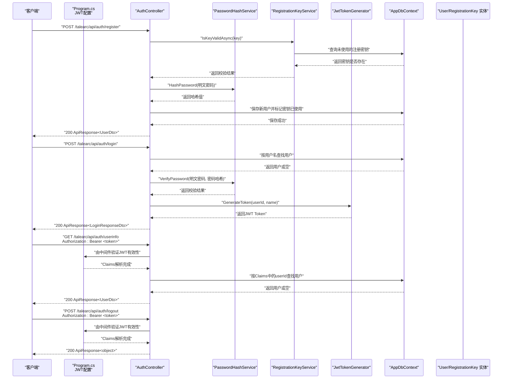

# API接口参考

<cite>
**本文引用的文件**
- [AuthController.cs](file://src/application/controllers/auth/AuthController.cs)
- [LoginForm.cs](file://src/application/controllers/auth/LoginForm.cs)
- [RegisterForm.cs](file://src/application/controllers/auth/RegisterForm.cs)
- [RegisterDto.cs](file://src/data/dto/RegisterDto.cs)
- [LoginResponseDto.cs](file://src/data/dto/LoginResponseDto.cs)
- [UserDto.cs](file://src/data/dto/UserDto.cs)
- [ApiResponse.cs](file://src/structure/ApiResponse.cs)
- [JwtTokenGenerator.cs](file://src/application/service/JwtTokenGenerator.cs)
- [PasswordHashService.cs](file://src/application/service/PasswordHashService.cs)
- [RegistrationKeyService.cs](file://src/application/service/RegistrationKeyService.cs)
- [User.cs](file://src/data/entities/User.cs)
- [RegistrationKey.cs](file://src/data/entities/RegistrationKey.cs)
- [Program.cs](file://Program.cs)
- [appsettings.json](file://appsettings.json)
- [NovelController.cs](file://src/application/controllers/novel/NovelController.cs)
- [ChapterController.cs](file://src/application/controllers/novel/ChapterController.cs)
- [MiscController.cs](file://src/application/controllers/worldview/MiscController.cs)
- [ChapterDto.cs](file://src/data/dto/ChapterDto.cs)
- [MiscDto.cs](file://src/data/dto/MiscDto.cs)
- [MiscQueryDto.cs](file://src/data/dto/MiscQueryDto.cs)
- [PagedRequest.cs](file://src/structure/PagedRequest.cs)
- [PagedResult.cs](file://src/structure/PagedResult.cs)
- [QueryableExtensions.cs](file://src/structure/QueryableExtensions.cs)
</cite>

## 更新摘要
**变更内容**
- 新增小说管理接口文档（NovelController）
- 新增章节管理接口文档（ChapterController）
- 新增杂项管理接口文档（MiscController）
- 新增分页功能说明
- 更新目录结构以包含新接口

## 目录
1. [简介](#简介)
2. [项目结构](#项目结构)
3. [核心组件](#核心组件)
4. [架构总览](#架构总览)
5. [详细组件分析](#详细组件分析)
6. [依赖关系分析](#依赖关系分析)
7. [性能与安全考虑](#性能与安全考虑)
8. [故障排查指南](#故障排查指南)
9. [结论](#结论)
10. [附录](#附录)

## 简介
本文件为 AuthController 暴露的全部 RESTful 接口提供权威参考，覆盖以下四类核心能力：
- 用户注册：需要提供注册密钥，成功后返回用户信息
- 用户登录：凭用户名与密码换取 JWT Token
- 获取用户信息：携带 Bearer Token 的受保护接口
- 用户登出：受保护接口，返回登出成功提示（无状态）

同时，文档详细说明 JWT 认证在 [Authorize] 属性中的应用方式、请求/响应结构、状态码含义以及常见问题排查。此外，新增小说、章节和杂项管理接口，以及分页功能的详细说明。

## 项目结构
- 控制器层位于 src/application/controllers/auth/AuthController.cs，定义了四个端点
- DTO 与实体位于 src/data/dto 与 src/data/entities
- 统一响应包装位于 src/structure/ApiResponse.cs
- 认证相关服务位于 src/application/service，包括 JwtTokenGenerator、PasswordHashService、RegistrationKeyService
- 应用程序入口 Program.cs 配置了 JWT Bearer 认证与 Swagger
- 小说管理控制器位于 src/application/controllers/novel/NovelController.cs
- 章节管理控制器位于 src/application/controllers/novel/ChapterController.cs
- 杂项管理控制器位于 src/application/controllers/worldview/MiscController.cs
- 分页相关类位于 src/structure/PagedRequest.cs、PagedResult.cs 和 QueryableExtensions.cs

```mermaid
graph TB
subgraph "控制器层"
AC["AuthController.cs"]
NC["NovelController.cs"]
CC["ChapterController.cs"]
MC["MiscController.cs"]
end
subgraph "DTO/实体"
D1["RegisterDto.cs"]
D2["LoginForm.cs"]
D3["LoginResponseDto.cs"]
D4["UserDto.cs"]
E1["User.cs"]
E2["RegistrationKey.cs"]
E3["Novel.cs"]
E4["Chapter.cs"]
E5["Misc.cs"]
end
subgraph "服务层"
S1["JwtTokenGenerator.cs"]
S2["PasswordHashService.cs"]
S3["RegistrationKeyService.cs"]
S4["ChapterContentService.cs"]
end
subgraph "基础设施"
P["Program.cs"]
A["appsettings.json"]
R["ApiResponse.cs"]
PR["PagedRequest.cs"]
PS["PagedResult.cs"]
QE["QueryableExtensions.cs"]
end
AC --> S1
AC --> S2
AC --> S3
AC --> E1
AC --> E2
AC --> D3
AC --> D4
AC --> R
NC --> E3
NC --> PR
NC --> PS
NC --> QE
CC --> E4
CC --> PR
CC --> PS
CC --> QE
MC --> E5
MC --> PR
MC --> PS
MC --> QE
P --> S1
P --> S2
P --> S3
P --> A
```

图表来源
- [AuthController.cs](file://src/application/controllers/auth/AuthController.cs#L62-L227)
- [NovelController.cs](file://src/application/controllers/novel/NovelController.cs#L1-L161)
- [ChapterController.cs](file://src/application/controllers/novel/ChapterController.cs#L1-L249)
- [MiscController.cs](file://src/application/controllers/worldview/MiscController.cs#L1-L247)
- [JwtTokenGenerator.cs](file://src/application/service/JwtTokenGenerator.cs#L1-L40)
- [PasswordHashService.cs](file://src/application/service/PasswordHashService.cs#L1-L53)
- [RegistrationKeyService.cs](file://src/application/service/RegistrationKeyService.cs#L1-L37)
- [User.cs](file://src/data/entities/User.cs#L1-L40)
- [RegistrationKey.cs](file://src/data/entities/RegistrationKey.cs#L1-L31)
- [Program.cs](file://Program.cs#L1-L107)
- [appsettings.json](file://appsettings.json#L1-L16)
- [ApiResponse.cs](file://src/structure/ApiResponse.cs#L1-L40)
- [PagedRequest.cs](file://src/structure/PagedRequest.cs#L1-L18)
- [PagedResult.cs](file://src/structure/PagedResult.cs#L1-L19)
- [QueryableExtensions.cs](file://src/structure/QueryableExtensions.cs#L1-L24)

章节来源
- [AuthController.cs](file://src/application/controllers/auth/AuthController.cs#L62-L227)
- [Program.cs](file://Program.cs#L1-L107)
- [NovelController.cs](file://src/application/controllers/novel/NovelController.cs#L1-L161)
- [ChapterController.cs](file://src/application/controllers/novel/ChapterController.cs#L1-L249)
- [MiscController.cs](file://src/application/controllers/worldview/MiscController.cs#L1-L247)

## 核心组件
- AuthController：实现注册、登录、获取用户信息、登出四个端点
- LoginForm/RegisterForm：输入模型（控制器内部定义）
- RegisterDto：注册请求 DTO（仓库中存在）
- LoginResponseDto：登录响应 DTO（包含 Token 与 User）
- UserDto：通用用户 DTO
- ApiResponse<T>：统一响应包装
- JwtTokenGenerator：生成 JWT Token
- PasswordHashService：密码哈希与校验
- RegistrationKeyService：注册密钥校验与使用标记
- User/RegistrationKey 实体：数据库映射
- NovelController：实现小说的增删改查
- ChapterController：实现章节的增删改查
- MiscController：实现杂项的增删改查及分页查询
- PagedRequest/PagedResult：分页请求和响应模型
- QueryableExtensions：IQueryable 扩展方法，支持分页

章节来源
- [AuthController.cs](file://src/application/controllers/auth/AuthController.cs#L1-L227)
- [RegisterDto.cs](file://src/data/dto/RegisterDto.cs#L1-L22)
- [LoginResponseDto.cs](file://src/data/dto/LoginResponseDto.cs#L1-L17)
- [UserDto.cs](file://src/data/dto/UserDto.cs#L1-L22)
- [ApiResponse.cs](file://src/structure/ApiResponse.cs#L1-L40)
- [JwtTokenGenerator.cs](file://src/application/service/JwtTokenGenerator.cs#L1-L40)
- [PasswordHashService.cs](file://src/application/service/PasswordHashService.cs#L1-L53)
- [RegistrationKeyService.cs](file://src/application/service/RegistrationKeyService.cs#L1-L37)
- [User.cs](file://src/data/entities/User.cs#L1-L40)
- [RegistrationKey.cs](file://src/data/entities/RegistrationKey.cs#L1-L31)
- [NovelController.cs](file://src/application/controllers/novel/NovelController.cs#L1-L161)
- [ChapterController.cs](file://src/application/controllers/novel/ChapterController.cs#L1-L249)
- [MiscController.cs](file://src/application/controllers/worldview/MiscController.cs#L1-L247)
- [PagedRequest.cs](file://src/structure/PagedRequest.cs#L1-L18)
- [PagedResult.cs](file://src/structure/PagedResult.cs#L1-L19)
- [QueryableExtensions.cs](file://src/structure/QueryableExtensions.cs#L1-L24)

## 架构总览
下图展示从客户端到控制器、服务与数据库的调用链路，以及 JWT 认证在 [Authorize] 中的应用。

图表来源
- [AuthController.cs](file://src/application/controllers/auth/AuthController.cs#L82-L227)
- [JwtTokenGenerator.cs](file://src/application/service/JwtTokenGenerator.cs#L1-L40)
- [PasswordHashService.cs](file://src/application/service/PasswordHashService.cs#L1-L53)
- [RegistrationKeyService.cs](file://src/application/service/RegistrationKeyService.cs#L1-L37)
- [Program.cs](file://Program.cs#L24-L44)
- [User.cs](file://src/data/entities/User.cs#L1-L40)
- [RegistrationKey.cs](file://src/data/entities/RegistrationKey.cs#L1-L31)

## 详细组件分析

### 1. 用户注册（POST /talearc/api/auth/register）
- HTTP 方法：POST
- 完整 URL：/talearc/api/auth/register
- 请求头：
  - Content-Type: application/json
- 请求体 JSON 结构（RegisterForm）：
  - name: 字符串，必填
  - password: 字符串，必填
  - registrationKey: 字符串，必填（注册密钥）
- 响应体结构（ApiResponse<UserDto>）：
  - code: 整数，成功时为 200
  - message: 字符串，例如“注册成功”
  - data: UserDto 对象
- 成功条件：
  - 注册密钥有效且未被使用
  - 用户名未被占用
  - 数据库保存成功
- 失败条件与状态码：
  - 400：注册密钥无效或用户名已存在
- 示例请求（不含具体值）：
  - POST /talearc/api/auth/register
  - Body: { "name": "...", "password": "...", "registrationKey": "..." }
- 示例响应（不含具体值）：
  - 200 OK
  - Body: { "code": 200, "message": "注册成功", "data": { "id": 123, "name": "...", "createAt": "..." } }

章节来源
- [AuthController.cs](file://src/application/controllers/auth/AuthController.cs#L82-L129)
- [RegisterForm.cs](file://src/application/controllers/auth/RegisterForm.cs#L38-L60)
- [RegisterDto.cs](file://src/data/dto/RegisterDto.cs#L1-L22)
- [RegistrationKeyService.cs](file://src/application/service/RegistrationKeyService.cs#L12-L37)
- [PasswordHashService.cs](file://src/application/service/PasswordHashService.cs#L12-L25)
- [UserDto.cs](file://src/data/dto/UserDto.cs#L1-L22)
- [ApiResponse.cs](file://src/structure/ApiResponse.cs#L30-L39)
- [User.cs](file://src/data/entities/User.cs#L1-L40)
- [RegistrationKey.cs](file://src/data/entities/RegistrationKey.cs#L1-L31)

### 2. 用户登录（POST /talearc/api/auth/login）
- HTTP 方法：POST
- 完整 URL：/talearc/api/auth/login
- 请求头：
  - Content-Type: application/json
- 请求体 JSON 结构（LoginForm）：
  - name: 字符串，必填
  - password: 字符串，必填
- 响应体结构（ApiResponse<LoginResponseDto>）：
  - code: 整数，成功时为 200
  - message: 字符串，例如“登录成功”
  - data: LoginResponseDto 对象
- LoginResponseDto 字段：
  - token: 字符串（JWT）
  - user: UserDto 对象
- 成功条件：
  - 用户存在且密码校验通过
  - 生成有效的 JWT Token
- 失败条件与状态码：
  - 401：用户名或密码错误
- 示例请求（不含具体值）：
  - POST /talearc/api/auth/login
  - Body: { "name": "...", "password": "..." }
- 示例响应（不含具体值）：
  - 200 OK
  - Body: { "code": 200, "message": "登录成功", "data": { "token": "...", "user": { "id": 123, "name": "...", "createAt": "..." } } }

章节来源
- [AuthController.cs](file://src/application/controllers/auth/AuthController.cs#L139-L175)
- [LoginForm.cs](file://src/application/controllers/auth/LoginForm.cs#L18-L33)
- [LoginResponseDto.cs](file://src/data/dto/LoginResponseDto.cs#L1-L17)
- [JwtTokenGenerator.cs](file://src/application/service/JwtTokenGenerator.cs#L19-L39)
- [PasswordHashService.cs](file://src/application/service/PasswordHashService.cs#L27-L53)
- [UserDto.cs](file://src/data/dto/UserDto.cs#L1-L22)
- [ApiResponse.cs](file://src/structure/ApiResponse.cs#L30-L39)
- [User.cs](file://src/data/entities/User.cs#L1-L40)

### 3. 获取用户信息（GET /talearc/api/auth/userinfo）
- HTTP 方法：GET
- 完整 URL：/talearc/api/auth/userinfo
- 请求头：
  - Authorization: Bearer <JWT Token>
- 请求体：无
- 响应体结构（ApiResponse<UserDto>）：
  - code: 整数，成功时为 200
  - message: 字符串，例如“获取成功”
  - data: UserDto 对象
- 认证机制：
  - [Authorize] 属性启用 JWT Bearer 认证
  - 程序入口 Program.cs 中配置了 Issuer/Audience/Lifetime 等参数
- 成功条件：
  - Token 有效且可解析出用户标识
  - 数据库中存在对应用户
- 失败条件与状态码：
  - 401：未授权（无效 Token 或用户不存在）
- 示例请求（不含具体值）：
  - GET /talearc/api/auth/userinfo
  - Header: Authorization: Bearer <token>
- 示例响应（不含具体值）：
  - 200 OK
  - Body: { "code": 200, "message": "获取成功", "data": { "id": 123, "name": "...", "createAt": "..." } }

章节来源
- [AuthController.cs](file://src/application/controllers/auth/AuthController.cs#L183-L208)
- [Program.cs](file://Program.cs#L30-L44)
- [UserDto.cs](file://src/data/dto/UserDto.cs#L1-L22)
- [ApiResponse.cs](file://src/structure/ApiResponse.cs#L30-L39)
- [User.cs](file://src/data/entities/User.cs#L1-L40)

### 4. 用户登出（POST /talearc/api/auth/logout）
- HTTP 方法：POST
- 完整 URL：/talearc/api/auth/logout
- 请求头：
  - Authorization: Bearer <JWT Token>
- 请求体：无
- 响应体结构（ApiResponse<object>）：
  - code: 整数，成功时为 200
  - message: 字符串，例如“登出成功”
  - data: null
- 认证机制：
  - [Authorize] 属性启用 JWT Bearer 认证
  - 该端点为无状态登出（不维护会话）
- 成功条件：
  - Token 有效
- 失败条件与状态码：
  - 401：未授权（无效 Token）
- 示例请求（不含具体值）：
  - POST /talearc/api/auth/logout
  - Header: Authorization: Bearer <token>
- 示例响应（不含具体值）：
  - 200 OK
  - Body: { "code": 200, "message": "登出成功", "data": null }

章节来源
- [AuthController.cs](file://src/application/controllers/auth/AuthController.cs#L216-L227)
- [Program.cs](file://Program.cs#L30-L44)
- [ApiResponse.cs](file://src/structure/ApiResponse.cs#L30-L39)

### 5. 小说管理接口
**小说控制器 (NovelController)**

#### 获取小说列表（GET /talearc/api/novel）
- HTTP 方法：GET
- 完整 URL：/talearc/api/novel
- 请求头：
  - Authorization: Bearer <JWT Token>
- 请求参数：
  - worldViewId: 整数，可选，世界观ID
- 响应体结构（ApiResponse<List<Novel>>）：
  - code: 整数，成功时为 200
  - message: 字符串
  - data: Novel 对象列表
- 成功条件：
  - Token 有效
  - 返回当前用户的所有小说，按更新时间倒序排列
- 失败条件与状态码：
  - 401：未授权
- 示例请求：
  - GET /talearc/api/novel?worldViewId=1
  - Header: Authorization: Bearer <token>
- 示例响应：
  - 200 OK
  - Body: { "code": 200, "message": "Success", "data": [ { "id": 1, "title": "小说1", "description": "...", "userId": 1, "worldViewId": 1, "createdAt": "...", "updatedAt": "..." } ] }

章节来源
- [NovelController.cs](file://src/application/controllers/novel/NovelController.cs#L37-L49)

#### 获取小说详情（GET /talearc/api/novel/{id}）
- HTTP 方法：GET
- 完整 URL：/talearc/api/novel/{id}
- 请求头：
  - Authorization: Bearer <JWT Token>
- 响应体结构（ApiResponse<Novel>）：
  - code: 整数，成功时为 200
  - message: 字符串
  - data: Novel 对象
- 成功条件：
  - Token 有效
  - 小说存在且属于当前用户
- 失败条件与状态码：
  - 401：未授权
  - 404：小说不存在
- 示例请求：
  - GET /talearc/api/novel/1
  - Header: Authorization: Bearer <token>
- 示例响应：
  - 200 OK
  - Body: { "code": 200, "message": "Success", "data": { "id": 1, "title": "小说1", "description": "...", "userId": 1, "worldViewId": 1, "createdAt": "...", "updatedAt": "..." } }

章节来源
- [NovelController.cs](file://src/application/controllers/novel/NovelController.cs#L58-L73)

#### 创建小说（POST /talearc/api/novel）
- HTTP 方法：POST
- 完整 URL：/talearc/api/novel
- 请求头：
  - Authorization: Bearer <JWT Token>
  - Content-Type: application/json
- 请求体 JSON 结构（Novel）：
  - title: 字符串，必填
  - description: 字符串，可选
  - worldViewId: 整数，可选
- 响应体结构（ApiResponse<Novel>）：
  - code: 整数，成功时为 200
  - message: 字符串，例如“创建成功”
  - data: 创建的 Novel 对象
- 成功条件：
  - Token 有效
  - 数据库保存成功
- 失败条件与状态码：
  - 401：未授权
- 示例请求：
  - POST /talearc/api/novel
  - Header: Authorization: Bearer <token>
  - Body: { "title": "新小说", "description": "小说描述", "worldViewId": 1 }
- 示例响应：
  - 200 OK
  - Body: { "code": 200, "message": "创建成功", "data": { "id": 2, "title": "新小说", "description": "小说描述", "userId": 1, "worldViewId": 1, "createdAt": "...", "updatedAt": "..." } }

章节来源
- [NovelController.cs](file://src/application/controllers/novel/NovelController.cs#L82-L94)

#### 更新小说（PUT /talearc/api/novel/{id}）
- HTTP 方法：PUT
- 完整 URL：/talearc/api/novel/{id}
- 请求头：
  - Authorization: Bearer <JWT Token>
  - Content-Type: application/json
- 请求体 JSON 结构（Novel）：
  - title: 字符串，必填
  - description: 字符串，可选
  - worldViewId: 整数，可选
- 响应体结构（ApiResponse<Novel>）：
  - code: 整数，成功时为 200
  - message: 字符串，例如“更新成功”
  - data: 更新后的 Novel 对象
- 成功条件：
  - Token 有效
  - 小说存在且属于当前用户
- 失败条件与状态码：
  - 401：未授权
  - 404：小说不存在
- 示例请求：
  - PUT /talearc/api/novel/1
  - Header: Authorization: Bearer <token>
  - Body: { "title": "更新后的小说", "description": "更新后的描述", "worldViewId": 1 }
- 示例响应：
  - 200 OK
  - Body: { "code": 200, "message": "更新成功", "data": { "id": 1, "title": "更新后的小说", "description": "更新后的描述", "userId": 1, "worldViewId": 1, "createdAt": "...", "updatedAt": "..." } }

章节来源
- [NovelController.cs](file://src/application/controllers/novel/NovelController.cs#L105-L125)

#### 删除小说（DELETE /talearc/api/novel/{id}）
- HTTP 方法：DELETE
- 完整 URL：/talearc/api/novel/{id}
- 请求头：
  - Authorization: Bearer <JWT Token>
- 响应体结构（ApiResponse<object>）：
  - code: 整数，成功时为 200
  - message: 字符串，例如“删除成功”
  - data: null
- 成功条件：
  - Token 有效
  - 小说存在且属于当前用户
- 失败条件与状态码：
  - 401：未授权
  - 404：小说不存在
- 示例请求：
  - DELETE /talearc/api/novel/1
  - Header: Authorization: Bearer <token>
- 示例响应：
  - 200 OK
  - Body: { "code": 200, "message": "删除成功", "data": null }

章节来源
- [NovelController.cs](file://src/application/controllers/novel/NovelController.cs#L134-L160)

### 6. 章节管理接口
**章节控制器 (ChapterController)**

#### 获取章节列表（GET /talearc/api/novels/{novelId}/chapter）
- HTTP 方法：GET
- 完整 URL：/talearc/api/novels/{novelId}/chapter
- 请求头：
  - Authorization: Bearer <JWT Token>
- 响应体结构（ApiResponse<List<ChapterResponse>>）：
  - code: 整数，成功时为 200
  - message: 字符串
  - data: ChapterResponse 对象列表
- 成功条件：
  - Token 有效
  - 小说存在且属于当前用户
- 失败条件与状态码：
  - 401：未授权
  - 404：小说不存在
- 示例请求：
  - GET /talearc/api/novels/1/chapter
  - Header: Authorization: Bearer <token>
- 示例响应：
  - 200 OK
  - Body: { "code": 200, "message": "Success", "data": [ { "id": 1, "uuid": "...", "novelId": 1, "title": "章节1", "summary": "...", "order": 1, "referencedSnapshotIds": [], "referencedEventIds": [], "referencedMiscIds": [], "createdAt": "...", "updatedAt": "..." } ] }

章节来源
- [ChapterController.cs](file://src/application/controllers/novel/ChapterController.cs#L38-L70)

#### 获取章节详情（GET /talearc/api/novels/{novelId}/chapter/{id}）
- HTTP 方法：GET
- 完整 URL：/talearc/api/novels/{novelId}/chapter/{id}
- 请求头：
  - Authorization: Bearer <JWT Token>
- 响应体结构（ApiResponse<ChapterResponse>）：
  - code: 整数，成功时为 200
  - message: 字符串
  - data: ChapterResponse 对象（包含内容）
- 成功条件：
  - Token 有效
  - 小说和章节存在且属于当前用户
- 失败条件与状态码：
  - 401：未授权
  - 404：小说或章节不存在
- 示例请求：
  - GET /talearc/api/novels/1/chapter/1
  - Header: Authorization: Bearer <token>
- 示例响应：
  - 200 OK
  - Body: { "code": 200, "message": "Success", "data": { "id": 1, "uuid": "...", "novelId": 1, "title": "章节1", "summary": "...", "order": 1, "referencedSnapshotIds": [], "referencedEventIds": [], "referencedMiscIds": [], "createdAt": "...", "updatedAt": "...", "content": "章节内容..." } }

章节来源
- [ChapterController.cs](file://src/application/controllers/novel/ChapterController.cs#L82-L119)

#### 创建章节（POST /talearc/api/novels/{novelId}/chapter）
- HTTP 方法：POST
- 完整 URL：/talearc/api/novels/{novelId}/chapter
- 请求头：
  - Authorization: Bearer <JWT Token>
  - Content-Type: application/json
- 请求体 JSON 结构（ChapterRequest）：
  - title: 字符串，必填
  - summary: 字符串，可选
  - order: 整数，必填
  - content: 字符串，必填
  - referencedSnapshotIds: 整数数组，可选
  - referencedEventIds: 整数数组，可选
  - referencedMiscIds: 整数数组，可选
- 响应体结构（ApiResponse<Chapter>）：
  - code: 整数，成功时为 200
  - message: 字符串，例如“创建成功”
  - data: 创建的 Chapter 对象
- 成功条件：
  - Token 有效
  - 小说存在且属于当前用户
- 失败条件与状态码：
  - 401：未授权
  - 404：小说不存在
- 示例请求：
  - POST /talearc/api/novels/1/chapter
  - Header: Authorization: Bearer <token>
  - Body: { "title": "新章节", "summary": "章节摘要", "order": 1, "content": "章节内容...", "referencedSnapshotIds": [1,2], "referencedEventIds": [3], "referencedMiscIds": [4] }
- 示例响应：
  - 200 OK
  - Body: { "code": 200, "message": "创建成功", "data": { "id": 2, "uuid": "...", "novelId": 1, "title": "新章节", "summary": "章节摘要", "order": 1, "referencedSnapshotIds": [1,2], "referencedEventIds": [3], "referencedMiscIds": [4], "createdAt": "...", "updatedAt": "..." } }

章节来源
- [ChapterController.cs](file://src/application/controllers/novel/ChapterController.cs#L131-L164)

#### 更新章节（PUT /talearc/api/novels/{novelId}/chapter/{id}）
- HTTP 方法：PUT
- 完整 URL：/talearc/api/novels/{novelId}/chapter/{id}
- 请求头：
  - Authorization: Bearer <JWT Token>
  - Content-Type: application/json
- 请求体 JSON 结构（ChapterRequest）：
  - title: 字符串，必填
  - summary: 字符串，可选
  - order: 整数，必填
  - content: 字符串，必填
  - referencedSnapshotIds: 整数数组，可选
  - referencedEventIds: 整数数组，可选
  - referencedMiscIds: 整数数组，可选
- 响应体结构（ApiResponse<Chapter>）：
  - code: 整数，成功时为 200
  - message: 字符串，例如“更新成功”
  - data: 更新后的 Chapter 对象
- 成功条件：
  - Token 有效
  - 小说和章节存在且属于当前用户
- 失败条件与状态码：
  - 401：未授权
  - 404：小说或章节不存在
- 示例请求：
  - PUT /talearc/api/novels/1/chapter/1
  - Header: Authorization: Bearer <token>
  - Body: { "title": "更新后的章节", "summary": "更新后的摘要", "order": 2, "content": "更新后的内容...", "referencedSnapshotIds": [3,4], "referencedEventIds": [5], "referencedMiscIds": [6] }
- 示例响应：
  - 200 OK
  - Body: { "code": 200, "message": "更新成功", "data": { "id": 1, "uuid": "...", "novelId": 1, "title": "更新后的章节", "summary": "更新后的摘要", "order": 2, "referencedSnapshotIds": [3,4], "referencedEventIds": [5], "referencedMiscIds": [6], "createdAt": "...", "updatedAt": "..." } }

章节来源
- [ChapterController.cs](file://src/application/controllers/novel/ChapterController.cs#L177-L210)

#### 删除章节（DELETE /talearc/api/novels/{novelId}/chapter/{id}）
- HTTP 方法：DELETE
- 完整 URL：/talearc/api/novels/{novelId}/chapter/{id}
- 请求头：
  - Authorization: Bearer <JWT Token>
- 响应体结构（ApiResponse<object>）：
  - code: 整数，成功时为 200
  - message: 字符串，例如“删除成功”
  - data: null
- 成功条件：
  - Token 有效
  - 小说和章节存在且属于当前用户
- 失败条件与状态码：
  - 401：未授权
  - 404：小说或章节不存在
- 示例请求：
  - DELETE /talearc/api/novels/1/chapter/1
  - Header: Authorization: Bearer <token>
- 示例响应：
  - 200 OK
  - Body: { "code": 200, "message": "删除成功", "data": null }

章节来源
- [ChapterController.cs](file://src/application/controllers/novel/ChapterController.cs#L222-L248)

### 7. 杂项管理接口
**杂项控制器 (MiscController)**

#### 获取杂项列表（分页）（GET /talearc/api/misc）
- HTTP 方法：GET
- 完整 URL：/talearc/api/misc
- 请求头：
  - Authorization: Bearer <JWT Token>
- 请求参数：
  - page: 整数，可选，默认1
  - size: 整数，可选，默认10
  - worldViewId: 整数，可选，世界观ID
- 响应体结构（ApiResponse<PagedResult<MiscResponse>>）：
  - code: 整数，成功时为 200
  - message: 字符串
  - data: PagedResult<MiscResponse> 对象
    - list: MiscResponse 对象列表
    - total: 整数，总记录数
- 成功条件：
  - Token 有效
  - 返回当前用户的杂项列表，支持分页和按世界观过滤
- 失败条件与状态码：
  - 401：未授权
- 示例请求：
  - GET /talearc/api/misc?page=1&size=10&worldViewId=1
  - Header: Authorization: Bearer <token>
- 示例响应：
  - 200 OK
  - Body: { "code": 200, "message": "Success", "data": { "list": [ { "id": 1, "userId": 1, "worldViewId": 1, "name": "杂项1", "description": "...", "type": "道具", "createdAt": "...", "updatedAt": "..." } ], "total": 1 } }

章节来源
- [MiscController.cs](file://src/application/controllers/worldview/MiscController.cs#L36-L72)

#### 获取杂项详情（GET /talearc/api/misc/{id}）
- HTTP 方法：GET
- 完整 URL：/talearc/api/misc/{id}
- 请求头：
  - Authorization: Bearer <JWT Token>
- 响应体结构（ApiResponse<MiscResponse>）：
  - code: 整数，成功时为 200
  - message: 字符串
  - data: MiscResponse 对象
- 成功条件：
  - Token 有效
  - 杂项存在且属于当前用户
- 失败条件与状态码：
  - 401：未授权
  - 404：杂项不存在
- 示例请求：
  - GET /talearc/api/misc/1
  - Header: Authorization: Bearer <token>
- 示例响应：
  - 200 OK
  - Body: { "code": 200, "message": "Success", "data": { "id": 1, "userId": 1, "worldViewId": 1, "name": "杂项1", "description": "...", "type": "道具", "createdAt": "...", "updatedAt": "..." } }

章节来源
- [MiscController.cs](file://src/application/controllers/worldview/MiscController.cs#L83-L109)

#### 创建杂项（POST /talearc/api/misc）
- HTTP 方法：POST
- 完整 URL：/talearc/api/misc
- 请求头：
  - Authorization: Bearer <JWT Token>
  - Content-Type: application/json
- 请求体 JSON 结构（CreateMiscRequest）：
  - worldViewId: 整数，必填
  - name: 字符串，必填
  - description: 字符串，可选
  - type: 字符串，必填
- 响应体结构（ApiResponse<MiscResponse>）：
  - code: 整数，成功时为 201
  - message: 字符串
  - data: 创建的 MiscResponse 对象
- 成功条件：
  - Token 有效
  - 世界观存在且属于当前用户
- 失败条件与状态码：
  - 400：世界观不存在或无权访问
  - 401：未授权
- 示例请求：
  - POST /talearc/api/misc
  - Header: Authorization: Bearer <token>
  - Body: { "worldViewId": 1, "name": "新杂项", "description": "杂项描述", "type": "地点" }
- 示例响应：
  - 201 Created
  - Body: { "code": 201, "message": "Created", "data": { "id": 2, "userId": 1, "worldViewId": 1, "name": "新杂项", "description": "杂项描述", "type": "地点", "createdAt": "...", "updatedAt": "..." } }

章节来源
- [MiscController.cs](file://src/application/controllers/worldview/MiscController.cs#L121-L161)

#### 更新杂项（PUT /talearc/api/misc/{id}）
- HTTP 方法：PUT
- 完整 URL：/talearc/api/misc/{id}
- 请求头：
  - Authorization: Bearer <JWT Token>
  - Content-Type: application/json
- 请求体 JSON 结构（UpdateMiscRequest）：
  - name: 字符串，可选
  - description: 字符串，可选
  - type: 字符串，可选
- 响应体结构（ApiResponse<MiscResponse>）：
  - code: 整数，成功时为 200
  - message: 字符串，例如“更新成功”
  - data: 更新后的 MiscResponse 对象
- 成功条件：
  - Token 有效
  - 杂项存在且属于当前用户
- 失败条件与状态码：
  - 401：未授权
  - 404：杂项不存在
- 示例请求：
  - PUT /talearc/api/misc/1
  - Header: Authorization: Bearer <token>
  - Body: { "name": "更新后的杂项", "description": "更新后的描述", "type": "事件" }
- 示例响应：
  - 200 OK
  - Body: { "code": 200, "message": "更新成功", "data": { "id": 1, "userId": 1, "worldViewId": 1, "name": "更新后的杂项", "description": "更新后的描述", "type": "事件", "createdAt": "...", "updatedAt": "..." } }

章节来源
- [MiscController.cs](file://src/application/controllers/worldview/MiscController.cs#L174-L218)

#### 删除杂项（DELETE /talearc/api/misc/{id}）
- HTTP 方法：DELETE
- 完整 URL：/talearc/api/misc/{id}
- 请求头：
  - Authorization: Bearer <JWT Token>
- 响应体结构（ApiResponse<object>）：
  - code: 整数，成功时为 200
  - message: 字符串，例如“删除成功”
  - data: null
- 成功条件：
  - Token 有效
  - 杂项存在且属于当前用户
- 失败条件与状态码：
  - 401：未授权
  - 404：杂项不存在
- 示例请求：
  - DELETE /talearc/api/misc/1
  - Header: Authorization: Bearer <token>
- 示例响应：
  - 200 OK
  - Body: { "code": 200, "message": "删除成功", "data": null }

章节来源
- [MiscController.cs](file://src/application/controllers/worldview/MiscController.cs#L229-L246)

## 依赖关系分析
- 控制器依赖服务与实体：
  - AuthController 依赖 JwtTokenGenerator、PasswordHashService、RegistrationKeyService、User/RegistrationKey 实体
  - NovelController 依赖 AppDbContext、ILogger、ChapterContentService、Novel 实体
  - ChapterController 依赖 AppDbContext、ILogger、ChapterContentService、Chapter 实体
  - MiscController 依赖 AppDbContext、ILogger、Misc 实体
- 认证依赖：
  - Program.cs 中配置 JwtBearer，默认使用对称密钥进行签名校验，限定 Issuer/Audience/Lifetime
- 响应统一：
  - 所有端点均以 ApiResponse<T> 包装，便于前端统一处理
- 分页功能：
  - 使用 PagedRequest 作为分页请求基类
  - 使用 PagedResult<T> 作为分页响应模型
  - 使用 QueryableExtensions 提供 IQueryable 分页扩展方法

```mermaid
classDiagram
class AuthController {
+Register(registerForm)
+Login(loginForm)
+GetUserInfo()
+Logout()
}
class NovelController {
+GetNovels(worldViewId)
+GetNovel(id)
+CreateNovel(novel)
+UpdateNovel(id, updatedNovel)
+DeleteNovel(id)
}
class ChapterController {
+GetChapters(novelId)
+GetChapter(novelId, id)
+CreateChapter(novelId, request)
+UpdateChapter(novelId, id, request)
+DeleteChapter(novelId, id)
}
class MiscController {
+GetMiscs(request)
+GetMisc(id)
+CreateMisc(request)
+UpdateMisc(id, request)
+DeleteMisc(id)
}
class JwtTokenGenerator {
+GenerateToken(userId, userName) string
}
class PasswordHashService {
+HashPassword(password) string
+VerifyPassword(password, hash) bool
}
class RegistrationKeyService {
+IsKeyValidAsync(key) bool
+MarkKeyAsUsedAsync(key, userId) void
}
class ChapterContentService {
+ReadChapterContentAsync(userId, worldViewId, novelId, uuid) string
+WriteChapterContentAsync(userId, worldViewId, novelId, uuid, content) void
+DeleteChapterContent(userId, worldViewId, novelId, uuid) void
}
class User
class RegistrationKey
class Novel
class Chapter
class Misc
class LoginResponseDto
class UserDto
class ChapterRequest
class ChapterResponse
class CreateMiscRequest
class UpdateMiscRequest
class MiscResponse
class PagedRequest
class PagedResult~T~
class ApiResponse~T~
AuthController --> JwtTokenGenerator : "生成Token"
AuthController --> PasswordHashService : "哈希/校验密码"
AuthController --> RegistrationKeyService : "校验/标记密钥"
AuthController --> User : "读写用户"
AuthController --> RegistrationKey : "读取密钥"
AuthController --> LoginResponseDto : "返回登录结果"
AuthController --> UserDto : "返回用户信息"
AuthController --> ApiResponse~T~ : "统一响应"
NovelController --> AppDbContext : "数据库访问"
NovelController --> ILogger : "日志记录"
NovelController --> ChapterContentService : "章节内容文件操作"
NovelController --> Novel : "读写小说"
NovelController --> ApiResponse~T~ : "统一响应"
ChapterController --> AppDbContext : "数据库访问"
ChapterController --> ILogger : "日志记录"
ChapterController --> ChapterContentService : "章节内容文件操作"
ChapterController --> Chapter : "读写章节"
ChapterController --> ApiResponse~T~ : "统一响应"
MiscController --> AppDbContext : "数据库访问"
MiscController --> ILogger : "日志记录"
MiscController --> Misc : "读写杂项"
MiscController --> ApiResponse~T~ : "统一响应"
MiscController --> PagedRequest : "分页请求"
MiscController --> PagedResult~T~ : "分页响应"
```

图表来源
- [AuthController.cs](file://src/application/controllers/auth/AuthController.cs#L62-L227)
- [NovelController.cs](file://src/application/controllers/novel/NovelController.cs#L1-L161)
- [ChapterController.cs](file://src/application/controllers/novel/ChapterController.cs#L1-L249)
- [MiscController.cs](file://src/application/controllers/worldview/MiscController.cs#L1-L247)
- [JwtTokenGenerator.cs](file://src/application/service/JwtTokenGenerator.cs#L1-L40)
- [PasswordHashService.cs](file://src/application/service/PasswordHashService.cs#L1-L53)
- [RegistrationKeyService.cs](file://src/application/service/RegistrationKeyService.cs#L1-L37)
- [ChapterContentService.cs](file://src/application/service/ChapterContentService.cs#L1-L40)
- [User.cs](file://src/data/entities/User.cs#L1-L40)
- [RegistrationKey.cs](file://src/data/entities/RegistrationKey.cs#L1-L31)
- [Novel.cs](file://src/data/entities/Novel.cs#L1-L40)
- [Chapter.cs](file://src/data/entities/Chapter.cs#L1-L40)
- [Misc.cs](file://src/data/entities/Misc.cs#L1-L40)
- [LoginResponseDto.cs](file://src/data/dto/LoginResponseDto.cs#L1-L17)
- [UserDto.cs](file://src/data/dto/UserDto.cs#L1-L22)
- [ChapterDto.cs](file://src/data/dto/ChapterDto.cs#L1-L35)
- [MiscDto.cs](file://src/data/dto/MiscDto.cs#L1-L95)
- [PagedRequest.cs](file://src/structure/PagedRequest.cs#L1-L18)
- [PagedResult.cs](file://src/structure/PagedResult.cs#L1-L19)
- [ApiResponse.cs](file://src/structure/ApiResponse.cs#L1-L40)

## 性能与安全考虑
- 密码安全
  - 使用 PBKDF2（Rfc2898DeriveBytes）进行盐值派生与哈希，迭代次数较高，降低暴力破解风险
- Token 安全
  - 使用对称密钥（HMAC-SHA256），建议定期轮换 SecretKey
  - 设置合理的过期时间（默认约 7 天）
- 数据库访问
  - 注册与登录均执行一次用户查询，复杂度 O(n)（n 为索引命中情况下的常数级）
  - 小说、章节、杂项等查询均使用用户ID过滤，确保数据隔离
- 并发与幂等
  - 登出为无状态操作，天然幂等
  - 注册与登录涉及写入，注意并发场景下的唯一性约束与锁策略
  - 小说和章节的删除操作会级联删除相关数据，需注意事务完整性
- 分页性能
  - 使用 IQueryable 分页扩展方法，避免在内存中分页
  - 在数据库层面执行分页查询，提高性能

[本节为通用指导，无需列出章节来源]

## 故障排查指南
- 400 错误（注册失败）
  - 可能原因：注册密钥无效或用户名已存在
  - 排查步骤：确认密钥是否正确且未被使用；检查用户名唯一性
- 401 错误（登录失败/未授权）
  - 可能原因：用户名或密码错误；Token 无效、过期或签名不匹配
  - 排查步骤：核对用户名与密码；确认 Authorization 头格式为 Bearer <token>；检查服务器时间与密钥配置
- 404 错误（资源不存在）
  - 可能原因：请求的资源（如小说、章节、杂项）不存在或不属于当前用户
  - 排查步骤：确认资源ID是否正确；检查资源是否属于当前用户
- Token 生成与验证
  - 确认 appsettings.json 中 Jwt:SecretKey 与 Program.cs 中的密钥一致
  - 确认 Token 的 Issuer/Audience 与验证参数一致
- 日志定位
  - 控制器与服务层均记录日志，可通过日志快速定位失败环节
- 分页问题
  - 确认请求参数 page 和 size 是否正确
  - 检查数据库查询是否正确应用了分页

章节来源
- [AuthController.cs](file://src/application/controllers/auth/AuthController.cs#L82-L227)
- [Program.cs](file://Program.cs#L24-L44)
- [appsettings.json](file://appsettings.json#L1-L16)
- [NovelController.cs](file://src/application/controllers/novel/NovelController.cs#L1-L161)
- [ChapterController.cs](file://src/application/controllers/novel/ChapterController.cs#L1-L249)
- [MiscController.cs](file://src/application/controllers/worldview/MiscController.cs#L1-L247)

## 结论
本文档系统梳理了 AuthController 的四个核心接口，明确了请求/响应结构、状态码含义与 JWT 认证在 [Authorize] 中的应用方式。结合统一响应包装与服务层职责分离，系统具备良好的可维护性与安全性。建议在生产环境中定期轮换密钥、限制请求频率并完善监控告警。此外，新增的小说、章节和杂项管理接口，以及分页功能，为系统提供了更丰富的功能和更好的用户体验。

[本节为总结性内容，无需列出章节来源]

## 附录

### A. JWT 认证机制说明
- 配置位置
  - Program.cs 中启用 JwtBearer 并设置 Issuer、Audience、密钥与过期时间
  - appsettings.json 提供密钥与过期分钟数
- Token 内容
  - Claims 包含用户标识与用户名
  - 过期时间由配置决定
- 使用方式
  - 登录成功后返回 Token；后续请求在 Authorization 头中携带 Bearer <token>

章节来源
- [Program.cs](file://Program.cs#L24-L44)
- [appsettings.json](file://appsettings.json#L1-L16)
- [JwtTokenGenerator.cs](file://src/application/service/JwtTokenGenerator.cs#L19-L39)

### B. 端点一览与状态码
- POST /talearc/api/auth/register
  - 200：注册成功
  - 400：注册密钥无效或用户名已存在
- POST /talearc/api/auth/login
  - 200：登录成功，返回 Token 与用户信息
  - 401：用户名或密码错误
- GET /talearc/api/auth/userinfo
  - 200：返回用户信息
  - 401：未授权
- POST /talearc/api/auth/logout
  - 200：登出成功
  - 401：未授权
- GET /talearc/api/novel
  - 200：返回小说列表
  - 401：未授权
- GET /talearc/api/novel/{id}
  - 200：返回小说详情
  - 401：未授权
  - 404：小说不存在
- POST /talearc/api/novel
  - 200：创建成功
  - 401：未授权
- PUT /talearc/api/novel/{id}
  - 200：更新成功
  - 401：未授权
  - 404：小说不存在
- DELETE /talearc/api/novel/{id}
  - 200：删除成功
  - 401：未授权
  - 404：小说不存在
- GET /talearc/api/novels/{novelId}/chapter
  - 200：返回章节列表
  - 401：未授权
  - 404：小说不存在
- GET /talearc/api/novels/{novelId}/chapter/{id}
  - 200：返回章节详情
  - 401：未授权
  - 404：小说或章节不存在
- POST /talearc/api/novels/{novelId}/chapter
  - 200：创建成功
  - 401：未授权
  - 404：小说不存在
- PUT /talearc/api/novels/{novelId}/chapter/{id}
  - 200：更新成功
  - 401：未授权
  - 404：小说或章节不存在
- DELETE /talearc/api/novels/{novelId}/chapter/{id}
  - 200：删除成功
  - 401：未授权
  - 404：小说或章节不存在
- GET /talearc/api/misc
  - 200：返回杂项列表
  - 401：未授权
- GET /talearc/api/misc/{id}
  - 200：返回杂项详情
  - 401：未授权
  - 404：杂项不存在
- POST /talearc/api/misc
  - 201：创建成功
  - 400：世界观不存在或无权访问
  - 401：未授权
- PUT /talearc/api/misc/{id}
  - 200：更新成功
  - 401：未授权
  - 404：杂项不存在
- DELETE /talearc/api/misc/{id}
  - 200：删除成功
  - 401：未授权
  - 404：杂项不存在

章节来源
- [AuthController.cs](file://src/application/controllers/auth/AuthController.cs#L82-L227)
- [ApiResponse.cs](file://src/structure/ApiResponse.cs#L30-L39)
- [NovelController.cs](file://src/application/controllers/novel/NovelController.cs#L1-L161)
- [ChapterController.cs](file://src/application/controllers/novel/ChapterController.cs#L1-L249)
- [MiscController.cs](file://src/application/controllers/worldview/MiscController.cs#L1-L247)