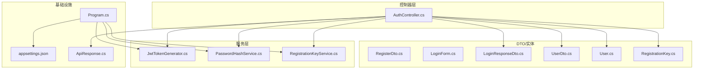
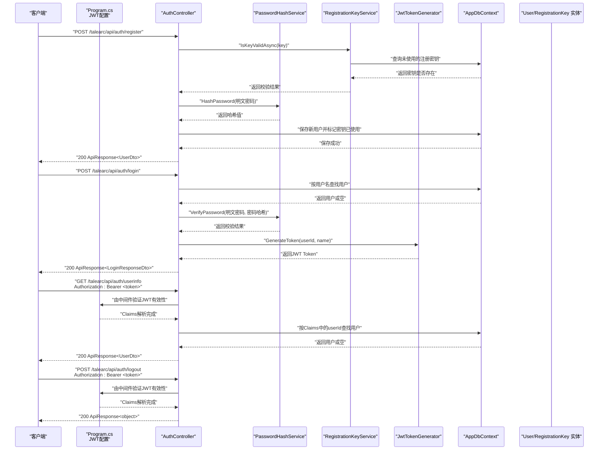
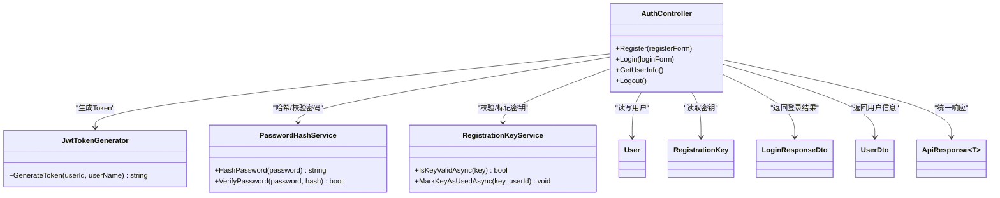

# API接口参考

<cite>
**本文引用的文件**
- [AuthController.cs](file://src/application/controllers/auth/AuthController.cs)
- [LoginForm.cs](file://src/application/controllers/auth/LoginForm.cs)
- [RegisterForm.cs](file://src/application/controllers/auth/RegisterForm.cs)
- [RegisterDto.cs](file://src/data/dto/RegisterDto.cs)
- [LoginResponseDto.cs](file://src/data/dto/LoginResponseDto.cs)
- [UserDto.cs](file://src/data/dto/UserDto.cs)
- [ApiResponse.cs](file://src/structure/ApiResponse.cs)
- [JwtTokenGenerator.cs](file://src/application/service/JwtTokenGenerator.cs)
- [PasswordHashService.cs](file://src/application/service/PasswordHashService.cs)
- [RegistrationKeyService.cs](file://src/application/service/RegistrationKeyService.cs)
- [User.cs](file://src/data/entities/User.cs)
- [RegistrationKey.cs](file://src/data/entities/RegistrationKey.cs)
- [Program.cs](file://Program.cs)
- [appsettings.json](file://appsettings.json)
</cite>

## 目录
1. [简介](#简介)
2. [项目结构](#项目结构)
3. [核心组件](#核心组件)
4. [架构总览](#架构总览)
5. [详细组件分析](#详细组件分析)
6. [依赖关系分析](#依赖关系分析)
7. [性能与安全考虑](#性能与安全考虑)
8. [故障排查指南](#故障排查指南)
9. [结论](#结论)
10. [附录](#附录)

## 简介
本文件为 AuthController 暴露的全部 RESTful 接口提供权威参考，覆盖以下四类核心能力：
- 用户注册：需要提供注册密钥，成功后返回用户信息
- 用户登录：凭用户名与密码换取 JWT Token
- 获取用户信息：携带 Bearer Token 的受保护接口
- 用户登出：受保护接口，返回登出成功提示（无状态）

同时，文档详细说明 JWT 认证在 [Authorize] 属性中的应用方式、请求/响应结构、状态码含义以及常见问题排查。

## 项目结构
- 控制器层位于 src/application/controllers/auth/AuthController.cs，定义了四个端点
- DTO 与实体位于 src/data/dto 与 src/data/entities
- 统一响应包装位于 src/structure/ApiResponse.cs
- 认证相关服务位于 src/application/service，包括 JwtTokenGenerator、PasswordHashService、RegistrationKeyService
- 应用程序入口 Program.cs 配置了 JWT Bearer 认证与 Swagger

图表来源
- [AuthController.cs](file://src/application/controllers/auth/AuthController.cs#L62-L227)
- [JwtTokenGenerator.cs](file://src/application/service/JwtTokenGenerator.cs#L1-L40)
- [PasswordHashService.cs](file://src/application/service/PasswordHashService.cs#L1-L53)
- [RegistrationKeyService.cs](file://src/application/service/RegistrationKeyService.cs#L1-L37)
- [User.cs](file://src/data/entities/User.cs#L1-L40)
- [RegistrationKey.cs](file://src/data/entities/RegistrationKey.cs#L1-L31)
- [Program.cs](file://Program.cs#L1-L107)
- [appsettings.json](file://appsettings.json#L1-L16)
- [ApiResponse.cs](file://src/structure/ApiResponse.cs#L1-L40)

章节来源
- [AuthController.cs](file://src/application/controllers/auth/AuthController.cs#L62-L227)
- [Program.cs](file://Program.cs#L1-L107)

## 核心组件
- AuthController：实现注册、登录、获取用户信息、登出四个端点
- LoginForm/RegisterForm：输入模型（控制器内部定义）
- RegisterDto：注册请求 DTO（仓库中存在）
- LoginResponseDto：登录响应 DTO（包含 Token 与 User）
- UserDto：通用用户 DTO
- ApiResponse<T>：统一响应包装
- JwtTokenGenerator：生成 JWT Token
- PasswordHashService：密码哈希与校验
- RegistrationKeyService：注册密钥校验与使用标记
- User/RegistrationKey 实体：数据库映射

章节来源
- [AuthController.cs](file://src/application/controllers/auth/AuthController.cs#L1-L227)
- [RegisterDto.cs](file://src/data/dto/RegisterDto.cs#L1-L22)
- [LoginResponseDto.cs](file://src/data/dto/LoginResponseDto.cs#L1-L17)
- [UserDto.cs](file://src/data/dto/UserDto.cs#L1-L22)
- [ApiResponse.cs](file://src/structure/ApiResponse.cs#L1-L40)
- [JwtTokenGenerator.cs](file://src/application/service/JwtTokenGenerator.cs#L1-L40)
- [PasswordHashService.cs](file://src/application/service/PasswordHashService.cs#L1-L53)
- [RegistrationKeyService.cs](file://src/application/service/RegistrationKeyService.cs#L1-L37)
- [User.cs](file://src/data/entities/User.cs#L1-L40)
- [RegistrationKey.cs](file://src/data/entities/RegistrationKey.cs#L1-L31)

## 架构总览
下图展示从客户端到控制器、服务与数据库的调用链路，以及 JWT 认证在 [Authorize] 中的应用。

图表来源
- [AuthController.cs](file://src/application/controllers/auth/AuthController.cs#L82-L227)
- [JwtTokenGenerator.cs](file://src/application/service/JwtTokenGenerator.cs#L1-L40)
- [PasswordHashService.cs](file://src/application/service/PasswordHashService.cs#L1-L53)
- [RegistrationKeyService.cs](file://src/application/service/RegistrationKeyService.cs#L1-L37)
- [Program.cs](file://Program.cs#L24-L44)
- [User.cs](file://src/data/entities/User.cs#L1-L40)
- [RegistrationKey.cs](file://src/data/entities/RegistrationKey.cs#L1-L31)

## 详细组件分析

### 1. 用户注册（POST /talearc/api/auth/register）
- HTTP 方法：POST
- 完整 URL：/talearc/api/auth/register
- 请求头：
  - Content-Type: application/json
- 请求体 JSON 结构（RegisterForm）：
  - name: 字符串，必填
  - password: 字符串，必填
  - registrationKey: 字符串，必填（注册密钥）
- 响应体结构（ApiResponse<UserDto>）：
  - code: 整数，成功时为 200
  - message: 字符串，例如“注册成功”
  - data: UserDto 对象
- 成功条件：
  - 注册密钥有效且未被使用
  - 用户名未被占用
  - 数据库保存成功
- 失败条件与状态码：
  - 400：注册密钥无效或用户名已存在
- 示例请求（不含具体值）：
  - POST /talearc/api/auth/register
  - Body: { "name": "...", "password": "...", "registrationKey": "..." }
- 示例响应（不含具体值）：
  - 200 OK
  - Body: { "code": 200, "message": "注册成功", "data": { "id": 123, "name": "...", "createAt": "..." } }

章节来源
- [AuthController.cs](file://src/application/controllers/auth/AuthController.cs#L82-L129)
- [RegisterForm.cs](file://src/application/controllers/auth/RegisterForm.cs#L38-L60)
- [RegisterDto.cs](file://src/data/dto/RegisterDto.cs#L1-L22)
- [RegistrationKeyService.cs](file://src/application/service/RegistrationKeyService.cs#L12-L37)
- [PasswordHashService.cs](file://src/application/service/PasswordHashService.cs#L12-L25)
- [UserDto.cs](file://src/data/dto/UserDto.cs#L1-L22)
- [ApiResponse.cs](file://src/structure/ApiResponse.cs#L30-L39)
- [User.cs](file://src/data/entities/User.cs#L1-L40)
- [RegistrationKey.cs](file://src/data/entities/RegistrationKey.cs#L1-L31)

### 2. 用户登录（POST /talearc/api/auth/login）
- HTTP 方法：POST
- 完整 URL：/talearc/api/auth/login
- 请求头：
  - Content-Type: application/json
- 请求体 JSON 结构（LoginForm）：
  - name: 字符串，必填
  - password: 字符串，必填
- 响应体结构（ApiResponse<LoginResponseDto>）：
  - code: 整数，成功时为 200
  - message: 字符串，例如“登录成功”
  - data: LoginResponseDto 对象
- LoginResponseDto 字段：
  - token: 字符串（JWT）
  - user: UserDto 对象
- 成功条件：
  - 用户存在且密码校验通过
  - 生成有效的 JWT Token
- 失败条件与状态码：
  - 401：用户名或密码错误
- 示例请求（不含具体值）：
  - POST /talearc/api/auth/login
  - Body: { "name": "...", "password": "..." }
- 示例响应（不含具体值）：
  - 200 OK
  - Body: { "code": 200, "message": "登录成功", "data": { "token": "...", "user": { "id": 123, "name": "...", "createAt": "..." } } }

章节来源
- [AuthController.cs](file://src/application/controllers/auth/AuthController.cs#L139-L175)
- [LoginForm.cs](file://src/application/controllers/auth/LoginForm.cs#L18-L33)
- [LoginResponseDto.cs](file://src/data/dto/LoginResponseDto.cs#L1-L17)
- [JwtTokenGenerator.cs](file://src/application/service/JwtTokenGenerator.cs#L19-L39)
- [PasswordHashService.cs](file://src/application/service/PasswordHashService.cs#L27-L53)
- [UserDto.cs](file://src/data/dto/UserDto.cs#L1-L22)
- [ApiResponse.cs](file://src/structure/ApiResponse.cs#L30-L39)
- [User.cs](file://src/data/entities/User.cs#L1-L40)

### 3. 获取用户信息（GET /talearc/api/auth/userinfo）
- HTTP 方法：GET
- 完整 URL：/talearc/api/auth/userinfo
- 请求头：
  - Authorization: Bearer <JWT Token>
- 请求体：无
- 响应体结构（ApiResponse<UserDto>）：
  - code: 整数，成功时为 200
  - message: 字符串，例如“获取成功”
  - data: UserDto 对象
- 认证机制：
  - [Authorize] 属性启用 JWT Bearer 认证
  - 程序入口 Program.cs 中配置了 Issuer/Audience/Lifetime 等参数
- 成功条件：
  - Token 有效且可解析出用户标识
  - 数据库中存在对应用户
- 失败条件与状态码：
  - 401：未授权（无效 Token 或用户不存在）
- 示例请求（不含具体值）：
  - GET /talearc/api/auth/userinfo
  - Header: Authorization: Bearer <token>
- 示例响应（不含具体值）：
  - 200 OK
  - Body: { "code": 200, "message": "获取成功", "data": { "id": 123, "name": "...", "createAt": "..." } }

章节来源
- [AuthController.cs](file://src/application/controllers/auth/AuthController.cs#L183-L208)
- [Program.cs](file://Program.cs#L30-L44)
- [UserDto.cs](file://src/data/dto/UserDto.cs#L1-L22)
- [ApiResponse.cs](file://src/structure/ApiResponse.cs#L30-L39)
- [User.cs](file://src/data/entities/User.cs#L1-L40)

### 4. 用户登出（POST /talearc/api/auth/logout）
- HTTP 方法：POST
- 完整 URL：/talearc/api/auth/logout
- 请求头：
  - Authorization: Bearer <JWT Token>
- 请求体：无
- 响应体结构（ApiResponse<object>）：
  - code: 整数，成功时为 200
  - message: 字符串，例如“登出成功”
  - data: null
- 认证机制：
  - [Authorize] 属性启用 JWT Bearer 认证
  - 该端点为无状态登出（不维护会话）
- 成功条件：
  - Token 有效
- 失败条件与状态码：
  - 401：未授权（无效 Token）
- 示例请求（不含具体值）：
  - POST /talearc/api/auth/logout
  - Header: Authorization: Bearer <token>
- 示例响应（不含具体值）：
  - 200 OK
  - Body: { "code": 200, "message": "登出成功", "data": null }

章节来源
- [AuthController.cs](file://src/application/controllers/auth/AuthController.cs#L216-L227)
- [Program.cs](file://Program.cs#L30-L44)
- [ApiResponse.cs](file://src/structure/ApiResponse.cs#L30-L39)

## 依赖关系分析
- 控制器依赖服务与实体：
  - AuthController 依赖 JwtTokenGenerator、PasswordHashService、RegistrationKeyService、User/RegistrationKey 实体
- 认证依赖：
  - Program.cs 中配置 JwtBearer，默认使用对称密钥进行签名校验，限定 Issuer/Audience/Lifetime
- 响应统一：
  - 所有端点均以 ApiResponse<T> 包装，便于前端统一处理

图表来源
- [AuthController.cs](file://src/application/controllers/auth/AuthController.cs#L62-L227)
- [JwtTokenGenerator.cs](file://src/application/service/JwtTokenGenerator.cs#L1-L40)
- [PasswordHashService.cs](file://src/application/service/PasswordHashService.cs#L1-L53)
- [RegistrationKeyService.cs](file://src/application/service/RegistrationKeyService.cs#L1-L37)
- [User.cs](file://src/data/entities/User.cs#L1-L40)
- [RegistrationKey.cs](file://src/data/entities/RegistrationKey.cs#L1-L31)
- [LoginResponseDto.cs](file://src/data/dto/LoginResponseDto.cs#L1-L17)
- [UserDto.cs](file://src/data/dto/UserDto.cs#L1-L22)
- [ApiResponse.cs](file://src/structure/ApiResponse.cs#L1-L40)

## 性能与安全考虑
- 密码安全
  - 使用 PBKDF2（Rfc2898DeriveBytes）进行盐值派生与哈希，迭代次数较高，降低暴力破解风险
- Token 安全
  - 使用对称密钥（HMAC-SHA256），建议定期轮换 SecretKey
  - 设置合理的过期时间（默认约 7 天）
- 数据库访问
  - 注册与登录均执行一次用户查询，复杂度 O(n)（n 为索引命中情况下的常数级）
- 并发与幂等
  - 登出为无状态操作，天然幂等
  - 注册与登录涉及写入，注意并发场景下的唯一性约束与锁策略

[本节为通用指导，无需列出章节来源]

## 故障排查指南
- 400 错误（注册失败）
  - 可能原因：注册密钥无效或用户名已存在
  - 排查步骤：确认密钥是否正确且未被使用；检查用户名唯一性
- 401 错误（登录失败/未授权）
  - 可能原因：用户名或密码错误；Token 无效、过期或签名不匹配
  - 排查步骤：核对用户名与密码；确认 Authorization 头格式为 Bearer <token>；检查服务器时间与密钥配置
- Token 生成与验证
  - 确认 appsettings.json 中 Jwt:SecretKey 与 Program.cs 中的密钥一致
  - 确认 Token 的 Issuer/Audience 与验证参数一致
- 日志定位
  - 控制器与服务层均记录日志，可通过日志快速定位失败环节

章节来源
- [AuthController.cs](file://src/application/controllers/auth/AuthController.cs#L82-L227)
- [Program.cs](file://Program.cs#L24-L44)
- [appsettings.json](file://appsettings.json#L1-L16)

## 结论
本文档系统梳理了 AuthController 的四个核心接口，明确了请求/响应结构、状态码含义与 JWT 认证在 [Authorize] 中的应用方式。结合统一响应包装与服务层职责分离，系统具备良好的可维护性与安全性。建议在生产环境中定期轮换密钥、限制请求频率并完善监控告警。

[本节为总结性内容，无需列出章节来源]

## 附录

### A. JWT 认证机制说明
- 配置位置
  - Program.cs 中启用 JwtBearer 并设置 Issuer、Audience、密钥与过期时间
  - appsettings.json 提供密钥与过期分钟数
- Token 内容
  - Claims 包含用户标识与用户名
  - 过期时间由配置决定
- 使用方式
  - 登录成功后返回 Token；后续请求在 Authorization 头中携带 Bearer <token>

章节来源
- [Program.cs](file://Program.cs#L24-L44)
- [appsettings.json](file://appsettings.json#L1-L16)
- [JwtTokenGenerator.cs](file://src/application/service/JwtTokenGenerator.cs#L19-L39)

### B. 端点一览与状态码
- POST /talearc/api/auth/register
  - 200：注册成功
  - 400：注册密钥无效或用户名已存在
- POST /talearc/api/auth/login
  - 200：登录成功，返回 Token 与用户信息
  - 401：用户名或密码错误
- GET /talearc/api/auth/userinfo
  - 200：返回用户信息
  - 401：未授权
- POST /talearc/api/auth/logout
  - 200：登出成功
  - 401：未授权

章节来源
- [AuthController.cs](file://src/application/controllers/auth/AuthController.cs#L82-L227)
- [ApiResponse.cs](file://src/structure/ApiResponse.cs#L30-L39)