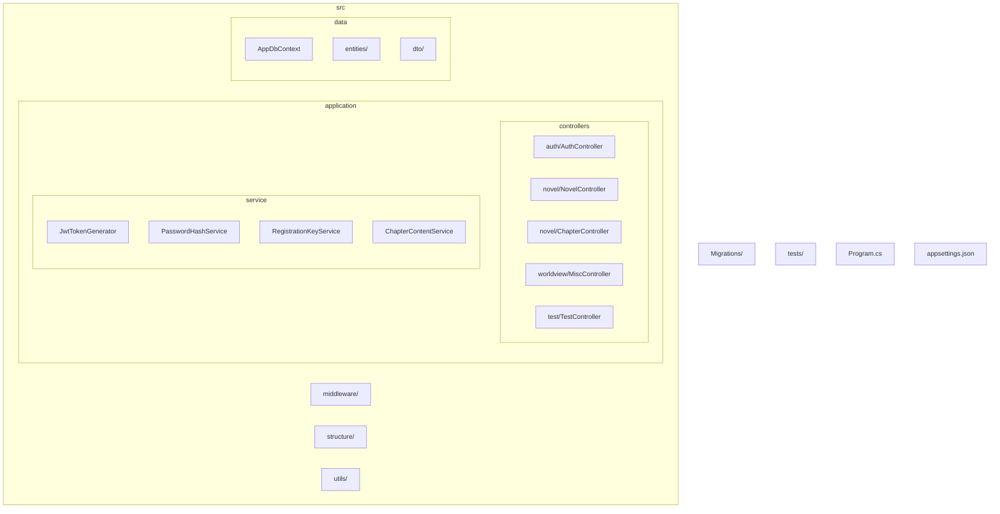
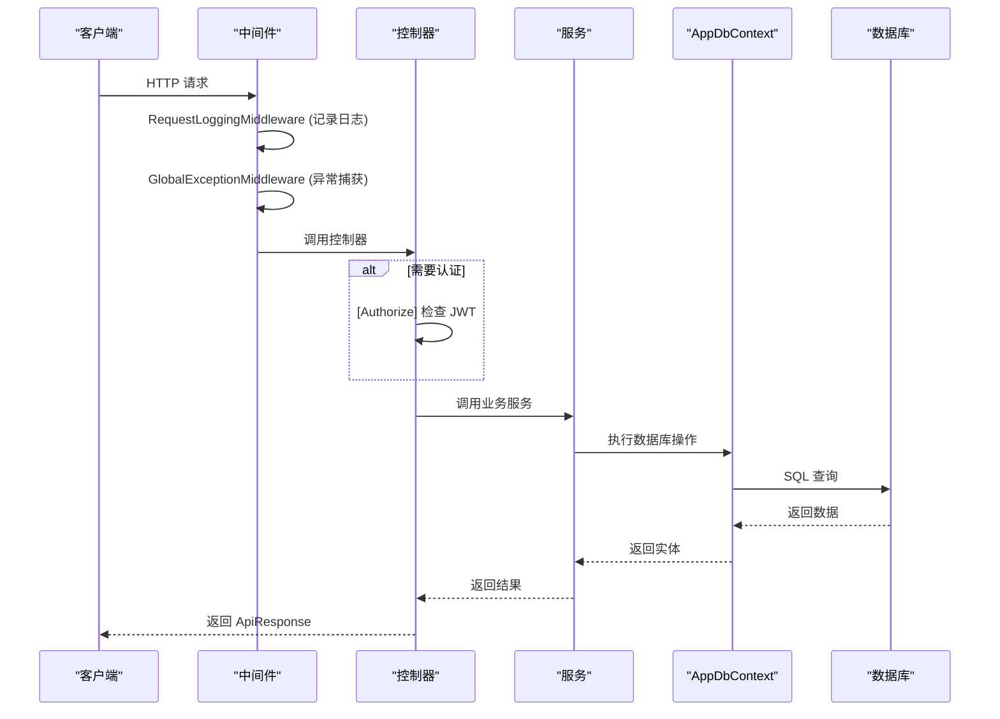
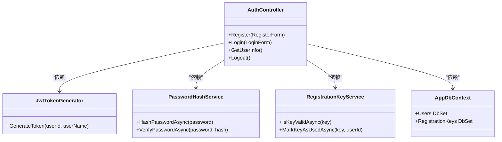
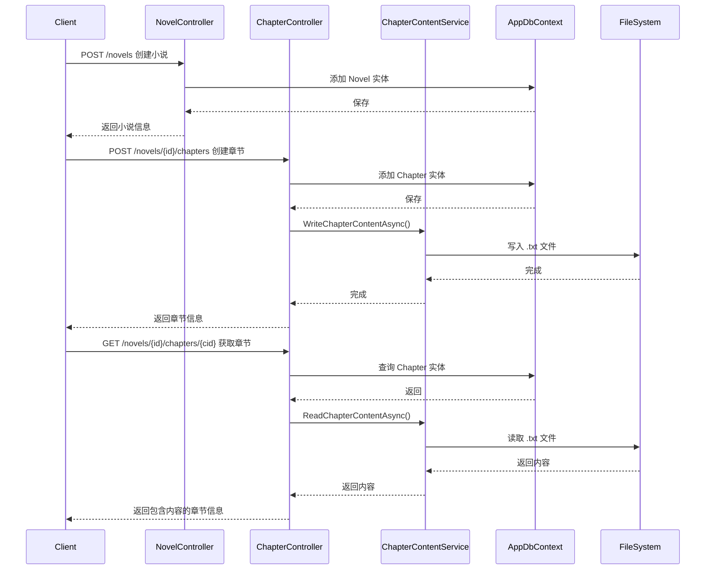
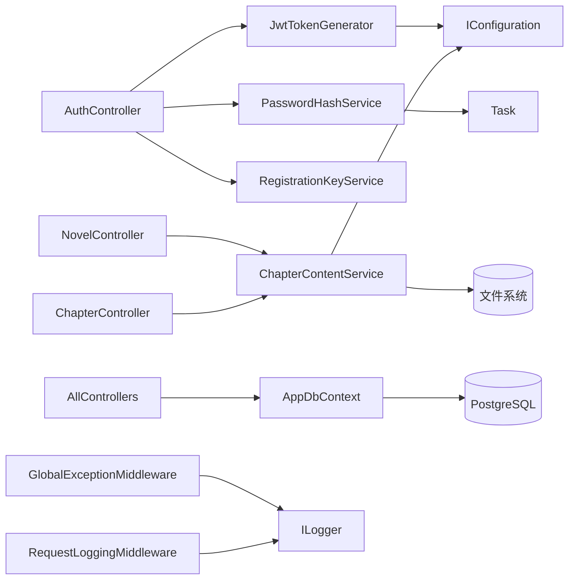

# API文档增强

<cite>
**本文档中引用的文件**  
- [Program.cs](file://Program.cs)
- [appsettings.json](file://appsettings.json)
- [AppDbContext.cs](file://src/data/AppDbContext.cs)
- [ApiResponse.cs](file://src/structure/ApiResponse.cs)
- [GlobalExceptionMiddleware.cs](file://src/middleware/GlobalExceptionMiddleware.cs)
- [RequestLoggingMiddleware.cs](file://src/middleware/RequestLoggingMiddleware.cs)
- [AuthController.cs](file://src/application/controllers/auth/AuthController.cs)
- [NovelController.cs](file://src/application/controllers/novel/NovelController.cs)
- [ChapterController.cs](file://src/application/controllers/novel/ChapterController.cs)
- [MiscController.cs](file://src/application/controllers/worldview/MiscController.cs)
- [TestController.cs](file://src/application/controllers/test/TestController.cs)
- [JwtTokenGenerator.cs](file://src/application/service/JwtTokenGenerator.cs)
- [PasswordHashService.cs](file://src/application/service/PasswordHashService.cs)
- [RegistrationKeyService.cs](file://src/application/service/RegistrationKeyService.cs)
- [ChapterContentService.cs](file://src/application/service/ChapterContentService.cs)
</cite>

## 目录
1. [简介](#简介)
2. [项目结构](#项目结构)
3. [核心组件](#核心组件)
4. [架构概览](#架构概览)
5. [详细组件分析](#详细组件分析)
6. [依赖分析](#依赖分析)
7. [性能考虑](#性能考虑)
8. [故障排除指南](#故障排除指南)
9. [结论](#结论)

## 简介
TaleArc 后端是一个基于 ASP.NET Core 构建的 RESTful API 服务，旨在为创意写作和世界观构建提供支持。系统实现了用户认证、小说管理、章节内容存储、世界观元素管理等功能。API 遵循统一响应格式，集成 JWT 身份验证，并通过中间件实现日志记录和全局异常处理。本增强文档旨在全面解析其 API 设计、架构模式和关键实现细节。

## 项目结构
该项目采用分层架构，主要分为 `src`（源代码）、`Migrations`（数据库迁移）、`tests`（单元测试）等目录。源代码按功能模块组织在 `src` 目录下，包括 `application`（应用层，含控制器和服务）、`data`（数据层，含实体和数据库上下文）、`middleware`（中间件）、`structure`（通用结构）和 `utils`（工具类）。



**图表来源**
- [Program.cs](file://Program.cs#L21-L111)
- [AppDbContext.cs](file://src/data/AppDbContext.cs#L6-L28)

**本节来源**
- [Program.cs](file://Program.cs#L1-L112)
- [appsettings.json](file://appsettings.json#L1-L19)
- [AppDbContext.cs](file://src/data/AppDbContext.cs#L1-L28)

## 核心组件
系统的核心组件包括认证控制器（`AuthController`）、小说控制器（`NovelController`）、章节控制器（`ChapterController`）和杂项控制器（`MiscController`），它们共同构成了 API 的主要功能入口。这些控制器均继承自 `ControllerBase`，并使用 `[ApiController]` 和 `[Route]` 属性进行配置。业务逻辑被封装在独立的服务类中，如 `JwtTokenGenerator` 用于生成令牌，`PasswordHashService` 用于安全地哈希密码，`ChapterContentService` 用于管理存储在文件系统中的章节内容。所有 API 响应均遵循 `ApiResponse<T>` 的统一格式，确保了客户端处理的一致性。

**本节来源**
- [AuthController.cs](file://src/application/controllers/auth/AuthController.cs#L67-L227)
- [NovelController.cs](file://src/application/controllers/novel/NovelController.cs#L18-L164)
- [ChapterController.cs](file://src/application/controllers/novel/ChapterController.cs#L19-L252)
- [MiscController.cs](file://src/application/controllers/worldview/MiscController.cs#L18-L249)
- [ApiResponse.cs](file://src/structure/ApiResponse.cs#L7-L40)

## 架构概览
该系统采用典型的分层架构，从上至下分为表示层（Controllers）、应用层（Services）、数据访问层（Entity Framework Core）和持久层（PostgreSQL 数据库）。HTTP 请求首先经过 `RequestLoggingMiddleware` 和 `GlobalExceptionMiddleware` 两个自定义中间件，分别负责记录请求日志和捕获未处理的异常。随后，请求由 ASP.NET Core 的路由系统分发到相应的控制器。控制器通过依赖注入获取服务实例和数据库上下文，执行业务逻辑，并通过 `AppDbContext` 访问数据库。对于需要身份验证的端点，`[Authorize]` 特性会与 JWT Bearer 认证方案协同工作，验证请求中的令牌。



**图表来源**
- [Program.cs](file://Program.cs#L105-L110)
- [AuthController.cs](file://src/application/controllers/auth/AuthController.cs#L67)
- [NovelController.cs](file://src/application/controllers/novel/NovelController.cs#L18)
- [AppDbContext.cs](file://src/data/AppDbContext.cs#L6)

## 详细组件分析
本节将深入分析系统中的关键组件，包括其职责、交互方式和实现细节。

### 认证流程分析
认证流程是系统安全性的基石，主要由 `AuthController`、`JwtTokenGenerator`、`PasswordHashService` 和 `RegistrationKeyService` 协同完成。

#### 认证控制器与服务交互


**图表来源**
- [AuthController.cs](file://src/application/controllers/auth/AuthController.cs#L67-L227)
- [JwtTokenGenerator.cs](file://src/application/service/JwtTokenGenerator.cs#L11-L49)
- [PasswordHashService.cs](file://src/application/service/PasswordHashService.cs#L9-L69)
- [RegistrationKeyService.cs](file://src/application/service/RegistrationKeyService.cs#L6-L37)

**本节来源**
- [AuthController.cs](file://src/application/controllers/auth/AuthController.cs#L15-L227)
- [JwtTokenGenerator.cs](file://src/application/service/JwtTokenGenerator.cs#L8-L49)
- [PasswordHashService.cs](file://src/application/service/PasswordHashService.cs#L6-L69)
- [RegistrationKeyService.cs](file://src/application/service/RegistrationKeyService.cs#L6-L37)

### 内容管理流程分析
内容管理流程涉及小说和章节的创建、读取、更新和删除（CRUD）操作，其特点是将元数据存储在数据库中，而将大文本内容存储在文件系统中。

#### 小说与章节管理序列图


**图表来源**
- [NovelController.cs](file://src/application/controllers/novel/NovelController.cs#L83-L95)
- [ChapterController.cs](file://src/application/controllers/novel/ChapterController.cs#L133-L164)
- [ChapterContentService.cs](file://src/application/service/ChapterContentService.cs#L59-L73)
- [ChapterContentService.cs](file://src/application/service/ChapterContentService.cs#L35-L48)

**本节来源**
- [NovelController.cs](file://src/application/controllers/novel/NovelController.cs#L18-L164)
- [ChapterController.cs](file://src/application/controllers/novel/ChapterController.cs#L19-L252)
- [ChapterContentService.cs](file://src/application/service/ChapterContentService.cs#L6-L104)

### 统一响应与异常处理
系统通过 `ApiResponse<T>` 类和 `GlobalExceptionMiddleware` 实现了统一的响应格式和异常处理机制。

#### 响应与异常处理流程
```mermaid
flowchart TD
A[HTTP 请求] --> B{控制器方法}
B --> C[业务逻辑执行]
C --> D{成功?}
D --> |是| E[ApiResponse.Success(data)]
D --> |否| F[抛出异常]
F --> G[GlobalExceptionMiddleware]
G --> H[记录错误日志]
H --> I[返回 ApiResponse.Fail(500)]
E --> J[序列化为 JSON]
I --> J
J --> K[HTTP 响应]
```

**图表来源**
- [ApiResponse.cs](file://src/structure/ApiResponse.cs#L7-L40)
- [GlobalExceptionMiddleware.cs](file://src/middleware/GlobalExceptionMiddleware.cs#L22-L44)
- [Program.cs](file://Program.cs#L106)

**本节来源**
- [ApiResponse.cs](file://src/structure/ApiResponse.cs#L1-L40)
- [GlobalExceptionMiddleware.cs](file://src/middleware/GlobalExceptionMiddleware.cs#L7-L45)
- [RequestLoggingMiddleware.cs](file://src/middleware/RequestLoggingMiddleware.cs#L5-L39)

## 依赖分析
系统依赖关系清晰，遵循依赖倒置原则。高层模块（如 Controllers）依赖于抽象（Services），而底层模块（如 Services）的实现则通过依赖注入容器进行管理。主要的外部依赖包括：
- **Microsoft.EntityFrameworkCore**：用于 ORM 和数据库交互。
- **Npgsql**：Entity Framework Core 的 PostgreSQL 提供程序。
- **Microsoft.AspNetCore.Authentication.JwtBearer**：用于 JWT 身份验证。
- **Serilog**：用于结构化日志记录。
- **System.Text.Json**：用于 JSON 序列化。



**图表来源**
- [Program.cs](file://Program.cs#L24-L49)
- [JwtTokenGenerator.cs](file://src/application/service/JwtTokenGenerator.cs#L16)
- [ChapterContentService.cs](file://src/application/service/ChapterContentService.cs#L11)
- [AppDbContext.cs](file://src/data/AppDbContext.cs#L6)

**本节来源**
- [Program.cs](file://Program.cs#L1-L112)
- [JwtTokenGenerator.cs](file://src/application/service/JwtTokenGenerator.cs#L1-L49)
- [ChapterContentService.cs](file://src/application/service/ChapterContentService.cs#L1-L104)

## 性能考虑
系统在设计时考虑了若干性能因素。密码哈希使用了 PBKDF2 算法，迭代次数设置为 100,000，以平衡安全性和性能，并通过 `Task.Run` 将其异步化以避免阻塞 I/O 线程。章节的大文本内容被存储在文件系统而非数据库中，这可以显著提高读写大文本的性能并降低数据库负载。`ChapterContentService` 在读取文件前会检查文件是否存在，避免了不必要的异常开销。此外，`RequestLoggingMiddleware` 使用 `Stopwatch` 来记录请求处理时间，有助于识别性能瓶颈。

## 故障排除指南
当 API 出现问题时，可按以下步骤进行排查：
1.  **检查日志**：首要步骤是查看 `logs/app-.log` 文件。`RequestLoggingMiddleware` 会记录每个请求的开始和结束，`GlobalExceptionMiddleware` 会捕获并记录所有未处理的异常。
2.  **验证 JWT 令牌**：对于返回 401 状态码的请求，检查 `Authorization` 头是否正确包含 `Bearer <token>`。确保令牌未过期。
3.  **检查数据库连接**：如果出现 500 错误且日志中提到数据库连接问题，请确认 `appsettings.json` 中的连接字符串是否正确，并确保 PostgreSQL 服务正在运行。
4.  **验证文件路径**：如果章节内容无法读取或写入，请检查 `appsettings.json` 中的 `ContentStorage:BasePath` 配置路径是否正确，并确认应用程序有对该目录的读写权限。
5.  **审查请求参数**：对于 400 错误，检查请求体是否符合 Swagger 文档中定义的模型，特别是必填字段和数据类型。

**本节来源**
- [GlobalExceptionMiddleware.cs](file://src/middleware/GlobalExceptionMiddleware.cs#L30-L44)
- [RequestLoggingMiddleware.cs](file://src/middleware/RequestLoggingMiddleware.cs#L20-L36)
- [appsettings.json](file://appsettings.json#L7-L11)
- [AuthController.cs](file://src/application/controllers/auth/AuthController.cs#L87-L94)

## 结论
TaleArc 后端 API 设计良好，结构清晰，实现了安全的用户认证、高效的内容管理和统一的错误处理。通过将大文本内容外置到文件系统，系统在处理长篇小说时具有良好的性能潜力。代码遵循了良好的实践，如依赖注入、关注点分离和使用异步编程。增强的文档详细说明了其架构、组件交互和关键流程，为后续的开发、维护和扩展提供了坚实的基础。建议未来可以进一步完善 Swagger 注释，并增加针对关键服务的单元测试覆盖率。