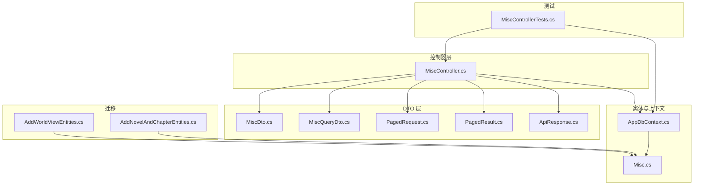
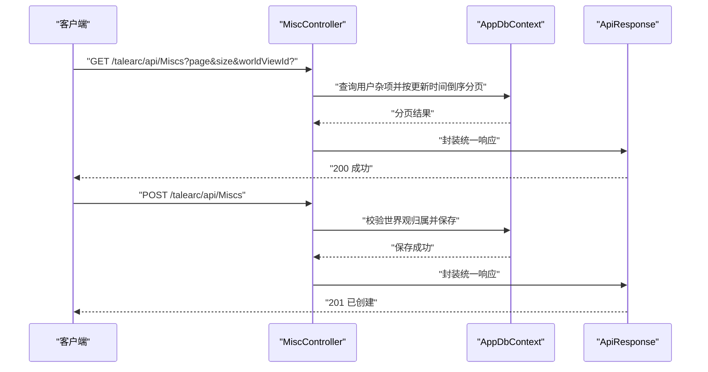
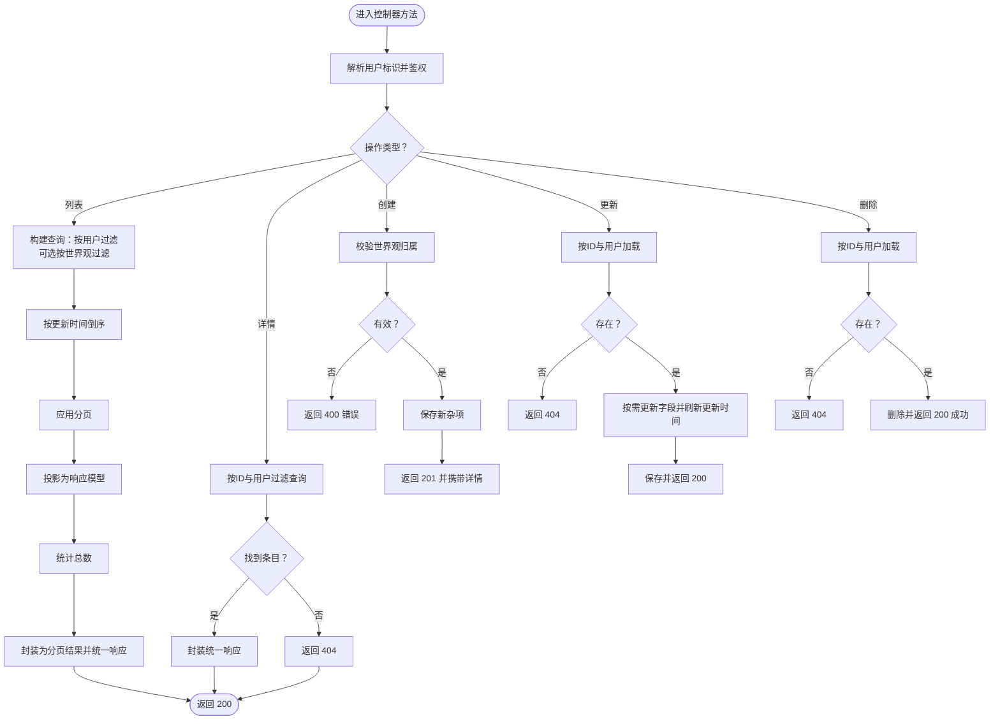
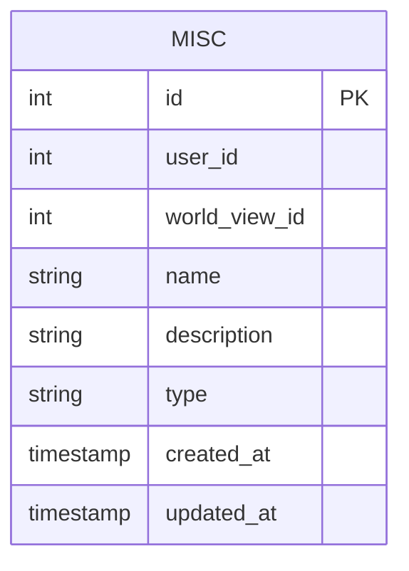
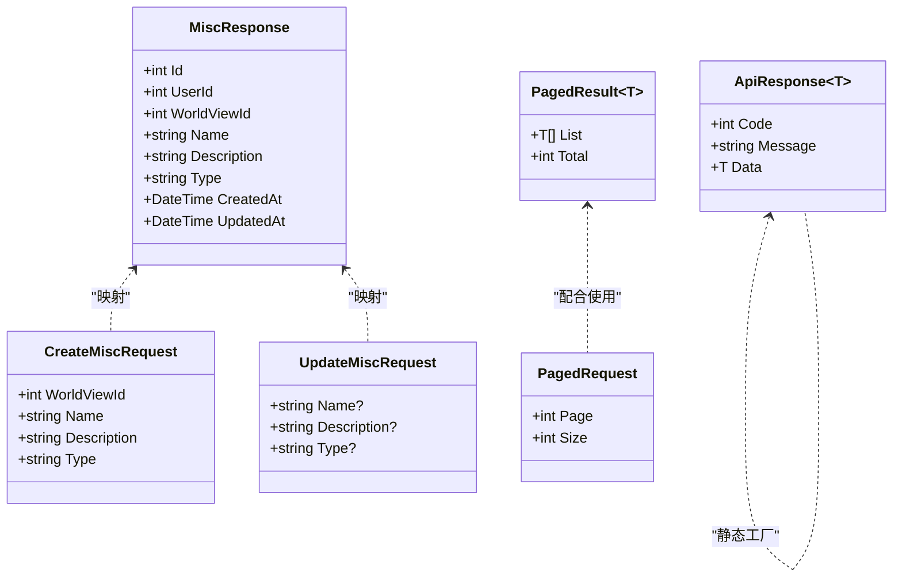
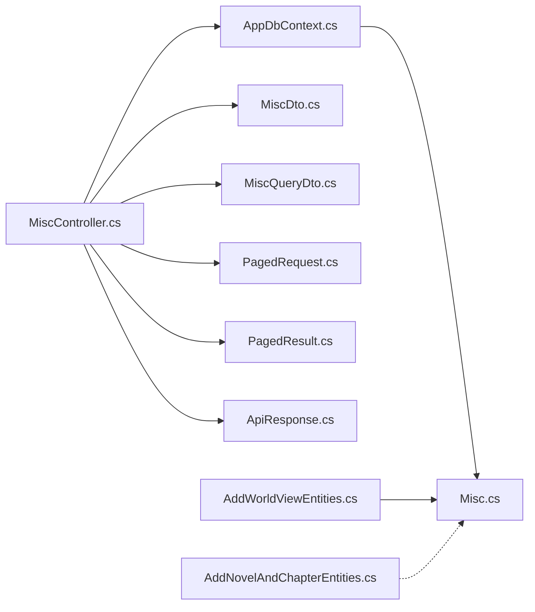

# 杂项实体管理

<cite>
**本文引用的文件**
- [MiscController.cs](file://src/application/controllers/worldview/MiscController.cs)
- [Misc.cs](file://src/data/entities/Misc.cs)
- [MiscDto.cs](file://src/data/dto/MiscDto.cs)
- [MiscQueryDto.cs](file://src/data/dto/MiscQueryDto.cs)
- [PagedRequest.cs](file://src/structure/PagedRequest.cs)
- [PagedResult.cs](file://src/structure/PagedResult.cs)
- [ApiResponse.cs](file://src/structure/ApiResponse.cs)
- [AppDbContext.cs](file://src/data/AppDbContext.cs)
- [AddWorldViewEntities.cs](file://Migrations/20251203092724_AddWorldViewEntities.cs)
- [AddNovelAndChapterEntities.cs](file://Migrations/20251217094734_AddNovelAndChapterEntities.cs)
- [MiscControllerTests.cs](file://tests/Controllers/MiscControllerTests.cs)
</cite>

## 目录
1. [简介](#简介)
2. [项目结构](#项目结构)
3. [核心组件](#核心组件)
4. [架构总览](#架构总览)
5. [详细组件分析](#详细组件分析)
6. [依赖关系分析](#依赖关系分析)
7. [性能考量](#性能考量)
8. [故障排查指南](#故障排查指南)
9. [结论](#结论)
10. [附录](#附录)

## 简介
本章节概述“杂项实体管理”的目标与范围。杂项用于在“世界观”维度下组织和管理通用条目，如道具、地点、事件等。该模块提供面向用户的 CRUD 能力，并通过分页查询支持大规模数据浏览；同时保证每个杂项仅对所属用户可见，确保数据隔离。

## 项目结构
围绕“杂项实体管理”，后端采用分层架构：
- 控制器层：处理 HTTP 请求与响应，负责鉴权与业务编排。
- DTO 层：定义输入输出模型，包括创建、更新、查询与分页参数。
- 实体层：持久化模型，映射数据库表字段。
- 数据上下文层：EF Core 上下文，暴露实体集合。
- 迁移层：定义数据库表结构及主键约束。
- 测试层：验证控制器行为与数据一致性。

图表来源
- [MiscController.cs](file://src/application/controllers/worldview/MiscController.cs#L1-L249)
- [MiscDto.cs](file://src/data/dto/MiscDto.cs#L1-L95)
- [MiscQueryDto.cs](file://src/data/dto/MiscQueryDto.cs#L1-L15)
- [PagedRequest.cs](file://src/structure/PagedRequest.cs#L1-L18)
- [PagedResult.cs](file://src/structure/PagedResult.cs#L1-L19)
- [ApiResponse.cs](file://src/structure/ApiResponse.cs#L1-L40)
- [Misc.cs](file://src/data/entities/Misc.cs#L1-L63)
- [AppDbContext.cs](file://src/data/AppDbContext.cs#L1-L28)
- [AddWorldViewEntities.cs](file://Migrations/20251203092724_AddWorldViewEntities.cs#L1-L137)
- [AddNovelAndChapterEntities.cs](file://Migrations/20251217094734_AddNovelAndChapterEntities.cs#L1-L67)
- [MiscControllerTests.cs](file://tests/Controllers/MiscControllerTests.cs#L1-L276)

章节来源
- [MiscController.cs](file://src/application/controllers/worldview/MiscController.cs#L1-L249)
- [AppDbContext.cs](file://src/data/AppDbContext.cs#L1-L28)

## 核心组件
- 控制器：提供获取列表（支持分页与按世界观过滤）、按 ID 获取详情、创建、更新、删除等接口。
- 实体：定义杂项的持久化字段与约束。
- DTO：封装创建、更新、查询与响应模型。
- 分页与统一响应：提供分页请求基类、分页结果容器与统一响应包装。
- 数据库上下文：注册实体集合并配置模型。

章节来源
- [MiscController.cs](file://src/application/controllers/worldview/MiscController.cs#L1-L249)
- [Misc.cs](file://src/data/entities/Misc.cs#L1-L63)
- [MiscDto.cs](file://src/data/dto/MiscDto.cs#L1-L95)
- [MiscQueryDto.cs](file://src/data/dto/MiscQueryDto.cs#L1-L15)
- [PagedRequest.cs](file://src/structure/PagedRequest.cs#L1-L18)
- [PagedResult.cs](file://src/structure/PagedResult.cs#L1-L19)
- [ApiResponse.cs](file://src/structure/ApiResponse.cs#L1-L40)
- [AppDbContext.cs](file://src/data/AppDbContext.cs#L1-L28)

## 架构总览
控制器作为入口，接收请求后进行鉴权与参数校验，随后调用数据上下文执行查询或变更操作，最后以统一响应格式返回。

图表来源
- [MiscController.cs](file://src/application/controllers/worldview/MiscController.cs#L1-L249)
- [AppDbContext.cs](file://src/data/AppDbContext.cs#L1-L28)
- [ApiResponse.cs](file://src/structure/ApiResponse.cs#L1-L40)

## 详细组件分析

### 控制器：杂项管理
- 认证与路由：使用授权特性，路由前缀为 talearc/api/Miscs。
- 查询接口：
  - 支持分页参数（page、size），默认第一页每页10条。
  - 可选按世界观过滤（WorldViewId）。
  - 结果按更新时间倒序，返回统一响应包裹的分页结果。
- 单条查询：按 ID 获取，仅当条目属于当前用户时返回。
- 创建接口：
  - 校验请求中的世界观是否属于当前用户，否则返回错误。
  - 保存新杂项并返回创建后的详情。
- 更新接口：
  - 仅允许更新名称、描述、类型（可空字段按需更新）。
  - 更新时间自动刷新。
- 删除接口：
  - 仅当条目属于当前用户时允许删除。

图表来源
- [MiscController.cs](file://src/application/controllers/worldview/MiscController.cs#L1-L249)

章节来源
- [MiscController.cs](file://src/application/controllers/worldview/MiscController.cs#L1-L249)

### 实体与数据库模型
- 实体字段：
  - 主键：自增整型 id。
  - 用户标识：UserId（外键到用户，由上层逻辑保证归属）。
  - 世界观标识：WorldViewId（用于按世界维度隔离）。
  - 名称与描述：字符串，长度限制。
  - 类型：字符串，用于区分“道具、地点、事件”等。
  - 时间戳：CreatedAt、UpdatedAt，默认值为当前 UTC。
- 关系与约束：
  - 主键约束：PK_Miscs。
  - 字段长度与必填约束：名称与类型必填，描述与名称有最大长度。
- 迁移：
  - 初始迁移中创建 Miscs 表。
  - 小说与章节迁移未影响 Miscs，但后续扩展可复用该表。

图表来源
- [Misc.cs](file://src/data/entities/Misc.cs#L1-L63)
- [AddWorldViewEntities.cs](file://Migrations/20251203092724_AddWorldViewEntities.cs#L56-L72)

章节来源
- [Misc.cs](file://src/data/entities/Misc.cs#L1-L63)
- [AddWorldViewEntities.cs](file://Migrations/20251203092724_AddWorldViewEntities.cs#L1-L137)

### DTO 与分页/响应模型
- 创建请求：包含 WorldViewId、Name、Description、Type。
- 更新请求：可空字段，按需更新。
- 响应模型：包含 Id、UserId、WorldViewId、Name、Description、Type、CreatedAt、UpdatedAt。
- 分页请求：继承 PagedRequest，新增可选 WorldViewId。
- 统一响应：Success/Fail 工具方法，返回 Code、Message、Data。

图表来源
- [MiscDto.cs](file://src/data/dto/MiscDto.cs#L1-L95)
- [MiscQueryDto.cs](file://src/data/dto/MiscQueryDto.cs#L1-L15)
- [PagedRequest.cs](file://src/structure/PagedRequest.cs#L1-L18)
- [PagedResult.cs](file://src/structure/PagedResult.cs#L1-L19)
- [ApiResponse.cs](file://src/structure/ApiResponse.cs#L1-L40)

章节来源
- [MiscDto.cs](file://src/data/dto/MiscDto.cs#L1-L95)
- [MiscQueryDto.cs](file://src/data/dto/MiscQueryDto.cs#L1-L15)
- [PagedRequest.cs](file://src/structure/PagedRequest.cs#L1-L18)
- [PagedResult.cs](file://src/structure/PagedResult.cs#L1-L19)
- [ApiResponse.cs](file://src/structure/ApiResponse.cs#L1-L40)

### 数据上下文与迁移
- 数据上下文：注册 Miscs 集合，供控制器与测试使用。
- 迁移：
  - 初始迁移创建 Miscs 表并设置主键。
  - 小说与章节迁移独立于 Miscs，不影响现有结构。

章节来源
- [AppDbContext.cs](file://src/data/AppDbContext.cs#L1-L28)
- [AddWorldViewEntities.cs](file://Migrations/20251203092724_AddWorldViewEntities.cs#L56-L72)
- [AddNovelAndChapterEntities.cs](file://Migrations/20251217094734_AddNovelAndChapterEntities.cs#L1-L67)

### 测试要点
- 创建：插入用户与世界观后，创建杂项并断言字段与归属正确。
- 查询：按 ID 与用户过滤，断言名称与类型等字段。
- 更新：修改名称、描述、类型，断言更新成功且更新时间刷新。
- 删除：删除后断言不存在。
- 过滤：按不同世界观过滤，断言仅返回对应条目。

章节来源
- [MiscControllerTests.cs](file://tests/Controllers/MiscControllerTests.cs#L1-L276)

## 依赖关系分析
- 控制器依赖：
  - AppDbContext 提供实体集合与数据库访问。
  - DTO 用于请求与响应建模。
  - PagedRequest/PagedResult/ApiResponse 提供分页与统一响应。
- 实体依赖：
  - Misc 实体依赖 EF Core 注解与数据库列映射。
- 迁移依赖：
  - 初始迁移定义 Miscs 表结构与主键。

图表来源
- [MiscController.cs](file://src/application/controllers/worldview/MiscController.cs#L1-L249)
- [AppDbContext.cs](file://src/data/AppDbContext.cs#L1-L28)
- [MiscDto.cs](file://src/data/dto/MiscDto.cs#L1-L95)
- [MiscQueryDto.cs](file://src/data/dto/MiscQueryDto.cs#L1-L15)
- [PagedRequest.cs](file://src/structure/PagedRequest.cs#L1-L18)
- [PagedResult.cs](file://src/structure/PagedResult.cs#L1-L19)
- [ApiResponse.cs](file://src/structure/ApiResponse.cs#L1-L40)
- [Misc.cs](file://src/data/entities/Misc.cs#L1-L63)
- [AddWorldViewEntities.cs](file://Migrations/20251203092724_AddWorldViewEntities.cs#L56-L72)
- [AddNovelAndChapterEntities.cs](file://Migrations/20251217094734_AddNovelAndChapterEntities.cs#L1-L67)

## 性能考量
- 查询优化：
  - 列表查询按用户过滤与更新时间倒序，建议在 WorldViewId 与 UpdatedAt 上建立索引以提升分页与过滤性能。
- 分页策略：
  - 使用 Page/Size 控制批量读取，避免一次性返回大量数据。
- 写入优化：
  - 更新时仅更新必要字段，减少写入开销。
- 缓存建议：
  - 对热点条目可考虑短期缓存，降低数据库压力（需结合失效策略）。

## 故障排查指南
- 404 未找到：
  - 条目不存在或不属于当前用户。
- 400 参数无效：
  - 传入的世界观不属于当前用户，或请求体不完整。
- 数据不一致：
  - 确认创建/更新流程是否正确设置 UserId 与 WorldViewId。
- 分页异常：
  - 检查 Page/Size 是否合理，以及排序字段是否稳定（建议使用唯一键辅助排序）。

章节来源
- [MiscController.cs](file://src/application/controllers/worldview/MiscController.cs#L1-L249)

## 结论
“杂项实体管理”模块以清晰的分层设计实现了用户级的数据隔离与高效分页浏览。通过统一响应与 DTO 映射，接口具备良好的可维护性与扩展性。建议在生产环境中补充索引与缓存策略，进一步提升性能与稳定性。

## 附录
- 接口清单（概要）
  - GET /talearc/api/Miscs?page&size&worldViewId?：分页获取用户杂项（支持按世界观过滤）
  - GET /talearc/api/Miscs/{id}：按 ID 获取杂项详情
  - POST /talearc/api/Miscs：创建杂项（校验世界观归属）
  - PUT /talearc/api/Miscs/{id}：更新杂项（按需更新字段）
  - DELETE /talearc/api/Miscs/{id}：删除杂项