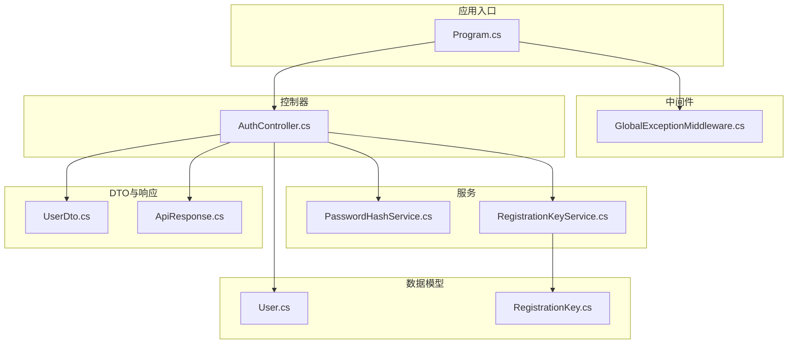
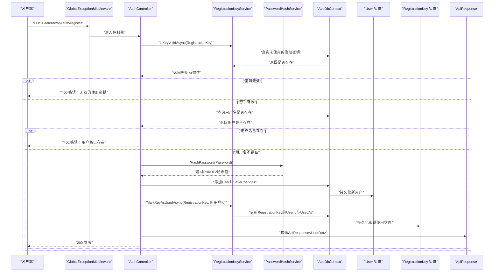
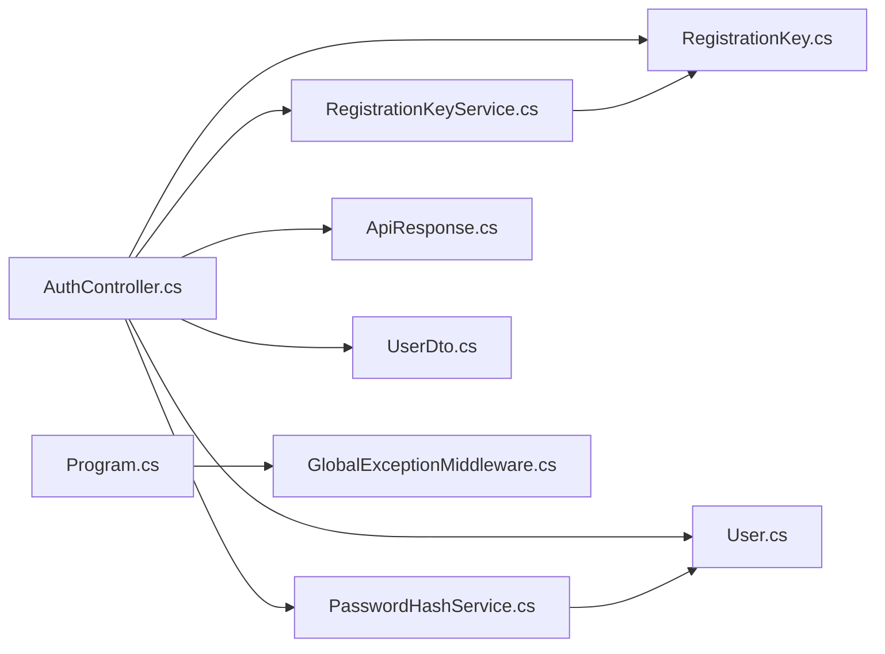

# 用户注册接口

<cite>
**本文引用的文件**
- [AuthController.cs](file://src/application/controllers/auth/AuthController.cs)
- [PasswordHashService.cs](file://src/application/service/PasswordHashService.cs)
- [RegistrationKeyService.cs](file://src/application/service/RegistrationKeyService.cs)
- [User.cs](file://src/data/entities/User.cs)
- [RegistrationKey.cs](file://src/data/entities/RegistrationKey.cs)
- [UserDto.cs](file://src/data/dto/UserDto.cs)
- [ApiResponse.cs](file://src/structure/ApiResponse.cs)
- [GlobalExceptionMiddleware.cs](file://src/middleware/GlobalExceptionMiddleware.cs)
- [Program.cs](file://Program.cs)
</cite>

## 目录
1. [简介](#简介)
2. [项目结构](#项目结构)
3. [核心组件](#核心组件)
4. [架构总览](#架构总览)
5. [详细组件分析](#详细组件分析)
6. [依赖关系分析](#依赖关系分析)
7. [性能与安全考虑](#性能与安全考虑)
8. [故障排查指南](#故障排查指南)
9. [结论](#结论)
10. [附录](#附录)

## 简介
本文件为用户注册接口（POST /talearc/api/auth/register）的完整API文档。该接口用于新用户注册，请求体为RegisterForm对象，包含用户名、密码与注册密钥三要素。接口工作流程包括：
- 校验注册密钥有效性
- 检查用户名是否已存在
- 使用PBKDF2算法对密码进行加盐哈希处理
- 将新用户持久化到数据库
- 将注册密钥标记为已使用

成功时返回200状态码及用户信息；失败时返回400（密钥无效或用户名已存在）。该接口无需身份认证，但受全局异常中间件保护，任何未处理异常会被捕获并记录日志。

## 项目结构
与注册接口相关的文件组织如下：
- 控制器层：AuthController.cs 提供注册与登录等认证相关接口
- 服务层：PasswordHashService.cs 负责密码哈希与校验；RegistrationKeyService.cs 负责注册密钥校验与使用标记
- 数据模型：User.cs、RegistrationKey.cs 定义用户与注册密钥的数据结构
- DTO：UserDto.cs 定义对外传输的用户信息
- 统一响应：ApiResponse.cs 定义统一响应格式
- 中间件：GlobalExceptionMiddleware.cs 全局异常捕获与日志记录
- 应用入口：Program.cs 配置中间件与认证

图表来源
- [Program.cs](file://Program.cs#L91-L107)
- [GlobalExceptionMiddleware.cs](file://src/middleware/GlobalExceptionMiddleware.cs#L1-L45)
- [AuthController.cs](file://src/application/controllers/auth/AuthController.cs#L62-L129)
- [PasswordHashService.cs](file://src/application/service/PasswordHashService.cs#L1-L53)
- [RegistrationKeyService.cs](file://src/application/service/RegistrationKeyService.cs#L1-L37)
- [User.cs](file://src/data/entities/User.cs#L1-L40)
- [RegistrationKey.cs](file://src/data/entities/RegistrationKey.cs#L1-L31)
- [UserDto.cs](file://src/data/dto/UserDto.cs#L1-L22)
- [ApiResponse.cs](file://src/structure/ApiResponse.cs#L1-L40)

章节来源
- [Program.cs](file://Program.cs#L91-L107)

## 核心组件
- 接口路径与方法：POST /talearc/api/auth/register
- 请求体：RegisterForm（包含Name、Password、RegistrationKey）
- 成功响应：200 OK，响应体为ApiResponse<UserDto>
- 失败响应：400 Bad Request，响应体为ApiResponse<object>，错误信息为“无效的注册密钥”或“用户名已存在”
- 认证要求：无需身份认证
- 异常处理：受GlobalExceptionMiddleware保护，未处理异常将被记录并返回500

章节来源
- [AuthController.cs](file://src/application/controllers/auth/AuthController.cs#L82-L129)
- [ApiResponse.cs](file://src/structure/ApiResponse.cs#L1-L40)

## 架构总览
注册接口的调用序列如下：

图表来源
- [AuthController.cs](file://src/application/controllers/auth/AuthController.cs#L82-L129)
- [RegistrationKeyService.cs](file://src/application/service/RegistrationKeyService.cs#L12-L37)
- [PasswordHashService.cs](file://src/application/service/PasswordHashService.cs#L12-L25)
- [User.cs](file://src/data/entities/User.cs#L1-L40)
- [RegistrationKey.cs](file://src/data/entities/RegistrationKey.cs#L1-L31)
- [ApiResponse.cs](file://src/structure/ApiResponse.cs#L1-L40)

## 详细组件分析

### 控制器：AuthController.Register
- 路由与方法：POST /talearc/api/auth/register
- 参数绑定：RegisterForm（Name、Password、RegistrationKey）
- 校验逻辑：
  - 使用RegistrationKeyService校验注册密钥是否有效且未被使用
  - 查询数据库确认用户名是否已存在
- 处理逻辑：
  - 使用PasswordHashService对密码进行PBKDF2加盐哈希
  - 创建User实体并保存到数据库
  - 使用RegistrationKeyService将注册密钥标记为已使用
- 响应：
  - 成功：返回200，数据为UserDto
  - 失败：返回400，错误信息为“无效的注册密钥”或“用户名已存在”
- 异常处理：捕获异常后记录日志并重新抛出，交由全局中间件处理

章节来源
- [AuthController.cs](file://src/application/controllers/auth/AuthController.cs#L82-L129)

### 服务：RegistrationKeyService
- IsKeyValidAsync：查询RegistrationKey表，判断指定密钥是否存在且未被使用（UserId为空）
- MarkKeyAsUsedAsync：根据密钥查找记录，设置UserId与UsedAt并保存

章节来源
- [RegistrationKeyService.cs](file://src/application/service/RegistrationKeyService.cs#L12-L37)
- [RegistrationKey.cs](file://src/data/entities/RegistrationKey.cs#L1-L31)

### 服务：PasswordHashService
- HashPassword：使用PBKDF2（SHA256、固定迭代次数与盐长度）生成哈希，并将盐与哈希拼接后Base64编码
- VerifyPassword：从存储的哈希中解析盐，重新计算哈希并与存储值逐字节比对

章节来源
- [PasswordHashService.cs](file://src/application/service/PasswordHashService.cs#L1-L53)
- [User.cs](file://src/data/entities/User.cs#L1-L40)

### 数据模型：User 与 RegistrationKey
- User：包含Id、Name、Password、CreateAt字段，其中Name与Password为必填
- RegistrationKey：包含Key、UserId、UsedAt字段，Key为主键，UserId可空表示未使用

章节来源
- [User.cs](file://src/data/entities/User.cs#L1-L40)
- [RegistrationKey.cs](file://src/data/entities/RegistrationKey.cs#L1-L31)

### DTO与统一响应：UserDto 与 ApiResponse
- UserDto：对外暴露的用户信息，包含Id、Name、CreateAt
- ApiResponse：统一响应结构，包含Code、Message、Data；提供Success与Fail工厂方法

章节来源
- [UserDto.cs](file://src/data/dto/UserDto.cs#L1-L22)
- [ApiResponse.cs](file://src/structure/ApiResponse.cs#L1-L40)

### 全局异常中间件：GlobalExceptionMiddleware
- 在请求管线中捕获未处理异常，记录日志并返回500错误的统一响应

章节来源
- [GlobalExceptionMiddleware.cs](file://src/middleware/GlobalExceptionMiddleware.cs#L1-L45)

## 依赖关系分析
- 控制器依赖：
  - RegistrationKeyService：用于密钥校验与使用标记
  - PasswordHashService：用于密码哈希
  - AppDbContext：用于用户与密钥的数据库访问
- 服务依赖：
  - AppDbContext：EF Core上下文
- 中间件依赖：
  - Program.cs中注册顺序：日志中间件 -> 全局异常中间件 -> 认证/授权中间件 -> 控制器映射

图表来源
- [AuthController.cs](file://src/application/controllers/auth/AuthController.cs#L62-L129)
- [RegistrationKeyService.cs](file://src/application/service/RegistrationKeyService.cs#L1-L37)
- [PasswordHashService.cs](file://src/application/service/PasswordHashService.cs#L1-L53)
- [User.cs](file://src/data/entities/User.cs#L1-L40)
- [RegistrationKey.cs](file://src/data/entities/RegistrationKey.cs#L1-L31)
- [UserDto.cs](file://src/data/dto/UserDto.cs#L1-L22)
- [ApiResponse.cs](file://src/structure/ApiResponse.cs#L1-L40)
- [Program.cs](file://Program.cs#L91-L107)
- [GlobalExceptionMiddleware.cs](file://src/middleware/GlobalExceptionMiddleware.cs#L1-L45)

## 性能与安全考虑
- 密码安全：使用PBKDF2（SHA256）与固定迭代次数，具备抗暴力破解能力
- 数据库访问：注册流程涉及两次数据库写入（新增用户、更新密钥），建议在事务中执行以保证一致性
- 并发控制：用户名唯一约束由数据库层面保障；若需强一致，可在注册流程中使用分布式锁或数据库级唯一索引
- 日志与监控：控制器与服务均记录关键事件与错误，便于审计与排障

[本节为通用指导，不直接分析具体文件]

## 故障排查指南
- 400 错误：无效的注册密钥
  - 可能原因：密钥不存在或已被使用
  - 排查步骤：确认密钥是否正确、是否处于未使用状态
- 400 错误：用户名已存在
  - 可能原因：数据库中已存在相同用户名
  - 排查步骤：更换用户名或联系管理员
- 500 错误：服务器内部错误
  - 可能原因：未处理异常
  - 排查步骤：查看日志中间件记录的异常堆栈，定位具体服务或数据库问题

章节来源
- [AuthController.cs](file://src/application/controllers/auth/AuthController.cs#L82-L129)
- [GlobalExceptionMiddleware.cs](file://src/middleware/GlobalExceptionMiddleware.cs#L1-L45)

## 结论
用户注册接口通过严格的密钥校验与用户名唯一性检查，结合PBKDF2加盐哈希与数据库持久化，实现了安全可靠的用户注册流程。接口无需身份认证，但受全局异常中间件保护，确保异常得到统一处理与记录。

[本节为总结性内容，不直接分析具体文件]

## 附录

### 请求与响应规范
- 方法与路径
  - POST /talearc/api/auth/register
- 请求头
  - Content-Type: application/json
- 请求体（RegisterForm）
  - Name：字符串，必填
  - Password：字符串，必填
  - RegistrationKey：字符串，必填
- 成功响应（200 OK）
  - Data：UserDto
    - Id：整数
    - Name：字符串
    - CreateAt：日期时间（UTC）
- 失败响应（400 Bad Request）
  - Message：字符串，错误信息
  - Code：整数，错误码

章节来源
- [AuthController.cs](file://src/application/controllers/auth/AuthController.cs#L82-L129)
- [UserDto.cs](file://src/data/dto/UserDto.cs#L1-L22)
- [ApiResponse.cs](file://src/structure/ApiResponse.cs#L1-L40)

### 请求示例（JSON）
- 请求体
  - {
    - "name": "示例用户名",
    - "password": "示例密码",
    - "registrationKey": "示例注册密钥"
    - }

### 成功响应示例（JSON）
- {
  - "code": 200,
  - "message": "注册成功",
  - "data": {
    - "id": 123,
    - "name": "示例用户名",
    - "createAt": "2025-01-01T00:00:00Z"
    - }
  - }

### 失败响应示例（JSON）
- {
  - "code": 400,
  - "message": "无效的注册密钥",
  - "data": null
  - }

### 字段说明
- Name：用户名称
- Password：用户密码（将被PBKDF2加盐哈希存储）
- RegistrationKey：注册密钥（必须有效且未被使用）
- Id：用户标识
- CreateAt：用户创建时间（UTC）

章节来源
- [AuthController.cs](file://src/application/controllers/auth/AuthController.cs#L82-L129)
- [UserDto.cs](file://src/data/dto/UserDto.cs#L1-L22)
- [User.cs](file://src/data/entities/User.cs#L1-L40)
- [RegistrationKey.cs](file://src/data/entities/RegistrationKey.cs#L1-L31)