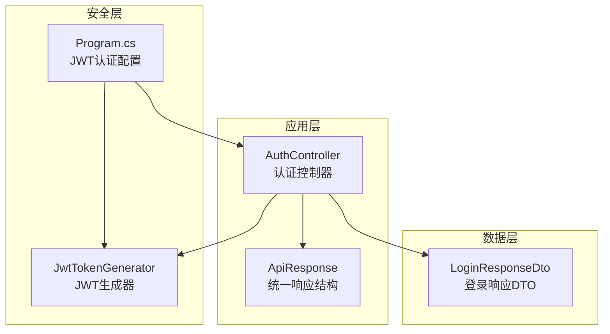
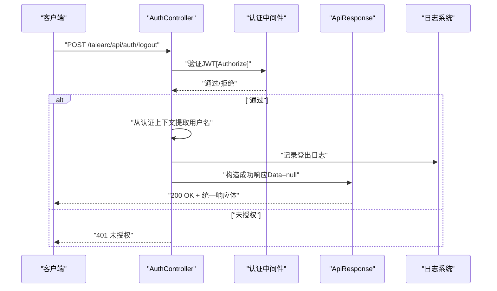
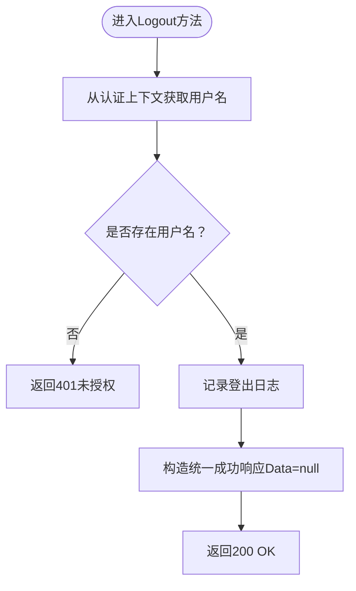
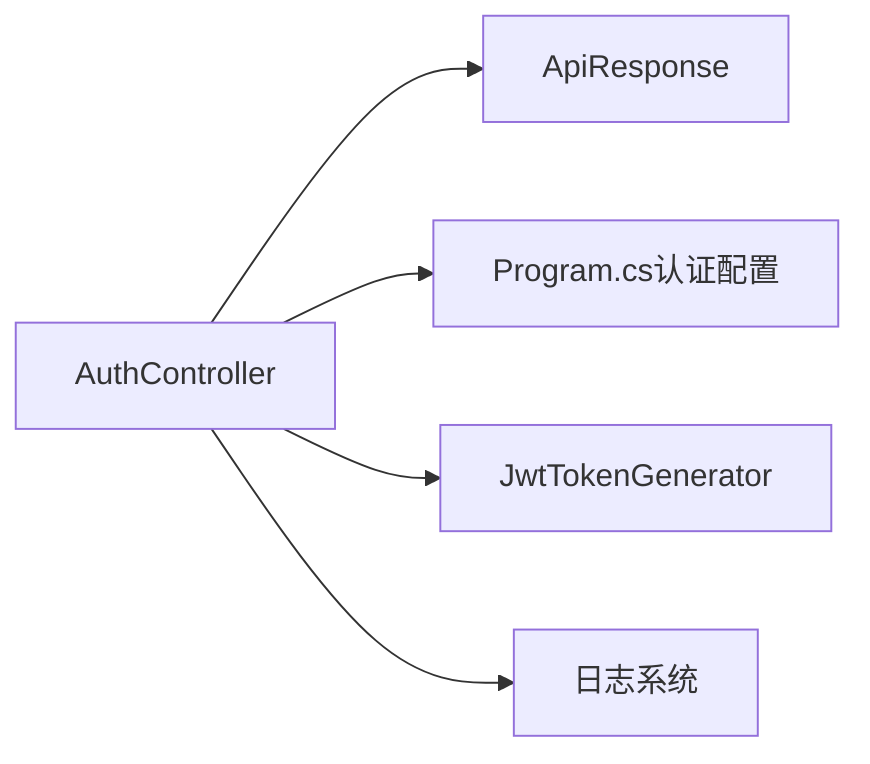

# 用户登出接口

<cite>
**本文引用的文件**
- [AuthController.cs](file://src/application/controllers/auth/AuthController.cs)
- [ApiResponse.cs](file://src/structure/ApiResponse.cs)
- [Program.cs](file://Program.cs)
- [JwtTokenGenerator.cs](file://src/application/service/JwtTokenGenerator.cs)
- [LoginResponseDto.cs](file://src/data/dto/LoginResponseDto.cs)
- [app-20251202.log](file://logs/app-20251202.log)
</cite>

## 目录
1. [简介](#简介)
2. [项目结构](#项目结构)
3. [核心组件](#核心组件)
4. [架构总览](#架构总览)
5. [详细组件分析](#详细组件分析)
6. [依赖关系分析](#依赖关系分析)
7. [性能考量](#性能考量)
8. [故障排查指南](#故障排查指南)
9. [结论](#结论)
10. [附录](#附录)

## 简介
本文件面向“用户登出接口（POST /talearc/api/auth/logout）”的使用与实现说明。该接口采用无状态JWT认证模型，服务端不维护会话状态，因此无法直接撤销已签发的Token。本接口的主要职责是在服务端记录一次登出事件并返回标准成功响应；真正使客户端持有的Token失效，需由客户端在收到登出请求后主动清理本地存储的Token。

## 项目结构
- 控制器层：认证相关接口集中在认证控制器中，包含注册、登录、获取当前用户信息以及登出等接口。
- 结构层：统一响应体封装在通用结构中，便于前后端一致处理。
- 安全配置：通过程序入口配置JWT认证方案，启用授权中间件，使控制器上的[Authorize]生效。
- 令牌生成：登录时生成JWT，登出接口基于同一认证体系进行鉴权。

图表来源
- [AuthController.cs](file://src/application/controllers/auth/AuthController.cs#L62-L227)
- [ApiResponse.cs](file://src/structure/ApiResponse.cs#L1-L40)
- [Program.cs](file://Program.cs#L24-L44)
- [JwtTokenGenerator.cs](file://src/application/service/JwtTokenGenerator.cs#L1-L40)
- [LoginResponseDto.cs](file://src/data/dto/LoginResponseDto.cs#L1-L17)

章节来源
- [AuthController.cs](file://src/application/controllers/auth/AuthController.cs#L62-L227)
- [Program.cs](file://Program.cs#L24-L44)

## 核心组件
- 登录接口：生成JWT并返回给客户端，作为后续请求的凭证。
- 登出接口：在[Authorize]保护下，从当前认证上下文中解析用户名，记录登出日志，返回统一成功响应。
- 统一响应体：所有接口均使用统一响应结构，包含状态码、消息与数据三部分。

章节来源
- [AuthController.cs](file://src/application/controllers/auth/AuthController.cs#L131-L175)
- [AuthController.cs](file://src/application/controllers/auth/AuthController.cs#L210-L227)
- [ApiResponse.cs](file://src/structure/ApiResponse.cs#L1-L40)

## 架构总览
下图展示了从客户端发起登出请求到服务端处理并返回响应的整体流程，以及与JWT认证、统一响应结构的关系。

图表来源
- [AuthController.cs](file://src/application/controllers/auth/AuthController.cs#L210-L227)
- [Program.cs](file://Program.cs#L24-L44)
- [ApiResponse.cs](file://src/structure/ApiResponse.cs#L1-L40)

## 详细组件分析

### 接口定义与行为
- 接口路径与方法：POST /talearc/api/auth/logout
- 认证要求：受[Authorize]保护，必须携带有效JWT Token
- 处理逻辑：
  - 从当前认证上下文解析用户名
  - 记录登出日志
  - 返回统一成功响应，其中Data字段为null
- 响应状态：
  - 成功：200
  - 未授权：401（当缺少或无效Token时）

章节来源
- [AuthController.cs](file://src/application/controllers/auth/AuthController.cs#L210-L227)

### 执行流程（代码级）

图表来源
- [AuthController.cs](file://src/application/controllers/auth/AuthController.cs#L210-L227)

### 统一响应结构
- 成功响应：Code=200，Message为“登出成功”，Data为null
- 失败响应：由统一工具类生成，Code由调用方指定，Data为null

章节来源
- [ApiResponse.cs](file://src/structure/ApiResponse.cs#L1-L40)

### JWT认证与授权链路
- 程序入口配置JWT认证方案，启用认证与授权中间件
- 登录接口生成JWT，包含用户标识与过期时间
- 登出接口通过[Authorize]进行鉴权，确保请求携带有效Token

章节来源
- [Program.cs](file://Program.cs#L24-L44)
- [JwtTokenGenerator.cs](file://src/application/service/JwtTokenGenerator.cs#L1-L40)
- [LoginResponseDto.cs](file://src/data/dto/LoginResponseDto.cs#L1-L17)

### 请求与响应示例
- 请求
  - 方法：POST
  - 路径：/talearc/api/auth/logout
  - 认证：Bearer Token（JWT）
- 成功响应
  - 状态码：200
  - 内容：统一响应体，Data为null
- 未授权响应
  - 状态码：401
  - 内容：统一响应体，Message为“未授权”相关提示

章节来源
- [AuthController.cs](file://src/application/controllers/auth/AuthController.cs#L210-L227)
- [ApiResponse.cs](file://src/structure/ApiResponse.cs#L1-L40)
- [app-20251202.log](file://logs/app-20251202.log#L88-L94)

### 关于Data字段为null的合理性
- 在无状态JWT认证模型中，服务端不持有Token状态，无法撤销Token
- 登出接口仅记录日志，不涉及服务端状态变更
- 因此返回Data为null符合“无状态”的设计原则，避免误导客户端认为服务端维护了额外状态

章节来源
- [AuthController.cs](file://src/application/controllers/auth/AuthController.cs#L210-L227)
- [ApiResponse.cs](file://src/structure/ApiResponse.cs#L1-L40)

### 客户端职责与最佳实践
- 客户端应在收到登出成功响应后，主动删除本地存储的Token
- 后续对受保护接口的请求应不再携带该Token，避免被误判为已登录
- 若客户端仍携带旧Token访问受保护接口，将触发401未授权（如日志所示）

章节来源
- [app-20251202.log](file://logs/app-20251202.log#L88-L94)

### 可扩展方向：引入Token黑名单机制
- 当前实现为无状态JWT，服务端不维护Token状态
- 未来可引入Token黑名单（例如基于Redis的短期缓存），在登出时将Token加入黑名单并在鉴权阶段检查
- 优点：实现“即时登出”
- 需权衡：增加服务端状态管理与跨实例共享成本，可能影响性能与一致性

[本节为概念性建议，不对应具体源码实现]

## 依赖关系分析
- AuthController依赖：
  - 统一响应结构（ApiResponse）
  - JWT认证中间件（Program.cs中配置）
  - 日志系统（用于记录登出事件）
- 登录与登出共同依赖JWT生成器与认证配置，保持一致的Token语义

图表来源
- [AuthController.cs](file://src/application/controllers/auth/AuthController.cs#L62-L227)
- [Program.cs](file://Program.cs#L24-L44)
- [JwtTokenGenerator.cs](file://src/application/service/JwtTokenGenerator.cs#L1-L40)
- [ApiResponse.cs](file://src/structure/ApiResponse.cs#L1-L40)

章节来源
- [AuthController.cs](file://src/application/controllers/auth/AuthController.cs#L62-L227)
- [Program.cs](file://Program.cs#L24-L44)

## 性能考量
- 登出接口为轻量级操作，仅记录日志并返回响应，开销极低
- 无状态设计避免了服务端状态同步与持久化成本
- 若引入Token黑名单，需评估缓存命中率与跨实例同步带来的额外开销

[本节为一般性指导，不直接分析具体文件]

## 故障排查指南
- 401未授权
  - 现象：请求登出接口返回401
  - 可能原因：未携带Token、Token无效或已过期
  - 处理建议：确认请求头中包含正确的Bearer Token；若已过期，请重新登录获取新Token
- 日志参考
  - 可通过日志查看请求是否到达以及响应状态码

章节来源
- [app-20251202.log](file://logs/app-20251202.log#L88-L94)

## 结论
- POST /talearc/api/auth/logout在当前无状态JWT认证体系下，主要承担“记录登出日志”的职责
- 服务端不主动撤销Token，客户端应负责清理本地Token
- 统一响应结构保证了前后端交互的一致性
- 如需实现“即时登出”，可考虑引入Token黑名单等有状态机制，但需综合权衡性能与复杂度

[本节为总结性内容，不直接分析具体文件]

## 附录
- 相关实现位置
  - 登出接口定义与实现：[AuthController.cs](file://src/application/controllers/auth/AuthController.cs#L210-L227)
  - 统一响应结构：[ApiResponse.cs](file://src/structure/ApiResponse.cs#L1-L40)
  - JWT认证配置：[Program.cs](file://Program.cs#L24-L44)
  - 登录响应DTO（Token载体）：[LoginResponseDto.cs](file://src/data/dto/LoginResponseDto.cs#L1-L17)
  - JWT生成器（登录时使用）：[JwtTokenGenerator.cs](file://src/application/service/JwtTokenGenerator.cs#L1-L40)