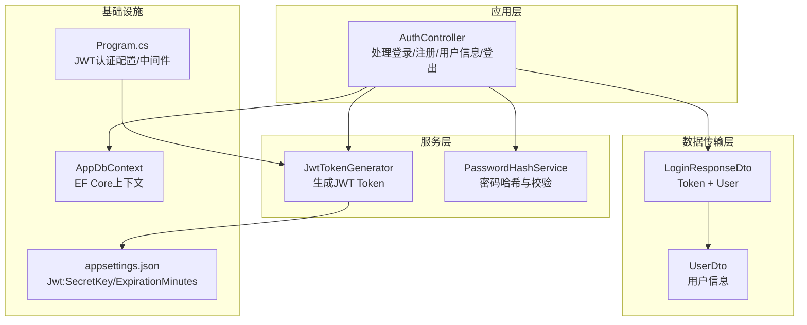
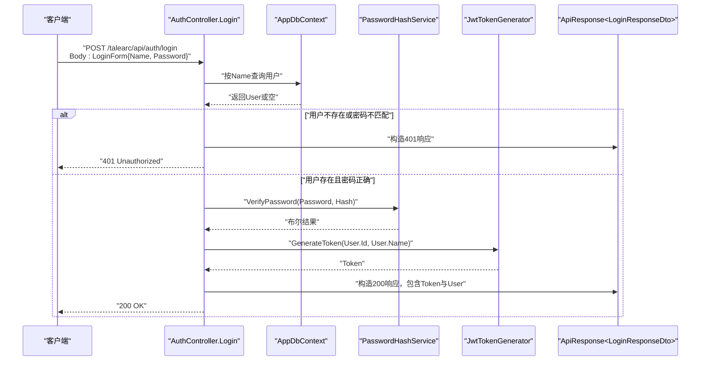
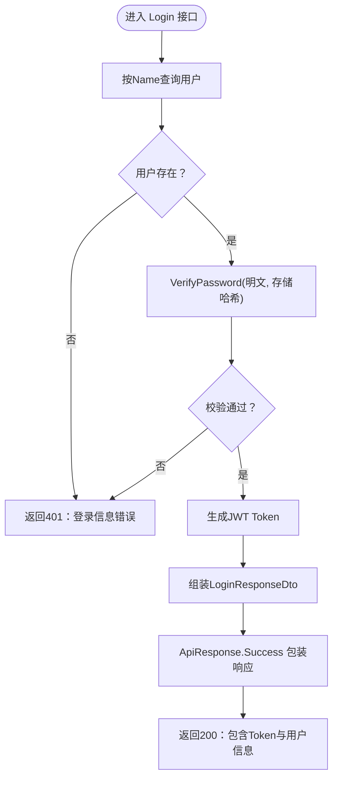
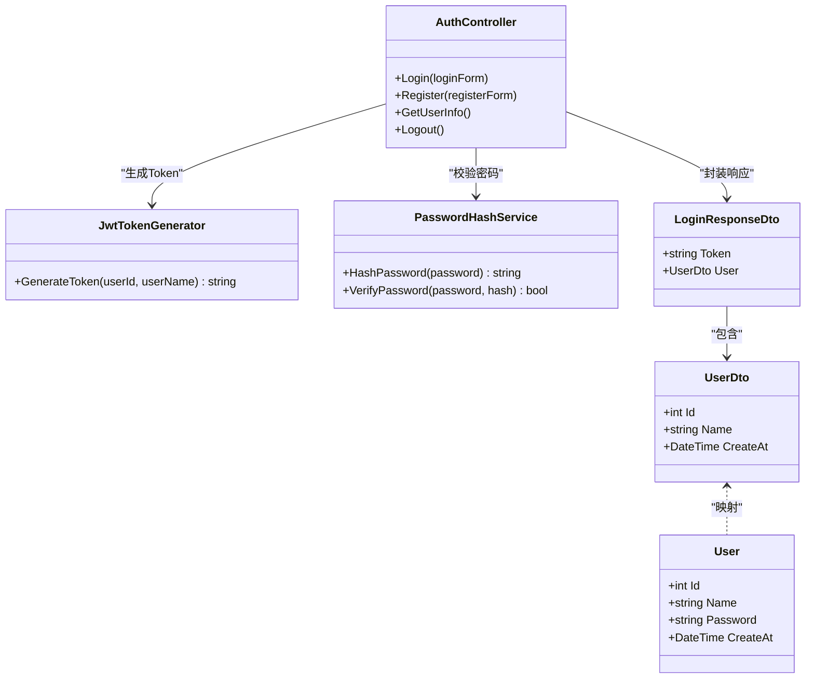

# 用户登录接口

<cite>
**本文引用的文件**
- [AuthController.cs](file://src/application/controllers/auth/AuthController.cs)
- [JwtTokenGenerator.cs](file://src/application/service/JwtTokenGenerator.cs)
- [PasswordHashService.cs](file://src/application/service/PasswordHashService.cs)
- [LoginResponseDto.cs](file://src/data/dto/LoginResponseDto.cs)
- [UserDto.cs](file://src/data/dto/UserDto.cs)
- [User.cs](file://src/data/entities/User.cs)
- [ApiResponse.cs](file://src/structure/ApiResponse.cs)
- [Program.cs](file://Program.cs)
- [appsettings.json](file://appsettings.json)
</cite>

## 目录
1. [简介](#简介)
2. [项目结构](#项目结构)
3. [核心组件](#核心组件)
4. [架构总览](#架构总览)
5. [详细组件分析](#详细组件分析)
6. [依赖关系分析](#依赖关系分析)
7. [性能与安全考虑](#性能与安全考虑)
8. [故障排查指南](#故障排查指南)
9. [结论](#结论)
10. [附录](#附录)

## 简介
本文件面向开发者与集成方，提供用户登录接口（POST /talearc/api/auth/login）的完整API文档。该接口接收LoginForm对象作为请求体，包含Name与Password字段；登录成功后返回包含JWT Token与用户信息的LoginResponseDto，响应采用统一的ApiResponse<T>包装。本文还说明密码校验流程、JWT Token的组成与有效期来源、以及客户端如何在后续请求中使用Authorization: Bearer <token>进行认证。

## 项目结构
- 控制器层：AuthController 提供登录、注册、获取用户信息、登出等端点。
- 服务层：JwtTokenGenerator 负责生成JWT；PasswordHashService 负责密码哈希与校验。
- 数据传输层：LoginResponseDto、UserDto 封装响应数据。
- 统一响应层：ApiResponse<T> 提供统一的响应结构。
- 配置与启动：Program.cs 中配置JWT认证参数与中间件；appsettings.json 提供JWT密钥与过期分钟数。

图表来源
- [AuthController.cs](file://src/application/controllers/auth/AuthController.cs#L131-L175)
- [JwtTokenGenerator.cs](file://src/application/service/JwtTokenGenerator.cs#L1-L40)
- [PasswordHashService.cs](file://src/application/service/PasswordHashService.cs#L1-L53)
- [LoginResponseDto.cs](file://src/data/dto/LoginResponseDto.cs#L1-L17)
- [UserDto.cs](file://src/data/dto/UserDto.cs#L1-L22)
- [Program.cs](file://Program.cs#L27-L44)
- [appsettings.json](file://appsettings.json#L1-L16)

章节来源
- [AuthController.cs](file://src/application/controllers/auth/AuthController.cs#L131-L175)
- [Program.cs](file://Program.cs#L27-L44)
- [appsettings.json](file://appsettings.json#L1-L16)

## 核心组件
- 接口路径与方法
  - 方法：POST
  - 路径：/talearc/api/auth/login
  - 请求体：LoginForm（包含Name与Password）
  - 成功响应：200，Body为ApiResponse<LoginResponseDto>
  - 失败响应：401，Body为ApiResponse<object>（错误信息）

- 请求体模型 LoginForm
  - 字段：
    - Name：字符串，必填
    - Password：字符串，必填
  - 验证规则：后端使用[Required]进行必填校验

- 响应模型 LoginResponseDto
  - 字段：
    - Token：字符串，JWT Token
    - User：UserDto，包含Id、Name、CreateAt

- 统一响应 ApiResponse<T>
  - 字段：Code、Message、Data
  - 成功：Code=200，Message为“登录成功”
  - 失败：Code=401，Message为“登录信息错误”

章节来源
- [AuthController.cs](file://src/application/controllers/auth/AuthController.cs#L131-L175)
- [LoginForm 定义](file://src/application/controllers/auth/AuthController.cs#L18-L33)
- [LoginResponseDto.cs](file://src/data/dto/LoginResponseDto.cs#L1-L17)
- [UserDto.cs](file://src/data/dto/UserDto.cs#L1-L22)
- [ApiResponse.cs](file://src/structure/ApiResponse.cs#L1-L40)

## 架构总览
下图展示登录流程从请求到响应的关键步骤与组件交互。

图表来源
- [AuthController.cs](file://src/application/controllers/auth/AuthController.cs#L131-L175)
- [PasswordHashService.cs](file://src/application/service/PasswordHashService.cs#L27-L53)
- [JwtTokenGenerator.cs](file://src/application/service/JwtTokenGenerator.cs#L19-L40)
- [ApiResponse.cs](file://src/structure/ApiResponse.cs#L28-L40)

## 详细组件分析

### 登录接口实现与验证流程
- 查询用户
  - 使用EF Core按Name查询用户，若不存在则直接返回401。
- 密码校验
  - 使用PasswordHashService.VerifyPassword对比明文密码与数据库存储的哈希值。
- 生成Token
  - 通过JwtTokenGenerator.GenerateToken生成JWT，载荷包含用户ID与用户名。
- 组装响应
  - 将Token与UserDto封装进LoginResponseDto，再由ApiResponse.Success包装返回200。

图表来源
- [AuthController.cs](file://src/application/controllers/auth/AuthController.cs#L141-L169)
- [PasswordHashService.cs](file://src/application/service/PasswordHashService.cs#L27-L53)
- [JwtTokenGenerator.cs](file://src/application/service/JwtTokenGenerator.cs#L19-L40)
- [LoginResponseDto.cs](file://src/data/dto/LoginResponseDto.cs#L1-L17)
- [ApiResponse.cs](file://src/structure/ApiResponse.cs#L28-L40)

章节来源
- [AuthController.cs](file://src/application/controllers/auth/AuthController.cs#L141-L169)

### JWT Token 组成与有效期
- Token 载荷（Claims）
  - NameIdentifier：用户ID
  - Name：用户名
- 签发者与受众
  - Issuer：talearc
  - Audience：talearc-api
- 有效期来源
  - 过期分钟数来自配置项Jwt:ExpirationMinutes，默认值见appsettings.json
- 密钥来源
  - 对称密钥来自Jwt:SecretKey，用于签名验证

章节来源
- [JwtTokenGenerator.cs](file://src/application/service/JwtTokenGenerator.cs#L19-L40)
- [Program.cs](file://Program.cs#L27-L44)
- [appsettings.json](file://appsettings.json#L1-L16)

### 客户端认证使用方式
- 在后续受保护的请求中，携带请求头：
  - Authorization: Bearer <token>
- 服务器端启用JWT认证，要求所有受保护端点必须通过验证。

章节来源
- [Program.cs](file://Program.cs#L30-L44)

### 典型请求/响应示例
- 成功示例
  - 请求
    - 方法：POST
    - 路径：/talearc/api/auth/login
    - 请求体：LoginForm（Name、Password）
  - 响应
    - 状态码：200
    - 响应体：ApiResponse<LoginResponseDto>
      - Code：200
      - Message：“登录成功”
      - Data：LoginResponseDto
        - Token：字符串（JWT）
        - User：UserDto（Id、Name、CreateAt）

- 失败示例（用户名或密码错误）
  - 请求：同上
  - 响应
    - 状态码：401
    - 响应体：ApiResponse<object>
      - Code：401
      - Message：“登录信息错误”
      - Data：null

章节来源
- [AuthController.cs](file://src/application/controllers/auth/AuthController.cs#L141-L169)
- [ApiResponse.cs](file://src/structure/ApiResponse.cs#L28-L40)
- [LoginResponseDto.cs](file://src/data/dto/LoginResponseDto.cs#L1-L17)
- [UserDto.cs](file://src/data/dto/UserDto.cs#L1-L22)

## 依赖关系分析
- 控制器依赖
  - AuthController 依赖 AppDbContext、JwtTokenGenerator、PasswordHashService、RegistrationKeyService。
- 服务依赖
  - JwtTokenGenerator 依赖 IConfiguration（读取Jwt:SecretKey与Jwt:ExpirationMinutes）。
  - PasswordHashService 为纯密码哈希与校验逻辑。
- 数据模型
  - User 实体包含Id、Name、Password、CreateAt。
  - UserDto 为对外暴露的用户信息。
  - LoginResponseDto 为登录响应载体。

图表来源
- [AuthController.cs](file://src/application/controllers/auth/AuthController.cs#L62-L175)
- [JwtTokenGenerator.cs](file://src/application/service/JwtTokenGenerator.cs#L1-L40)
- [PasswordHashService.cs](file://src/application/service/PasswordHashService.cs#L1-L53)
- [LoginResponseDto.cs](file://src/data/dto/LoginResponseDto.cs#L1-L17)
- [UserDto.cs](file://src/data/dto/UserDto.cs#L1-L22)
- [User.cs](file://src/data/entities/User.cs#L1-L40)

章节来源
- [AuthController.cs](file://src/application/controllers/auth/AuthController.cs#L62-L175)
- [User.cs](file://src/data/entities/User.cs#L1-L40)

## 性能与安全考虑
- 密码校验复杂度
  - PasswordHashService 使用PBKDF2（Rfc2898DeriveBytes），迭代次数较高，可有效抵御暴力破解，但会带来CPU开销。
- Token有效期
  - 默认过期时间为10080分钟（约7天）。可根据业务需求调整appsettings.json中的Jwt:ExpirationMinutes。
- 安全建议
  - 生产环境请确保Jwt:SecretKey足够长且保密。
  - 启用HTTPS以防止Token在传输中被窃取。
  - 对于高风险操作，可考虑缩短Token有效期并结合刷新Token机制。

章节来源
- [PasswordHashService.cs](file://src/application/service/PasswordHashService.cs#L1-L53)
- [JwtTokenGenerator.cs](file://src/application/service/JwtTokenGenerator.cs#L13-L17)
- [appsettings.json](file://appsettings.json#L1-L16)

## 故障排查指南
- 401 未授权
  - 可能原因：用户名不存在或密码错误。
  - 排查要点：确认LoginForm的Name与Password是否正确；检查数据库中用户记录与存储的哈希值。
- JWT 验证失败
  - 可能原因：密钥不一致、签发者/受众不匹配、Token过期。
  - 排查要点：核对appsettings.json中的Jwt:SecretKey与Jwt:ExpirationMinutes；确认客户端使用正确的Authorization头。
- 日志定位
  - AuthController在登录失败时会记录警告日志；在异常情况下会记录错误日志，便于定位问题。

章节来源
- [AuthController.cs](file://src/application/controllers/auth/AuthController.cs#L141-L169)
- [Program.cs](file://Program.cs#L30-L44)

## 结论
用户登录接口通过严格的用户名存在性与密码哈希校验，确保只有合法用户能够获得JWT Token。Token包含用户标识与名称，有效期由配置文件控制。客户端应在后续请求中使用Authorization: Bearer <token>进行认证。整体设计遵循统一响应格式与清晰的职责分离，便于维护与扩展。

## 附录
- 关键配置项
  - Jwt:SecretKey：JWT对称密钥
  - Jwt:ExpirationMinutes：Token过期分钟数
- 关键实体与DTO
  - User：持久化用户实体
  - UserDto：对外用户信息
  - LoginResponseDto：登录响应载体

章节来源
- [appsettings.json](file://appsettings.json#L1-L16)
- [User.cs](file://src/data/entities/User.cs#L1-L40)
- [UserDto.cs](file://src/data/dto/UserDto.cs#L1-L22)
- [LoginResponseDto.cs](file://src/data/dto/LoginResponseDto.cs#L1-L17)