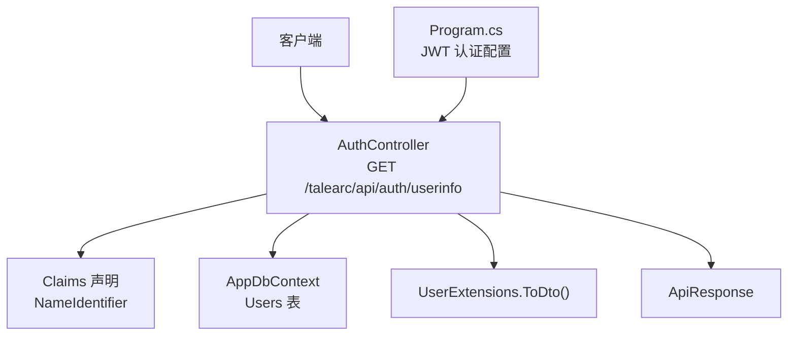
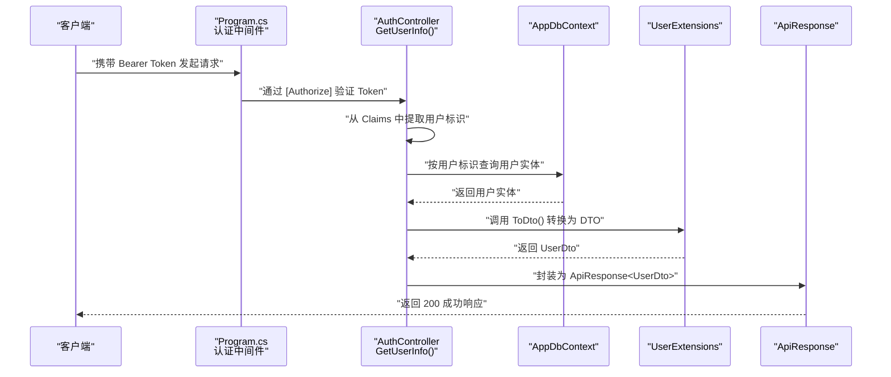
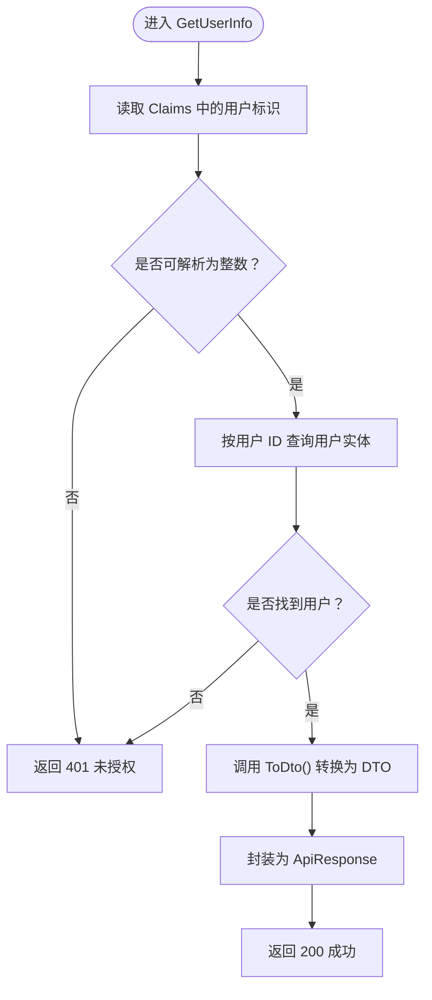
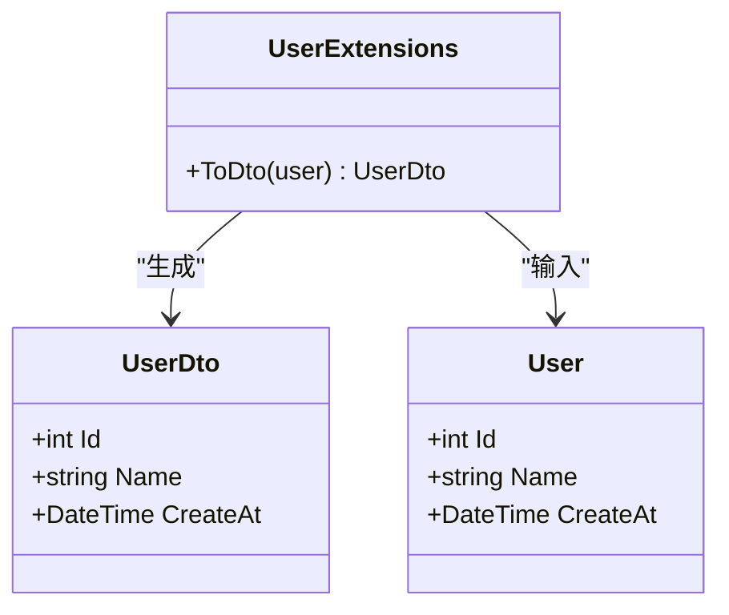
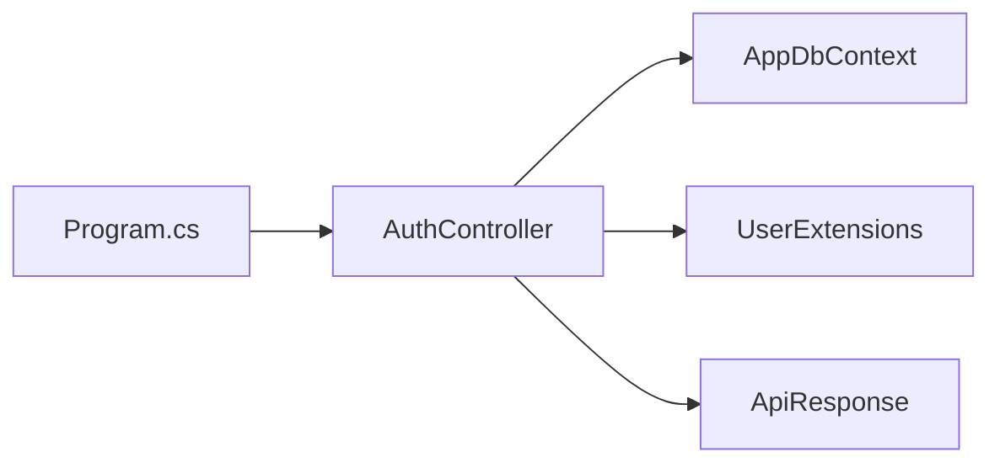

# 获取用户信息接口

<cite>
**本文引用的文件**
- [AuthController.cs](file://src/application/controllers/auth/AuthController.cs)
- [UserExtensions.cs](file://src/data/extensions/UserExtensions.cs)
- [UserDto.cs](file://src/data/dto/UserDto.cs)
- [ApiResponse.cs](file://src/structure/ApiResponse.cs)
- [Program.cs](file://Program.cs)
- [User.cs](file://src/data/entities/User.cs)
</cite>

## 目录
1. [简介](#简介)
2. [项目结构](#项目结构)
3. [核心组件](#核心组件)
4. [架构总览](#架构总览)
5. [详细组件分析](#详细组件分析)
6. [依赖关系分析](#依赖关系分析)
7. [性能考量](#性能考量)
8. [故障排查指南](#故障排查指南)
9. [结论](#结论)

## 简介
本文件面向“获取用户信息接口（GET /talearc/api/auth/userinfo）”的使用与实现说明。该接口采用基于 JWT 的无状态认证机制，要求客户端在请求头中携带有效的 Bearer Token。接口内部流程包括：
- 使用 [Authorize] 属性进行认证拦截；
- 从 JWT 的 Claim 中提取用户标识；
- 查询数据库获取用户实体；
- 通过扩展方法将实体转换为 DTO；
- 包装为统一响应模型后返回。

成功返回 200，未认证或 Token 无效返回 401。接口体现了服务端不存储会话信息的无状态特性。

## 项目结构
该接口位于认证控制器中，配合统一响应模型、DTO 扩展与全局认证配置共同工作。

图表来源
- [AuthController.cs](file://src/application/controllers/auth/AuthController.cs#L177-L208)
- [UserExtensions.cs](file://src/data/extensions/UserExtensions.cs#L1-L17)
- [ApiResponse.cs](file://src/structure/ApiResponse.cs#L1-L40)
- [Program.cs](file://Program.cs#L30-L44)

章节来源
- [AuthController.cs](file://src/application/controllers/auth/AuthController.cs#L177-L208)
- [Program.cs](file://Program.cs#L30-L44)

## 核心组件
- 控制器方法：负责路由、鉴权与业务处理。
- Claims 提取：从 JWT 中读取用户标识。
- 数据访问：通过 DbContext 查询用户实体。
- DTO 转换：使用扩展方法将实体映射到 DTO。
- 统一响应：封装响应状态码、消息与数据体。

章节来源
- [AuthController.cs](file://src/application/controllers/auth/AuthController.cs#L177-L208)
- [UserExtensions.cs](file://src/data/extensions/UserExtensions.cs#L1-L17)
- [ApiResponse.cs](file://src/structure/ApiResponse.cs#L1-L40)

## 架构总览
下图展示了从客户端到服务端的调用链路与关键组件交互。

图表来源
- [Program.cs](file://Program.cs#L30-L44)
- [AuthController.cs](file://src/application/controllers/auth/AuthController.cs#L177-L208)
- [UserExtensions.cs](file://src/data/extensions/UserExtensions.cs#L1-L17)
- [ApiResponse.cs](file://src/structure/ApiResponse.cs#L1-L40)

## 详细组件分析

### 接口定义与行为
- 路由与方法：GET /talearc/api/auth/userinfo
- 认证策略：[Authorize] 属性启用 JWT Bearer 认证
- 请求头要求：Authorization: Bearer <token>
- 返回值：ApiResponse<UserDto>，成功时 Code=200

章节来源
- [AuthController.cs](file://src/application/controllers/auth/AuthController.cs#L177-L208)
- [Program.cs](file://Program.cs#L30-L44)

### 内部流程与数据流
- 从 Claims 中读取用户标识（NameIdentifier），解析为整型用户 ID
- 使用 DbContext 按 ID 查询用户实体
- 若用户不存在，返回 401
- 将用户实体转换为 UserDto
- 包装为 ApiResponse<UserDto> 并返回 200

图表来源
- [AuthController.cs](file://src/application/controllers/auth/AuthController.cs#L177-L208)
- [UserExtensions.cs](file://src/data/extensions/UserExtensions.cs#L1-L17)
- [ApiResponse.cs](file://src/structure/ApiResponse.cs#L1-L40)

章节来源
- [AuthController.cs](file://src/application/controllers/auth/AuthController.cs#L177-L208)

### 数据模型与转换
- 用户实体：包含 Id、Name、CreateAt 等字段
- DTO：包含 Id、Name、CreateAt 字段
- 转换逻辑：扩展方法将实体映射到 DTO

图表来源
- [User.cs](file://src/data/entities/User.cs#L1-L40)
- [UserDto.cs](file://src/data/dto/UserDto.cs#L1-L22)
- [UserExtensions.cs](file://src/data/extensions/UserExtensions.cs#L1-L17)

章节来源
- [User.cs](file://src/data/entities/User.cs#L1-L40)
- [UserDto.cs](file://src/data/dto/UserDto.cs#L1-L22)
- [UserExtensions.cs](file://src/data/extensions/UserExtensions.cs#L1-L17)

### 统一响应模型
- 成功响应：Code=200，Message 为“获取成功”，Data 为 UserDto
- 失败响应：Code=401，Message 为“无效的用户信息”或“用户不存在”，Data 为空

章节来源
- [ApiResponse.cs](file://src/structure/ApiResponse.cs#L1-L40)

### 认证配置与无状态机制
- 全局认证：Program.cs 中配置了 JWT Bearer 验证参数（签名密钥、发行者、受众、有效期等）
- 无状态：接口仅依赖 Token 内容进行验证，不维护服务端会话状态

章节来源
- [Program.cs](file://Program.cs#L30-L44)

## 依赖关系分析
- AuthController 依赖：
  - AppDbContext：用于查询用户实体
  - UserExtensions：用于实体到 DTO 的转换
  - ApiResponse：用于统一响应包装
  - Program.cs 的认证配置：提供 [Authorize] 的 JWT 验证能力

图表来源
- [AuthController.cs](file://src/application/controllers/auth/AuthController.cs#L177-L208)
- [UserExtensions.cs](file://src/data/extensions/UserExtensions.cs#L1-L17)
- [ApiResponse.cs](file://src/structure/ApiResponse.cs#L1-L40)
- [Program.cs](file://Program.cs#L30-L44)

章节来源
- [AuthController.cs](file://src/application/controllers/auth/AuthController.cs#L177-L208)
- [Program.cs](file://Program.cs#L30-L44)

## 性能考量
- 查询复杂度：按主键查询用户实体，时间复杂度 O(1)，建议确保 Users 表对 id 建有索引
- DTO 映射：扩展方法为轻量级投影，开销极低
- 认证开销：JWT 验证在中间件层完成，接口本身只做一次数据库查询
- 建议：保持 Token 合理有效期，避免频繁刷新；对日志输出进行分级，减少生产环境冗余日志

## 故障排查指南
- 401 未授权
  - 可能原因：缺少 Authorization 头、Token 过期、签名不匹配、发行者/受众不正确
  - 排查步骤：确认请求头格式为 Bearer <token>；检查服务端 JWT 配置与密钥一致；确认 Token 未过期
- 用户不存在
  - 可能原因：Claims 中的用户标识与数据库记录不一致
  - 排查步骤：核对登录时生成 Token 的用户标识；确认用户未被删除
- 日志定位
  - 控制器内包含日志记录，可用于定位问题

章节来源
- [AuthController.cs](file://src/application/controllers/auth/AuthController.cs#L177-L208)
- [Program.cs](file://Program.cs#L30-L44)

## 结论
“获取用户信息接口”遵循基于 JWT 的无状态认证模式，通过 [Authorize] 属性与全局认证配置实现安全访问。接口流程清晰、职责单一：从 Token 中提取用户标识，查询用户实体，转换为 DTO，并以统一响应模型返回。该设计具备良好的可维护性与可扩展性，适合在微服务与分布式场景中使用。