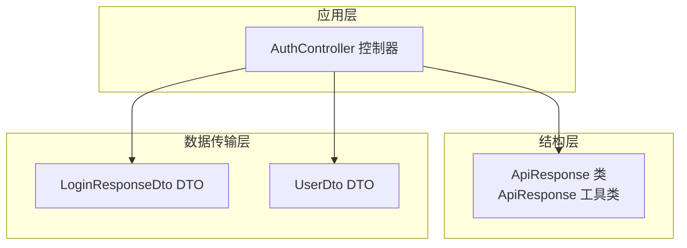
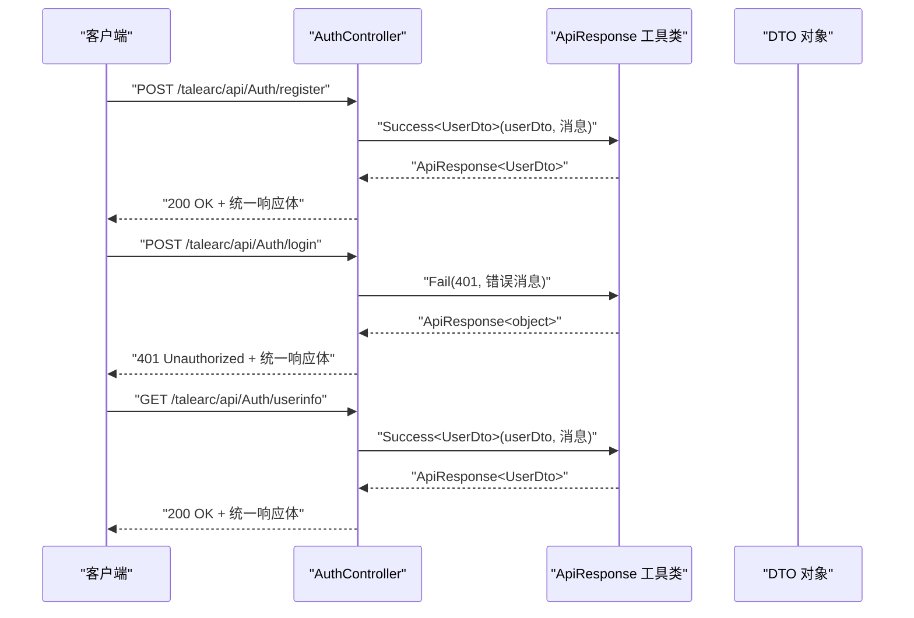
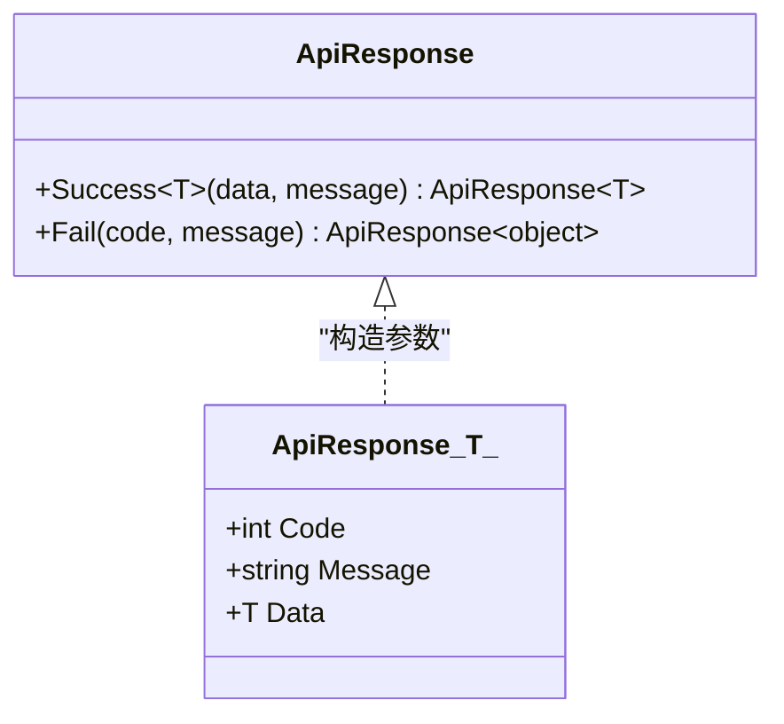
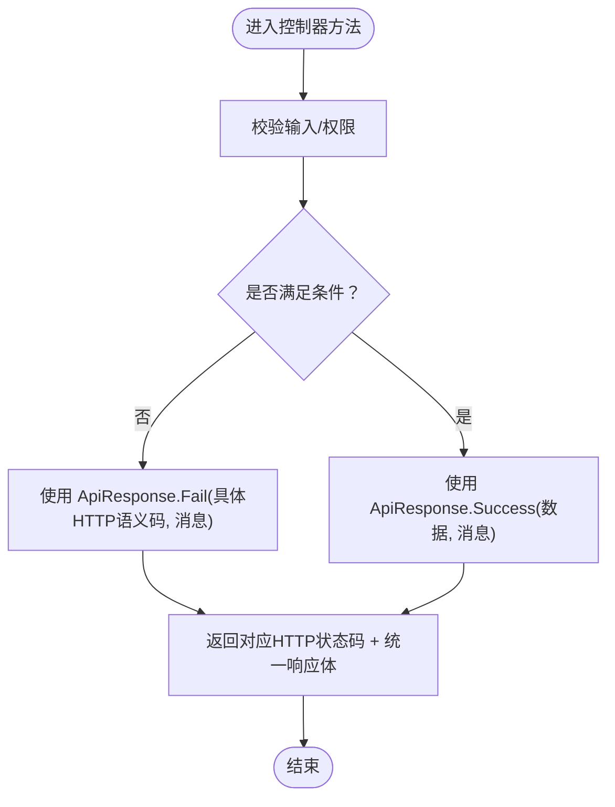
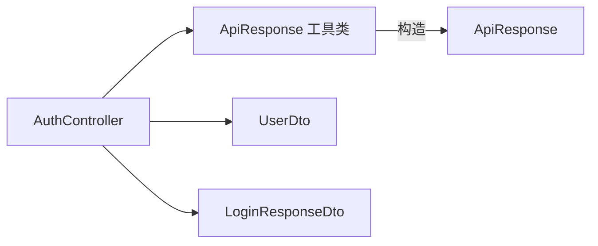

# 通用响应格式

<cite>
**本文引用的文件**
- [ApiResponse.cs](file://src/structure/ApiResponse.cs)
- [AuthController.cs](file://src/application/controllers/auth/AuthController.cs)
- [LoginResponseDto.cs](file://src/data/dto/LoginResponseDto.cs)
- [UserDto.cs](file://src/data/dto/UserDto.cs)
</cite>

## 目录
1. [简介](#简介)
2. [项目结构](#项目结构)
3. [核心组件](#核心组件)
4. [架构总览](#架构总览)
5. [详细组件分析](#详细组件分析)
6. [依赖关系分析](#依赖关系分析)
7. [性能考量](#性能考量)
8. [故障排查指南](#故障排查指南)
9. [结论](#结论)
10. [附录](#附录)

## 简介
本文件围绕通用API响应格式进行系统化说明，重点解析 ApiResponse<T> 类的设计与使用方式。该格式通过统一的三元结构（Code、Message、Data）简化前后端交互契约，使前端能够以一致的方式处理成功与失败响应；同时通过静态工厂方法 Success<T> 与 Fail 实现“成功统一200、错误按HTTP语义”的设计原则，从而降低前端分支判断复杂度并提升可维护性。

## 项目结构
- 响应模型与工具位于结构层，便于跨控制器复用。
- 认证相关接口集中在 AuthController 中，演示了 ApiResponse 的典型用法。
- 数据传输对象（DTO）用于承载业务数据载体，配合 ApiResponse.Data 使用。

图表来源
- [ApiResponse.cs](file://src/structure/ApiResponse.cs#L1-L40)
- [AuthController.cs](file://src/application/controllers/auth/AuthController.cs#L62-L227)
- [LoginResponseDto.cs](file://src/data/dto/LoginResponseDto.cs#L1-L17)
- [UserDto.cs](file://src/data/dto/UserDto.cs#L1-L22)

章节来源
- [ApiResponse.cs](file://src/structure/ApiResponse.cs#L1-L40)
- [AuthController.cs](file://src/application/controllers/auth/AuthController.cs#L62-L227)

## 核心组件
- ApiResponse<T> 泛型类
  - Code：整型状态码，用于承载业务语义或HTTP语义。
  - Message：字符串描述信息，用于提示用户或记录日志。
  - Data：泛型数据载体，承载业务返回体。
- ApiResponse 工具类
  - Success<T>(data, message)：构造成功响应，统一返回 Code=200。
  - Fail(code, message)：构造失败响应，由调用方传入具体HTTP语义码（如400、401等）。

章节来源
- [ApiResponse.cs](file://src/structure/ApiResponse.cs#L1-L40)

## 架构总览
下图展示了 AuthController 在不同接口中如何使用 ApiResponse 统一返回格式，以及与 DTO 的协作关系。

图表来源
- [AuthController.cs](file://src/application/controllers/auth/AuthController.cs#L82-L129)
- [AuthController.cs](file://src/application/controllers/auth/AuthController.cs#L139-L169)
- [AuthController.cs](file://src/application/controllers/auth/AuthController.cs#L184-L208)
- [ApiResponse.cs](file://src/structure/ApiResponse.cs#L28-L39)
- [LoginResponseDto.cs](file://src/data/dto/LoginResponseDto.cs#L1-L17)
- [UserDto.cs](file://src/data/dto/UserDto.cs#L1-L22)

## 详细组件分析

### ApiResponse<T> 类与 ApiResponse 工具类
- 设计要点
  - 通过泛型 T 将 Data 的类型约束到业务数据，既保证类型安全，又保持响应结构统一。
  - 工具类提供两个静态方法：
    - Success<T>：固定 Code=200，便于前端统一处理“成功”分支。
    - Fail：允许调用方根据错误类型选择合适的HTTP语义码（如400/401），便于前端区分错误类别。
- 使用建议
  - 成功场景优先使用 Success<T>，确保前端无需关心后端内部状态码差异。
  - 失败场景使用 Fail 并传入具体HTTP语义码，帮助前端做差异化处理（例如401触发跳转登录页）。

图表来源
- [ApiResponse.cs](file://src/structure/ApiResponse.cs#L1-L40)

章节来源
- [ApiResponse.cs](file://src/structure/ApiResponse.cs#L1-L40)

### AuthController 中的响应实践
- 注册接口（POST /talearc/api/Auth/register）
  - 成功：使用 Success<UserDto> 返回用户信息DTO。
  - 失败：当注册密钥无效或用户名已存在时，使用 Fail(400, ...) 返回错误信息。
- 登录接口（POST /talearc/api/Auth/login）
  - 成功：使用 Success<LoginResponseDto> 返回Token与用户信息。
  - 失败：当用户名或密码错误时，使用 Fail(401, ...) 返回错误信息。
- 获取用户信息（GET /talearc/api/Auth/userinfo）
  - 成功：使用 Success<UserDto> 返回用户信息。
  - 失败：当未授权或用户不存在时，使用 Fail(401, ...) 返回错误信息。
- 登出接口（POST /talearc/api/Auth/logout）
  - 成功：使用 Success<object> 返回空数据（或显式传入null!），Message为登出成功提示。

图表来源
- [AuthController.cs](file://src/application/controllers/auth/AuthController.cs#L82-L129)
- [AuthController.cs](file://src/application/controllers/auth/AuthController.cs#L139-L169)
- [AuthController.cs](file://src/application/controllers/auth/AuthController.cs#L184-L208)
- [AuthController.cs](file://src/application/controllers/auth/AuthController.cs#L217-L226)
- [ApiResponse.cs](file://src/structure/ApiResponse.cs#L28-L39)

章节来源
- [AuthController.cs](file://src/application/controllers/auth/AuthController.cs#L82-L129)
- [AuthController.cs](file://src/application/controllers/auth/AuthController.cs#L139-L169)
- [AuthController.cs](file://src/application/controllers/auth/AuthController.cs#L184-L208)
- [AuthController.cs](file://src/application/controllers/auth/AuthController.cs#L217-L226)

### 为什么成功统一使用200，错误使用具体HTTP语义码？
- 成功统一200的原因
  - 前端只需关注响应体中的 Code 字段即可判断业务成功与否，避免对HTTP状态码的过度依赖。
  - 便于跨环境（开发/测试/生产）与代理层（网关/反向代理）的一致性处理。
- 错误使用具体HTTP语义码的原因
  - 400 表示客户端请求参数或业务规则错误（如注册密钥无效、用户名已存在）。
  - 401 表示未授权或认证失败（如登录信息错误、无效用户信息）。
  - 这样前端可以基于HTTP状态码快速分流（例如401直接跳转登录页），同时仍可读取响应体中的 Message 作为用户提示。

章节来源
- [AuthController.cs](file://src/application/controllers/auth/AuthController.cs#L82-L129)
- [AuthController.cs](file://src/application/controllers/auth/AuthController.cs#L139-L169)
- [AuthController.cs](file://src/application/controllers/auth/AuthController.cs#L184-L208)

### 在AuthController中返回不同ApiResponse实例的示例路径
- 注册成功返回用户信息
  - 示例路径：[AuthController.cs](file://src/application/controllers/auth/AuthController.cs#L117-L122)
- 注册失败返回400错误
  - 示例路径：[AuthController.cs](file://src/application/controllers/auth/AuthController.cs#L93-L104)
- 登录成功返回Token与用户信息
  - 示例路径：[AuthController.cs](file://src/application/controllers/auth/AuthController.cs#L156-L168)
- 登录失败返回401错误
  - 示例路径：[AuthController.cs](file://src/application/controllers/auth/AuthController.cs#L152-L155)
- 获取用户信息成功
  - 示例路径：[AuthController.cs](file://src/application/controllers/auth/AuthController.cs#L204-L207)
- 获取用户信息失败（401）
  - 示例路径：[AuthController.cs](file://src/application/controllers/auth/AuthController.cs#L193-L202)
- 登出成功
  - 示例路径：[AuthController.cs](file://src/application/controllers/auth/AuthController.cs#L222-L226)

章节来源
- [AuthController.cs](file://src/application/controllers/auth/AuthController.cs#L82-L129)
- [AuthController.cs](file://src/application/controllers/auth/AuthController.cs#L139-L169)
- [AuthController.cs](file://src/application/controllers/auth/AuthController.cs#L184-L208)
- [AuthController.cs](file://src/application/controllers/auth/AuthController.cs#L217-L226)

## 依赖关系分析
- AuthController 依赖 ApiResponse 工具类生成统一响应体。
- AuthController 依赖 DTO（UserDto、LoginResponseDto）作为 Data 载体。
- ApiResponse 与 DTO 之间无直接耦合，通过泛型 Data 解耦，利于扩展新接口。

图表来源
- [AuthController.cs](file://src/application/controllers/auth/AuthController.cs#L62-L227)
- [ApiResponse.cs](file://src/structure/ApiResponse.cs#L1-L40)
- [UserDto.cs](file://src/data/dto/UserDto.cs#L1-L22)
- [LoginResponseDto.cs](file://src/data/dto/LoginResponseDto.cs#L1-L17)

章节来源
- [AuthController.cs](file://src/application/controllers/auth/AuthController.cs#L62-L227)
- [ApiResponse.cs](file://src/structure/ApiResponse.cs#L1-L40)
- [UserDto.cs](file://src/data/dto/UserDto.cs#L1-L22)
- [LoginResponseDto.cs](file://src/data/dto/LoginResponseDto.cs#L1-L17)

## 性能考量
- 统一响应格式不会引入额外的序列化开销，且通过泛型减少装箱拆箱成本。
- 建议在控制器中尽量复用 ApiResponse.Success/Fail，避免重复构造响应体，提高一致性与可维护性。
- 对于大对象（如分页列表），建议在DTO层做必要的裁剪，避免不必要的网络传输。

## 故障排查指南
- 前端收到HTTP 200但业务失败
  - 检查后端是否正确使用 ApiResponse.Success/Fail，并确认响应体中的 Code 是否符合预期。
  - 参考路径：[AuthController.cs](file://src/application/controllers/auth/AuthController.cs#L117-L122)
- 前端收到HTTP 400/401但提示不明确
  - 检查后端是否传入了合理的 Message，并确保 Fail 的第一个参数为正确的HTTP语义码。
  - 参考路径：[AuthController.cs](file://src/application/controllers/auth/AuthController.cs#L93-L104)
- 授权相关接口返回401
  - 检查鉴权中间件与Claims解析逻辑，确认用户身份是否有效。
  - 参考路径：[AuthController.cs](file://src/application/controllers/auth/AuthController.cs#L193-L202)

章节来源
- [AuthController.cs](file://src/application/controllers/auth/AuthController.cs#L82-L129)
- [AuthController.cs](file://src/application/controllers/auth/AuthController.cs#L139-L169)
- [AuthController.cs](file://src/application/controllers/auth/AuthController.cs#L184-L208)

## 结论
通过 ApiResponse<T> 与 ApiResponse 工具类，后端实现了“统一响应结构 + 明确HTTP语义”的接口设计。成功响应统一200，简化了前端的成功分支处理；错误响应采用具体HTTP语义码，便于前端进行差异化处理。建议所有新增API接口均遵循此规范，以提升整体一致性与可维护性。

## 附录
- 建议新增接口遵循以下模板
  - 成功：使用 ApiResponse.Success<T>(data, message)，返回Ok(200)。
  - 失败：使用 ApiResponse.Fail(具体HTTP语义码, message)，返回对应HTTP状态码。
- DTO 设计建议
  - 将业务数据封装为DTO，避免直接暴露实体字段。
  - 对敏感字段进行脱敏处理，确保响应安全。