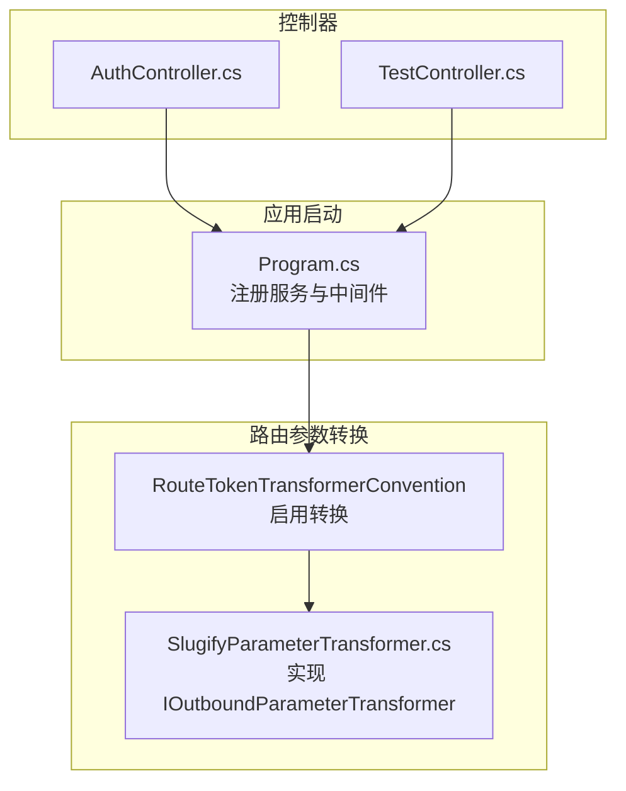
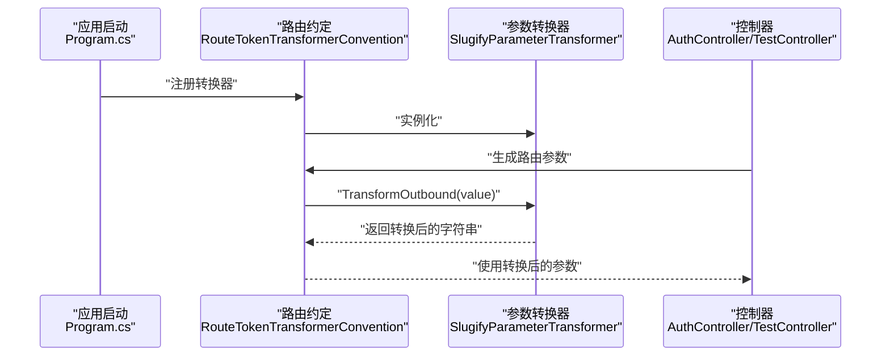
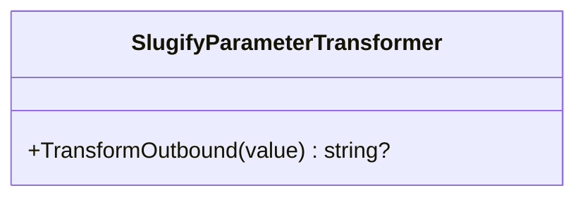
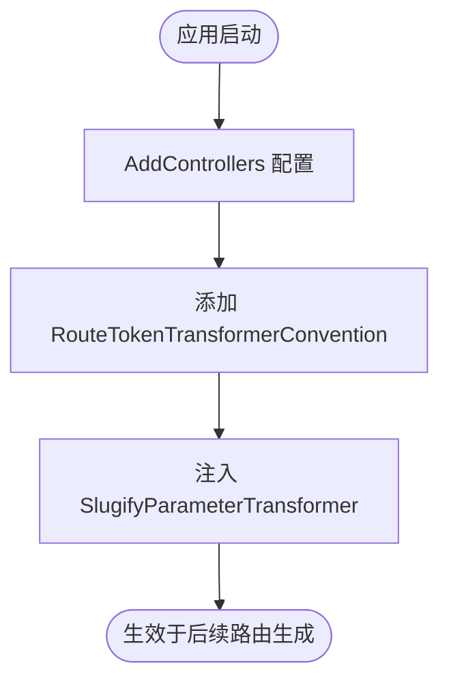
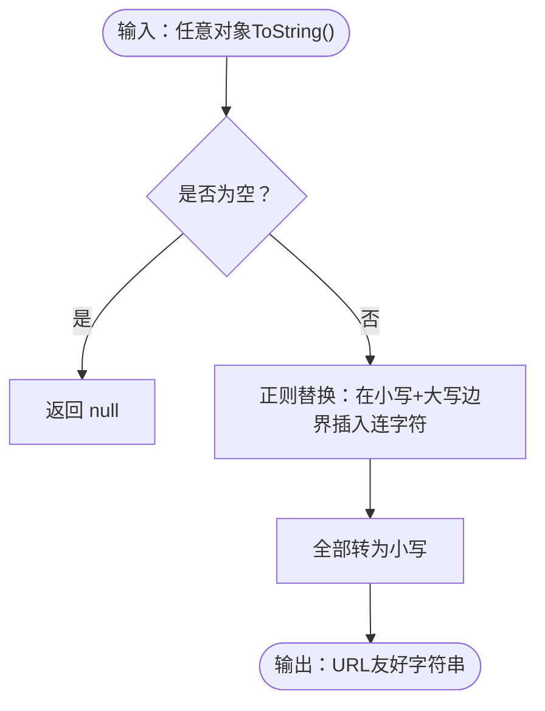
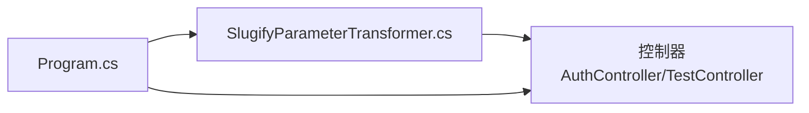

# URL参数美化工具

<cite>
**本文引用的文件列表**
- [SlugifyParameterTransformer.cs](file://src/utils/SlugifyParameterTransformer.cs)
- [Program.cs](file://Program.cs)
- [AuthController.cs](file://src/application/controllers/auth/AuthController.cs)
- [TestController.cs](file://src/application/controllers/test/TestController.cs)
- [talearc-backend.csproj](file://talearc-backend.csproj)
</cite>

## 目录
1. [简介](#简介)
2. [项目结构](#项目结构)
3. [核心组件](#核心组件)
4. [架构总览](#架构总览)
5. [详细组件分析](#详细组件分析)
6. [依赖分析](#依赖分析)
7. [性能考量](#性能考量)
8. [故障排查指南](#故障排查指南)
9. [结论](#结论)
10. [附录](#附录)

## 简介
本文件围绕 URL 路由参数的“美化”能力展开，重点介绍如何通过实现 IOutboundParameterTransformer 接口的 SlugifyParameterTransformer 工具类，在生成 URL 时将控制器名称等路由参数从驼峰式（如 TestController）自动转换为 URL 友好的小写连字符格式（如 test-controller）。该工具在 Program.cs 中通过 AddRouting 的 RouteTokenTransformerConvention 启用，使 API 路由更美观、利于 SEO，并保持无状态与可扩展性。

## 项目结构
- 工具类位于 src/utils/SlugifyParameterTransformer.cs，实现 IOutboundParameterTransformer 接口。
- 在 Program.cs 中，通过添加 RouteTokenTransformerConvention 并注入该工具类，启用参数转换。
- 控制器层位于 src/application/controllers 下，包含多个控制器示例，用于演示路由参数转换效果。

图表来源
- [Program.cs](file://Program.cs#L50-L55)
- [SlugifyParameterTransformer.cs](file://src/utils/SlugifyParameterTransformer.cs#L5-L12)
- [AuthController.cs](file://src/application/controllers/auth/AuthController.cs#L62-L67)
- [TestController.cs](file://src/application/controllers/test/TestController.cs#L28-L31)

章节来源
- [Program.cs](file://Program.cs#L50-L55)
- [SlugifyParameterTransformer.cs](file://src/utils/SlugifyParameterTransformer.cs#L5-L12)
- [AuthController.cs](file://src/application/controllers/auth/AuthController.cs#L62-L67)
- [TestController.cs](file://src/application/controllers/test/TestController.cs#L28-L31)

## 核心组件
- SlugifyParameterTransformer：实现 IOutboundParameterTransformer 接口，负责将传入的路由参数值转换为小写连字符格式。其 TransformOutbound 方法在值非空时执行正则替换并统一转为小写。
- Program.cs：在 AddControllers 的选项中通过 RouteTokenTransformerConvention 注入该转换器，从而影响所有控制器路由参数的生成。

章节来源
- [SlugifyParameterTransformer.cs](file://src/utils/SlugifyParameterTransformer.cs#L5-L12)
- [Program.cs](file://Program.cs#L50-L55)

## 架构总览
下图展示了从应用启动到路由参数转换的整体流程，以及控制器如何参与其中。

图表来源
- [Program.cs](file://Program.cs#L50-L55)
- [SlugifyParameterTransformer.cs](file://src/utils/SlugifyParameterTransformer.cs#L7-L11)
- [AuthController.cs](file://src/application/controllers/auth/AuthController.cs#L62-L67)
- [TestController.cs](file://src/application/controllers/test/TestController.cs#L28-L31)

## 详细组件分析

### 组件一：SlugifyParameterTransformer（URL参数美化工具）
- 角色定位：无状态的参数转换器，实现 IOutboundParameterTransformer 接口，仅负责将输入对象转换为 URL 友好字符串。
- 关键行为：
  - TransformOutbound(value)：当 value 非空时，使用正则表达式在小写字母与大写字母边界处插入连字符，并将整体转为小写；若为空则直接返回 null。
- 设计特点：
  - 轻量：纯逻辑函数，无外部依赖，适合全局复用。
  - 无状态：不持有任何可变字段，线程安全且易于测试。
  - 可扩展：可通过继承或组合其他转换策略进行扩展。

图表来源
- [SlugifyParameterTransformer.cs](file://src/utils/SlugifyParameterTransformer.cs#L5-L12)

章节来源
- [SlugifyParameterTransformer.cs](file://src/utils/SlugifyParameterTransformer.cs#L5-L12)

### 组件二：Program.cs 中的启用方式
- 在 AddControllers 的 options.Conventions 中添加 RouteTokenTransformerConvention，并注入 SlugifyParameterTransformer 实例。
- 这样，所有基于控制器名称的路由参数都会经过该转换器处理，从而生成更美观的 URL。

图表来源
- [Program.cs](file://Program.cs#L50-L55)

章节来源
- [Program.cs](file://Program.cs#L50-L55)

### 组件三：控制器中的路由示例
- AuthController 与 TestController 均使用基于控制器名称的路由模板，例如 [Route("talearc/api/[controller]")]。
- 当生成具体路由时，控制器名称会通过转换器处理，最终形成 URL 友好的形式。

章节来源
- [AuthController.cs](file://src/application/controllers/auth/AuthController.cs#L62-L67)
- [TestController.cs](file://src/application/controllers/test/TestController.cs#L28-L31)

### 正则表达式工作原理详解
TransformOutbound 方法中的正则替换步骤如下：
- 匹配规则：识别小写字母后跟一个大写字母的位置（如 “nC”），并在其间插入连字符。
- 结果处理：将整个字符串统一转为小写，确保输出为 URL 友好的连字符格式。
- 示例（概念性说明）：
  - 输入：驼峰式名称（如 TestController）
  - 输出：小写连字符（如 test-controller）

图表来源
- [SlugifyParameterTransformer.cs](file://src/utils/SlugifyParameterTransformer.cs#L7-L11)

章节来源
- [SlugifyParameterTransformer.cs](file://src/utils/SlugifyParameterTransformer.cs#L7-L11)

### 实际路由映射示例（默认与转换后对比）
- 默认（未启用转换器）：控制器名为 TestController，生成的路由片段可能仍为驼峰形式。
- 启用转换器后：控制器名为 TestController，生成的路由片段将为 test-controller，更美观且利于 SEO。

章节来源
- [AuthController.cs](file://src/application/controllers/auth/AuthController.cs#L62-L67)
- [TestController.cs](file://src/application/controllers/test/TestController.cs#L28-L31)
- [Program.cs](file://Program.cs#L50-L55)

## 依赖分析
- 内部依赖：
  - Program.cs 依赖 SlugifyParameterTransformer 类型，通过 RouteTokenTransformerConvention 注入。
  - 控制器依赖框架提供的路由机制，受转换器影响。
- 外部依赖：
  - 项目使用 ASP.NET Core（通过 csproj 中的包引用体现），转换器属于框架路由参数转换的一部分。

图表来源
- [Program.cs](file://Program.cs#L50-L55)
- [SlugifyParameterTransformer.cs](file://src/utils/SlugifyParameterTransformer.cs#L5-L12)
- [AuthController.cs](file://src/application/controllers/auth/AuthController.cs#L62-L67)
- [TestController.cs](file://src/application/controllers/test/TestController.cs#L28-L31)

章节来源
- [Program.cs](file://Program.cs#L50-L55)
- [SlugifyParameterTransformer.cs](file://src/utils/SlugifyParameterTransformer.cs#L5-L12)
- [AuthController.cs](file://src/application/controllers/auth/AuthController.cs#L62-L67)
- [TestController.cs](file://src/application/controllers/test/TestController.cs#L28-L31)
- [talearc-backend.csproj](file://talearc-backend.csproj#L12-L27)

## 性能考量
- 转换成本极低：正则替换与小写转换均为 O(n) 操作，n 为字符串长度，通常只在生成 URL 时触发，开销可忽略不计。
- 无状态设计：避免了缓存与共享状态带来的复杂性，简化并发场景下的处理。
- 扩展建议：若未来需要更复杂的命名策略（如多段连字符、保留特定前缀等），可在现有基础上新增转换器类，保持与现有约定的兼容。

## 故障排查指南
- 现象：路由参数未按预期转换
  - 检查 Program.cs 是否正确添加 RouteTokenTransformerConvention 并注入 SlugifyParameterTransformer。
  - 确认控制器路由模板是否依赖 [controller] 或其他参数会被转换。
- 现象：空值导致返回 null
  - TransformOutbound 对空值直接返回 null，这是预期行为；如需自定义空值策略，可在转换器中扩展。
- 现象：SEO 优化效果不明显
  - 确认生成的 URL 片段确实使用了转换后的参数；检查控制器路由模板与实际访问路径。

章节来源
- [Program.cs](file://Program.cs#L50-L55)
- [SlugifyParameterTransformer.cs](file://src/utils/SlugifyParameterTransformer.cs#L7-L11)
- [AuthController.cs](file://src/application/controllers/auth/AuthController.cs#L62-L67)
- [TestController.cs](file://src/application/controllers/test/TestController.cs#L28-L31)

## 结论
SlugifyParameterTransformer 通过实现 IOutboundParameterTransformer 接口，为 ASP.NET Core 应用提供了轻量、无状态的 URL 参数美化能力。在 Program.cs 中通过 RouteTokenTransformerConvention 启用后，控制器名称等路由参数将自动转换为小写连字符格式，显著提升路由的可读性与 SEO 表现。该工具易于扩展，可作为统一的路由参数转换策略基础，适用于多种命名风格的规范化需求。

## 附录
- 使用建议：
  - 将该转换器作为全局路由约定的一部分，确保一致性。
  - 如需保留某些特殊前缀或缩写，可在转换器中增加额外规则或创建新的转换器类。
- 相关文件参考：
  - [SlugifyParameterTransformer.cs](file://src/utils/SlugifyParameterTransformer.cs#L5-L12)
  - [Program.cs](file://Program.cs#L50-L55)
  - [AuthController.cs](file://src/application/controllers/auth/AuthController.cs#L62-L67)
  - [TestController.cs](file://src/application/controllers/test/TestController.cs#L28-L31)