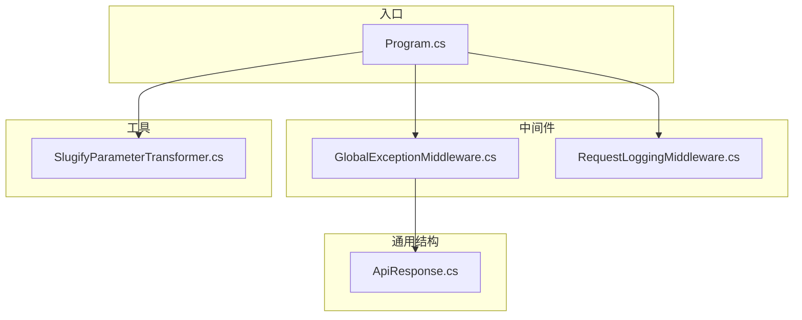
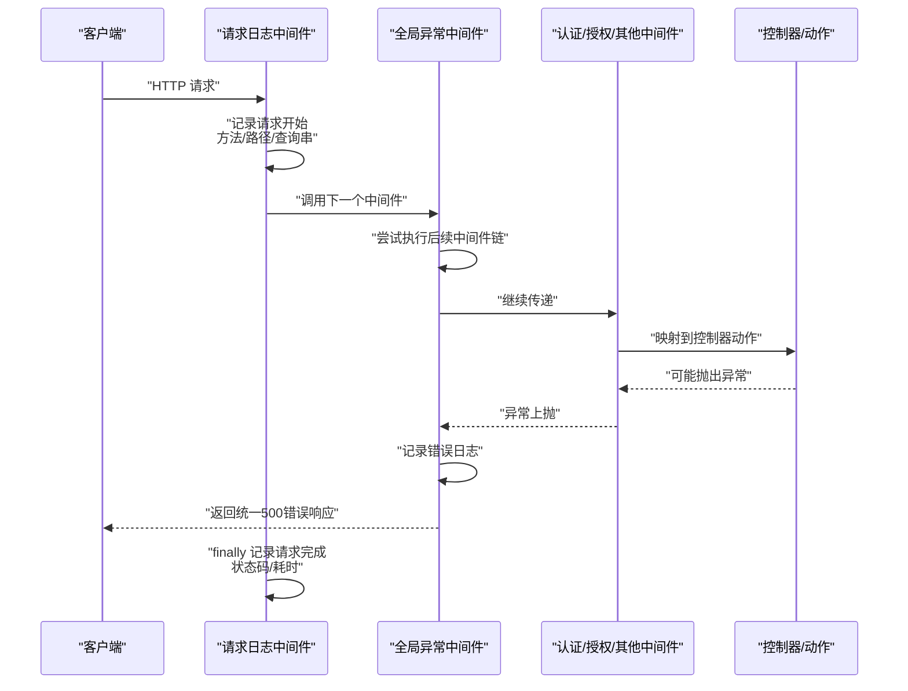
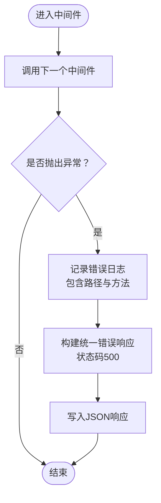
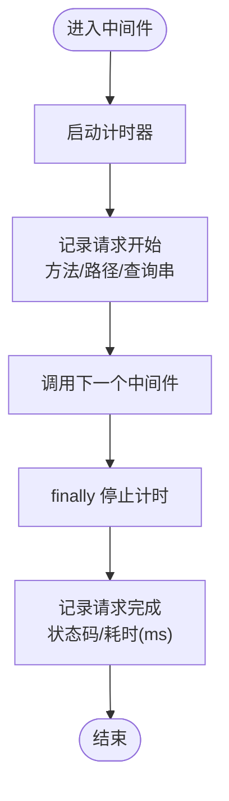
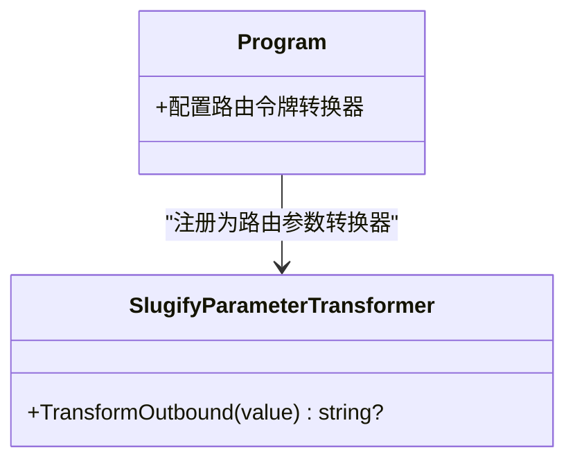
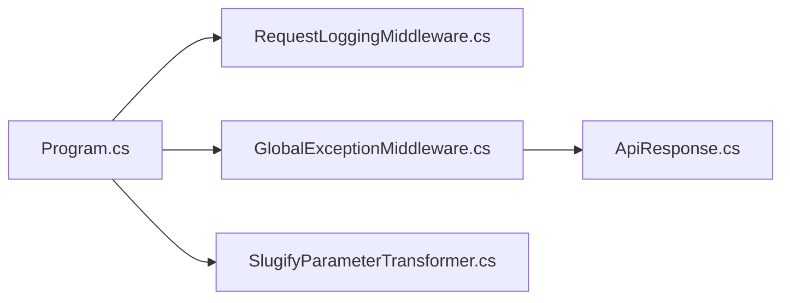

# 中间件与基础设施

<cite>
**本文引用的文件**
- [GlobalExceptionMiddleware.cs](file://src/middleware/GlobalExceptionMiddleware.cs)
- [RequestLoggingMiddleware.cs](file://src/middleware/RequestLoggingMiddleware.cs)
- [SlugifyParameterTransformer.cs](file://src/utils/SlugifyParameterTransformer.cs)
- [Program.cs](file://Program.cs)
- [ApiResponse.cs](file://src/structure/ApiResponse.cs)
</cite>

## 目录
1. [引言](#引言)
2. [项目结构](#项目结构)
3. [核心组件](#核心组件)
4. [架构总览](#架构总览)
5. [详细组件分析](#详细组件分析)
6. [依赖关系分析](#依赖关系分析)
7. [性能考量](#性能考量)
8. [故障排查指南](#故障排查指南)
9. [结论](#结论)

## 引言
本文件聚焦于项目中的中间件与基础设施组件，系统性说明以下内容：
- 全局异常中间件如何捕获未处理异常、记录错误日志并返回统一的500错误响应，从而提升API的健壮性。
- 请求日志中间件如何记录每个请求的路径、方法、查询串、状态码与耗时，便于监控与调试。
- 参数转换器如何将路由参数转换为URL友好的小写连字符格式，并说明其在程序入口中的注册方式。
- 这些基础设施组件如何协同提升系统的可观测性与用户体验。

## 项目结构
项目采用分层与功能模块结合的组织方式，中间件与工具位于独立目录，入口程序负责装配与注册：
- 中间件：全局异常中间件、请求日志中间件
- 工具：参数转换器
- 入口：程序启动与管道装配

图表来源
- [Program.cs](file://Program.cs#L100-L107)
- [GlobalExceptionMiddleware.cs](file://src/middleware/GlobalExceptionMiddleware.cs#L1-L45)
- [RequestLoggingMiddleware.cs](file://src/middleware/RequestLoggingMiddleware.cs#L1-L39)
- [SlugifyParameterTransformer.cs](file://src/utils/SlugifyParameterTransformer.cs#L1-L13)
- [ApiResponse.cs](file://src/structure/ApiResponse.cs#L1-L40)

章节来源
- [Program.cs](file://Program.cs#L1-L107)

## 核心组件
- 全局异常中间件：在管道中捕获未处理异常，记录错误日志，并以统一格式返回500错误响应。
- 请求日志中间件：记录请求开始与完成信息（方法、路径、查询串、状态码、耗时）。
- 参数转换器：将路由参数转换为URL友好的小写连字符格式，改善可读性与一致性。
- 统一响应模型：提供统一的响应结构，便于前端消费与调试。

章节来源
- [GlobalExceptionMiddleware.cs](file://src/middleware/GlobalExceptionMiddleware.cs#L1-L45)
- [RequestLoggingMiddleware.cs](file://src/middleware/RequestLoggingMiddleware.cs#L1-L39)
- [SlugifyParameterTransformer.cs](file://src/utils/SlugifyParameterTransformer.cs#L1-L13)
- [ApiResponse.cs](file://src/structure/ApiResponse.cs#L1-L40)

## 架构总览
中间件在ASP.NET Core请求管道中的位置如下：
- 请求进入后先经过请求日志中间件，再进入全局异常中间件，随后是认证授权等后续中间件，最后映射控制器。
- 全局异常中间件在捕获异常时，会使用统一响应模型返回标准化错误。

图表来源
- [Program.cs](file://Program.cs#L100-L107)
- [RequestLoggingMiddleware.cs](file://src/middleware/RequestLoggingMiddleware.cs#L16-L39)
- [GlobalExceptionMiddleware.cs](file://src/middleware/GlobalExceptionMiddleware.cs#L22-L45)
- [ApiResponse.cs](file://src/structure/ApiResponse.cs#L28-L40)

## 详细组件分析

### 全局异常中间件（GlobalExceptionMiddleware）
职责与行为
- 捕获管道中未处理的异常，避免异常直接暴露给客户端。
- 使用日志记录器输出异常上下文（路径、方法）。
- 将错误封装为统一响应模型，设置状态码为500，返回JSON格式。

关键实现要点
- 在调用下一个中间件前后的try/catch/finally结构确保异常被捕获且日志被记录。
- 使用统一响应模型生成失败响应，保证前后端一致的错误格式。
- JSON序列化选项采用驼峰命名策略，保持与全局配置一致。

图表来源
- [GlobalExceptionMiddleware.cs](file://src/middleware/GlobalExceptionMiddleware.cs#L22-L45)
- [ApiResponse.cs](file://src/structure/ApiResponse.cs#L28-L40)

章节来源
- [GlobalExceptionMiddleware.cs](file://src/middleware/GlobalExceptionMiddleware.cs#L1-L45)
- [ApiResponse.cs](file://src/structure/ApiResponse.cs#L1-L40)

### 请求日志中间件（RequestLoggingMiddleware）
职责与行为
- 在请求开始时记录方法、路径与查询串。
- 在finally块中记录请求完成信息，包括状态码与耗时（毫秒）。
- 使用Stopwatch精确统计执行时间，避免遗漏或重复计时。

图表来源
- [RequestLoggingMiddleware.cs](file://src/middleware/RequestLoggingMiddleware.cs#L16-L39)

章节来源
- [RequestLoggingMiddleware.cs](file://src/middleware/RequestLoggingMiddleware.cs#L1-L39)

### 参数转换器（SlugifyParameterTransformer）
职责与行为
- 实现IOutboundParameterTransformer接口，用于将路由参数转换为URL友好的小写连字符格式。
- 对输入值进行正则替换，将“小写字母+大写字母”的边界插入连字符，并转为小写，从而将类似“TestController”转换为“test-controller”。

注册方式
- 在程序入口通过路由约定添加参数转换器，使所有基于约定的路由参数均应用该转换规则。

图表来源
- [SlugifyParameterTransformer.cs](file://src/utils/SlugifyParameterTransformer.cs#L1-L13)
- [Program.cs](file://Program.cs#L50-L57)

章节来源
- [SlugifyParameterTransformer.cs](file://src/utils/SlugifyParameterTransformer.cs#L1-L13)
- [Program.cs](file://Program.cs#L50-L57)

## 依赖关系分析
- 程序入口装配顺序决定中间件的执行顺序：请求日志中间件先于全局异常中间件，确保异常场景也能记录完成的请求信息。
- 全局异常中间件依赖统一响应模型，保证错误响应格式一致。
- 参数转换器通过路由约定注入，影响所有基于约定的路由生成与匹配。

图表来源
- [Program.cs](file://Program.cs#L100-L107)
- [RequestLoggingMiddleware.cs](file://src/middleware/RequestLoggingMiddleware.cs#L1-L39)
- [GlobalExceptionMiddleware.cs](file://src/middleware/GlobalExceptionMiddleware.cs#L1-L45)
- [SlugifyParameterTransformer.cs](file://src/utils/SlugifyParameterTransformer.cs#L1-L13)
- [ApiResponse.cs](file://src/structure/ApiResponse.cs#L1-L40)

章节来源
- [Program.cs](file://Program.cs#L100-L107)

## 性能考量
- 请求日志中间件使用Stopwatch进行轻量级计时，对性能影响极低。
- 全局异常中间件仅在异常发生时执行额外逻辑，正常路径不引入额外开销。
- 参数转换器为纯字符串处理，复杂度与输入长度线性相关，通常可忽略不计。
- 建议在生产环境开启结构化日志与滚动日志文件，避免磁盘IO成为瓶颈。

## 故障排查指南
- 异常未被捕获：确认全局异常中间件已正确注册在管道中，且顺序在认证/授权之后。
- 日志缺失：检查日志配置与中间件是否启用；确保finally块能够执行，避免异常导致提前退出。
- 路由参数不符合预期：确认路由约定中已注册参数转换器，验证转换逻辑是否符合预期格式。
- 统一响应格式不一致：核对全局异常中间件使用的响应模型与全局JSON命名策略。

章节来源
- [Program.cs](file://Program.cs#L100-L107)
- [RequestLoggingMiddleware.cs](file://src/middleware/RequestLoggingMiddleware.cs#L16-L39)
- [GlobalExceptionMiddleware.cs](file://src/middleware/GlobalExceptionMiddleware.cs#L22-L45)
- [SlugifyParameterTransformer.cs](file://src/utils/SlugifyParameterTransformer.cs#L1-L13)
- [ApiResponse.cs](file://src/structure/ApiResponse.cs#L28-L40)

## 结论
通过请求日志中间件与全局异常中间件的组合，系统实现了对请求生命周期的完整观测与异常的统一兜底处理；通过参数转换器，路由参数具备了更友好、一致的URL表现形式。三者共同提升了系统的可观测性、稳定性与可维护性，为开发与运维提供了坚实的基础。