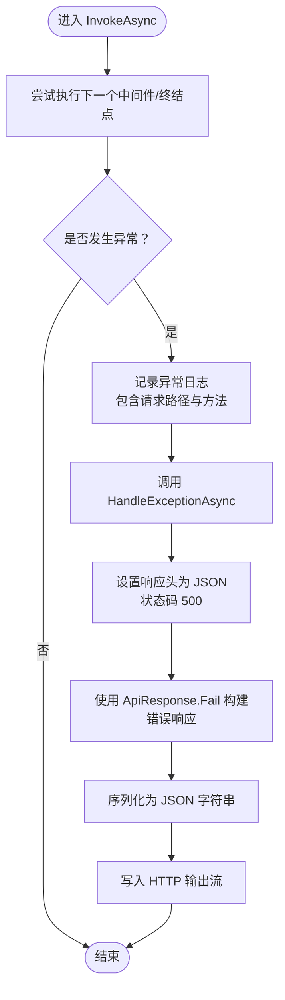

# 全局异常处理中间件

<cite>
**本文引用的文件**
- [GlobalExceptionMiddleware.cs](file://src/middleware/GlobalExceptionMiddleware.cs)
- [ApiResponse.cs](file://src/structure/ApiResponse.cs)
- [Program.cs](file://Program.cs)
- [RequestLoggingMiddleware.cs](file://src/middleware/RequestLoggingMiddleware.cs)
- [TestController.cs](file://src/application/controllers/test/TestController.cs)
- [appsettings.json](file://appsettings.json)
</cite>

## 目录
1. [简介](#简介)
2. [项目结构](#项目结构)
3. [核心组件](#核心组件)
4. [架构总览](#架构总览)
5. [组件详细分析](#组件详细分析)
6. [依赖关系分析](#依赖关系分析)
7. [性能考量](#性能考量)
8. [故障排查指南](#故障排查指南)
9. [结论](#结论)
10. [附录](#附录)

## 简介
本文件围绕全局异常处理中间件 GlobalExceptionMiddleware 展开，系统性说明其如何通过捕获未处理异常、记录详细错误日志、返回统一格式的 500 错误响应（基于 ApiResponse.Fail），以及与 Serilog 日志系统的集成方式。文档还提供异常未被捕获或响应格式错误等常见问题的排查建议，并通过序列图与流程图帮助读者理解中间件在 ASP.NET Core 请求管道中的作用与执行流程。

## 项目结构
- 中间件层位于 src/middleware，包含全局异常处理中间件与请求日志中间件。
- 统一响应模型位于 src/structure，提供 ApiResponse<T> 与 ApiResponse 工具类。
- 应用程序入口 Program.cs 配置了 Serilog 并注册中间件顺序。
- 测试控制器用于演示正常与异常场景，便于验证中间件行为。

图表来源
- [Program.cs](file://Program.cs#L91-L107)
- [GlobalExceptionMiddleware.cs](file://src/middleware/GlobalExceptionMiddleware.cs#L1-L45)
- [RequestLoggingMiddleware.cs](file://src/middleware/RequestLoggingMiddleware.cs#L1-L39)
- [ApiResponse.cs](file://src/structure/ApiResponse.cs#L1-L40)
- [TestController.cs](file://src/application/controllers/test/TestController.cs#L1-L70)
- [appsettings.json](file://appsettings.json#L1-L16)

章节来源
- [Program.cs](file://Program.cs#L91-L107)
- [GlobalExceptionMiddleware.cs](file://src/middleware/GlobalExceptionMiddleware.cs#L1-L45)
- [RequestLoggingMiddleware.cs](file://src/middleware/RequestLoggingMiddleware.cs#L1-L39)
- [ApiResponse.cs](file://src/structure/ApiResponse.cs#L1-L40)
- [TestController.cs](file://src/application/controllers/test/TestController.cs#L1-L70)
- [appsettings.json](file://appsettings.json#L1-L16)

## 核心组件
- 全局异常处理中间件：负责拦截未处理异常，记录日志，并以统一 JSON 格式返回 500 错误响应。
- 统一响应模型：提供 ApiResponse<T> 与 ApiResponse.Fail 工具方法，确保所有错误响应结构一致。
- 请求日志中间件：在请求进入与完成时记录日志，便于定位异常发生的上下文。
- 应用入口与日志配置：Program.cs 使用 Serilog 初始化日志系统，并在管道中注册中间件顺序。

章节来源
- [GlobalExceptionMiddleware.cs](file://src/middleware/GlobalExceptionMiddleware.cs#L1-L45)
- [ApiResponse.cs](file://src/structure/ApiResponse.cs#L1-L40)
- [RequestLoggingMiddleware.cs](file://src/middleware/RequestLoggingMiddleware.cs#L1-L39)
- [Program.cs](file://Program.cs#L1-L23)

## 架构总览
全局异常处理中间件位于请求管道中，处于请求日志中间件之后、认证授权之前，确保：
- 所有后续中间件与控制器抛出的未处理异常均能被捕获。
- 异常发生时，先记录详细日志，再返回统一的 500 错误响应。
- 与 Serilog 的集成保证日志输出到控制台与滚动文件。

图表来源
- [Program.cs](file://Program.cs#L91-L107)
- [RequestLoggingMiddleware.cs](file://src/middleware/RequestLoggingMiddleware.cs#L16-L39)
- [GlobalExceptionMiddleware.cs](file://src/middleware/GlobalExceptionMiddleware.cs#L22-L45)
- [ApiResponse.cs](file://src/structure/ApiResponse.cs#L28-L40)

## 组件详细分析

### GlobalExceptionMiddleware 类分析
- 依赖注入
  - 构造函数接收 RequestDelegate 与 ILogger<GlobalExceptionMiddleware>，分别用于继续执行后续中间件与记录日志。
- 执行流程
  - 在 InvokeAsync 中包裹对 _next(context) 的调用于 try 块内；若发生异常，则记录日志并调用 HandleExceptionAsync。
- 错误响应生成
  - HandleExceptionAsync 设置响应内容类型为 application/json，状态码为 500，并通过 ApiResponse.Fail 构建统一错误响应对象，随后序列化为 JSON 写入响应流。

图表来源
- [GlobalExceptionMiddleware.cs](file://src/middleware/GlobalExceptionMiddleware.cs#L9-L45)
- [ApiResponse.cs](file://src/structure/ApiResponse.cs#L28-L40)

章节来源
- [GlobalExceptionMiddleware.cs](file://src/middleware/GlobalExceptionMiddleware.cs#L9-L45)

### InvokeAsync 方法流程
- 尝试执行下一个中间件或终结点。
- 若出现异常，记录包含请求路径与方法的错误日志。
- 调用 HandleExceptionAsync 生成统一错误响应并写入 HTTP 输出流。

图表来源
- [GlobalExceptionMiddleware.cs](file://src/middleware/GlobalExceptionMiddleware.cs#L22-L45)

章节来源
- [GlobalExceptionMiddleware.cs](file://src/middleware/GlobalExceptionMiddleware.cs#L22-L45)

### HandleExceptionAsync 方法细节
- 设置响应内容类型为 application/json。
- 设置状态码为 500。
- 通过 ApiResponse.Fail 创建统一错误响应对象。
- 使用预设的 JSON 序列化选项（驼峰命名）进行序列化。
- 将 JSON 字符串写入响应流。

章节来源
- [GlobalExceptionMiddleware.cs](file://src/middleware/GlobalExceptionMiddleware.cs#L36-L45)
- [ApiResponse.cs](file://src/structure/ApiResponse.cs#L28-L40)

### 与 Serilog 的集成
- Program.cs 中初始化 Serilog，配置控制台与滚动文件输出，并启用从日志上下文提取属性。
- 中间件使用 ILogger<GlobalExceptionMiddleware> 记录异常详情，确保异常堆栈、请求路径与方法等信息被完整记录。
- appsettings.json 提供默认日志级别配置，便于在不同环境调整日志输出。

章节来源
- [Program.cs](file://Program.cs#L1-L23)
- [GlobalExceptionMiddleware.cs](file://src/middleware/GlobalExceptionMiddleware.cs#L30-L33)
- [appsettings.json](file://appsettings.json#L9-L14)

### 与其他中间件的协作
- 请求日志中间件先于全局异常中间件注册，确保异常前后均能记录请求开始与完成信息。
- 全局异常中间件位于 HTTPS、认证与授权之前，确保异常在认证授权前被捕获与处理。

章节来源
- [Program.cs](file://Program.cs#L91-L107)
- [RequestLoggingMiddleware.cs](file://src/middleware/RequestLoggingMiddleware.cs#L16-L39)

### 示例：异常场景下的日志与响应
- 控制器示例中提供一个返回 500 的接口，用于演示错误响应结构。
- 当控制器或后续中间件抛出未处理异常时，全局异常中间件会记录日志并返回统一的 500 错误响应。

章节来源
- [TestController.cs](file://src/application/controllers/test/TestController.cs#L55-L68)
- [GlobalExceptionMiddleware.cs](file://src/middleware/GlobalExceptionMiddleware.cs#L30-L45)

## 依赖关系分析
- GlobalExceptionMiddleware 依赖：
  - RequestDelegate：继续执行后续中间件或终结点。
  - ILogger<GlobalExceptionMiddleware>：记录异常日志。
  - ApiResponse.Fail：生成统一错误响应。
- 管道注册顺序：
  - RequestLoggingMiddleware -> GlobalExceptionMiddleware -> 其他中间件/终结点。
- Serilog 集成：
  - Program.cs 使用 Serilog 初始化日志系统，中间件通过 ILogger 注入记录异常。

图表来源
- [Program.cs](file://Program.cs#L91-L107)
- [GlobalExceptionMiddleware.cs](file://src/middleware/GlobalExceptionMiddleware.cs#L9-L45)
- [RequestLoggingMiddleware.cs](file://src/middleware/RequestLoggingMiddleware.cs#L16-L39)
- [ApiResponse.cs](file://src/structure/ApiResponse.cs#L28-L40)

章节来源
- [Program.cs](file://Program.cs#L91-L107)
- [GlobalExceptionMiddleware.cs](file://src/middleware/GlobalExceptionMiddleware.cs#L9-L45)
- [RequestLoggingMiddleware.cs](file://src/middleware/RequestLoggingMiddleware.cs#L16-L39)
- [ApiResponse.cs](file://src/structure/ApiResponse.cs#L28-L40)

## 性能考量
- 异常捕获与日志记录会带来额外开销，但这是保障服务稳定性的必要成本。
- JSON 序列化采用预设选项（驼峰命名），避免在异常处理过程中进行复杂转换。
- 建议仅在必要时记录异常的详细堆栈，避免在高并发场景下产生过多日志。

## 故障排查指南
- 异常未被捕获
  - 检查中间件注册顺序：确保 GlobalExceptionMiddleware 位于请求日志中间件之后、认证授权之前。
  - 确认未在控制器或中间件中再次抛出未处理异常。
  - 参考：[Program.cs](file://Program.cs#L91-L107)
- 响应格式错误
  - 确保响应内容类型为 application/json，状态码为 500。
  - 检查 ApiResponse.Fail 的使用是否正确，确保返回结构与统一模型一致。
  - 参考：[GlobalExceptionMiddleware.cs](file://src/middleware/GlobalExceptionMiddleware.cs#L36-L45)，[ApiResponse.cs](file://src/structure/ApiResponse.cs#L28-L40)
- 日志未输出或不完整
  - 检查 Serilog 初始化与配置是否生效。
  - 确认 appsettings.json 中的日志级别设置合理。
  - 参考：[Program.cs](file://Program.cs#L1-L23)，[appsettings.json](file://appsettings.json#L9-L14)
- 异常上下文缺失
  - 确保在 InvokeAsync 中记录请求路径与方法，以便快速定位问题。
  - 参考：[GlobalExceptionMiddleware.cs](file://src/middleware/GlobalExceptionMiddleware.cs#L30-L33)

章节来源
- [Program.cs](file://Program.cs#L91-L107)
- [GlobalExceptionMiddleware.cs](file://src/middleware/GlobalExceptionMiddleware.cs#L30-L45)
- [appsettings.json](file://appsettings.json#L9-L14)

## 结论
GlobalExceptionMiddleware 通过在 ASP.NET Core 请求管道中捕获未处理异常，实现了统一错误响应与标准化日志记录。结合 Serilog 的集成，能够有效提升 API 的健壮性与可观测性。遵循本文提供的注册顺序与排查建议，可确保异常得到及时捕获与正确处理。

## 附录
- 统一响应模型
  - ApiResponse<T>：包含 Code、Message、Data 字段。
  - ApiResponse.Fail：用于生成统一的错误响应对象。
  - 参考：[ApiResponse.cs](file://src/structure/ApiResponse.cs#L1-L40)
- 中间件注册顺序
  - 请求日志中间件 -> 全局异常中间件 -> HTTPS/认证/授权 -> 控制器映射。
  - 参考：[Program.cs](file://Program.cs#L91-L107)