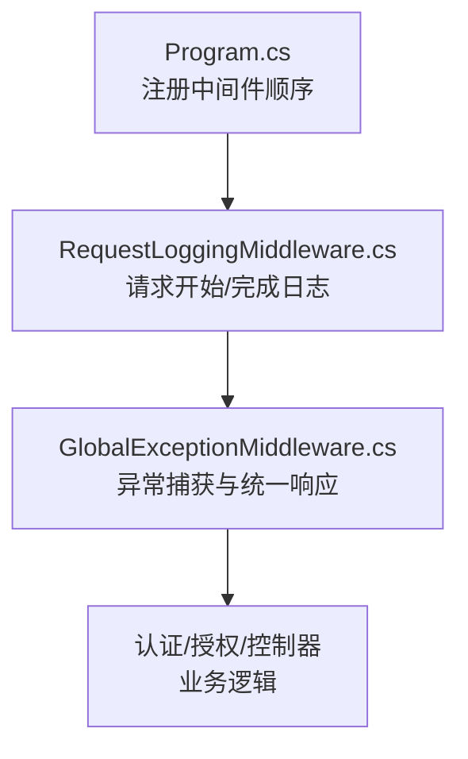
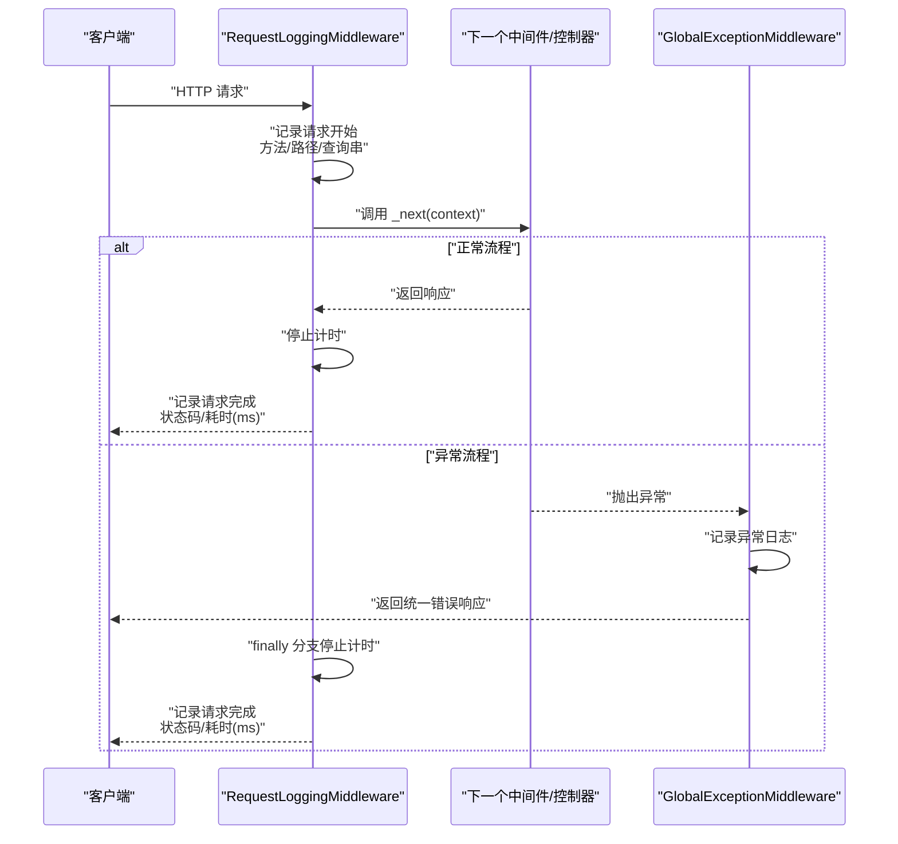
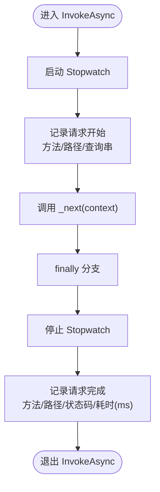
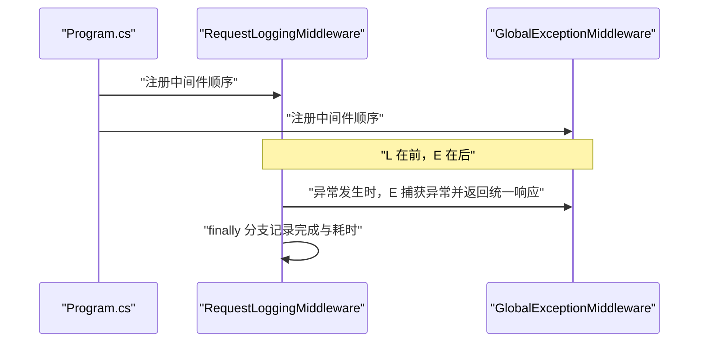
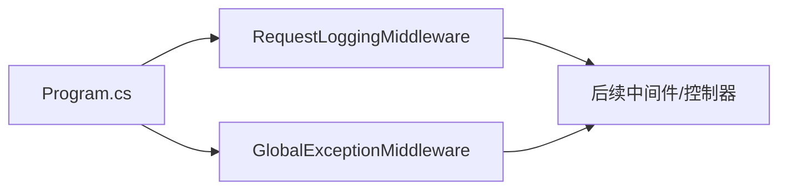

# 请求日志记录中间件

<cite>
**本文引用的文件**
- [RequestLoggingMiddleware.cs](file://src/middleware/RequestLoggingMiddleware.cs)
- [GlobalExceptionMiddleware.cs](file://src/middleware/GlobalExceptionMiddleware.cs)
- [Program.cs](file://Program.cs)
- [appsettings.json](file://appsettings.json)
- [ApiResponse.cs](file://src/structure/ApiResponse.cs)
- [TestController.cs](file://src/application/controllers/test/TestController.cs)
- [AuthController.cs](file://src/application/controllers/auth/AuthController.cs)
</cite>

## 目录
1. [简介](#简介)
2. [项目结构](#项目结构)
3. [核心组件](#核心组件)
4. [架构总览](#架构总览)
5. [详细组件分析](#详细组件分析)
6. [依赖分析](#依赖分析)
7. [性能考量](#性能考量)
8. [故障排查指南](#故障排查指南)
9. [结论](#结论)
10. [附录](#附录)

## 简介
本文件围绕 RequestLoggingMiddleware 中间件展开，系统性阐述其如何基于 Stopwatch 精确测量每个 HTTP 请求的处理耗时，并通过 ILogger 在请求进入与完成两个关键节点记录日志。文档重点说明 InvokeAsync 方法中日志记录的时机与内容，包括 HTTP 方法、路径、查询字符串、状态码以及执行时间；同时结合 GlobalExceptionMiddleware 的协作机制，确保异常场景下仍能正确记录耗时；最后给出日志输出格式示例、appsettings.json 日志级别配置方法，以及在性能诊断、系统监控与接口调试中的实践价值。

## 项目结构
该中间件位于中间件目录，与全局异常中间件共同构成请求管道的前置日志与异常处理层。程序入口在 Program.cs 中注册中间件顺序，随后进入认证、授权与控制器路由阶段。

**图表来源**
- [Program.cs](file://Program.cs#L93-L106)
- [RequestLoggingMiddleware.cs](file://src/middleware/RequestLoggingMiddleware.cs#L16-L38)
- [GlobalExceptionMiddleware.cs](file://src/middleware/GlobalExceptionMiddleware.cs#L22-L34)

**章节来源**
- [Program.cs](file://Program.cs#L93-L106)

## 核心组件
- RequestLoggingMiddleware：负责在请求进入与完成时记录日志，使用 Stopwatch 测量耗时。
- GlobalExceptionMiddleware：负责捕获未处理异常，记录错误日志并返回统一响应。
- Program.cs：定义中间件注册顺序，确保 RequestLoggingMiddleware 先于 GlobalExceptionMiddleware 执行。
- appsettings.json：提供默认日志级别配置，可按命名空间调整输出细节。

**章节来源**
- [RequestLoggingMiddleware.cs](file://src/middleware/RequestLoggingMiddleware.cs#L16-L38)
- [GlobalExceptionMiddleware.cs](file://src/middleware/GlobalExceptionMiddleware.cs#L22-L34)
- [Program.cs](file://Program.cs#L93-L106)
- [appsettings.json](file://appsettings.json#L9-L13)

## 架构总览
请求从客户端到达 ASP.NET Core 管道后，先由 RequestLoggingMiddleware 记录“请求开始”，再交由后续中间件（如认证、授权、控制器）处理；无论是否发生异常，最终都会在 RequestLoggingMiddleware 的 finally 分支中记录“请求完成”及耗时。若发生异常，GlobalExceptionMiddleware 将捕获并记录异常，同时返回统一错误响应。

**图表来源**
- [RequestLoggingMiddleware.cs](file://src/middleware/RequestLoggingMiddleware.cs#L16-L38)
- [GlobalExceptionMiddleware.cs](file://src/middleware/GlobalExceptionMiddleware.cs#L22-L34)
- [Program.cs](file://Program.cs#L93-L106)

## 详细组件分析

### RequestLoggingMiddleware 组件分析
- 依赖注入：接收 RequestDelegate 与 ILogger<RequestLoggingMiddleware>。
- 计时策略：在进入 InvokeAsync 后立即启动 Stopwatch；在 finally 分支中停止计时，保证即使发生异常也能记录耗时。
- 日志时机：
  - 请求开始：记录 HTTP 方法、路径、查询字符串。
  - 请求完成：记录 HTTP 方法、路径、状态码、耗时（毫秒）。
- 异常安全：使用 try/finally 结构，确保 finally 总会执行，从而在异常情况下也能记录“请求完成”。

**图表来源**
- [RequestLoggingMiddleware.cs](file://src/middleware/RequestLoggingMiddleware.cs#L16-L38)

**章节来源**
- [RequestLoggingMiddleware.cs](file://src/middleware/RequestLoggingMiddleware.cs#L16-L38)

### GlobalExceptionMiddleware 协作关系
- 作用：捕获未处理异常，记录异常日志并返回统一 JSON 错误响应。
- 与 RequestLoggingMiddleware 的关系：
  - 由于 Program.cs 中中间件注册顺序为先 RequestLoggingMiddleware 再 GlobalExceptionMiddleware，因此异常发生时，RequestLoggingMiddleware 的 finally 分支仍会执行，确保“请求完成”日志与耗时被记录。
  - GlobalExceptionMiddleware 负责将异常转化为标准响应，避免异常直接暴露给客户端。

**图表来源**
- [Program.cs](file://Program.cs#L93-L106)
- [GlobalExceptionMiddleware.cs](file://src/middleware/GlobalExceptionMiddleware.cs#L22-L34)
- [RequestLoggingMiddleware.cs](file://src/middleware/RequestLoggingMiddleware.cs#L16-L38)

**章节来源**
- [Program.cs](file://Program.cs#L93-L106)
- [GlobalExceptionMiddleware.cs](file://src/middleware/GlobalExceptionMiddleware.cs#L22-L34)
- [RequestLoggingMiddleware.cs](file://src/middleware/RequestLoggingMiddleware.cs#L16-L38)

### 日志输出格式示例
- 请求开始示例（不含具体值）：请求开始: {Method} {Path} {QueryString}
- 请求完成示例（不含具体值）：请求完成: {Method} {Path} {StatusCode} 耗时 {ElapsedMs}ms
- 上述占位符对应字段：
  - Method：HTTP 方法（如 GET、POST）
  - Path：请求路径
  - QueryString：查询字符串
  - StatusCode：响应状态码
  - ElapsedMs：耗时（毫秒）

说明：
- 以上格式为中间件日志模板，实际输出取决于日志提供者（如 Console、文件）与模板设置。
- 控制台与文件输出模板由 Program.cs 中的 Serilog 配置决定。

**章节来源**
- [RequestLoggingMiddleware.cs](file://src/middleware/RequestLoggingMiddleware.cs#L20-L36)
- [Program.cs](file://Program.cs#L12-L19)

### 在 appsettings.json 中配置日志级别
- 默认日志级别：Default 设置为 Information，可按需提升至 Debug 以获取更详细的请求级日志。
- 命名空间控制：可通过为特定命名空间（如 talearc_backend.src.middleware）单独设置 LogLevel，实现差异化输出。

示例配置要点（摘自现有配置）：
- Default：Information
- Microsoft.AspNetCore：Warning

建议新增中间件命名空间级别：
- 在 Logging: { LogLevel: { "talearc_backend.src.middleware": "Debug" } } 可开启中间件详细日志。

注意：
- 本仓库未提供中间件命名空间的专用配置项，可在现有基础上追加。

**章节来源**
- [appsettings.json](file://appsettings.json#L9-L13)
- [Program.cs](file://Program.cs#L12-L19)

### 实际应用价值
- 性能诊断：通过“耗时(ms)”快速定位慢请求与潜在瓶颈。
- 系统监控：结合日志聚合平台，统计各端点的平均耗时、错误率与吞吐。
- 接口调试：在请求开始与完成处均留有上下文信息，便于回溯请求链路与问题定位。
- 异常保障：即使出现异常，也能记录“请求完成”与耗时，避免遗漏关键指标。

### 与控制器交互示例
- 测试端点：TestController 提供问候与失败测试端点，便于验证中间件在不同状态码下的日志输出。
- 认证端点：AuthController 展示典型业务流程，中间件会在其前后记录完整生命周期日志。

**章节来源**
- [TestController.cs](file://src/application/controllers/test/TestController.cs#L40-L68)
- [AuthController.cs](file://src/application/controllers/auth/AuthController.cs#L80-L125)

## 依赖分析
- RequestLoggingMiddleware 依赖：
  - RequestDelegate：用于继续管道处理。
  - ILogger<RequestLoggingMiddleware>：记录请求开始与完成日志。
- GlobalExceptionMiddleware 依赖：
  - RequestDelegate：继续管道处理并在异常时接管。
  - ILogger<GlobalExceptionMiddleware>：记录异常日志。
- 程序入口依赖：
  - Program.cs 通过 UseMiddleware 注册中间件，决定请求处理顺序。

**图表来源**
- [Program.cs](file://Program.cs#L93-L106)
- [RequestLoggingMiddleware.cs](file://src/middleware/RequestLoggingMiddleware.cs#L10-L14)
- [GlobalExceptionMiddleware.cs](file://src/middleware/GlobalExceptionMiddleware.cs#L16-L20)

**章节来源**
- [Program.cs](file://Program.cs#L93-L106)
- [RequestLoggingMiddleware.cs](file://src/middleware/RequestLoggingMiddleware.cs#L10-L14)
- [GlobalExceptionMiddleware.cs](file://src/middleware/GlobalExceptionMiddleware.cs#L16-L20)

## 性能考量
- 计时精度：使用 Stopwatch.StartNew()，在高并发场景下对性能影响极小。
- 日志开销：Information 级别日志在生产环境通常成本可控；如需进一步降低开销，可考虑在高流量端点仅记录关键指标或采用采样策略。
- 异常路径：finally 分支确保耗时记录，避免异常导致的漏记；但异常本身可能带来额外日志与处理成本，应结合异常监控策略综合评估。

## 故障排查指南
- 未看到“请求完成”日志：
  - 检查中间件注册顺序是否正确（RequestLoggingMiddleware 应在 GlobalExceptionMiddleware 之前）。
  - 确认日志级别配置是否过低，导致被过滤。
- 异常时未记录耗时：
  - 确保异常未被上游中间件拦截并提前终止；GlobalExceptionMiddleware 会捕获异常并返回统一响应，但不影响 RequestLoggingMiddleware 的 finally 分支。
- 日志格式不符合预期：
  - 检查 Program.cs 中 Serilog 输出模板与 appsettings.json 中的日志级别配置。

**章节来源**
- [Program.cs](file://Program.cs#L93-L106)
- [RequestLoggingMiddleware.cs](file://src/middleware/RequestLoggingMiddleware.cs#L16-L38)
- [GlobalExceptionMiddleware.cs](file://src/middleware/GlobalExceptionMiddleware.cs#L22-L34)
- [appsettings.json](file://appsettings.json#L9-L13)

## 结论
RequestLoggingMiddleware 通过 Stopwatch 精准测量请求耗时，并在请求进入与完成两个关键节点记录日志，为性能诊断、系统监控与接口调试提供了可靠依据。配合 GlobalExceptionMiddleware 的异常捕获与统一响应，即使在异常情况下也能完整记录耗时，确保可观测性不缺失。通过合理配置 appsettings.json 的日志级别，可在不同环境下平衡可观测性与性能成本。

## 附录
- 相关响应模型：ApiResponse 用于统一 API 响应结构，便于在控制器与中间件中保持一致的输出风格。
- 控制器示例：TestController 与 AuthController 展示了常见端点与状态码，适合用于验证中间件日志覆盖范围与准确性。

**章节来源**
- [ApiResponse.cs](file://src/structure/ApiResponse.cs#L1-L40)
- [TestController.cs](file://src/application/controllers/test/TestController.cs#L40-L68)
- [AuthController.cs](file://src/application/controllers/auth/AuthController.cs#L80-L125)