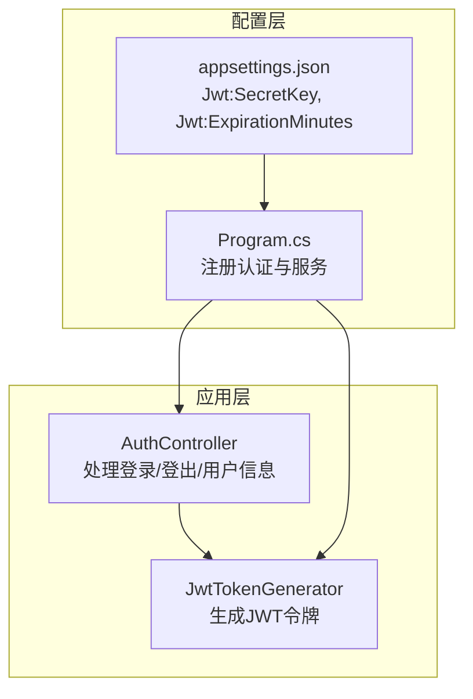
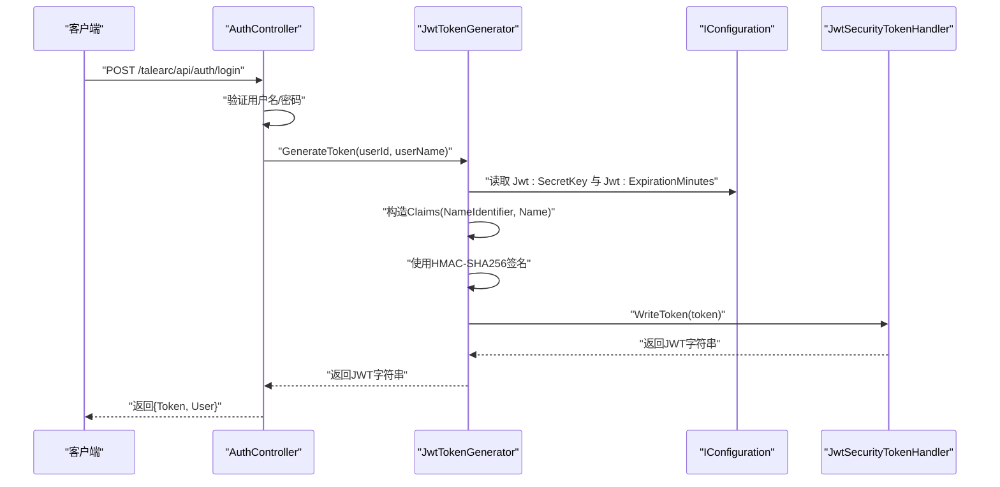
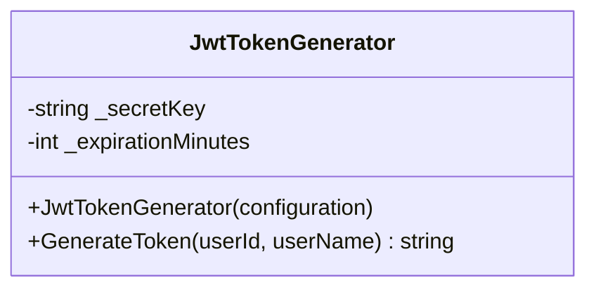
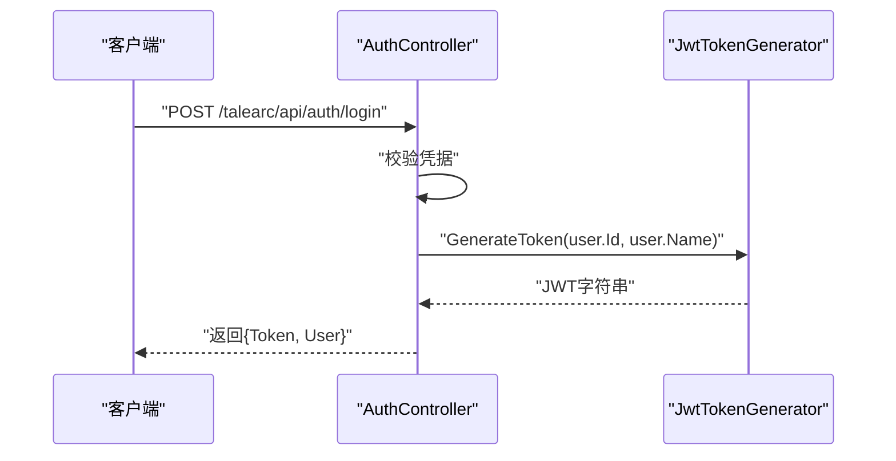
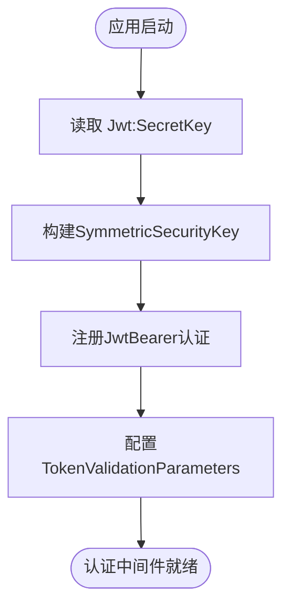
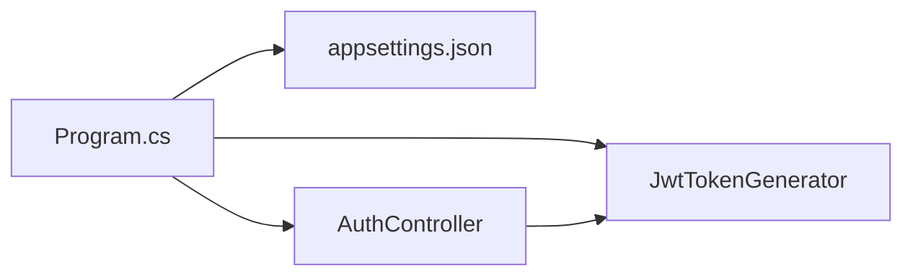

# JWT令牌安全

<cite>
**本文引用的文件**
- [JwtTokenGenerator.cs](file://src/application/service/JwtTokenGenerator.cs)
- [AuthController.cs](file://src/application/controllers/auth/AuthController.cs)
- [appsettings.json](file://appsettings.json)
- [Program.cs](file://Program.cs)
</cite>

## 目录
1. [引言](#引言)
2. [项目结构](#项目结构)
3. [核心组件](#核心组件)
4. [架构总览](#架构总览)
5. [详细组件分析](#详细组件分析)
6. [依赖关系分析](#依赖关系分析)
7. [性能与安全考量](#性能与安全考量)
8. [故障排查指南](#故障排查指南)
9. [结论](#结论)
10. [附录](#附录)

## 引言
本文件围绕 JwtTokenGenerator 类的实现，系统性解析其如何从配置中读取密钥与过期时间、使用 HMAC-SHA256 签名生成 JWT 令牌、令牌中声明（Claims）的作用、issuer 与 audience 的固定值、以及 7 天过期时间对安全与体验的影响。同时指出将 SecretKey 硬编码于配置文件的风险，并给出通过环境变量注入的改进方案；最后结合代码说明令牌生成流程，并建议在生产环境中启用 HTTPS 与 HttpOnly Cookie 存储以提升安全性。

## 项目结构
后端采用分层结构：控制器负责处理请求与响应，服务层封装业务逻辑（如 JWT 令牌生成），配置文件提供运行时参数，程序入口完成认证中间件与服务注册。

图表来源
- [AuthController.cs](file://src/application/controllers/auth/AuthController.cs#L131-L175)
- [JwtTokenGenerator.cs](file://src/application/service/JwtTokenGenerator.cs#L1-L40)
- [appsettings.json](file://appsettings.json#L1-L16)
- [Program.cs](file://Program.cs#L27-L44)

章节来源
- [AuthController.cs](file://src/application/controllers/auth/AuthController.cs#L131-L175)
- [JwtTokenGenerator.cs](file://src/application/service/JwtTokenGenerator.cs#L1-L40)
- [appsettings.json](file://appsettings.json#L1-L16)
- [Program.cs](file://Program.cs#L27-L44)

## 核心组件
- JwtTokenGenerator：负责从 IConfiguration 读取密钥与过期时间，构造 Claims，使用 HMAC-SHA256 签名并输出 JWT 字符串。
- AuthController：在用户登录成功后调用 JwtTokenGenerator 生成令牌，并将令牌与用户信息一并返回。
- Program.cs：注册认证中间件，校验 issuer、audience、签名密钥等；同时在启动阶段读取 Jwt:SecretKey 并构建对称密钥。
- appsettings.json：提供 Jwt:SecretKey 与 Jwt:ExpirationMinutes 的默认值。

章节来源
- [JwtTokenGenerator.cs](file://src/application/service/JwtTokenGenerator.cs#L1-L40)
- [AuthController.cs](file://src/application/controllers/auth/AuthController.cs#L131-L175)
- [Program.cs](file://Program.cs#L27-L44)
- [appsettings.json](file://appsettings.json#L1-L16)

## 架构总览
下图展示登录流程中各组件之间的交互与数据流。

图表来源
- [AuthController.cs](file://src/application/controllers/auth/AuthController.cs#L131-L175)
- [JwtTokenGenerator.cs](file://src/application/service/JwtTokenGenerator.cs#L1-L40)
- [Program.cs](file://Program.cs#L27-L44)

## 详细组件分析

### JwtTokenGenerator 类分析
- 配置读取
  - 从 IConfiguration 中读取 Jwt:SecretKey，若缺失则抛出异常；Jwt:ExpirationMinutes 默认 60 分钟。
  - 安全要求：SecretKey 至少 32 字符，以满足 HMAC-SHA256 的强度需求。
- 声明（Claims）
  - 包含 NameIdentifier（用户标识）与 Name（用户名），用于后续鉴权与用户信息提取。
- 签名与令牌
  - 使用对称密钥与 HMAC-SHA256 算法签名，issuer 固定为 "talearc"，audience 固定为 "talearc-api"。
  - 过期时间由 Jwt:ExpirationMinutes 决定，默认 10080 分钟（7 天）。
- 输出
  - 通过 JwtSecurityTokenHandler 将令牌序列化为字符串返回。

图表来源
- [JwtTokenGenerator.cs](file://src/application/service/JwtTokenGenerator.cs#L1-L40)

章节来源
- [JwtTokenGenerator.cs](file://src/application/service/JwtTokenGenerator.cs#L1-L40)

### AuthController 登录流程分析
- 登录接口接收用户名与密码，验证通过后调用 JwtTokenGenerator 生成令牌。
- 将令牌与用户 DTO 组装为登录响应返回。

图表来源
- [AuthController.cs](file://src/application/controllers/auth/AuthController.cs#L131-L175)
- [JwtTokenGenerator.cs](file://src/application/service/JwtTokenGenerator.cs#L1-L40)

章节来源
- [AuthController.cs](file://src/application/controllers/auth/AuthController.cs#L131-L175)

### 配置与认证参数
- appsettings.json
  - 提供 Jwt:SecretKey 与 Jwt:ExpirationMinutes 的默认值。
- Program.cs
  - 在启动阶段读取 Jwt:SecretKey 并构建对称密钥，注册 JwtBearer 认证。
  - 设置 TokenValidationParameters：
    - ValidateIssuerSigningKey = true
    - IssuerSigningKey = 对称密钥
    - ValidateIssuer = true，ValidIssuer = "talearc"
    - ValidateAudience = true，ValidAudience = "talearc-api"
    - ValidateLifetime = true，ClockSkew = TimeSpan.Zero

图表来源
- [Program.cs](file://Program.cs#L27-L44)
- [appsettings.json](file://appsettings.json#L1-L16)

章节来源
- [Program.cs](file://Program.cs#L27-L44)
- [appsettings.json](file://appsettings.json#L1-L16)

## 依赖关系分析
- JwtTokenGenerator 依赖 IConfiguration 提供的 Jwt:SecretKey 与 Jwt:ExpirationMinutes。
- Program.cs 同时读取 Jwt:SecretKey 用于客户端与服务端一致的密钥校验。
- AuthController 依赖 JwtTokenGenerator 生成令牌。

图表来源
- [Program.cs](file://Program.cs#L27-L44)
- [JwtTokenGenerator.cs](file://src/application/service/JwtTokenGenerator.cs#L1-L40)
- [AuthController.cs](file://src/application/controllers/auth/AuthController.cs#L131-L175)
- [appsettings.json](file://appsettings.json#L1-L16)

章节来源
- [Program.cs](file://Program.cs#L27-L44)
- [JwtTokenGenerator.cs](file://src/application/service/JwtTokenGenerator.cs#L1-L40)
- [AuthController.cs](file://src/application/controllers/auth/AuthController.cs#L131-L175)
- [appsettings.json](file://appsettings.json#L1-L16)

## 性能与安全考量

### 密钥长度与算法强度
- JwtTokenGenerator 使用 HMAC-SHA256 签名，需要足够强度的对称密钥以抵御暴力破解与侧信道攻击。
- appsettings.json 中示例密钥长度满足“至少 32 字符”的要求，建议在生产环境通过环境变量注入更长且随机的密钥。

章节来源
- [JwtTokenGenerator.cs](file://src/application/service/JwtTokenGenerator.cs#L1-L40)
- [appsettings.json](file://appsettings.json#L1-L16)

### 过期时间权衡（7 天）
- 默认过期时间为 10080 分钟（7 天），可显著提升用户体验（减少频繁登录），但会增加令牌泄露后的潜在暴露窗口。
- 建议：
  - 采用短期令牌（如 15-60 分钟）+ 刷新令牌机制，刷新令牌仅在安全通道与严格限制下发放。
  - 对高敏感操作（如修改密码、删除账户）强制二次验证或短时效令牌。

章节来源
- [JwtTokenGenerator.cs](file://src/application/service/JwtTokenGenerator.cs#L1-L40)
- [appsettings.json](file://appsettings.json#L1-L16)

### issuer 与 audience 固定值
- 服务端与客户端均固定为 "talearc" 与 "talearc-api"，有助于防止跨域或跨服务的令牌滥用。
- 若部署多租户或多域名场景，应考虑动态配置或基于环境的差异化值。

章节来源
- [JwtTokenGenerator.cs](file://src/application/service/JwtTokenGenerator.cs#L1-L40)
- [Program.cs](file://Program.cs#L33-L43)

### SecretKey 硬编码风险与改进
- 当前 SecretKey 硬编码于 appsettings.json，存在泄露风险（版本库、备份、日志等）。
- 改进建议：
  - 使用环境变量注入（如 Jwt__SecretKey），在容器或平台密钥管理服务中存放。
  - 启动时校验环境变量是否存在，缺失则拒绝启动。
  - 对密钥轮换建立自动化流程，避免手动更新带来的不一致。

章节来源
- [appsettings.json](file://appsettings.json#L1-L16)
- [Program.cs](file://Program.cs#L27-L33)

### 传输与存储安全建议
- 传输安全：生产环境必须启用 HTTPS，防止令牌在传输过程中被窃听或篡改。
- 存储安全：建议将令牌存储于 HttpOnly Cookie 中，降低 XSS 攻击导致的令牌泄露风险；同时配合 SameSite 与 Secure 标志进一步加固。
- 令牌撤销：在退出登录时使 Cookie 失效或服务端维护黑名单（短期令牌更易撤销）。

章节来源
- [AuthController.cs](file://src/application/controllers/auth/AuthController.cs#L131-L175)
- [Program.cs](file://Program.cs#L100-L106)

## 故障排查指南
- 缺少 Jwt:SecretKey 配置
  - 现象：应用启动时报错，提示未配置 Jwt:SecretKey。
  - 排查：检查 appsettings.json 或环境变量是否正确设置。
  - 参考路径：[Program.cs](file://Program.cs#L27-L28)
- 令牌签名校验失败
  - 现象：客户端收到 401/403，服务端日志显示签名或 issuer/audience 不匹配。
  - 排查：确认服务端与客户端使用相同 SecretKey；核对 issuer/audience 是否为 "talearc"/"talearc-api"。
  - 参考路径：[Program.cs](file://Program.cs#L33-L43)
- 令牌过期或时间偏差
  - 现象：令牌很快失效或出现时间漂移导致验证失败。
  - 排查：检查服务器时间同步；确认 ClockSkew 设置为 TimeSpan.Zero 时无容差。
  - 参考路径：[Program.cs](file://Program.cs#L33-L43)
- 登录后无法获取用户信息
  - 现象：调用受保护接口返回 401。
  - 排查：确认前端携带 Bearer 令牌；检查 Claims 中 NameIdentifier 是否有效。
  - 参考路径：[AuthController.cs](file://src/application/controllers/auth/AuthController.cs#L188-L195)

章节来源
- [Program.cs](file://Program.cs#L27-L44)
- [AuthController.cs](file://src/application/controllers/auth/AuthController.cs#L188-L195)

## 结论
JwtTokenGenerator 通过 HMAC-SHA256 对称签名实现了安全的令牌生成，结合固定 issuer/audience 与严格的验证参数，能够有效防止令牌滥用。默认 7 天过期时间提升了用户体验，但需配合刷新令牌与高敏感操作二次验证以平衡安全。当前 SecretKey 硬编码于配置文件存在风险，建议通过环境变量注入与平台密钥管理服务强化密钥安全。生产环境务必启用 HTTPS 与 HttpOnly Cookie 存储令牌，降低 XSS 与中间人攻击风险。

## 附录

### 令牌生成流程（代码级）
- 读取配置：从 IConfiguration 读取 Jwt:SecretKey 与 Jwt:ExpirationMinutes。
- 构造密钥与凭据：将 SecretKey 转换为对称密钥并指定 HMAC-SHA256。
- 构造声明：添加 NameIdentifier 与 Name。
- 创建令牌：设置 issuer/audience/过期时间/签名凭据。
- 序列化输出：使用 JwtSecurityTokenHandler 写入为字符串。

章节来源
- [JwtTokenGenerator.cs](file://src/application/service/JwtTokenGenerator.cs#L1-L40)