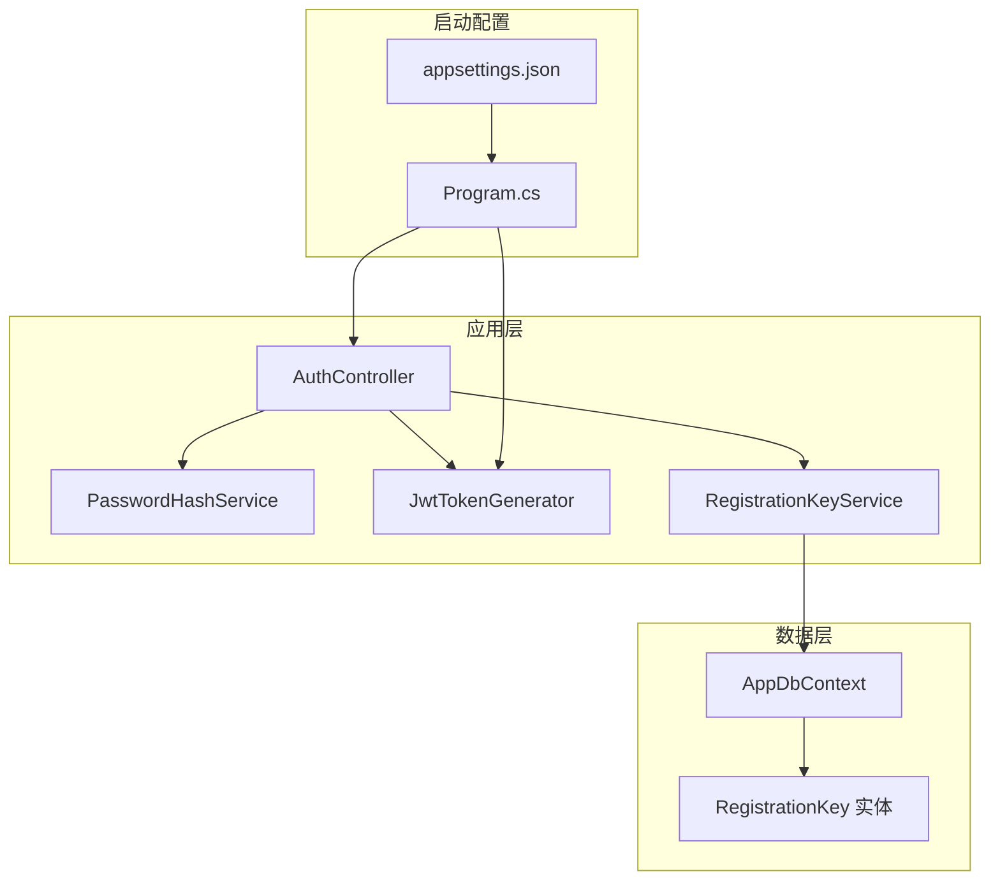
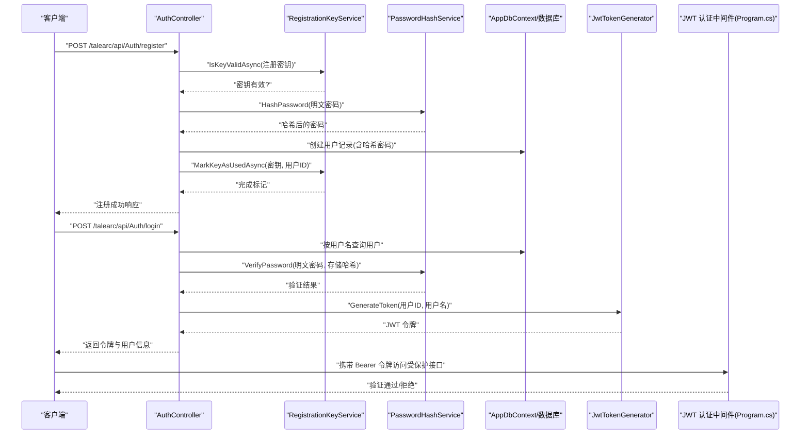
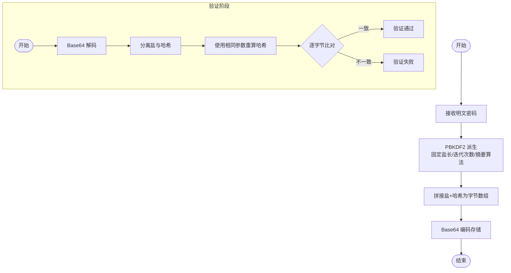
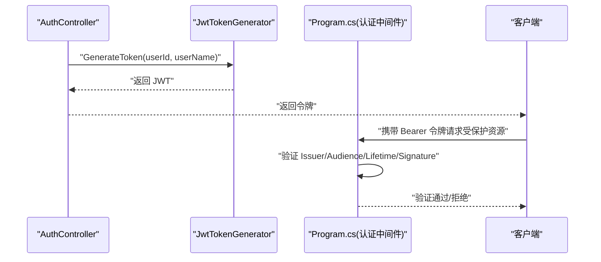
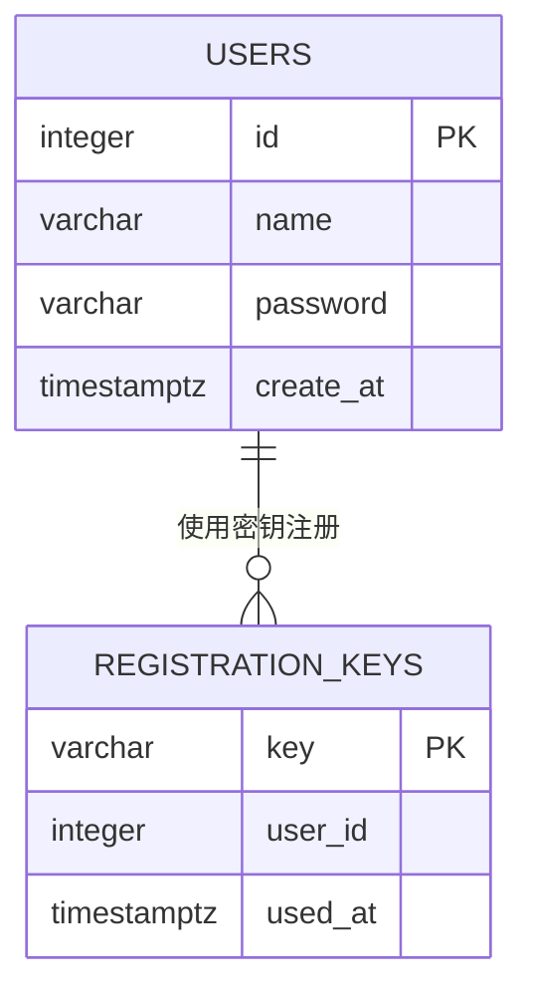
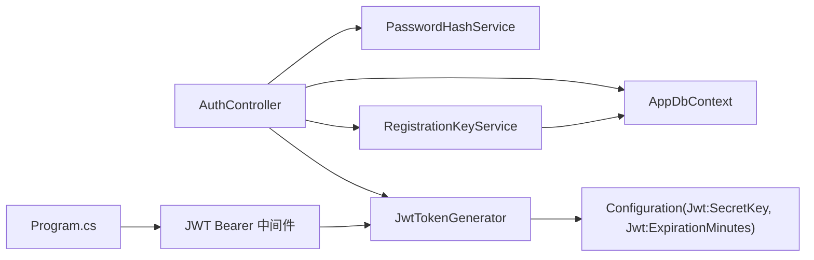

# 安全性设计

<cite>
**本文引用的文件**
- [Program.cs](file://Program.cs)
- [appsettings.json](file://appsettings.json)
- [AuthController.cs](file://src/application/controllers/auth/AuthController.cs)
- [PasswordHashService.cs](file://src/application/service/PasswordHashService.cs)
- [JwtTokenGenerator.cs](file://src/application/service/JwtTokenGenerator.cs)
- [RegistrationKeyService.cs](file://src/application/service/RegistrationKeyService.cs)
- [RegistrationKey.cs](file://src/data/entities/RegistrationKey.cs)
- [AppDbContext.cs](file://src/data/AppDbContext.cs)
- [20251217055145_AddRegistrationKeyTable.cs](file://Migrations/20251217055145_AddRegistrationKeyTable.cs)
</cite>

## 目录
1. [引言](#引言)
2. [项目结构与安全相关模块](#项目结构与安全相关模块)
3. [核心安全组件](#核心安全组件)
4. [架构总览](#架构总览)
5. [详细组件分析](#详细组件分析)
6. [依赖关系分析](#依赖关系分析)
7. [性能与安全权衡](#性能与安全权衡)
8. [故障排查指南](#故障排查指南)
9. [结论](#结论)
10. [附录：安全检查清单](#附录安全检查清单)

## 引言
本文件系统性阐述本项目的认证与授权安全机制，重点覆盖以下方面：
- 密码安全：PasswordHashService 如何使用加盐的 PBKDF2（Rfc2898DeriveBytes）算法对密码进行哈希存储，确保即便数据库泄露，攻击者也难以还原明文密码。
- JWT 安全：JwtTokenGenerator 生成的令牌通过 HMAC-SHA256 签名，结合服务端严格验证参数（签发方、受众、有效期），有效防止令牌篡改；同时强调 appsettings.json 中 SecretKey 的保密性与配置方式。
- 注册密钥机制：RegistrationKeyService 与 RegistrationKey 实体配合，作为“邀请制”注册的第一道防线，限制任意用户注册。
- 安全最佳实践：SecretKey 应通过环境变量配置而非硬编码、使用 HTTPS 传输 Token、设置合理 Token 过期时间、最小权限原则等。
- 安全检查清单：为开发者提供可执行的安全自检步骤。

## 项目结构与安全相关模块
本项目采用分层架构，安全相关逻辑主要集中在应用层的服务组件与控制器中，并通过 Entity Framework Core 访问数据库。关键安全模块如下：
- 应用层服务：PasswordHashService、JwtTokenGenerator、RegistrationKeyService
- 控制器：AuthController（负责注册、登录、用户信息查询）
- 数据层：AppDbContext、RegistrationKey 实体、迁移脚本
- 启动配置：Program.cs（JWT 认证配置、HTTPS、中间件）

图表来源
- [Program.cs](file://Program.cs#L24-L44)
- [AuthController.cs](file://src/application/controllers/auth/AuthController.cs#L62-L74)
- [PasswordHashService.cs](file://src/application/service/PasswordHashService.cs#L12-L25)
- [JwtTokenGenerator.cs](file://src/application/service/JwtTokenGenerator.cs#L13-L39)
- [RegistrationKeyService.cs](file://src/application/service/RegistrationKeyService.cs#L12-L37)
- [AppDbContext.cs](file://src/data/AppDbContext.cs#L10-L16)
- [RegistrationKey.cs](file://src/data/entities/RegistrationKey.cs#L11-L31)
- [20251217055145_AddRegistrationKeyTable.cs](file://Migrations/20251217055145_AddRegistrationKeyTable.cs#L14-L25)
- [appsettings.json](file://appsettings.json#L1-L16)

章节来源
- [Program.cs](file://Program.cs#L24-L44)
- [AuthController.cs](file://src/application/controllers/auth/AuthController.cs#L62-L74)
- [AppDbContext.cs](file://src/data/AppDbContext.cs#L10-L16)

## 核心安全组件
- 密码哈希服务 PasswordHashService：使用 PBKDF2（Rfc2898DeriveBytes）进行加盐哈希，迭代次数、盐长度、哈希长度均固定，便于验证与扩展。
- JWT 令牌生成器 JwtTokenGenerator：基于对称密钥（HMAC-SHA256）生成签名令牌，支持配置过期时间。
- 注册密钥服务 RegistrationKeyService：校验注册密钥是否有效且未被使用，使用后标记为已用并绑定用户。
- 认证与授权：Program.cs 中启用 JWT Bearer 认证，严格校验签发方、受众、有效期与签名密钥。

章节来源
- [PasswordHashService.cs](file://src/application/service/PasswordHashService.cs#L12-L25)
- [JwtTokenGenerator.cs](file://src/application/service/JwtTokenGenerator.cs#L13-L39)
- [RegistrationKeyService.cs](file://src/application/service/RegistrationKeyService.cs#L12-L37)
- [Program.cs](file://Program.cs#L30-L44)

## 架构总览
下图展示从客户端到服务端的关键交互路径，以及安全控制点（密码哈希、JWT 签名、注册密钥校验、认证中间件）：

图表来源
- [AuthController.cs](file://src/application/controllers/auth/AuthController.cs#L83-L129)
- [AuthController.cs](file://src/application/controllers/auth/AuthController.cs#L139-L175)
- [RegistrationKeyService.cs](file://src/application/service/RegistrationKeyService.cs#L12-L37)
- [PasswordHashService.cs](file://src/application/service/PasswordHashService.cs#L27-L52)
- [JwtTokenGenerator.cs](file://src/application/service/JwtTokenGenerator.cs#L19-L39)
- [Program.cs](file://Program.cs#L30-L44)

## 详细组件分析

### 密码安全：PBKDF2 加盐哈希
- 哈希算法与参数
  - 使用 PBKDF2（Rfc2898DeriveBytes），SHA-256 摘要算法，固定迭代次数与盐长度，保证计算成本与一致性。
  - 生成的哈希字节包含前部 16 字节盐与 32 字节哈希值，统一编码为 Base64 存储。
- 验证流程
  - 从存储的 Base64 解码得到盐与哈希，使用相同盐与迭代次数重新派生哈希，逐字节比对，避免时序攻击风险。
- 安全收益
  - 即便数据库泄露，攻击者需要针对每个用户单独破解，成本极高；碰撞与彩虹表攻击效果有限。
- 可优化建议
  - 随着硬件性能提升，可逐步提高迭代次数以维持安全强度。
  - 对于高敏感场景，可考虑引入随机化工作因子（如 bcrypt/scrypt）以进一步提升抗 GPU 攻击能力。

图表来源
- [PasswordHashService.cs](file://src/application/service/PasswordHashService.cs#L12-L25)
- [PasswordHashService.cs](file://src/application/service/PasswordHashService.cs#L27-L52)

章节来源
- [PasswordHashService.cs](file://src/application/service/PasswordHashService.cs#L12-L25)
- [PasswordHashService.cs](file://src/application/service/PasswordHashService.cs#L27-L52)

### JWT 安全：HMAC-SHA256 签名与验证
- 令牌生成
  - 基于对称密钥（HMAC-SHA256）生成签名，包含标准声明（用户标识、用户名），设置过期时间（分钟级）。
- 服务端验证
  - Program.cs 中启用 JWT Bearer 认证，严格校验：
    - IssuerSigningKey（对称密钥）
    - ValidIssuer/ValidAudience
    - ValidateLifetime（有效期）
    - ClockSkew 设为零，确保严格时效控制
- 安全要点
  - SecretKey 必须保密，且不应硬编码在配置文件中；推荐通过环境变量注入。
  - Token 仅在 HTTPS 下传输，防止中间人窃听与重放。
  - 设置合理的过期时间，结合刷新令牌策略（如需）实现更细粒度的生命周期管理。

图表来源
- [JwtTokenGenerator.cs](file://src/application/service/JwtTokenGenerator.cs#L19-L39)
- [Program.cs](file://Program.cs#L30-L44)
- [AuthController.cs](file://src/application/controllers/auth/AuthController.cs#L156-L168)

章节来源
- [JwtTokenGenerator.cs](file://src/application/service/JwtTokenGenerator.cs#L13-L39)
- [Program.cs](file://Program.cs#L30-L44)

### 注册密钥机制：第一道防线
- 密钥有效性校验
  - RegistrationKeyService 查询数据库，确认密钥存在且未被使用（UserId 为空）。
- 密钥使用标记
  - 注册成功后，将密钥绑定到新用户 ID，并记录使用时间，防止重复使用。
- 数据模型与迁移
  - RegistrationKey 实体包含键值、使用者 ID、使用时间；迁移脚本创建对应表并建立主键约束。

图表来源
- [RegistrationKey.cs](file://src/data/entities/RegistrationKey.cs#L11-L31)
- [20251217055145_AddRegistrationKeyTable.cs](file://Migrations/20251217055145_AddRegistrationKeyTable.cs#L14-L25)
- [AppDbContext.cs](file://src/data/AppDbContext.cs#L16-L16)

章节来源
- [RegistrationKeyService.cs](file://src/application/service/RegistrationKeyService.cs#L12-L37)
- [RegistrationKey.cs](file://src/data/entities/RegistrationKey.cs#L11-L31)
- [20251217055145_AddRegistrationKeyTable.cs](file://Migrations/20251217055145_AddRegistrationKeyTable.cs#L14-L25)

### 控制器与安全控制点
- 注册流程
  - 先校验注册密钥，再检查用户名唯一性，随后对密码进行哈希存储，最后标记密钥为已使用。
- 登录流程
  - 按用户名查找用户，使用 PasswordHashService 验证密码，成功后生成 JWT 返回。
- 授权访问
  - 受保护接口使用 [Authorize] 装饰，依赖 Program.cs 中的 JWT 认证中间件进行统一验证。

章节来源
- [AuthController.cs](file://src/application/controllers/auth/AuthController.cs#L83-L129)
- [AuthController.cs](file://src/application/controllers/auth/AuthController.cs#L139-L175)
- [Program.cs](file://Program.cs#L100-L106)

## 依赖关系分析
- 组件耦合
  - AuthController 依赖 PasswordHashService、JwtTokenGenerator、RegistrationKeyService 与 AppDbContext。
  - JwtTokenGenerator 依赖 IConfiguration（读取 Jwt:SecretKey 与 Jwt:ExpirationMinutes）。
  - RegistrationKeyService 依赖 AppDbContext 与日志器。
- 外部依赖
  - Microsoft IdentityModel.Tokens（JWT 签名与验证）
  - Microsoft.AspNetCore.Authentication.JwtBearer（JWT Bearer 认证）
  - Npgsql EF Core Provider（数据库访问）
- 潜在风险
  - SecretKey 配置不当（硬编码、未加密存储）会直接导致令牌伪造风险。
  - 缺少 HTTPS 将导致令牌在网络传输中暴露，易被窃取。

图表来源
- [AuthController.cs](file://src/application/controllers/auth/AuthController.cs#L62-L74)
- [JwtTokenGenerator.cs](file://src/application/service/JwtTokenGenerator.cs#L13-L17)
- [Program.cs](file://Program.cs#L30-L44)

章节来源
- [AuthController.cs](file://src/application/controllers/auth/AuthController.cs#L62-L74)
- [JwtTokenGenerator.cs](file://src/application/service/JwtTokenGenerator.cs#L13-L17)
- [Program.cs](file://Program.cs#L30-L44)

## 性能与安全权衡
- PBKDF2 迭代次数
  - 当前固定迭代次数在安全性与性能之间取得平衡；随着硬件升级，应逐步提高迭代次数以保持同等安全强度。
- JWT 过期时间
  - 短过期时间提升安全性但增加刷新频率；可通过刷新令牌策略缓解用户体验。
- 数据库访问
  - 注册密钥查询与用户查询均为单表简单条件查询，性能开销较低；建议在密钥字段上建立索引以提升校验效率。

[本节为通用指导，无需列出具体文件来源]

## 故障排查指南
- 登录失败
  - 检查用户名是否存在，确认 PasswordHashService 验证逻辑是否正确执行。
  - 查看控制器日志输出，定位错误原因（用户名或密码错误）。
- 注册失败
  - 确认注册密钥是否有效且未被使用；查看 RegistrationKeyService 的标记流程是否成功写入数据库。
  - 检查用户名唯一性约束是否触发。
- JWT 无法通过验证
  - 确认 SecretKey 是否正确配置且与生成端一致；检查 Issuer/Audience/过期时间是否匹配。
  - 确保请求通过 HTTPS 发送，避免令牌在传输中被截获。
- 数据库连接问题
  - 检查连接字符串配置与数据库可达性；确认迁移脚本已执行，注册密钥表存在。

章节来源
- [AuthController.cs](file://src/application/controllers/auth/AuthController.cs#L146-L155)
- [AuthController.cs](file://src/application/controllers/auth/AuthController.cs#L91-L104)
- [RegistrationKeyService.cs](file://src/application/service/RegistrationKeyService.cs#L12-L37)
- [Program.cs](file://Program.cs#L30-L44)

## 结论
本项目在密码存储、令牌签名与注册控制三方面形成了较为完整的安全闭环：
- 密码采用 PBKDF2 加盐哈希，显著提升数据库泄露场景下的防护能力；
- JWT 使用 HMAC-SHA256 签名并配合严格的验证参数，有效防止篡改；
- 注册密钥机制作为第一道防线，限制了任意注册行为；
- 通过 HTTPS、合理过期时间与最小权限原则，进一步强化整体安全。

建议持续改进方向：将 SecretKey 从配置文件迁移到环境变量，定期轮换密钥，监控异常登录与注册行为，并根据业务需求完善刷新令牌与多因素认证策略。

[本节为总结性内容，无需列出具体文件来源]

## 附录：安全检查清单
- 配置与部署
  - SecretKey 是否通过环境变量注入，不在配置文件中硬编码？
  - 是否启用 HTTPS 并强制重定向至 HTTPS？
  - 是否限制允许的主机与来源（AllowedHosts/反向代理）？
- 认证与授权
  - 是否启用 JWT Bearer 认证并严格校验 Issuer、Audience、有效期？
  - 是否对受保护接口添加 [Authorize] 装饰？
  - 是否设置合理的 Token 过期时间？是否考虑刷新令牌策略？
- 密码与密钥
  - 是否使用 PBKDF2 或更高强度的密码哈希算法？
  - 是否对盐与迭代次数进行适当配置并随硬件升级调整？
  - 是否定期轮换 SecretKey 并清理历史密钥？
- 注册与访问控制
  - 是否启用注册密钥机制并确保密钥不可复用？
  - 是否对用户名唯一性与输入合法性进行严格校验？
- 日志与监控
  - 是否记录登录/注册失败事件并进行告警？
  - 是否对异常访问模式（频繁失败、异常 IP）进行检测？

[本节为通用指导，无需列出具体文件来源]