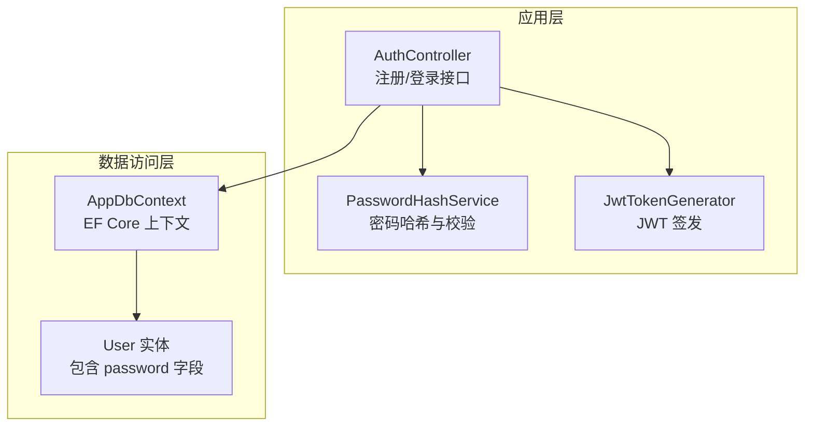
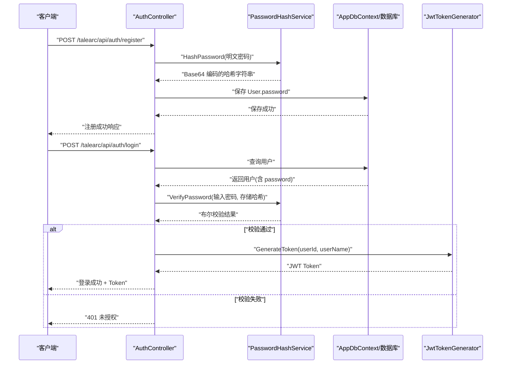
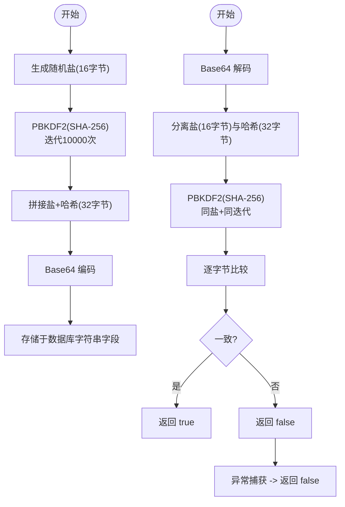
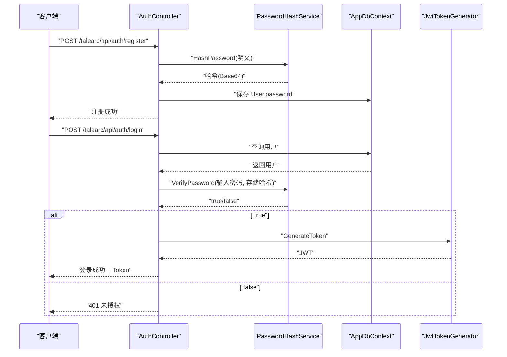
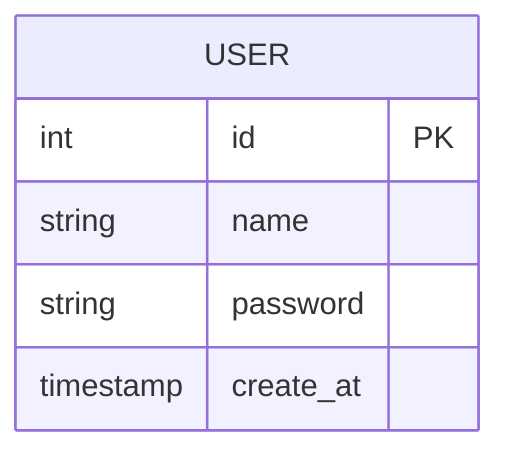
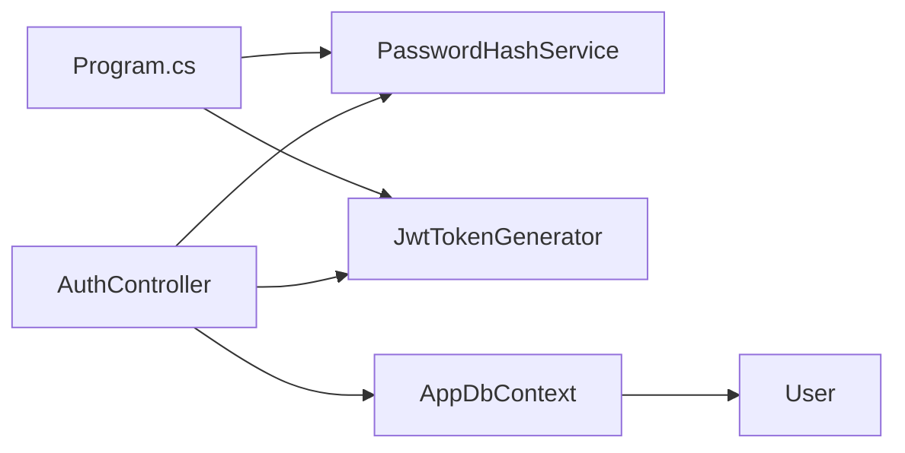

# 密码安全机制

<cite>
**本文引用的文件**
- [PasswordHashService.cs](file://src/application/service/PasswordHashService.cs)
- [AuthController.cs](file://src/application/controllers/auth/AuthController.cs)
- [User.cs](file://src/data/entities/User.cs)
- [AppDbContext.cs](file://src/data/AppDbContext.cs)
- [JwtTokenGenerator.cs](file://src/application/service/JwtTokenGenerator.cs)
- [Program.cs](file://Program.cs)
- [appsettings.json](file://appsettings.json)
</cite>

## 目录
1. [引言](#引言)
2. [项目结构](#项目结构)
3. [核心组件](#核心组件)
4. [架构总览](#架构总览)
5. [详细组件分析](#详细组件分析)
6. [依赖关系分析](#依赖关系分析)
7. [性能考量](#性能考量)
8. [故障排查指南](#故障排查指南)
9. [结论](#结论)
10. [附录](#附录)

## 引言
本文件围绕 PasswordHashService 如何通过 PBKDF2 算法实现安全的密码存储进行系统化说明。重点解释以下方面：
- 使用 Rfc2898DeriveBytes 生成加盐哈希的过程与参数选择（盐长度 16 字节、哈希长度 32 字节、迭代次数 10000 次）的安全意义；
- HashPassword 方法将盐与哈希拼接并以 Base64 存储的设计；
- VerifyPassword 方法的逐字节安全比对与异常捕获，防止信息泄露与时序攻击；
- 结合代码路径展示密码哈希的生成与验证流程；
- 数据库泄露场景下，攻击者难以通过彩虹表破解用户密码的原因；
- 迭代次数调优建议与未来可扩展支持 Argon2 等更先进算法的方向。

## 项目结构
本项目的密码安全相关代码集中在应用层服务与数据访问层之间，采用分层架构：
- 应用层：PasswordHashService 负责密码哈希与校验；AuthController 调用该服务完成注册与登录流程；JwtTokenGenerator 负责签发 JWT；
- 数据访问层：AppDbContext 定义数据库上下文；User 实体包含 password 字段用于持久化；
- 启动配置：Program.cs 注册 PasswordHashService、JwtTokenGenerator 等服务；appsettings.json 提供 JWT 密钥与连接字符串。

图表来源
- [AuthController.cs](file://src/application/controllers/auth/AuthController.cs#L62-L175)
- [PasswordHashService.cs](file://src/application/service/PasswordHashService.cs#L12-L52)
- [JwtTokenGenerator.cs](file://src/application/service/JwtTokenGenerator.cs#L1-L40)
- [AppDbContext.cs](file://src/data/AppDbContext.cs#L1-L26)
- [User.cs](file://src/data/entities/User.cs#L1-L40)

章节来源
- [Program.cs](file://Program.cs#L24-L49)
- [appsettings.json](file://appsettings.json#L1-L16)

## 核心组件
- PasswordHashService：提供 HashPassword 与 VerifyPassword 两个关键方法，基于 PBKDF2（Rfc2898DeriveBytes）实现加盐哈希与安全比对。
- AuthController：在注册时调用 HashPassword 将明文密码转换为哈希并保存；在登录时调用 VerifyPassword 对比输入密码与存储哈希。
- User 实体：password 字段用于持久化存储哈希后的密码。
- AppDbContext：定义 Users 表，承载 User 实体的数据访问。
- JwtTokenGenerator：在登录成功后签发 JWT，作为后续会话凭证。

章节来源
- [PasswordHashService.cs](file://src/application/service/PasswordHashService.cs#L12-L52)
- [AuthController.cs](file://src/application/controllers/auth/AuthController.cs#L82-L175)
- [User.cs](file://src/data/entities/User.cs#L27-L33)
- [AppDbContext.cs](file://src/data/AppDbContext.cs#L10-L17)
- [JwtTokenGenerator.cs](file://src/application/service/JwtTokenGenerator.cs#L1-L40)

## 架构总览
下图展示了从客户端请求到数据库存储与 JWT 返回的整体流程，以及 PasswordHashService 在其中的关键作用。

图表来源
- [AuthController.cs](file://src/application/controllers/auth/AuthController.cs#L82-L175)
- [PasswordHashService.cs](file://src/application/service/PasswordHashService.cs#L12-L52)
- [JwtTokenGenerator.cs](file://src/application/service/JwtTokenGenerator.cs#L19-L39)
- [User.cs](file://src/data/entities/User.cs#L27-L33)
- [AppDbContext.cs](file://src/data/AppDbContext.cs#L10-L17)

## 详细组件分析

### PasswordHashService 组件分析
- 参数与常量
  - 盐长度：16 字节（足够抵御碰撞与彩虹表）
  - 哈希长度：32 字节（SHA-256 输出长度，满足现代安全强度）
  - 迭代次数：10000 次（在通用硬件上平衡安全性与性能）
- HashPassword 流程
  - 使用 Rfc2898DeriveBytes(password, salt, iterations, SHA256) 生成盐与哈希；
  - 将盐与哈希拼接为固定长度字节数组；
  - 以 Base64 编码存储，便于数据库字符串字段保存。
- VerifyPassword 流程
  - Base64 解码存储的哈希字符串；
  - 从解码字节中提取盐；
  - 使用相同盐与迭代次数重新计算哈希；
  - 逐字节比较，避免短路判断导致时序泄漏；
  - 捕获异常并统一返回 false，防止异常信息泄露。

图表来源
- [PasswordHashService.cs](file://src/application/service/PasswordHashService.cs#L12-L52)

章节来源
- [PasswordHashService.cs](file://src/application/service/PasswordHashService.cs#L8-L11)
- [PasswordHashService.cs](file://src/application/service/PasswordHashService.cs#L12-L25)
- [PasswordHashService.cs](file://src/application/service/PasswordHashService.cs#L27-L52)

### AuthController 中的密码处理
- 注册流程：调用 PasswordHashService.HashPassword 生成哈希，写入 User.password 字段。
- 登录流程：从数据库读取用户记录，调用 PasswordHashService.VerifyPassword 对比输入密码与存储哈希，成功则签发 JWT。

图表来源
- [AuthController.cs](file://src/application/controllers/auth/AuthController.cs#L82-L175)
- [PasswordHashService.cs](file://src/application/service/PasswordHashService.cs#L12-L52)
- [JwtTokenGenerator.cs](file://src/application/service/JwtTokenGenerator.cs#L19-L39)
- [User.cs](file://src/data/entities/User.cs#L27-L33)
- [AppDbContext.cs](file://src/data/AppDbContext.cs#L10-L17)

章节来源
- [AuthController.cs](file://src/application/controllers/auth/AuthController.cs#L82-L175)

### 数据模型与存储
- User 实体的 password 字段类型为字符串，最大长度 255，足以容纳 Base64 编码后的盐+哈希组合（约 48 字符）。
- AppDbContext 定义 Users 表，User 实体映射到数据库表。

图表来源
- [User.cs](file://src/data/entities/User.cs#L1-L40)
- [AppDbContext.cs](file://src/data/AppDbContext.cs#L10-L17)

章节来源
- [User.cs](file://src/data/entities/User.cs#L27-L33)
- [AppDbContext.cs](file://src/data/AppDbContext.cs#L10-L17)

## 依赖关系分析
- PasswordHashService 由 AuthController 依赖注入使用，确保单一职责与可测试性；
- Program.cs 注册 PasswordHashService、JwtTokenGenerator、RegistrationKeyService 等服务；
- appsettings.json 提供 JWT 密钥与数据库连接字符串，支撑运行时配置。

图表来源
- [Program.cs](file://Program.cs#L46-L49)
- [AuthController.cs](file://src/application/controllers/auth/AuthController.cs#L62-L74)
- [PasswordHashService.cs](file://src/application/service/PasswordHashService.cs#L12-L52)
- [JwtTokenGenerator.cs](file://src/application/service/JwtTokenGenerator.cs#L1-L40)
- [AppDbContext.cs](file://src/data/AppDbContext.cs#L10-L17)
- [User.cs](file://src/data/entities/User.cs#L1-L40)

章节来源
- [Program.cs](file://Program.cs#L24-L49)

## 性能考量
- 迭代次数 10000 次在通用服务器上可提供良好安全与性能平衡。若硬件资源充裕，可逐步提升至更高值（例如 50000 或更高），以进一步增加暴力破解成本。
- Base64 编码与解码开销极低，对整体性能影响可忽略。
- 建议定期评估服务器 CPU 负载与登录延迟阈值，动态调整迭代次数以维持用户体验与安全性的平衡。

## 故障排查指南
- 登录失败但日志显示“用户名或密码错误”：检查 VerifyPassword 是否返回 false，确认数据库中存储的哈希是否为正确的 Base64 字符串。
- 注册后无法登录：确认注册流程确实调用了 HashPassword 并将返回值写入 User.password。
- 异常导致登录失败：VerifyPassword 内部捕获异常并返回 false，避免异常信息泄露。若频繁出现异常，检查数据库连接、字段长度与编码一致性。
- JWT 无效：确认 appsettings.json 中 Jwt:SecretKey 配置正确且与 Program.cs 中读取一致。

章节来源
- [AuthController.cs](file://src/application/controllers/auth/AuthController.cs#L131-L175)
- [PasswordHashService.cs](file://src/application/service/PasswordHashService.cs#L27-L52)
- [appsettings.json](file://appsettings.json#L1-L16)
- [Program.cs](file://Program.cs#L27-L44)

## 结论
PasswordHashService 通过 PBKDF2（Rfc2898DeriveBytes）实现了高安全性的密码存储方案：
- 使用 16 字节盐与 32 字节哈希，配合 10000 次迭代，有效抵御彩虹表与暴力破解；
- 将盐与哈希拼接并以 Base64 存储，结构简单且兼容字符串字段；
- VerifyPassword 的逐字节比较与异常捕获，显著降低时序攻击与信息泄露风险；
- 即使数据库泄露，攻击者也难以直接还原明文密码。

未来可扩展方向：
- 迭代次数应随硬件能力与安全需求持续提升；
- 可考虑引入 Argon2 等更先进的内存硬函数作为替代或并行方案；
- 在服务层抽象出 IPasswordHasher 接口，便于平滑迁移不同算法。

## 附录
- 代码路径参考
  - [PasswordHashService.HashPassword](file://src/application/service/PasswordHashService.cs#L12-L25)
  - [PasswordHashService.VerifyPassword](file://src/application/service/PasswordHashService.cs#L27-L52)
  - [AuthController.Register](file://src/application/controllers/auth/AuthController.cs#L82-L129)
  - [AuthController.Login](file://src/application/controllers/auth/AuthController.cs#L131-L175)
  - [User.password 字段](file://src/data/entities/User.cs#L27-L33)
  - [AppDbContext.Users](file://src/data/AppDbContext.cs#L10-L17)
  - [JwtTokenGenerator.GenerateToken](file://src/application/service/JwtTokenGenerator.cs#L19-L39)
  - [Program.cs 服务注册](file://Program.cs#L46-L49)
  - [appsettings.json 配置](file://appsettings.json#L1-L16)