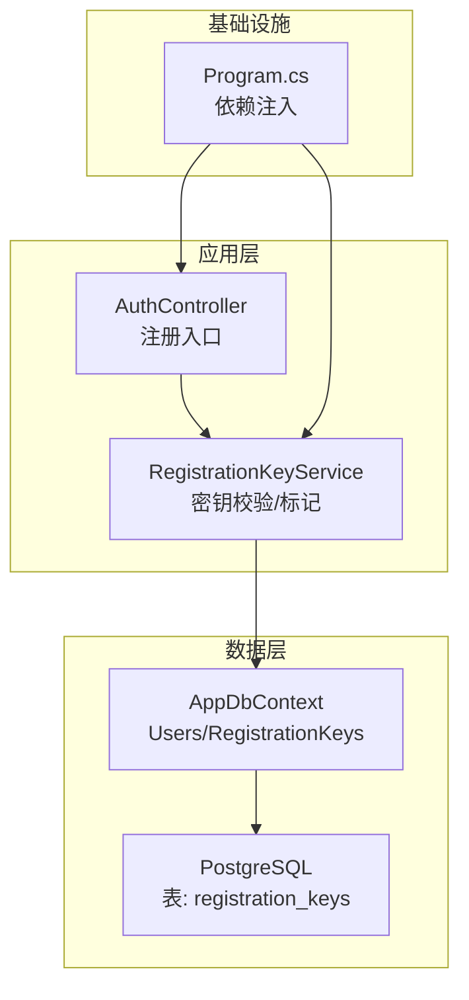
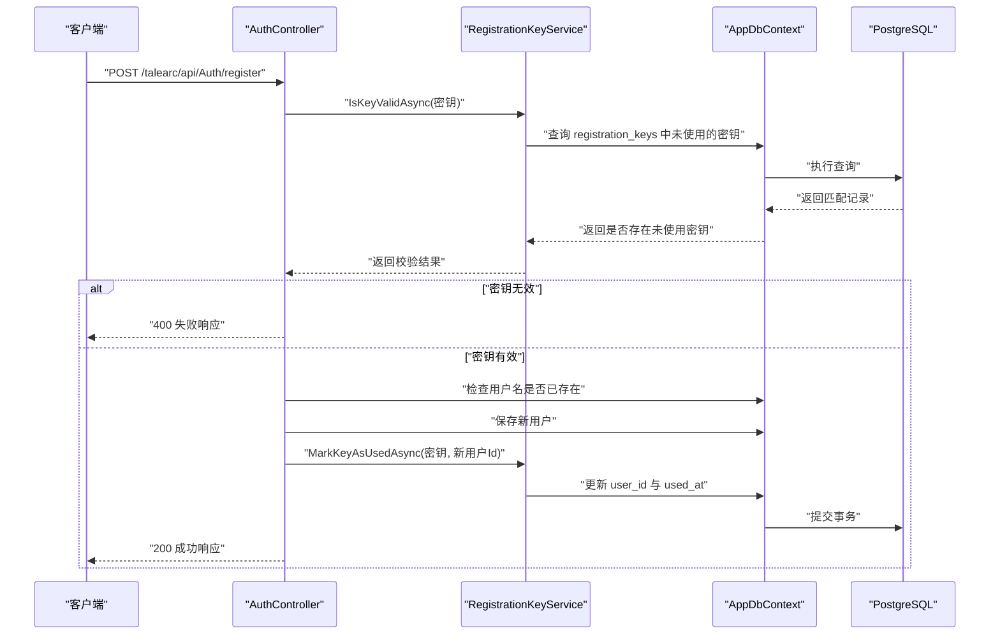
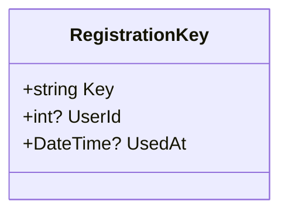
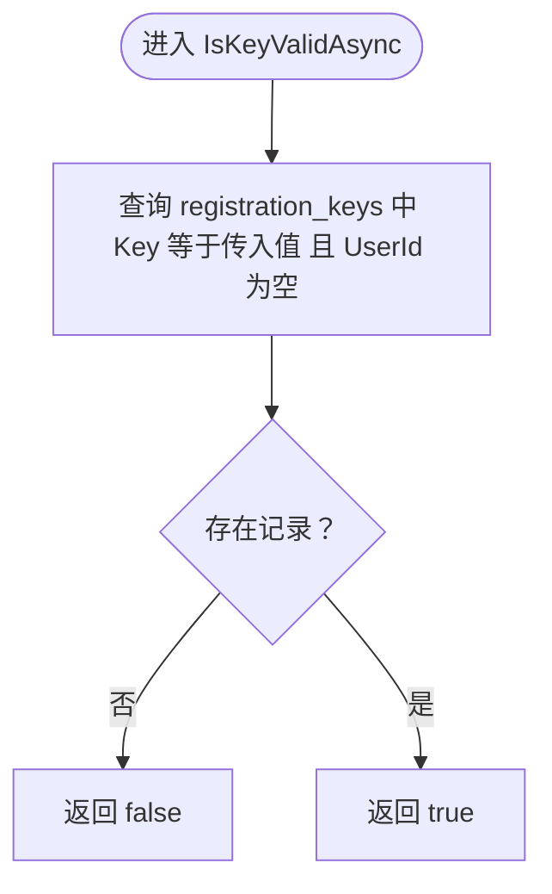
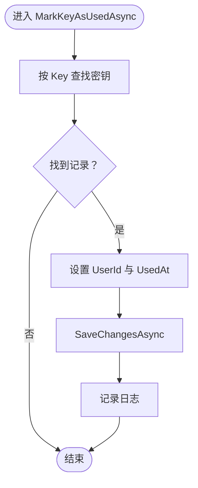
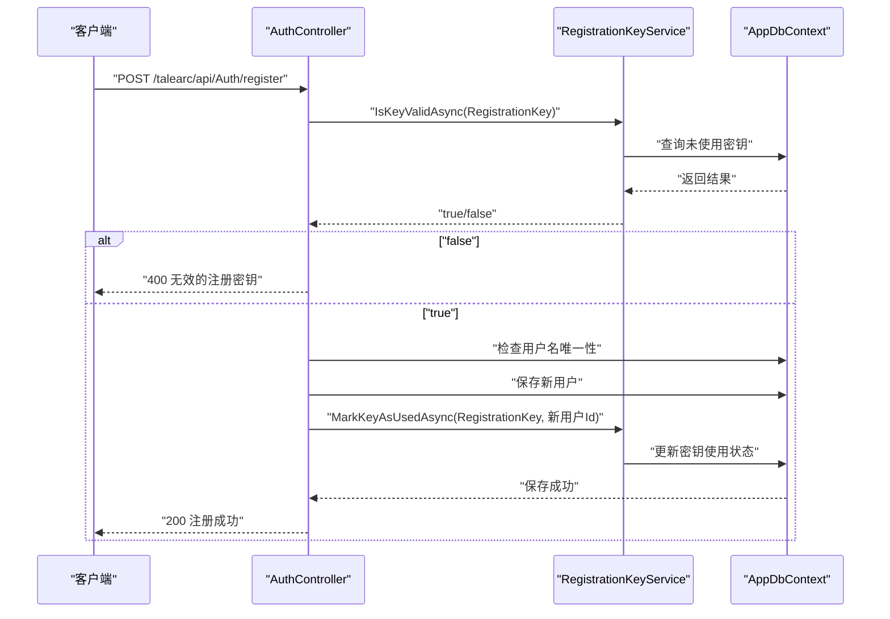
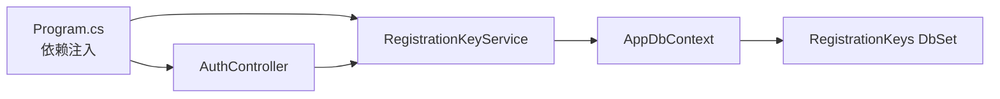

# 访问控制与注册密钥机制

<cite>
**本文引用的文件**
- [Program.cs](file://Program.cs)
- [AppDbContext.cs](file://src/data/AppDbContext.cs)
- [RegistrationKey.cs](file://src/data/entities/RegistrationKey.cs)
- [RegistrationKeyService.cs](file://src/application/service/RegistrationKeyService.cs)
- [AuthController.cs](file://src/application/controllers/auth/AuthController.cs)
- [20251217055145_AddRegistrationKeyTable.cs](file://Migrations/20251217055145_AddRegistrationKeyTable.cs)
</cite>

## 目录
1. [引言](#引言)
2. [项目结构](#项目结构)
3. [核心组件](#核心组件)
4. [架构总览](#架构总览)
5. [详细组件分析](#详细组件分析)
6. [依赖关系分析](#依赖关系分析)
7. [性能考量](#性能考量)
8. [故障排查指南](#故障排查指南)
9. [结论](#结论)
10. [附录](#附录)

## 引言
本文件系统性介绍基于注册密钥的访问控制机制如何作为系统的第一道安全防线。该机制通过“仅持有有效且未使用的注册密钥”才能完成用户注册，从而有效限制准入范围，防止任意用户注册。本文从实体设计、服务实现、控制器集成、数据库迁移以及未来扩展建议等方面进行深入解析，并提供可视化图示帮助读者快速理解。

## 项目结构
围绕注册密钥机制的关键文件分布如下：
- 实体层：RegistrationKey 实体定义密钥字段及状态
- 数据层：AppDbContext 暴露 RegistrationKeys 集合
- 应用服务层：RegistrationKeyService 提供密钥校验与使用标记能力
- 控制器层：AuthController 在注册流程中强制执行密钥校验
- 迁移层：新增 registration_keys 表结构

图表来源
- [AuthController.cs](file://src/application/controllers/auth/AuthController.cs#L62-L129)
- [RegistrationKeyService.cs](file://src/application/service/RegistrationKeyService.cs#L1-L37)
- [AppDbContext.cs](file://src/data/AppDbContext.cs#L10-L16)
- [20251217055145_AddRegistrationKeyTable.cs](file://Migrations/20251217055145_AddRegistrationKeyTable.cs#L14-L25)
- [Program.cs](file://Program.cs#L46-L48)

章节来源
- [Program.cs](file://Program.cs#L46-L48)
- [AppDbContext.cs](file://src/data/AppDbContext.cs#L10-L16)
- [20251217055145_AddRegistrationKeyTable.cs](file://Migrations/20251217055145_AddRegistrationKeyTable.cs#L14-L25)

## 核心组件
- RegistrationKey 实体：包含密钥值、使用者ID、使用时间三个字段，用于标识密钥状态（未使用、已使用）
- RegistrationKeyService：提供 IsKeyValidAsync 与 MarkKeyAsUsedAsync 两个关键方法，保证密钥只被使用一次
- AuthController.Register：在注册流程中先校验密钥有效性，再创建用户并标记密钥为已使用
- AppDbContext：暴露 RegistrationKeys 集合，配合 EF Core 完成持久化操作
- 数据库迁移：创建 registration_keys 表，包含主键 key 与可空字段 user_id、used_at

章节来源
- [RegistrationKey.cs](file://src/data/entities/RegistrationKey.cs#L10-L31)
- [RegistrationKeyService.cs](file://src/application/service/RegistrationKeyService.cs#L12-L37)
- [AuthController.cs](file://src/application/controllers/auth/AuthController.cs#L82-L129)
- [AppDbContext.cs](file://src/data/AppDbContext.cs#L10-L16)
- [20251217055145_AddRegistrationKeyTable.cs](file://Migrations/20251217055145_AddRegistrationKeyTable.cs#L14-L25)

## 架构总览
下图展示了注册密钥机制在认证流程中的位置与交互关系。

图表来源
- [AuthController.cs](file://src/application/controllers/auth/AuthController.cs#L82-L129)
- [RegistrationKeyService.cs](file://src/application/service/RegistrationKeyService.cs#L12-L37)
- [AppDbContext.cs](file://src/data/AppDbContext.cs#L10-L16)
- [20251217055145_AddRegistrationKeyTable.cs](file://Migrations/20251217055145_AddRegistrationKeyTable.cs#L14-L25)

## 详细组件分析

### RegistrationKey 实体设计
- 字段说明
  - 密钥值：唯一标识符，作为表主键
  - 使用者ID：首次使用时写入，用于绑定密钥与用户
  - 使用时间：首次使用时写入，UTC 时间戳
- 设计意义
  - 通过 user_id 与 used_at 的组合，确保同一密钥仅能被使用一次
  - 未使用密钥的 user_id 为空，便于快速筛选可用密钥
  - 使用时间可用于审计与统计

图表来源
- [RegistrationKey.cs](file://src/data/entities/RegistrationKey.cs#L10-L31)

章节来源
- [RegistrationKey.cs](file://src/data/entities/RegistrationKey.cs#L10-L31)

### RegistrationKeyService 实现逻辑
- IsKeyValidAsync
  - 查询条件：密钥值相等 且 使用者ID为空
  - 返回值：布尔型，表示密钥是否有效且未被使用
  - 作用：作为注册流程的第一道校验，拒绝无效或已被使用的密钥
- MarkKeyAsUsedAsync
  - 查询密钥：按密钥值查找
  - 更新策略：若存在则设置使用者ID与使用时间并保存
  - 日志记录：记录密钥使用事件，便于审计
  - 并发注意：当前实现未显式加锁，建议在数据库层面通过唯一约束或乐观并发控制进一步保障原子性

图表来源
- [RegistrationKeyService.cs](file://src/application/service/RegistrationKeyService.cs#L12-L19)

图表来源
- [RegistrationKeyService.cs](file://src/application/service/RegistrationKeyService.cs#L21-L37)

章节来源
- [RegistrationKeyService.cs](file://src/application/service/RegistrationKeyService.cs#L12-L37)

### AuthController 注册流程中的密钥校验
- 请求参数：包含用户名、密码与注册密钥
- 校验顺序：
  1) 调用 RegistrationKeyService.IsKeyValidAsync 校验密钥
  2) 若无效，立即返回 400
  3) 检查用户名是否已存在
  4) 创建用户并保存
  5) 调用 RegistrationKeyService.MarkKeyAsUsedAsync 将密钥标记为已使用
  6) 返回成功响应
- 安全收益：只有持有有效且未使用密钥的用户才能完成注册，有效阻断任意注册

图表来源
- [AuthController.cs](file://src/application/controllers/auth/AuthController.cs#L82-L129)
- [RegistrationKeyService.cs](file://src/application/service/RegistrationKeyService.cs#L12-L37)

章节来源
- [AuthController.cs](file://src/application/controllers/auth/AuthController.cs#L82-L129)

### 数据库迁移与表结构
- 表名：registration_keys
- 主键：key（字符型，最大长度 255）
- 可空字段：user_id、used_at
- 迁移脚本创建了表并在回滚时删除

章节来源
- [20251217055145_AddRegistrationKeyTable.cs](file://Migrations/20251217055145_AddRegistrationKeyTable.cs#L14-L25)

## 依赖关系分析
- 依赖注入
  - Program.cs 中注册 RegistrationKeyService 为 Scoped
  - AuthController 通过构造函数注入 RegistrationKeyService
- 数据访问
  - RegistrationKeyService 依赖 AppDbContext.RegistrationKeys
  - AppDbContext 在 OnModelCreating 中配置了 Users 的默认值等，但未对 RegistrationKeys 做额外配置
- 控制流
  - AuthController.Register 先调用 RegistrationKeyService.IsKeyValidAsync，再执行用户创建与密钥标记
  - 两者在同一事务内完成，避免竞态条件

图表来源
- [Program.cs](file://Program.cs#L46-L48)
- [AuthController.cs](file://src/application/controllers/auth/AuthController.cs#L62-L74)
- [RegistrationKeyService.cs](file://src/application/service/RegistrationKeyService.cs#L1-L11)
- [AppDbContext.cs](file://src/data/AppDbContext.cs#L10-L16)

章节来源
- [Program.cs](file://Program.cs#L46-L48)
- [AppDbContext.cs](file://src/data/AppDbContext.cs#L10-L16)

## 性能考量
- 查询优化
  - IsKeyValidAsync 使用单字段过滤，建议在 key 上建立索引以提升查询效率
- 并发与一致性
  - 当前实现未显式加锁，建议在数据库层添加唯一约束或采用乐观并发控制，确保同一密钥不会被并发使用
- 日志与审计
  - MarkKeyAsUsedAsync 已记录使用日志，建议增加唯一性检查与幂等处理，避免重复标记导致的数据异常

## 故障排查指南
- 常见问题与定位
  - 400 无效的注册密钥：确认密钥是否存在且未被使用；检查密钥大小写与格式
  - 用户名已存在：检查用户名是否已被占用
  - 数据库连接或迁移问题：确认 migration 是否执行成功，表结构是否正确
- 排查步骤
  - 检查 RegistrationKeyService.IsKeyValidAsync 的查询条件是否满足
  - 确认 AppDbContext.RegistrationKeys 是否正确映射到表
  - 查看日志中关于密钥使用标记的日志输出
- 建议
  - 在生产环境启用数据库唯一约束，防止并发场景下的重复使用
  - 对密钥使用情况进行定期审计与清理

章节来源
- [AuthController.cs](file://src/application/controllers/auth/AuthController.cs#L82-L129)
- [RegistrationKeyService.cs](file://src/application/service/RegistrationKeyService.cs#L12-L37)
- [AppDbContext.cs](file://src/data/AppDbContext.cs#L10-L16)

## 结论
注册密钥机制通过“密钥唯一性 + 未使用状态 + 单次使用”的设计，有效将注册入口前置为第一道安全防线。AuthController 在注册流程中强制校验密钥有效性，并在成功创建用户后立即将密钥标记为已使用，从而杜绝任意注册风险。该机制简单可靠，易于部署与维护，适合在需要严格准入控制的场景中使用。

## 附录

### 未来扩展建议
- 密钥有效期
  - 增加过期时间字段，校验时同时判断是否在有效期内
  - 可通过后台任务定期清理过期密钥
- 批量生成
  - 提供 API 生成多组密钥，支持导出与导入
- 使用次数限制
  - 增加使用次数上限字段，超过上限自动失效
- 生命周期管理 API
  - 支持创建、启用/禁用、查询、导出、清理等操作
  - 提供密钥使用统计与审计日志接口

### API 接口建议（概念性）
- POST /talearc/api/RegistrationKey/generate
  - 请求体：数量、有效期、备注
  - 响应：生成的密钥列表
- GET /talearc/api/RegistrationKey/{key}
  - 响应：密钥详情（状态、使用者、使用时间、有效期）
- PUT /talearc/api/RegistrationKey/{key}/disable
  - 响应：禁用成功
- GET /talearc/api/RegistrationKey/stats
  - 响应：使用统计与分布

[本节为概念性内容，不直接对应具体源码文件]