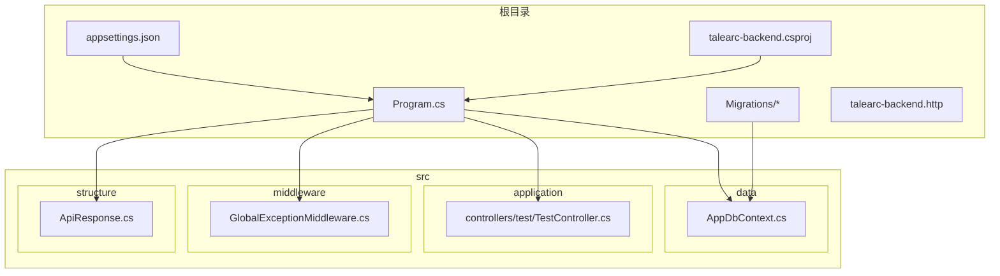
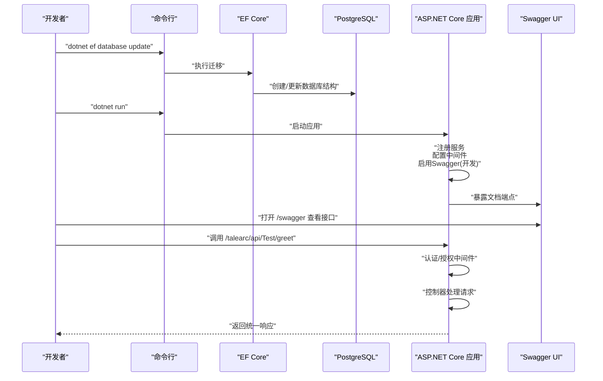
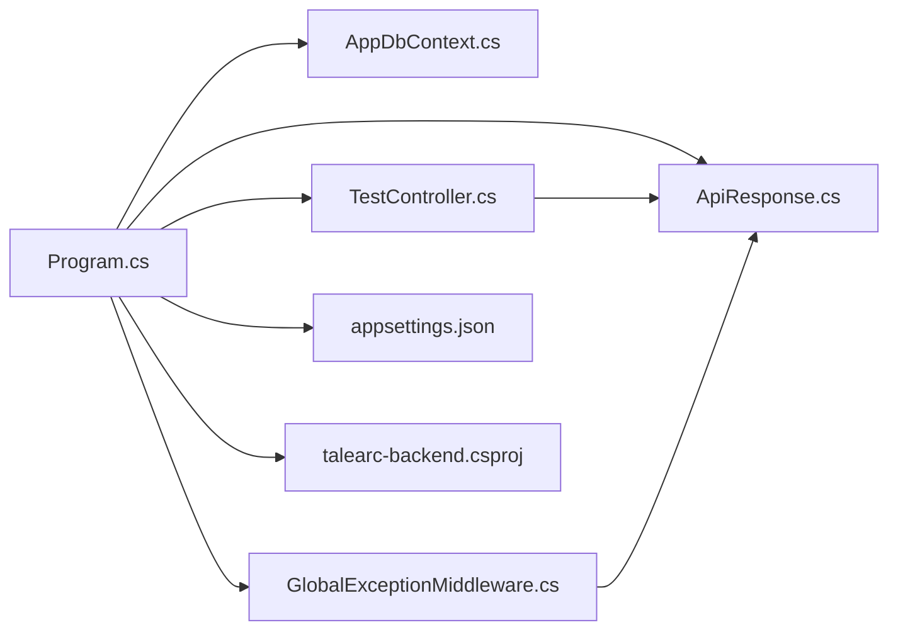

# 快速开始指南

<cite>
**本文引用的文件**
- [appsettings.json](file://appsettings.json)
- [Program.cs](file://Program.cs)
- [talearc-backend.csproj](file://talearc-backend.csproj)
- [AppDbContext.cs](file://src/data/AppDbContext.cs)
- [TestController.cs](file://src/application/controllers/test/TestController.cs)
- [ApiResponse.cs](file://src/structure/ApiResponse.cs)
- [GlobalExceptionMiddleware.cs](file://src/middleware/GlobalExceptionMiddleware.cs)
- [talearc-backend.http](file://talearc-backend.http)
</cite>

## 目录
1. [简介](#简介)
2. [项目结构](#项目结构)
3. [核心组件](#核心组件)
4. [架构总览](#架构总览)
5. [详细组件分析](#详细组件分析)
6. [依赖分析](#依赖分析)
7. [性能注意事项](#性能注意事项)
8. [故障排查指南](#故障排查指南)
9. [结论](#结论)
10. [附录](#附录)

## 简介
本指南面向首次接触 talearc-backend 的开发者，帮助你在本地 10 分钟内完成环境准备、数据库初始化与服务启动，并通过 Swagger UI 调用第一个 API。你将学会：
- 安装 .NET 8 SDK 与 PostgreSQL 数据库
- 修改连接字符串并执行 EF Core 迁移
- 启动服务并通过 Swagger 测试接口
- 常见问题排查（端口冲突、数据库连接失败等）

## 项目结构
该项目采用分层架构，主要目录与职责如下：
- src/application：控制器与业务服务层
- src/data：实体与 EF Core 上下文
- src/middleware：全局中间件（日志、异常）
- src/structure：统一响应模型
- Migrations：EF Core 迁移脚本
- 根目录：配置文件、项目文件与示例 HTTP 请求

图表来源
- [Program.cs](file://Program.cs#L1-L107)
- [AppDbContext.cs](file://src/data/AppDbContext.cs#L1-L26)
- [TestController.cs](file://src/application/controllers/test/TestController.cs#L1-L70)
- [GlobalExceptionMiddleware.cs](file://src/middleware/GlobalExceptionMiddleware.cs#L1-L45)
- [ApiResponse.cs](file://src/structure/ApiResponse.cs#L1-L40)
- [appsettings.json](file://appsettings.json#L1-L16)
- [talearc-backend.csproj](file://talearc-backend.csproj#L1-L30)
- [talearc-backend.http](file://talearc-backend.http#L1-L7)

章节来源
- [Program.cs](file://Program.cs#L1-L107)
- [talearc-backend.csproj](file://talearc-backend.csproj#L1-L30)

## 核心组件
- 应用入口与服务注册：在程序入口中配置 Serilog 日志、EF Core 上下文、JWT 认证、Swagger 文档与中间件管道。
- 数据上下文：定义实体集合并设置默认值策略。
- 控制器：提供测试接口（问候与错误模拟），使用统一响应模型。
- 中间件：全局异常捕获与日志记录。
- 配置：连接字符串、JWT 密钥、日志级别、Swagger 文档等。

章节来源
- [Program.cs](file://Program.cs#L1-L107)
- [AppDbContext.cs](file://src/data/AppDbContext.cs#L1-L26)
- [TestController.cs](file://src/application/controllers/test/TestController.cs#L1-L70)
- [GlobalExceptionMiddleware.cs](file://src/middleware/GlobalExceptionMiddleware.cs#L1-L45)
- [ApiResponse.cs](file://src/structure/ApiResponse.cs#L1-L40)
- [appsettings.json](file://appsettings.json#L1-L16)

## 架构总览
下面的时序图展示了从启动到请求处理的关键流程，以及 Swagger 在开发环境中的启用方式。

图表来源
- [Program.cs](file://Program.cs#L1-L107)
- [AppDbContext.cs](file://src/data/AppDbContext.cs#L1-L26)
- [TestController.cs](file://src/application/controllers/test/TestController.cs#L1-L70)

## 详细组件分析

### 开发环境准备
- 安装 .NET 8 SDK：用于编译与运行 ASP.NET Core 应用。
- 安装 PostgreSQL：用于存储应用数据。确保数据库服务正在运行。

章节来源
- [talearc-backend.csproj](file://talearc-backend.csproj#L1-L30)

### 配置数据库连接字符串
- 打开配置文件，找到连接字符串键名并按需修改主机、数据库名、用户名与密码。
- 修改后保存，确保与本地 PostgreSQL 实例一致。

章节来源
- [appsettings.json](file://appsettings.json#L1-L16)
- [Program.cs](file://Program.cs#L20-L30)

### 执行 EF Core 迁移以创建数据库结构
- 在项目根目录执行数据库更新命令，EF Core 将根据迁移脚本创建或更新数据库结构。
- 迁移脚本位于 Migrations 目录，包含初始创建与后续扩展。

章节来源
- [Program.cs](file://Program.cs#L20-L30)
- [AppDbContext.cs](file://src/data/AppDbContext.cs#L1-L26)
- [Migrations/*](file://Migrations/20251202060311_InitialCreate.cs#L1-L50)

### 启动服务与访问 Swagger UI
- 在项目根目录执行启动命令，应用将注册服务、中间件与 Swagger（开发环境）。
- 启动完成后，在浏览器中访问 Swagger 默认路径查看与测试接口。

章节来源
- [Program.cs](file://Program.cs#L90-L107)
- [talearc-backend.http](file://talearc-backend.http#L1-L7)

### 调用第一个 API
- 使用 Swagger 或 HTTP 客户端调用测试接口，体验统一响应格式与日志输出。
- 可选：调用错误模拟接口验证全局异常中间件行为。

章节来源
- [TestController.cs](file://src/application/controllers/test/TestController.cs#L1-L70)
- [ApiResponse.cs](file://src/structure/ApiResponse.cs#L1-L40)
- [GlobalExceptionMiddleware.cs](file://src/middleware/GlobalExceptionMiddleware.cs#L1-L45)

## 依赖分析
项目对外部依赖与内部模块的耦合关系如下：

图表来源
- [Program.cs](file://Program.cs#L1-L107)
- [AppDbContext.cs](file://src/data/AppDbContext.cs#L1-L26)
- [TestController.cs](file://src/application/controllers/test/TestController.cs#L1-L70)
- [GlobalExceptionMiddleware.cs](file://src/middleware/GlobalExceptionMiddleware.cs#L1-L45)
- [ApiResponse.cs](file://src/structure/ApiResponse.cs#L1-L40)
- [appsettings.json](file://appsettings.json#L1-L16)
- [talearc-backend.csproj](file://talearc-backend.csproj#L1-L30)

章节来源
- [Program.cs](file://Program.cs#L1-L107)
- [talearc-backend.csproj](file://talearc-backend.csproj#L1-L30)

## 性能注意事项
- 生产环境建议开启 HTTPS 重定向与更严格的日志级别。
- 控制器与中间件中已启用 JSON 驼峰命名策略，减少前后端字段不一致带来的解析成本。
- EF Core 使用 Npgsql 提供程序，注意数据库连接池与查询优化。

[本节为通用建议，无需引用具体文件]

## 故障排查指南
- 端口冲突
  - 现象：应用启动时报端口占用错误。
  - 处理：检查应用监听地址与端口，修改为未被占用的端口后重启。
  - 参考：启动配置与示例 HTTP 文件中的主机地址。

- 数据库连接失败
  - 现象：应用启动时报数据库连接异常。
  - 处理：确认连接字符串中的主机、数据库名、用户名与密码正确；确保 PostgreSQL 服务已启动且允许本地连接；必要时调整防火墙或连接权限。

- EF Core 迁移失败
  - 现象：执行数据库更新命令报错。
  - 处理：检查连接字符串是否指向正确的数据库实例；确认迁移脚本无语法错误；清理临时文件后重试。

- Swagger 无法访问
  - 现象：访问 Swagger 路径返回 404。
  - 处理：确认当前环境为开发模式；检查 Swagger 注册与启用逻辑；确保未被代理或中间件拦截。

- 全局异常中间件触发
  - 现象：调用接口返回 500 错误。
  - 处理：查看日志输出定位异常原因；检查控制器逻辑与依赖注入；必要时在开发环境复现并调试。

章节来源
- [Program.cs](file://Program.cs#L90-L107)
- [GlobalExceptionMiddleware.cs](file://src/middleware/GlobalExceptionMiddleware.cs#L1-L45)
- [appsettings.json](file://appsettings.json#L1-L16)
- [talearc-backend.http](file://talearc-backend.http#L1-L7)

## 结论
按照本指南，你可以在 10 分钟内完成本地部署与首个 API 调用。建议在开发环境中优先使用 Swagger 进行接口测试，并结合统一响应模型与日志中间件快速定位问题。生产部署前请完善安全配置与数据库连接策略。

[本节为总结性内容，无需引用具体文件]

## 附录
- 快速操作清单
  - 安装 .NET 8 SDK 与 PostgreSQL
  - 修改连接字符串
  - 执行 EF Core 迁移
  - dotnet run 启动
  - 访问 /swagger 测试接口

[本节为概览性内容，无需引用具体文件]