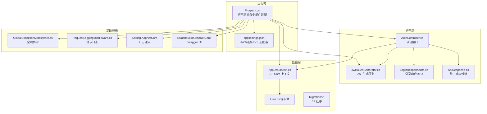
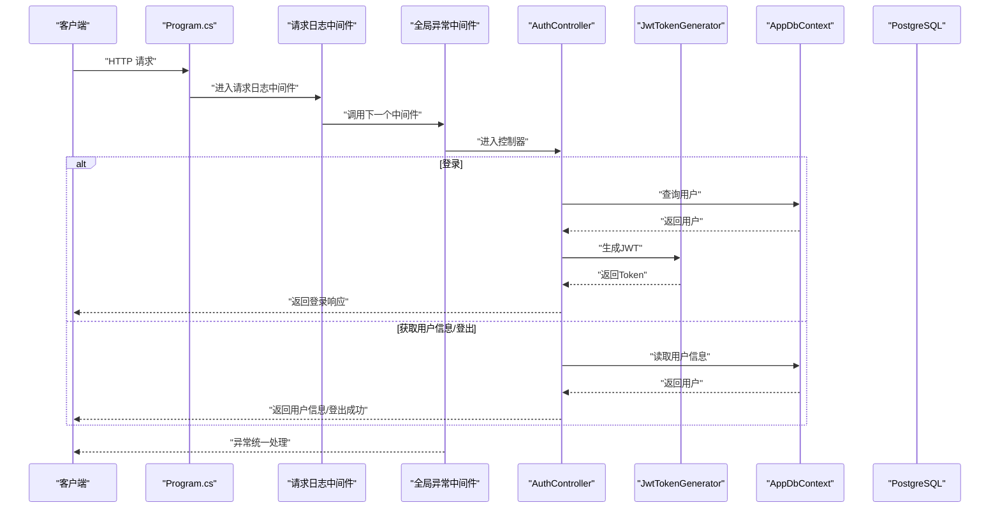
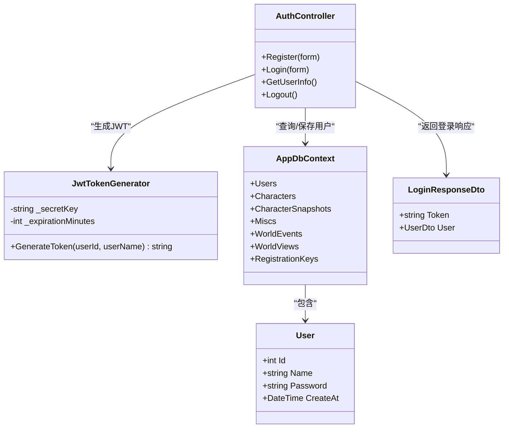
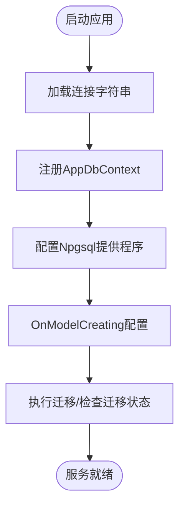
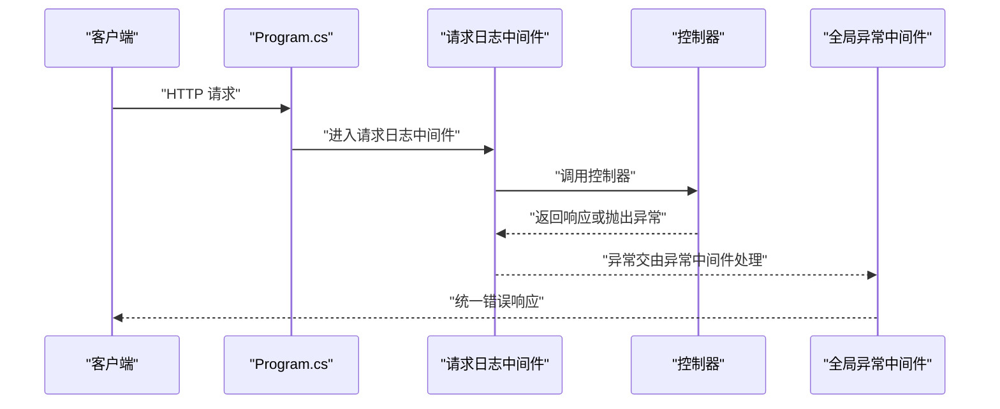
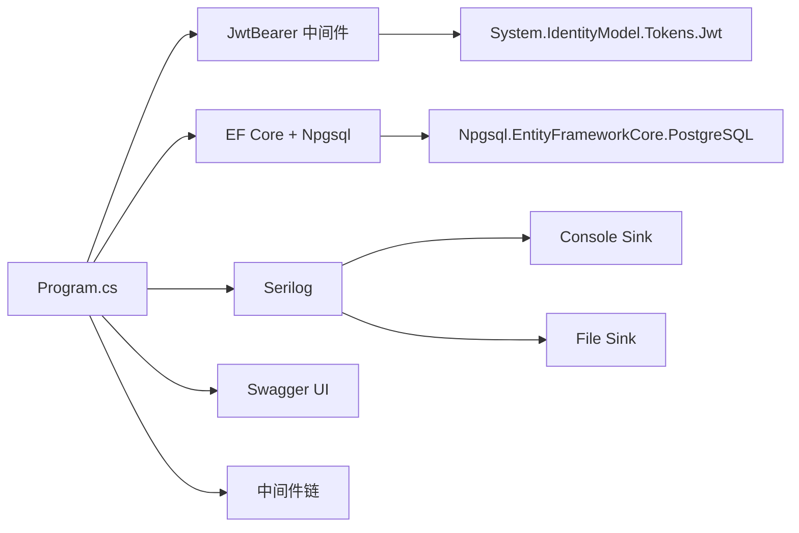

# 技术栈与依赖

<cite>
**本文引用的文件**
- [talearc-backend.csproj](file://talearc-backend.csproj)
- [appsettings.json](file://appsettings.json)
- [Program.cs](file://Program.cs)
- [src/data/AppDbContext.cs](file://src/data/AppDbContext.cs)
- [src/application/service/JwtTokenGenerator.cs](file://src/application/service/JwtTokenGenerator.cs)
- [src/application/controllers/auth/AuthController.cs](file://src/application/controllers/auth/AuthController.cs)
- [src/middleware/GlobalExceptionMiddleware.cs](file://src/middleware/GlobalExceptionMiddleware.cs)
- [src/middleware/RequestLoggingMiddleware.cs](file://src/middleware/RequestLoggingMiddleware.cs)
- [src/data/entities/User.cs](file://src/data/entities/User.cs)
- [src/data/dto/LoginResponseDto.cs](file://src/data/dto/LoginResponseDto.cs)
- [src/structure/ApiResponse.cs](file://src/structure/ApiResponse.cs)
</cite>

## 目录
1. [引言](#引言)
2. [项目结构](#项目结构)
3. [核心组件](#核心组件)
4. [架构总览](#架构总览)
5. [详细组件分析](#详细组件分析)
6. [依赖分析](#依赖分析)
7. [性能考虑](#性能考虑)
8. [故障排查指南](#故障排查指南)
9. [结论](#结论)

## 引言
本文件面向开发者，系统性梳理 talearc-backend 的技术栈与依赖，重点覆盖以下方面：
- 核心框架：ASP.NET Core Web API
- 数据访问：Entity Framework Core + Npgsql（PostgreSQL）
- 安全认证：JWT（Microsoft.AspNetCore.Authentication.JwtBearer + System.IdentityModel.Tokens.Jwt）
- 日志系统：Serilog
- 文档与调试：Swashbuckle.AspNetCore（Swagger UI）
- 运行时与语言特性：.NET 8（TargetFramework）

同时，结合项目中的配置文件与代码实现，说明各依赖在项目中的职责、集成方式与最佳实践，帮助新成员快速上手并正确扩展。

## 项目结构
项目采用分层与功能域结合的组织方式：
- 应用层：控制器、服务、DTO、扩展方法
- 数据层：实体、上下文、迁移
- 结构化工具：统一响应包装
- 中间件：全局异常与请求日志
- 配置：Program.cs（运行时配置）、appsettings.json（应用配置）

图表来源
- [Program.cs](file://Program.cs#L1-L107)
- [src/application/controllers/auth/AuthController.cs](file://src/application/controllers/auth/AuthController.cs#L1-L227)
- [src/application/service/JwtTokenGenerator.cs](file://src/application/service/JwtTokenGenerator.cs#L1-L40)
- [src/data/AppDbContext.cs](file://src/data/AppDbContext.cs#L1-L26)
- [src/data/entities/User.cs](file://src/data/entities/User.cs#L1-L40)
- [src/data/dto/LoginResponseDto.cs](file://src/data/dto/LoginResponseDto.cs#L1-L17)
- [src/structure/ApiResponse.cs](file://src/structure/ApiResponse.cs#L1-L40)
- [src/middleware/GlobalExceptionMiddleware.cs](file://src/middleware/GlobalExceptionMiddleware.cs#L1-L45)
- [src/middleware/RequestLoggingMiddleware.cs](file://src/middleware/RequestLoggingMiddleware.cs#L1-L39)
- [appsettings.json](file://appsettings.json#L1-L16)

章节来源
- [Program.cs](file://Program.cs#L1-L107)
- [talearc-backend.csproj](file://talearc-backend.csproj#L1-L30)

## 核心组件
- ASP.NET Core Web API：作为后端服务框架，提供路由、中间件、依赖注入、认证与授权等能力。
- Entity Framework Core + Npgsql：ORM 与 PostgreSQL 提供程序，负责数据库建模、迁移与查询。
- JWT 身份验证：基于对称密钥的 HS256 签名，配合 JwtBearer 中间件进行令牌校验。
- Serilog：结构化日志记录，支持控制台与文件输出，并通过中间件记录请求生命周期。
- Swashbuckle.AspNetCore：自动生成 OpenAPI/Swagger 文档，便于调试与联调。

章节来源
- [Program.cs](file://Program.cs#L1-L107)
- [talearc-backend.csproj](file://talearc-backend.csproj#L12-L27)
- [appsettings.json](file://appsettings.json#L1-L16)

## 架构总览
下图展示从客户端到数据库的关键交互路径，包括认证流程、日志与异常处理。

图表来源
- [Program.cs](file://Program.cs#L90-L107)
- [src/application/controllers/auth/AuthController.cs](file://src/application/controllers/auth/AuthController.cs#L1-L227)
- [src/application/service/JwtTokenGenerator.cs](file://src/application/service/JwtTokenGenerator.cs#L1-L40)
- [src/data/AppDbContext.cs](file://src/data/AppDbContext.cs#L1-L26)
- [src/middleware/RequestLoggingMiddleware.cs](file://src/middleware/RequestLoggingMiddleware.cs#L1-L39)
- [src/middleware/GlobalExceptionMiddleware.cs](file://src/middleware/GlobalExceptionMiddleware.cs#L1-L45)

## 详细组件分析

### 组件一：认证与JWT
- 功能职责
  - 登录：校验用户名与密码，生成JWT并返回统一响应。
  - 注册：校验注册密钥、检查用户名唯一性、哈希密码并持久化。
  - 用户信息：基于已认证的Claims解析用户信息。
  - 登出：返回登出成功（客户端可清理本地Token）。
- 关键实现要点
  - 使用 JwtBearer 中间件与对称密钥校验参数，确保签发方、受众、过期时间与签名完整性。
  - JwtTokenGenerator 基于配置的密钥与过期分钟数生成HS256令牌。
  - 控制器通过 Authorize 特性保护受保护接口。
  - 使用 PasswordHashService 对密码进行安全哈希（服务在Program中注册）。

图表来源
- [src/application/controllers/auth/AuthController.cs](file://src/application/controllers/auth/AuthController.cs#L1-L227)
- [src/application/service/JwtTokenGenerator.cs](file://src/application/service/JwtTokenGenerator.cs#L1-L40)
- [src/data/AppDbContext.cs](file://src/data/AppDbContext.cs#L1-L26)
- [src/data/entities/User.cs](file://src/data/entities/User.cs#L1-L40)
- [src/data/dto/LoginResponseDto.cs](file://src/data/dto/LoginResponseDto.cs#L1-L17)

章节来源
- [src/application/controllers/auth/AuthController.cs](file://src/application/controllers/auth/AuthController.cs#L1-L227)
- [src/application/service/JwtTokenGenerator.cs](file://src/application/service/JwtTokenGenerator.cs#L1-L40)
- [Program.cs](file://Program.cs#L27-L44)

### 组件二：EF Core与PostgreSQL
- 功能职责
  - AppDbContext 定义实体集合（用户、角色快照、世界事件、世界视图、注册密钥等）。
  - 使用 Npgsql.EntityFrameworkCore.PostgreSQL 连接 PostgreSQL。
  - 通过迁移管理数据库结构演进。
- 关键实现要点
  - 在 Program.cs 中通过配置连接字符串注册 DbContext。
  - 在 OnModelCreating 中设置默认值等约定（如用户创建时间）。
  - 迁移目录包含多个版本的迁移文件，体现数据库演进历史。

图表来源
- [Program.cs](file://Program.cs#L24-L25)
- [src/data/AppDbContext.cs](file://src/data/AppDbContext.cs#L1-L26)
- [talearc-backend.csproj](file://talearc-backend.csproj#L16-L20)

章节来源
- [Program.cs](file://Program.cs#L24-L25)
- [src/data/AppDbContext.cs](file://src/data/AppDbContext.cs#L1-L26)
- [talearc-backend.csproj](file://talearc-backend.csproj#L16-L20)

### 组件三：日志与异常处理
- 请求日志中间件
  - 记录请求开始与完成信息，包含方法、路径、查询参数、状态码与耗时。
- 全局异常中间件
  - 捕获未处理异常，记录错误上下文，返回统一的500错误响应。
- Serilog
  - 在 Program.cs 中配置控制台与滚动文件输出，启用上下文丰富。

图表来源
- [Program.cs](file://Program.cs#L90-L107)
- [src/middleware/RequestLoggingMiddleware.cs](file://src/middleware/RequestLoggingMiddleware.cs#L1-L39)
- [src/middleware/GlobalExceptionMiddleware.cs](file://src/middleware/GlobalExceptionMiddleware.cs#L1-L45)

章节来源
- [Program.cs](file://Program.cs#L1-L20)
- [src/middleware/RequestLoggingMiddleware.cs](file://src/middleware/RequestLoggingMiddleware.cs#L1-L39)
- [src/middleware/GlobalExceptionMiddleware.cs](file://src/middleware/GlobalExceptionMiddleware.cs#L1-L45)

### 组件四：Swagger UI
- 功能职责
  - 在开发环境自动启用 Swagger UI，提供交互式API文档。
  - 配置安全方案（Bearer），允许在界面直接测试带Token的请求。
- 关键实现要点
  - 在 Program.cs 中注册并配置 SwaggerGen，添加XML注释与安全定义。
  - 开发环境下启用 UseSwagger 与 UseSwaggerUI。

章节来源
- [Program.cs](file://Program.cs#L58-L90)

## 依赖分析
- 包依赖概览
  - Microsoft.AspNetCore.Authentication.JwtBearer：启用JwtBearer认证方案。
  - System.IdentityModel.Tokens.Jwt：生成与验证JWT令牌。
  - Microsoft.EntityFrameworkCore / Design：ORM与设计时工具。
  - Npgsql.EntityFrameworkCore.PostgreSQL：PostgreSQL EF提供程序。
  - Serilog.AspNetCore / Serilog.Sinks.Console / Serilog.Sinks.File：日志系统。
  - Microsoft.AspNetCore.OpenApi / Swashbuckle.AspNetCore：OpenAPI/Swagger。
  - Microsoft.AspNetCore.SignalR：保留引用（项目当前未使用）。
- 集成点
  - Program.cs：集中注册认证、EF、Serilog、Swagger、中间件。
  - appsettings.json：提供JWT密钥、连接字符串、日志级别等配置。
  - 控制器：通过 Authorize 保护接口，使用服务生成JWT并返回统一响应。

图表来源
- [Program.cs](file://Program.cs#L1-L107)
- [talearc-backend.csproj](file://talearc-backend.csproj#L12-L27)

章节来源
- [talearc-backend.csproj](file://talearc-backend.csproj#L12-L27)
- [Program.cs](file://Program.cs#L1-L107)
- [appsettings.json](file://appsettings.json#L1-L16)

## 性能考虑
- 启动与中间件顺序
  - 请求日志与异常中间件应尽早加入管道，以便覆盖所有后续处理。
  - 认证与授权中间件需位于日志之后，以避免重复记录。
- EF Core
  - 使用异步API（如 FindAsync、FirstOrDefaultAsync）减少阻塞。
  - 合理使用投影与分页，避免一次性加载大结果集。
- JWT
  - 将过期时间设为合理范围，避免频繁刷新导致额外开销。
  - 密钥长度与随机性足够强，防止暴力破解。
- 日志
  - 生产环境建议降低日志级别，避免I/O瓶颈。
  - 使用结构化字段（如用户ID、请求路径）便于检索与告警。

## 故障排查指南
- 认证失败
  - 检查 appsettings.json 中的 Jwt:SecretKey 是否配置且与服务端一致。
  - 确认请求头携带正确的 Bearer Token，且未过期。
  - 查看控制器日志，定位用户名或密码错误、无效用户ID等问题。
- 数据库连接问题
  - 检查 appsettings.json 中的 DefaultConnection 是否正确。
  - 确认 PostgreSQL 服务可用，网络可达。
  - 执行迁移命令，确保数据库结构与模型匹配。
- 未处理异常
  - 查看全局异常中间件日志，确认异常堆栈与上下文信息。
  - 检查 Serilog 输出位置（控制台/文件），定位错误根因。
- Swagger 不可用
  - 确认处于开发环境，且已启用 UseSwagger 与 UseSwaggerUI。
  - 检查安全定义是否正确配置（Bearer）。

章节来源
- [appsettings.json](file://appsettings.json#L1-L16)
- [src/application/controllers/auth/AuthController.cs](file://src/application/controllers/auth/AuthController.cs#L131-L208)
- [src/middleware/GlobalExceptionMiddleware.cs](file://src/middleware/GlobalExceptionMiddleware.cs#L22-L45)
- [Program.cs](file://Program.cs#L90-L107)

## 结论
本项目以 ASP.NET Core Web API 为核心，结合 EF Core + Npgsql 实现数据持久化，使用 JWT 保障接口安全，借助 Serilog 提升可观测性，并通过 Swagger UI 提高联调效率。.NET 8 的引入为项目带来更佳的性能与语言特性。遵循本文的技术清单与最佳实践，可帮助团队快速理解并扩展该后端服务。