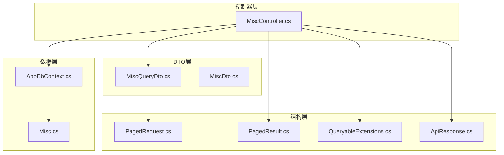
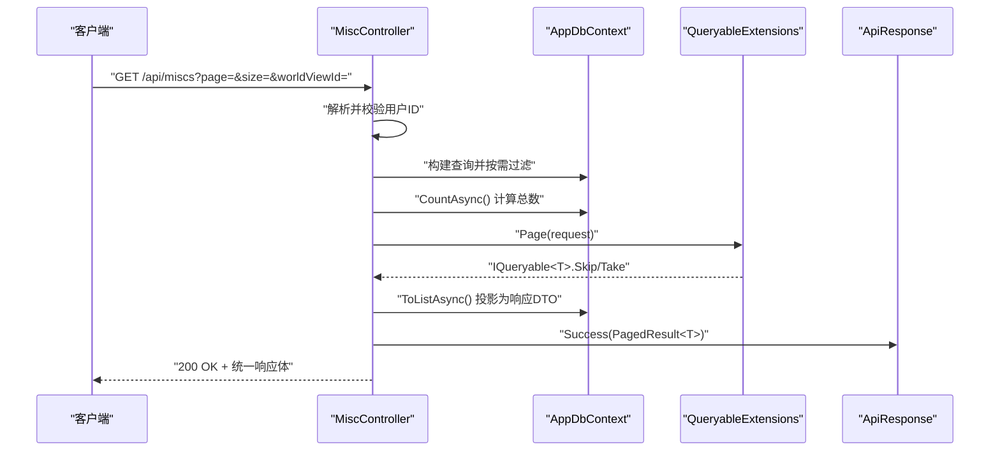
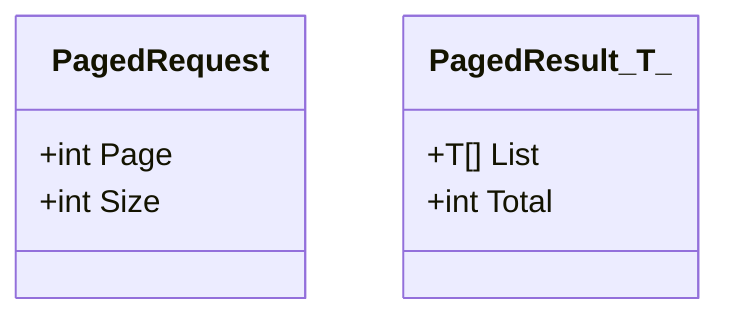
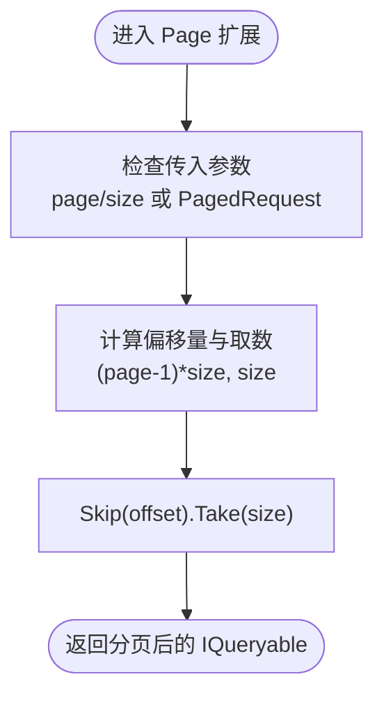
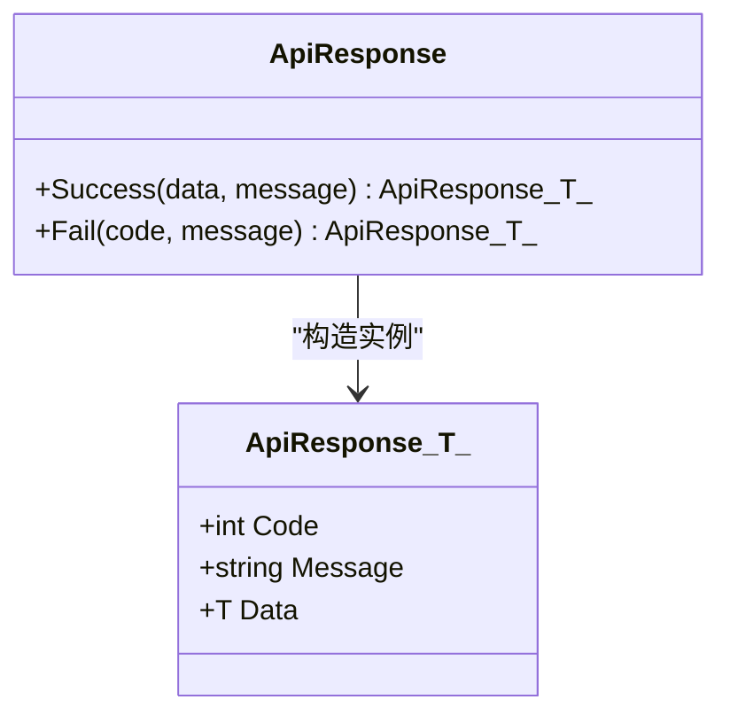
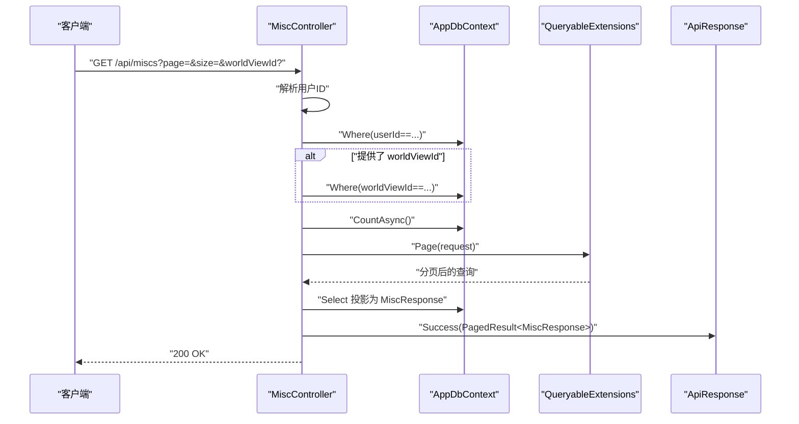
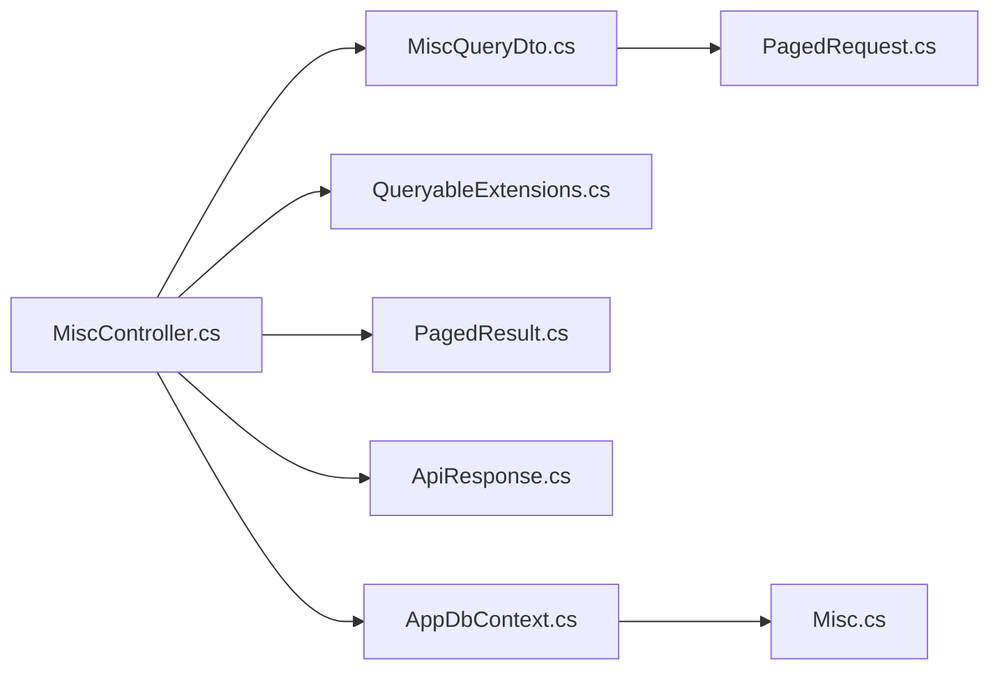

# 分页架构

<cite>
**本文引用的文件**
- [Program.cs](file://Program.cs)
- [appsettings.json](file://appsettings.json)
- [src/structure/PagedRequest.cs](file://src/structure/PagedRequest.cs)
- [src/structure/PagedResult.cs](file://src/structure/PagedResult.cs)
- [src/structure/QueryableExtensions.cs](file://src/structure/QueryableExtensions.cs)
- [src/structure/ApiResponse.cs](file://src/structure/ApiResponse.cs)
- [src/data/AppDbContext.cs](file://src/data/AppDbContext.cs)
- [src/data/dto/MiscQueryDto.cs](file://src/data/dto/MiscQueryDto.cs)
- [src/data/dto/MiscDto.cs](file://src/data/dto/MiscDto.cs)
- [src/data/entities/Misc.cs](file://src/data/entities/Misc.cs)
- [src/application/controllers/worldview/MiscController.cs](file://src/application/controllers/worldview/MiscController.cs)
</cite>

## 目录
1. [引言](#引言)
2. [项目结构](#项目结构)
3. [核心组件](#核心组件)
4. [架构总览](#架构总览)
5. [详细组件分析](#详细组件分析)
6. [依赖关系分析](#依赖关系分析)
7. [性能考量](#性能考量)
8. [故障排查指南](#故障排查指南)
9. [结论](#结论)

## 引言
本文件系统性梳理并文档化本仓库中的“分页架构”，聚焦于通用分页请求与结果模型、LINQ 查询扩展、以及在控制器层的实际应用。通过统一的分页契约，确保不同资源在查询时具备一致的行为与响应格式，便于前端稳定消费。

## 项目结构
分页相关能力主要分布在以下层次：
- 结构层：定义分页请求与结果模型、LINQ 扩展方法
- 数据层：EF Core 上下文与实体映射
- DTO 层：分页查询 DTO 与响应 DTO
- 控制器层：具体业务控制器对分页能力的应用

图表来源
- [src/structure/PagedRequest.cs](file://src/structure/PagedRequest.cs#L1-L18)
- [src/structure/PagedResult.cs](file://src/structure/PagedResult.cs#L1-L19)
- [src/structure/QueryableExtensions.cs](file://src/structure/QueryableExtensions.cs#L1-L24)
- [src/structure/ApiResponse.cs](file://src/structure/ApiResponse.cs#L1-L40)
- [src/data/AppDbContext.cs](file://src/data/AppDbContext.cs#L1-L28)
- [src/data/entities/Misc.cs](file://src/data/entities/Misc.cs#L1-L63)
- [src/data/dto/MiscQueryDto.cs](file://src/data/dto/MiscQueryDto.cs#L1-L15)
- [src/data/dto/MiscDto.cs](file://src/data/dto/MiscDto.cs#L1-L95)
- [src/application/controllers/worldview/MiscController.cs](file://src/application/controllers/worldview/MiscController.cs#L1-L249)

章节来源
- [Program.cs](file://Program.cs#L1-L112)
- [appsettings.json](file://appsettings.json#L1-L19)

## 核心组件
- 分页请求模型：提供默认页码与每页大小，作为查询参数的基础契约
- 分页结果模型：承载数据列表与总条目数，统一响应结构
- LINQ 扩展方法：提供基于页码与大小的 Skip/Take 分页能力
- 统一响应模型：封装业务响应的状态码、消息与数据体

章节来源
- [src/structure/PagedRequest.cs](file://src/structure/PagedRequest.cs#L1-L18)
- [src/structure/PagedResult.cs](file://src/structure/PagedResult.cs#L1-L19)
- [src/structure/QueryableExtensions.cs](file://src/structure/QueryableExtensions.cs#L1-L24)
- [src/structure/ApiResponse.cs](file://src/structure/ApiResponse.cs#L1-L40)

## 架构总览
分页在控制器中的典型流程如下：
- 控制器接收分页查询参数（继承自分页请求模型）
- 构造查询并按需添加过滤条件
- 计算总条目数
- 使用 LINQ 扩展进行分页切片
- 投影为响应 DTO
- 包装为统一响应模型并返回

图表来源
- [src/application/controllers/worldview/MiscController.cs](file://src/application/controllers/worldview/MiscController.cs#L1-L249)
- [src/structure/QueryableExtensions.cs](file://src/structure/QueryableExtensions.cs#L1-L24)
- [src/structure/ApiResponse.cs](file://src/structure/ApiResponse.cs#L1-L40)
- [src/data/AppDbContext.cs](file://src/data/AppDbContext.cs#L1-L28)

## 详细组件分析

### 分页请求与结果模型
- PagedRequest：定义 Page（从1开始）与 Size 的默认值，作为所有分页查询的输入契约
- PagedResult<T>：包含 List 与 Total 字段，用于承载分页结果

图表来源
- [src/structure/PagedRequest.cs](file://src/structure/PagedRequest.cs#L1-L18)
- [src/structure/PagedResult.cs](file://src/structure/PagedResult.cs#L1-L19)

章节来源
- [src/structure/PagedRequest.cs](file://src/structure/PagedRequest.cs#L1-L18)
- [src/structure/PagedResult.cs](file://src/structure/PagedResult.cs#L1-L19)

### LINQ 分页扩展
- 提供两个重载的 Page 方法：
  - Page(query, page, size)
  - Page(query, PagedRequest)
- 内部实现为 Skip((page - 1) * size).Take(size)，保证与前端页码约定一致

图表来源
- [src/structure/QueryableExtensions.cs](file://src/structure/QueryableExtensions.cs#L1-L24)

章节来源
- [src/structure/QueryableExtensions.cs](file://src/structure/QueryableExtensions.cs#L1-L24)

### 统一响应模型
- ApiResponse<T>：封装 Code、Message、Data
- ApiResponse 工具类：提供 Success 与 Fail 快捷方法，统一业务响应格式

图表来源
- [src/structure/ApiResponse.cs](file://src/structure/ApiResponse.cs#L1-L40)

章节来源
- [src/structure/ApiResponse.cs](file://src/structure/ApiResponse.cs#L1-L40)

### 杂项分页控制器（实际落地）
- 输入：MiscPagedRequest（继承 PagedRequest），支持可选的 WorldViewId 过滤
- 流程：
  - 解析用户标识，限定仅查询当前用户的数据
  - 可选过滤 WorldViewId
  - CountAsync 计算 Total
  - Page(request) 应用分页
  - Select 投影为 MiscResponse
  - 组装 PagedResult 并通过 ApiResponse.Success 返回

图表来源
- [src/application/controllers/worldview/MiscController.cs](file://src/application/controllers/worldview/MiscController.cs#L1-L249)
- [src/structure/QueryableExtensions.cs](file://src/structure/QueryableExtensions.cs#L1-L24)
- [src/structure/ApiResponse.cs](file://src/structure/ApiResponse.cs#L1-L40)

章节来源
- [src/application/controllers/worldview/MiscController.cs](file://src/application/controllers/worldview/MiscController.cs#L1-L249)
- [src/data/dto/MiscQueryDto.cs](file://src/data/dto/MiscQueryDto.cs#L1-L15)
- [src/data/dto/MiscDto.cs](file://src/data/dto/MiscDto.cs#L1-L95)
- [src/data/entities/Misc.cs](file://src/data/entities/Misc.cs#L1-L63)
- [src/data/AppDbContext.cs](file://src/data/AppDbContext.cs#L1-L28)

## 依赖关系分析
- 控制器依赖：
  - AppDbContext：提供 DbSet 与数据库访问
  - PagedRequest/PagedResult：作为查询与响应的契约
  - QueryableExtensions：提供 Page 扩展
  - ApiResponse：统一响应包装
- DTO 与实体：
  - MiscQueryDto 继承 PagedRequest，复用分页参数
  - Misc 实体承载字段与数据库映射
  - MiscDto 定义创建/更新/响应结构

图表来源
- [src/application/controllers/worldview/MiscController.cs](file://src/application/controllers/worldview/MiscController.cs#L1-L249)
- [src/data/dto/MiscQueryDto.cs](file://src/data/dto/MiscQueryDto.cs#L1-L15)
- [src/structure/PagedRequest.cs](file://src/structure/PagedRequest.cs#L1-L18)
- [src/structure/PagedResult.cs](file://src/structure/PagedResult.cs#L1-L19)
- [src/structure/QueryableExtensions.cs](file://src/structure/QueryableExtensions.cs#L1-L24)
- [src/structure/ApiResponse.cs](file://src/structure/ApiResponse.cs#L1-L40)
- [src/data/AppDbContext.cs](file://src/data/AppDbContext.cs#L1-L28)
- [src/data/entities/Misc.cs](file://src/data/entities/Misc.cs#L1-L63)

章节来源
- [src/application/controllers/worldview/MiscController.cs](file://src/application/controllers/worldview/MiscController.cs#L1-L249)
- [src/data/dto/MiscQueryDto.cs](file://src/data/dto/MiscQueryDto.cs#L1-L15)
- [src/structure/PagedRequest.cs](file://src/structure/PagedRequest.cs#L1-L18)
- [src/structure/PagedResult.cs](file://src/structure/PagedResult.cs#L1-L19)
- [src/structure/QueryableExtensions.cs](file://src/structure/QueryableExtensions.cs#L1-L24)
- [src/structure/ApiResponse.cs](file://src/structure/ApiResponse.cs#L1-L40)
- [src/data/AppDbContext.cs](file://src/data/AppDbContext.cs#L1-L28)
- [src/data/entities/Misc.cs](file://src/data/entities/Misc.cs#L1-L63)

## 性能考量
- 分页与排序：
  - Page 扩展使用 Skip/Take，建议配合合适的排序键（如按更新时间倒序）以提升一致性
  - 对大数据集分页时，优先在数据库侧完成排序与分页，避免在内存中处理
- 计数与分页：
  - 先 CountAsync 再 Page，确保 Total 准确；若对实时性要求极高，可考虑缓存策略或延迟计数
- 查询过滤：
  - 在控制器中先按用户维度过滤，再应用分页，避免跨用户扫描
- EF Core 映射：
  - 使用 Select 投影为 DTO，减少不必要的列加载与对象图复杂度
- 连接与中间件：
  - 程序启动配置了认证、日志与异常中间件，有助于定位性能瓶颈与错误

章节来源
- [src/application/controllers/worldview/MiscController.cs](file://src/application/controllers/worldview/MiscController.cs#L1-L249)
- [src/structure/QueryableExtensions.cs](file://src/structure/QueryableExtensions.cs#L1-L24)
- [Program.cs](file://Program.cs#L1-L112)

## 故障排查指南
- 分页参数无效：
  - 确认 Page 从1开始，Size 合理；若未传入，默认值由 PagedRequest 提供
- 查询不到数据：
  - 检查用户标识解析是否正确；控制器会按用户维度过滤
  - 若传入了 WorldViewId，请确认该世界观确实属于当前用户
- 响应格式不一致：
  - 确保使用 ApiResponse.Success/ Fail 包装响应体
- 数据库连接与日志：
  - 查看日志输出与异常中间件捕获的信息，定位连接字符串与认证配置问题

章节来源
- [src/application/controllers/worldview/MiscController.cs](file://src/application/controllers/worldview/MiscController.cs#L1-L249)
- [src/structure/ApiResponse.cs](file://src/structure/ApiResponse.cs#L1-L40)
- [Program.cs](file://Program.cs#L1-L112)
- [appsettings.json](file://appsettings.json#L1-L19)

## 结论
本项目的分页架构以简洁的契约（PagedRequest/PagedResult）与可复用的 LINQ 扩展为基础，在控制器层实现了统一、可维护的分页查询模式。通过将分页与过滤、计数、投影、统一响应组合在一起，既保证了接口的一致性，也为后续扩展其他资源的分页查询提供了清晰范式。