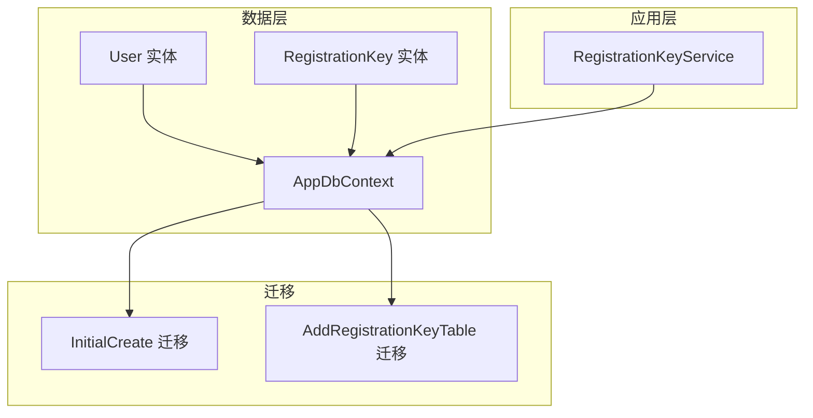
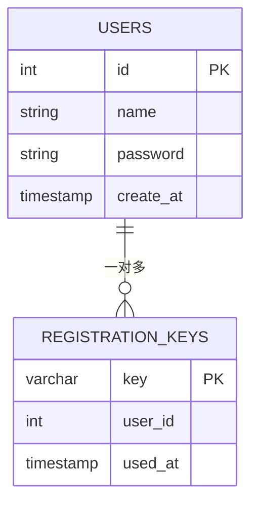
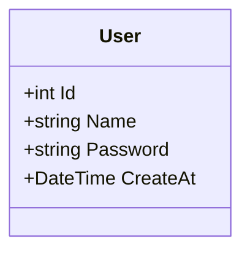
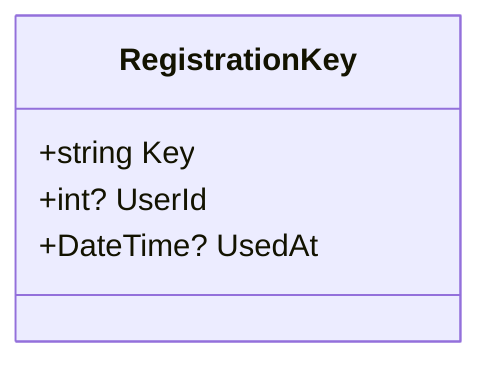
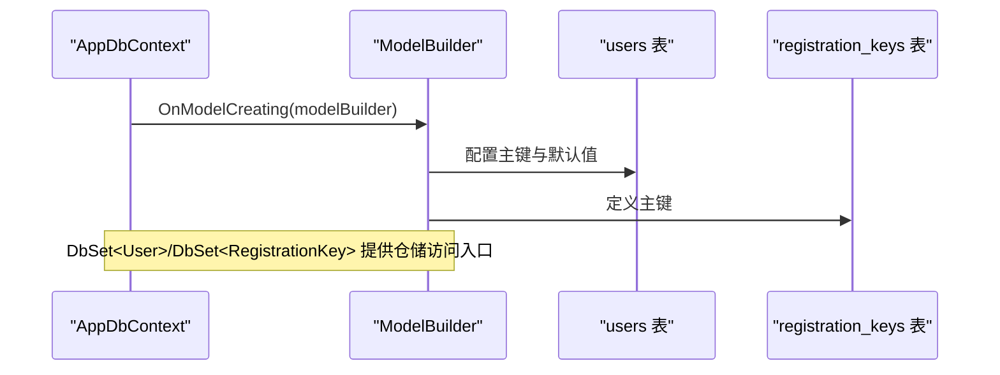
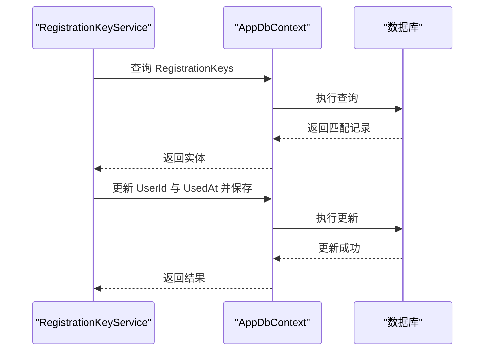
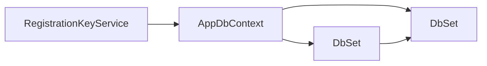

# 实体模型说明

<cite>
**本文引用的文件**
- [User.cs](file://src/data/entities/User.cs)
- [RegistrationKey.cs](file://src/data/entities/RegistrationKey.cs)
- [AppDbContext.cs](file://src/data/AppDbContext.cs)
- [20251202060311_InitialCreate.cs](file://Migrations/20251202060311_InitialCreate.cs)
- [20251217055145_AddRegistrationKeyTable.cs](file://Migrations/20251217055145_AddRegistrationKeyTable.cs)
- [RegistrationKeyService.cs](file://src/application/service/RegistrationKeyService.cs)
</cite>

## 目录
1. [简介](#简介)
2. [项目结构](#项目结构)
3. [核心组件](#核心组件)
4. [架构总览](#架构总览)
5. [详细组件分析](#详细组件分析)
6. [依赖分析](#依赖分析)
7. [性能考虑](#性能考虑)
8. [故障排查指南](#故障排查指南)
9. [结论](#结论)

## 简介
本文件聚焦于两个核心实体：User（用户）与 RegistrationKey（注册密钥）。我们将从实体属性设计、EF Core 数据注解与模型配置、数据库迁移映射、以及服务层使用方式等方面进行系统化说明，帮助读者全面理解这两个实体在仓储与业务流程中的职责与协作关系。

## 项目结构
与实体模型直接相关的文件分布如下：
- 实体定义：src/data/entities/User.cs、src/data/entities/RegistrationKey.cs
- 上下文与模型配置：src/data/AppDbContext.cs
- 数据库迁移：Migrations/20251202060311_InitialCreate.cs（users 表）、Migrations/20251217055145_AddRegistrationKeyTable.cs（registration_keys 表）
- 服务层使用示例：src/application/service/RegistrationKeyService.cs

图表来源
- [AppDbContext.cs](file://src/data/AppDbContext.cs#L1-L26)
- [User.cs](file://src/data/entities/User.cs#L1-L40)
- [RegistrationKey.cs](file://src/data/entities/RegistrationKey.cs#L1-L31)
- [20251202060311_InitialCreate.cs](file://Migrations/20251202060311_InitialCreate.cs#L1-L39)
- [20251217055145_AddRegistrationKeyTable.cs](file://Migrations/20251217055145_AddRegistrationKeyTable.cs#L1-L36)

章节来源
- [AppDbContext.cs](file://src/data/AppDbContext.cs#L1-L26)
- [User.cs](file://src/data/entities/User.cs#L1-L40)
- [RegistrationKey.cs](file://src/data/entities/RegistrationKey.cs#L1-L31)
- [20251202060311_InitialCreate.cs](file://Migrations/20251202060311_InitialCreate.cs#L1-L39)
- [20251217055145_AddRegistrationKeyTable.cs](file://Migrations/20251217055145_AddRegistrationKeyTable.cs#L1-L36)

## 核心组件
本节概述两个实体的职责与关键属性约束，便于快速建立整体认知。

- User（用户）
  - 主键：Id（对应数据库 users.id）
  - 名称：Name（最大长度50字符，必填）
  - 密码：Password（存储PBKDF2哈希后的密码，最大长度255字符，必填）
  - 创建时间：CreateAt（默认UTC时间）
- RegistrationKey（注册密钥）
  - 主键：Key（密钥字符串，最大长度255）
  - 外键：UserId（指向 User.Id，标识使用者；可空）
  - 使用时间：UsedAt（使用时间戳；可空）

章节来源
- [User.cs](file://src/data/entities/User.cs#L1-L40)
- [RegistrationKey.cs](file://src/data/entities/RegistrationKey.cs#L1-L31)

## 架构总览
User 与 RegistrationKey 的关系通过外键约束在数据库层面体现：RegistrationKey.UserId → User.Id，形成“一个用户可拥有多个注册密钥”的一对多关系。EF Core 在 AppDbContext 中通过 DbSet 暴露这两个实体，并在 OnModelCreating 中对 User 的默认值进行配置。

图表来源
- [AppDbContext.cs](file://src/data/AppDbContext.cs#L10-L25)
- [User.cs](file://src/data/entities/User.cs#L1-L40)
- [RegistrationKey.cs](file://src/data/entities/RegistrationKey.cs#L1-L31)
- [20251202060311_InitialCreate.cs](file://Migrations/20251202060311_InitialCreate.cs#L15-L28)
- [20251217055145_AddRegistrationKeyTable.cs](file://Migrations/20251217055145_AddRegistrationKeyTable.cs#L14-L25)

## 详细组件分析

### User 实体
- 属性与约束
  - Id：主键，对应数据库 users.id
  - Name：必填，最大长度50
  - Password：必填，最大长度255
  - CreateAt：默认UTC时间
- EF Core 配置
  - 在 AppDbContext 的 OnModelCreating 中，显式配置了 User 的主键与 CreateAt 的默认值（使用 SQL 默认表达式）
- 数据注解作用
  - [Key]：声明主键
  - [Column]：指定数据库列名
  - [Required]：必填约束
  - [StringLength]：长度限制
  - [Table]：指定表名

图表来源
- [User.cs](file://src/data/entities/User.cs#L1-L40)
- [AppDbContext.cs](file://src/data/AppDbContext.cs#L18-L25)

章节来源
- [User.cs](file://src/data/entities/User.cs#L1-L40)
- [AppDbContext.cs](file://src/data/AppDbContext.cs#L18-L25)
- [20251202060311_InitialCreate.cs](file://Migrations/20251202060311_InitialCreate.cs#L15-L28)

### RegistrationKey 实体
- 属性与约束
  - Key：主键，密钥字符串，最大长度255
  - UserId：外键，指向 User.Id，可空
  - UsedAt：使用时间戳，可空
- 数据注解作用
  - [Key]：声明主键
  - [Column]：指定数据库列名
  - [StringLength]：长度限制
  - [Table]：指定表名

图表来源
- [RegistrationKey.cs](file://src/data/entities/RegistrationKey.cs#L1-L31)
- [20251217055145_AddRegistrationKeyTable.cs](file://Migrations/20251217055145_AddRegistrationKeyTable.cs#L14-L25)

章节来源
- [RegistrationKey.cs](file://src/data/entities/RegistrationKey.cs#L1-L31)
- [20251217055145_AddRegistrationKeyTable.cs](file://Migrations/20251217055145_AddRegistrationKeyTable.cs#L14-L25)

### AppDbContext 中的实体管理与模型配置
- DbSet 定义
  - Users：User 实体集合
  - RegistrationKeys：RegistrationKey 实体集合
- OnModelCreating 配置
  - 对 User 的主键与 CreateAt 默认值进行配置（使用 SQL 默认表达式 CURRENT_TIMESTAMP）
- 迁移映射
  - users 表：包含 id、name、password、create_at 列，主键为 id
  - registration_keys 表：包含 key、user_id、used_at 列，主键为 key

图表来源
- [AppDbContext.cs](file://src/data/AppDbContext.cs#L10-L25)
- [20251202060311_InitialCreate.cs](file://Migrations/20251202060311_InitialCreate.cs#L15-L28)
- [20251217055145_AddRegistrationKeyTable.cs](file://Migrations/20251217055145_AddRegistrationKeyTable.cs#L14-L25)

章节来源
- [AppDbContext.cs](file://src/data/AppDbContext.cs#L10-L25)
- [20251202060311_InitialCreate.cs](file://Migrations/20251202060311_InitialCreate.cs#L15-L28)
- [20251217055145_AddRegistrationKeyTable.cs](file://Migrations/20251217055145_AddRegistrationKeyTable.cs#L14-L25)

### 关系与使用流程（服务层）
- 关系说明
  - RegistrationKey.UserId → User.Id，形成一对多关系：一个用户可持有多个注册密钥
- 服务层使用示例
  - RegistrationKeyService 提供密钥有效性检查与标记为已使用的功能，内部通过 AppDbContext 访问 RegistrationKeys 集合
  - 该服务逻辑体现了外键关系的使用：当密钥被使用时，更新其 UserId 与 UsedAt 字段

图表来源
- [RegistrationKeyService.cs](file://src/application/service/RegistrationKeyService.cs#L12-L36)
- [AppDbContext.cs](file://src/data/AppDbContext.cs#L10-L16)

章节来源
- [RegistrationKeyService.cs](file://src/application/service/RegistrationKeyService.cs#L12-L36)
- [AppDbContext.cs](file://src/data/AppDbContext.cs#L10-L16)

## 依赖分析
- 组件耦合
  - AppDbContext 同时持有 User 与 RegistrationKey 的 DbSet，是两者在仓储层的统一入口
  - RegistrationKeyService 依赖 AppDbContext，用于读写 RegistrationKey 实体
- 外键关系
  - RegistrationKey.UserId 作为外键引用 User.Id，迁移脚本定义了主键约束
- 可能的改进点
  - 当前 OnModelCreating 未显式配置外键关系，建议在 OnModelCreating 中补充外键映射以增强模型完整性与可读性

图表来源
- [AppDbContext.cs](file://src/data/AppDbContext.cs#L10-L16)
- [RegistrationKeyService.cs](file://src/application/service/RegistrationKeyService.cs#L12-L36)

章节来源
- [AppDbContext.cs](file://src/data/AppDbContext.cs#L10-L16)
- [RegistrationKeyService.cs](file://src/application/service/RegistrationKeyService.cs#L12-L36)

## 性能考虑
- 建议在 RegistrationKey.Key 与 RegistrationKey.UserId 上建立索引，以优化密钥查找与外键关联查询
- 对于高频的密钥校验场景，可在数据库层面增加唯一性约束或复合索引，减少重复校验成本
- 使用分页与条件过滤避免全表扫描

## 故障排查指南
- 密钥无效
  - 现象：IsKeyValidAsync 返回 false
  - 排查：确认密钥是否存在于 registration_keys 表且 UserId 为空
  - 参考路径：[RegistrationKeyService.cs](file://src/application/service/RegistrationKeyService.cs#L15-L19)
- 标记密钥为已使用失败
  - 现象：MarkKeyAsUsedAsync 未更新或日志无记录
  - 排查：确认传入的 key 是否存在；检查 SaveChanges 是否抛出异常；查看 UsedAt 是否正确更新
  - 参考路径：[RegistrationKeyService.cs](file://src/application/service/RegistrationKeyService.cs#L24-L36)
- 数据库迁移问题
  - 现象：users 或 registration_keys 表结构不一致
  - 排查：核对迁移文件与实体注解是否一致；确认主键与默认值配置
  - 参考路径：
    - [20251202060311_InitialCreate.cs](file://Migrations/20251202060311_InitialCreate.cs#L15-L28)
    - [20251217055145_AddRegistrationKeyTable.cs](file://Migrations/20251217055145_AddRegistrationKeyTable.cs#L14-L25)

章节来源
- [RegistrationKeyService.cs](file://src/application/service/RegistrationKeyService.cs#L15-L36)
- [20251202060311_InitialCreate.cs](file://Migrations/20251202060311_InitialCreate.cs#L15-L28)
- [20251217055145_AddRegistrationKeyTable.cs](file://Migrations/20251217055145_AddRegistrationKeyTable.cs#L14-L25)

## 结论
User 与 RegistrationKey 是系统中重要的身份与注册控制实体。User 负责用户基本信息与默认创建时间，RegistrationKey 负责注册流程中的密钥发放与使用追踪。通过 AppDbContext 的 DbSet 与 OnModelCreating 配置，二者在仓储层得到清晰管理；服务层通过 RegistrationKeyService 将密钥校验与使用流程落地。建议后续在模型配置中补充外键关系映射，以进一步提升模型的完整性与可维护性。