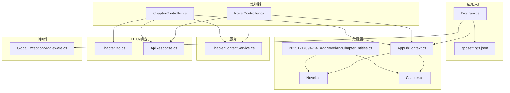
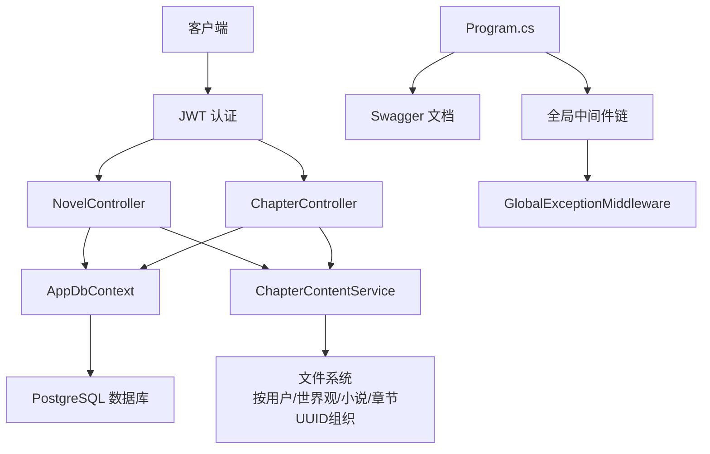
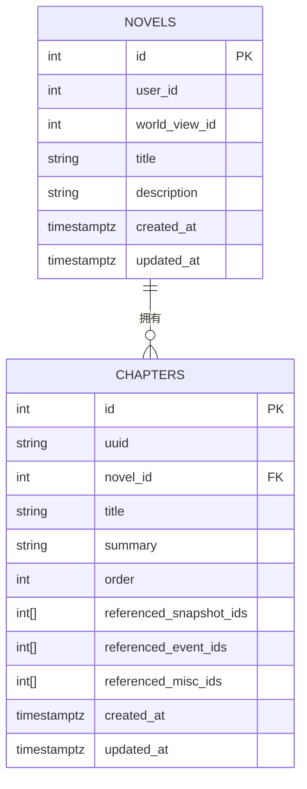
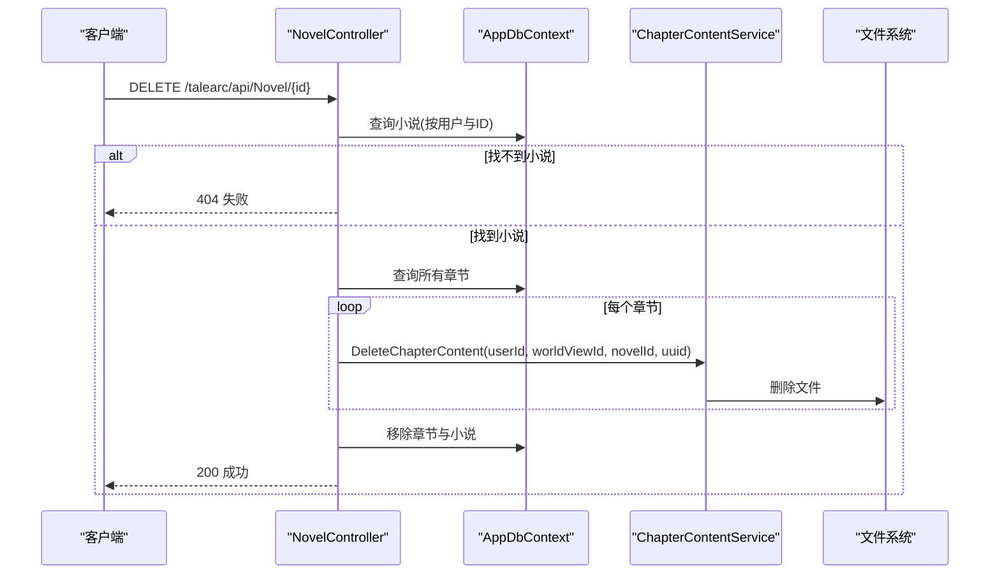
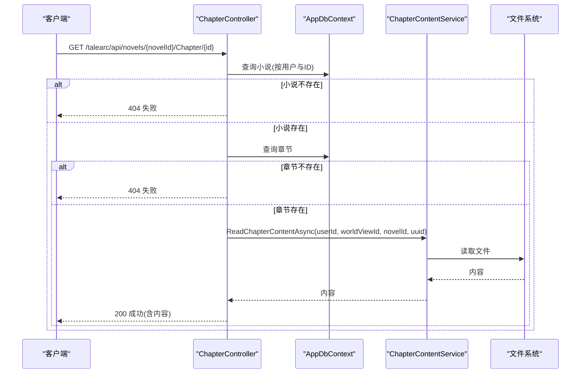
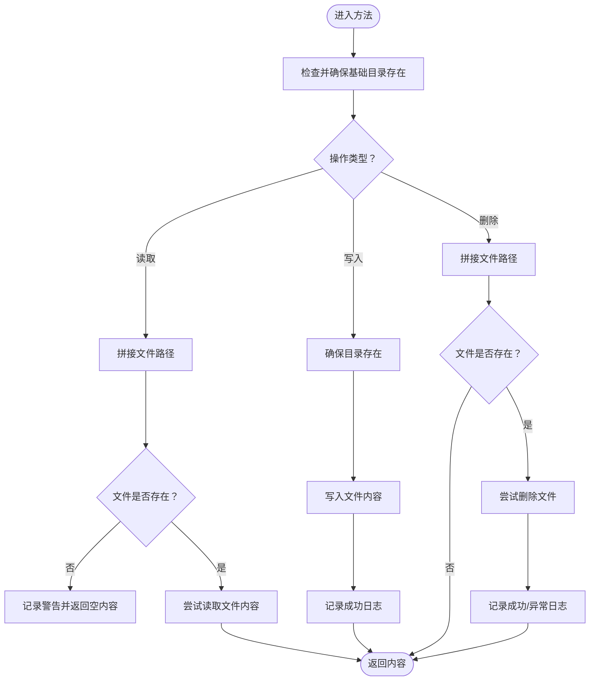
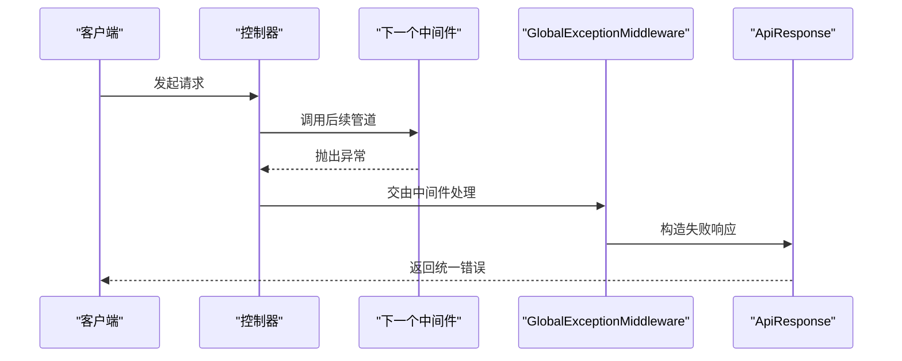
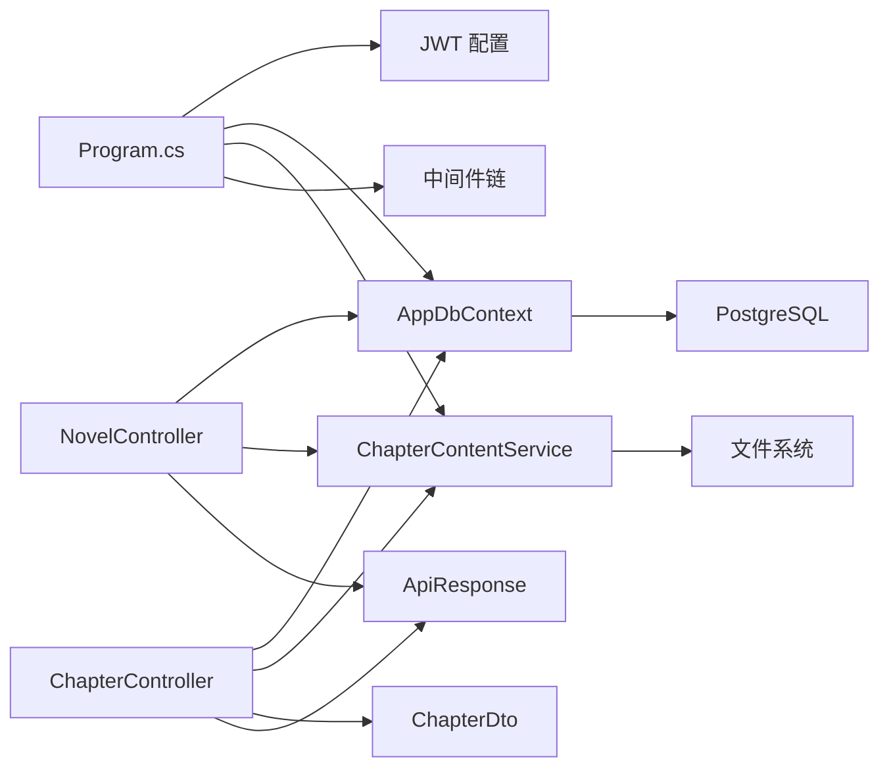

# 小说与章节管理

<cite>
**本文引用的文件**
- [Program.cs](file://Program.cs)
- [appsettings.json](file://appsettings.json)
- [AppDbContext.cs](file://src/data/AppDbContext.cs)
- [Novel.cs](file://src/data/entities/Novel.cs)
- [Chapter.cs](file://src/data/entities/Chapter.cs)
- [ChapterDto.cs](file://src/data/dto/ChapterDto.cs)
- [NovelController.cs](file://src/application/controllers/novel/NovelController.cs)
- [ChapterController.cs](file://src/application/controllers/novel/ChapterController.cs)
- [ChapterContentService.cs](file://src/application/service/ChapterContentService.cs)
- [ApiResponse.cs](file://src/structure/ApiResponse.cs)
- [GlobalExceptionMiddleware.cs](file://src/middleware/GlobalExceptionMiddleware.cs)
- [20251217094734_AddNovelAndChapterEntities.cs](file://Migrations/20251217094734_AddNovelAndChapterEntities.cs)
</cite>

## 目录
1. [引言](#引言)
2. [项目结构](#项目结构)
3. [核心组件](#核心组件)
4. [架构总览](#架构总览)
5. [详细组件分析](#详细组件分析)
6. [依赖关系分析](#依赖关系分析)
7. [性能考虑](#性能考虑)
8. [故障排查指南](#故障排查指南)
9. [结论](#结论)
10. [附录](#附录)

## 引言
本文件聚焦于“小说与章节管理”子系统，覆盖从数据库模型、控制器接口、内容存储到统一响应与中间件的整体设计。系统通过 JWT 认证保护 API，使用 Entity Framework Core 进行数据持久化，并将章节内容以文本文件形式按用户/世界观/小说/章节 UUID 的层级结构进行组织与管理。文档提供架构图、调用序列图与流程图，帮助开发者快速理解并扩展该模块。

## 项目结构
- 应用入口与配置：Program.cs 负责注册数据库、认证、Swagger、中间件与控制器映射；appsettings.json 提供 JWT 密钥、数据库连接与内容存储根路径。
- 数据层：AppDbContext 定义实体集合作为 EF 模型入口；迁移文件定义 novels 与 chapters 表结构。
- 控制器层：NovelController 与 ChapterController 分别提供小说与章节的 CRUD 及内容读写。
- 服务层：ChapterContentService 负责章节内容文件的读写与删除。
- DTO 层：ChapterRequest/ChapterResponse 定义章节请求与响应结构。
- 统一响应：ApiResponse 提供统一的响应包装。
- 中间件：GlobalExceptionMiddleware 捕获未处理异常并返回统一错误响应。

图表来源
- [Program.cs](file://Program.cs#L1-L112)
- [appsettings.json](file://appsettings.json#L1-L19)
- [AppDbContext.cs](file://src/data/AppDbContext.cs#L1-L28)
- [20251217094734_AddNovelAndChapterEntities.cs](file://Migrations/20251217094734_AddNovelAndChapterEntities.cs#L1-L67)
- [Novel.cs](file://src/data/entities/Novel.cs#L1-L60)
- [Chapter.cs](file://src/data/entities/Chapter.cs#L1-L86)
- [NovelController.cs](file://src/application/controllers/novel/NovelController.cs#L1-L164)
- [ChapterController.cs](file://src/application/controllers/novel/ChapterController.cs#L1-L252)
- [ChapterContentService.cs](file://src/application/service/ChapterContentService.cs#L1-L104)
- [ChapterDto.cs](file://src/data/dto/ChapterDto.cs#L1-L35)
- [ApiResponse.cs](file://src/structure/ApiResponse.cs#L1-L40)
- [GlobalExceptionMiddleware.cs](file://src/middleware/GlobalExceptionMiddleware.cs#L1-L45)

章节来源
- [Program.cs](file://Program.cs#L1-L112)
- [appsettings.json](file://appsettings.json#L1-L19)
- [AppDbContext.cs](file://src/data/AppDbContext.cs#L1-L28)
- [20251217094734_AddNovelAndChapterEntities.cs](file://Migrations/20251217094734_AddNovelAndChapterEntities.cs#L1-L67)

## 核心组件
- 小说实体（Novel）：包含用户 ID、世界观 ID、标题、描述、创建与更新时间等字段，主键为自增整数。
- 章节实体（Chapter）：包含 UUID、所属小说 ID、标题、概述、排序、引用的角色/事件/杂项 ID 数组，以及创建与更新时间。
- 小说控制器（NovelController）：提供获取列表/详情、创建、更新、删除小说的接口；删除时会级联删除对应章节内容文件并移除章节与小说记录。
- 章节控制器（ChapterController）：提供获取章节列表/详情（含内容）、创建、更新、删除章节的接口；内容读写由 ChapterContentService 完成。
- 章节内容服务（ChapterContentService）：负责根据用户、世界观、小说与章节 UUID 组合的路径读取/写入/删除章节内容文件。
- DTO（ChapterRequest/ChapterResponse）：封装章节请求与响应字段，支持内容字段可空。
- 统一响应（ApiResponse）：统一返回结构，包含状态码、消息与数据。
- 全局异常中间件（GlobalExceptionMiddleware）：捕获未处理异常并返回统一错误响应。

章节来源
- [Novel.cs](file://src/data/entities/Novel.cs#L1-L60)
- [Chapter.cs](file://src/data/entities/Chapter.cs#L1-L86)
- [NovelController.cs](file://src/application/controllers/novel/NovelController.cs#L1-L164)
- [ChapterController.cs](file://src/application/controllers/novel/ChapterController.cs#L1-L252)
- [ChapterContentService.cs](file://src/application/service/ChapterContentService.cs#L1-L104)
- [ChapterDto.cs](file://src/data/dto/ChapterDto.cs#L1-L35)
- [ApiResponse.cs](file://src/structure/ApiResponse.cs#L1-L40)
- [GlobalExceptionMiddleware.cs](file://src/middleware/GlobalExceptionMiddleware.cs#L1-L45)

## 架构总览
系统采用分层架构：
- 表现层：控制器暴露 REST 接口，接收请求并返回 ApiResponse。
- 应用层：服务负责业务逻辑（如章节内容文件操作）。
- 数据访问层：EF Core DbContext 管理实体集合与数据库交互。
- 基础设施：中间件提供日志与异常处理；配置文件提供 JWT 与存储路径。

图表来源
- [Program.cs](file://Program.cs#L1-L112)
- [NovelController.cs](file://src/application/controllers/novel/NovelController.cs#L1-L164)
- [ChapterController.cs](file://src/application/controllers/novel/ChapterController.cs#L1-L252)
- [ChapterContentService.cs](file://src/application/service/ChapterContentService.cs#L1-L104)
- [AppDbContext.cs](file://src/data/AppDbContext.cs#L1-L28)
- [GlobalExceptionMiddleware.cs](file://src/middleware/GlobalExceptionMiddleware.cs#L1-L45)

## 详细组件分析

### 数据模型与迁移
- 小说表（novels）：主键 id，外键 user_id、world_view_id，title、description、created_at、updated_at。
- 章节表（chapters）：主键 id，uuid（36位字符串）、novel_id、title、summary、order、引用数组字段、created_at、updated_at。
- 迁移脚本确保表结构与实体一致，并定义了主键约束。

图表来源
- [20251217094734_AddNovelAndChapterEntities.cs](file://Migrations/20251217094734_AddNovelAndChapterEntities.cs#L1-L67)
- [Novel.cs](file://src/data/entities/Novel.cs#L1-L60)
- [Chapter.cs](file://src/data/entities/Chapter.cs#L1-L86)

章节来源
- [20251217094734_AddNovelAndChapterEntities.cs](file://Migrations/20251217094734_AddNovelAndChapterEntities.cs#L1-L67)
- [Novel.cs](file://src/data/entities/Novel.cs#L1-L60)
- [Chapter.cs](file://src/data/entities/Chapter.cs#L1-L86)

### 控制器与业务流程

#### 小说控制器（NovelController）
- 路由：/talearc/api/Novel
- 关键能力：
  - 列表查询：按当前用户过滤，可选按世界观筛选，按更新时间倒序。
  - 详情查询：校验小说归属当前用户。
  - 创建：设置用户 ID、创建与更新时间为当前时间。
  - 更新：校验归属后更新字段。
  - 删除：先删除所有章节的内容文件，再删除章节与小说记录。

图表来源
- [NovelController.cs](file://src/application/controllers/novel/NovelController.cs#L1-L164)
- [ChapterContentService.cs](file://src/application/service/ChapterContentService.cs#L1-L104)

章节来源
- [NovelController.cs](file://src/application/controllers/novel/NovelController.cs#L1-L164)

#### 章节控制器（ChapterController）
- 路由：/talearc/api/novels/{novelId}/Chapter
- 关键能力：
  - 列表查询：按小说 ID 与排序字段返回章节摘要。
  - 详情查询：返回章节元数据与内容（通过服务读取文件）。
  - 创建：写入章节元数据并保存内容文件。
  - 更新：更新元数据并同步内容文件。
  - 删除：删除内容文件后移除章节记录。

图表来源
- [ChapterController.cs](file://src/application/controllers/novel/ChapterController.cs#L1-L252)
- [ChapterContentService.cs](file://src/application/service/ChapterContentService.cs#L1-L104)

章节来源
- [ChapterController.cs](file://src/application/controllers/novel/ChapterController.cs#L1-L252)

#### 章节内容文件服务（ChapterContentService）
- 存储路径：基于配置的 BasePath，按用户 ID、世界观 ID、小说 ID、章节 UUID 组织文件路径。
- 功能：读取、写入、删除章节内容文件；对不存在与异常进行日志记录与抛出。

图表来源
- [ChapterContentService.cs](file://src/application/service/ChapterContentService.cs#L1-L104)
- [appsettings.json](file://appsettings.json#L1-L19)

章节来源
- [ChapterContentService.cs](file://src/application/service/ChapterContentService.cs#L1-L104)
- [appsettings.json](file://appsettings.json#L1-L19)

### 统一响应与异常处理
- 统一响应：Success/ Fail 工具方法返回固定结构，便于前端统一处理。
- 全局异常中间件：捕获未处理异常，记录日志并返回 500 错误响应。

图表来源
- [ApiResponse.cs](file://src/structure/ApiResponse.cs#L1-L40)
- [GlobalExceptionMiddleware.cs](file://src/middleware/GlobalExceptionMiddleware.cs#L1-L45)

章节来源
- [ApiResponse.cs](file://src/structure/ApiResponse.cs#L1-L40)
- [GlobalExceptionMiddleware.cs](file://src/middleware/GlobalExceptionMiddleware.cs#L1-L45)

## 依赖关系分析
- 控制器依赖 DbContext 与 ChapterContentService。
- ChapterController 同时依赖 DTO（ChapterRequest/ChapterResponse）与统一响应。
- 程序入口注册认证、EF、Swagger、中间件与服务。
- 文件系统路径依赖配置文件中的 ContentStorage:BasePath。

图表来源
- [Program.cs](file://Program.cs#L1-L112)
- [NovelController.cs](file://src/application/controllers/novel/NovelController.cs#L1-L164)
- [ChapterController.cs](file://src/application/controllers/novel/ChapterController.cs#L1-L252)
- [ChapterContentService.cs](file://src/application/service/ChapterContentService.cs#L1-L104)
- [ApiResponse.cs](file://src/structure/ApiResponse.cs#L1-L40)
- [ChapterDto.cs](file://src/data/dto/ChapterDto.cs#L1-L35)

章节来源
- [Program.cs](file://Program.cs#L1-L112)
- [ChapterDto.cs](file://src/data/dto/ChapterDto.cs#L1-L35)

## 性能考虑
- 数据库查询：
  - 小说列表按用户与可选的世界观过滤，排序使用更新时间倒序，适合高频读取场景。
  - 章节列表按顺序字段排序，避免额外排序开销。
- 文件 I/O：
  - 内容读写采用异步 API，减少阻塞；写入前确保目录存在，避免频繁 IO 异常。
  - 删除操作仅在文件存在时执行，降低无效 I/O。
- 缓存建议：
  - 对热门章节内容可引入缓存层（如内存缓存或分布式缓存），减少磁盘读取压力。
- 并发与事务：
  - 删除小说时先删除内容文件再批量删除章节与小说，建议在事务中执行以保证一致性（当前实现为多次 SaveChanges，可评估合并为单事务）。

## 故障排查指南
- 404 小说不存在/章节不存在：
  - 控制器在查询不到目标资源时返回统一失败响应，请确认请求参数与用户归属。
- 500 服务器内部错误：
  - 全局异常中间件会捕获未处理异常并返回统一错误；查看日志文件定位具体异常。
- 文件读取失败：
  - 当内容文件缺失时会记录警告并返回空内容；若写入/删除失败会记录错误日志并抛出异常。
- 配置问题：
  - 确认 appsettings.json 中的 ContentStorage:BasePath 是否可写，以及 JWT 密钥与数据库连接字符串是否正确。

章节来源
- [ChapterController.cs](file://src/application/controllers/novel/ChapterController.cs#L1-L252)
- [NovelController.cs](file://src/application/controllers/novel/NovelController.cs#L1-L164)
- [GlobalExceptionMiddleware.cs](file://src/middleware/GlobalExceptionMiddleware.cs#L1-L45)
- [ChapterContentService.cs](file://src/application/service/ChapterContentService.cs#L1-L104)
- [appsettings.json](file://appsettings.json#L1-L19)

## 结论
该模块围绕“小说-章节-内容文件”的三层结构构建，控制器负责资源编排，服务负责内容持久化，统一响应与中间件保障了接口的一致性与稳定性。通过清晰的路由与严格的用户归属校验，系统实现了安全可控的小说创作与管理能力。建议后续在高并发场景下引入缓存与事务优化，并完善章节内容的版本控制与权限隔离策略。

## 附录
- API 路由与行为概览（基于控制器注解与实现）：
  - 小说：GET/POST/PUT/DELETE /talearc/api/Novel
  - 章节：GET/POST/PUT/DELETE /talearc/api/novels/{novelId}/Chapter
- 关键字段说明：
  - 章节 UUID：用于文件路径定位，确保唯一性。
  - 引用数组：用于关联角色快照、世界事件与杂项资源。
- 配置项：
  - ContentStorage:BasePath：内容文件存储根目录。
  - Jwt:SecretKey、Jwt:ExpirationMinutes：JWT 认证密钥与过期时间。
  - ConnectionStrings:DefaultConnection：数据库连接字符串。

章节来源
- [NovelController.cs](file://src/application/controllers/novel/NovelController.cs#L1-L164)
- [ChapterController.cs](file://src/application/controllers/novel/ChapterController.cs#L1-L252)
- [appsettings.json](file://appsettings.json#L1-L19)