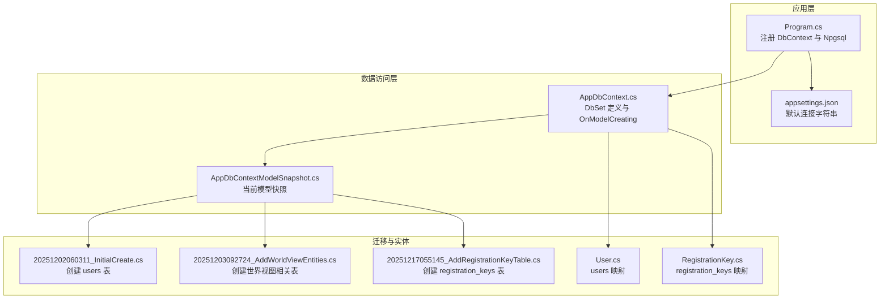
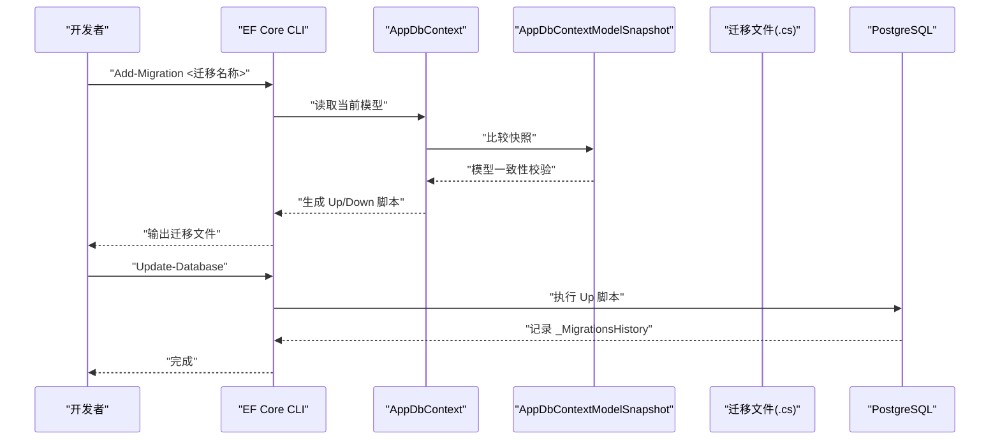
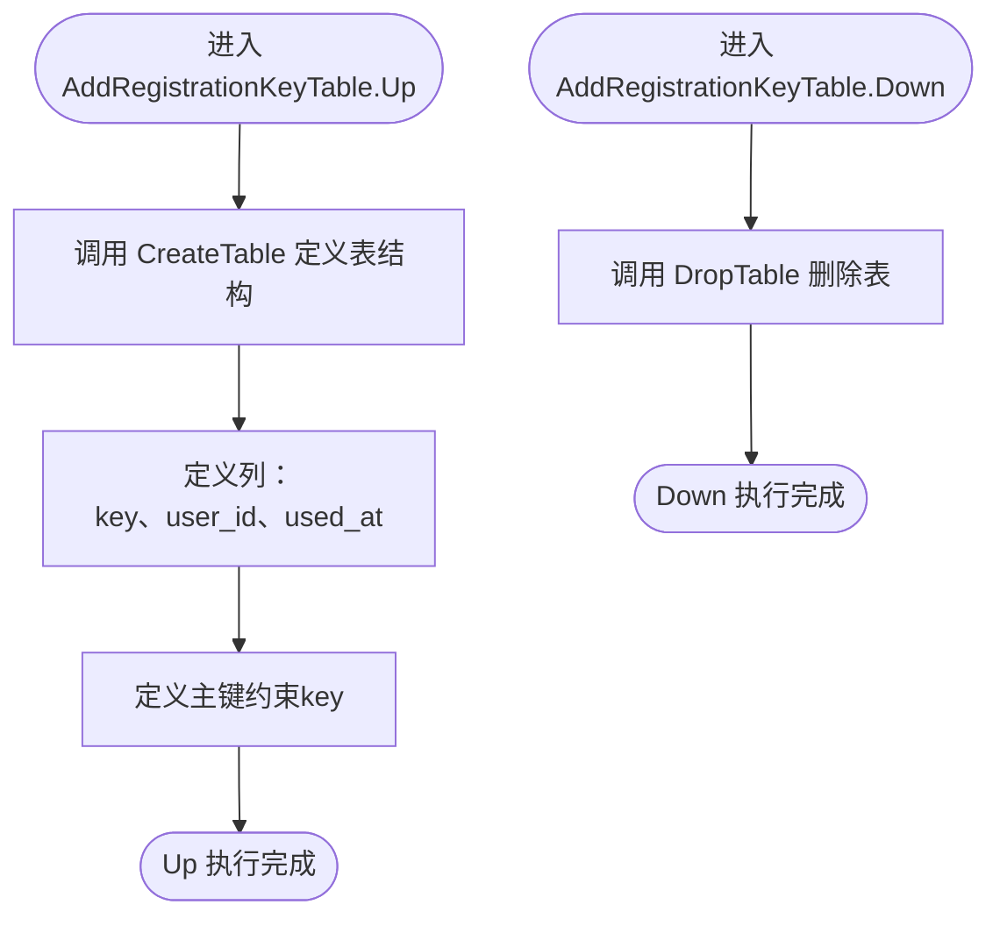
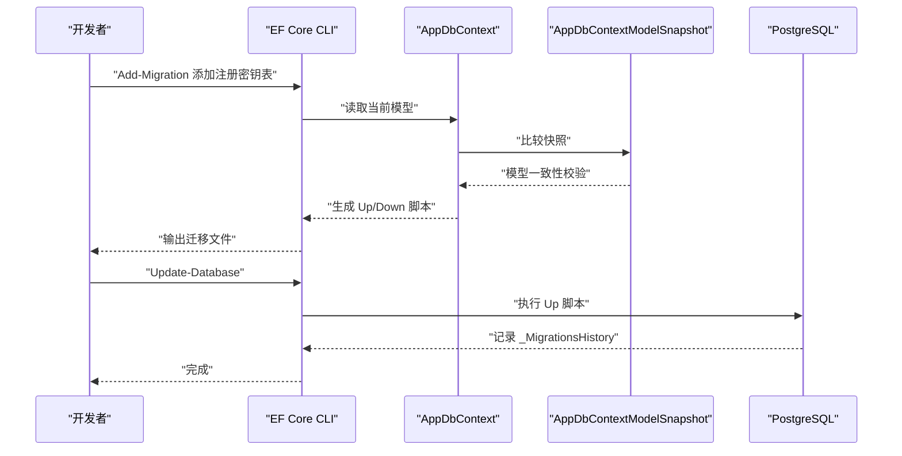
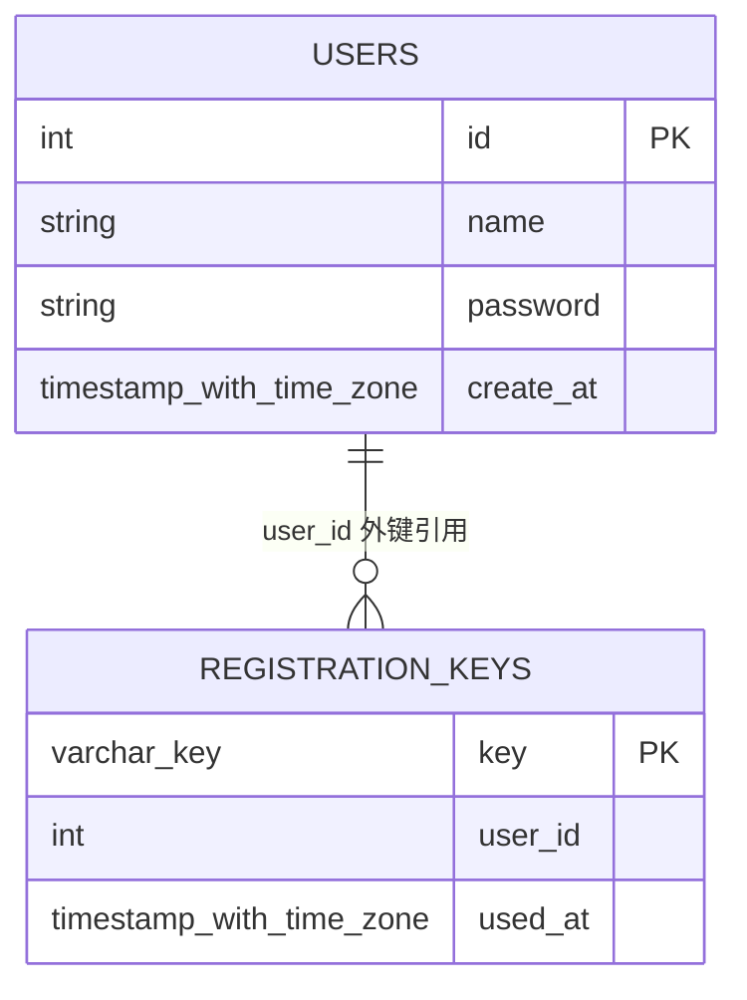
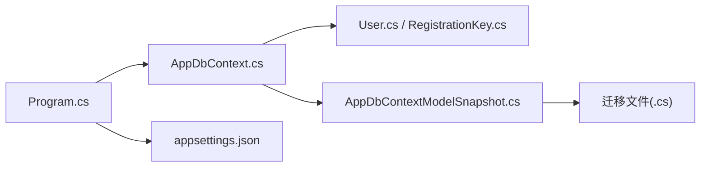

# 数据库迁移管理

<cite>
**本文引用的文件**
- [Program.cs](file://Program.cs)
- [appsettings.json](file://appsettings.json)
- [src/data/AppDbContext.cs](file://src/data/AppDbContext.cs)
- [src/data/entities/User.cs](file://src/data/entities/User.cs)
- [src/data/entities/RegistrationKey.cs](file://src/data/entities/RegistrationKey.cs)
- [Migrations/20251202060311_InitialCreate.cs](file://Migrations/20251202060311_InitialCreate.cs)
- [Migrations/20251203092724_AddWorldViewEntities.cs](file://Migrations/20251203092724_AddWorldViewEntities.cs)
- [Migrations/20251217055145_AddRegistrationKeyTable.cs](file://Migrations/20251217055145_AddRegistrationKeyTable.cs)
- [Migrations/AppDbContextModelSnapshot.cs](file://Migrations/AppDbContextModelSnapshot.cs)
</cite>

## 目录
1. [引言](#引言)
2. [项目结构](#项目结构)
3. [核心组件](#核心组件)
4. [架构总览](#架构总览)
5. [详细组件分析](#详细组件分析)
6. [依赖关系分析](#依赖关系分析)
7. [性能考量](#性能考量)
8. [故障排查指南](#故障排查指南)
9. [结论](#结论)
10. [附录](#附录)

## 引言
本文件系统性记录基于 EF Core 的数据库迁移机制，围绕以下目标展开：
- 解释迁移文件命名规则（时间戳+描述）及其作用，如 InitialCreate 迁移负责创建初始表结构（包括 users 表），AddRegistrationKeyTable 迁移则添加 registration_keys 表。
- 分析 AddRegistrationKeyTable.cs 中的 Up 方法，展示如何通过 modelBuilder.CreateTable 构建新表，定义主键、字段类型等；Down 方法用于回滚删除表。
- 阐述迁移与 AppDbContext 的协同工作流程：代码优先（Code-First）设计如何通过 Add-Migration 命令生成迁移脚本，再通过 Update-Database 应用到 PostgreSQL 数据库。
- 提供实际迁移命令示例，并强调迁移历史记录在 _MigrationsHistory 表中的存储机制。
- 说明 AppDbContextModelSnapshot 的作用：维护当前模型的快照以确保迁移一致性。

## 项目结构
该项目采用“代码优先（Code-First）”方式管理数据库演进，核心由以下部分组成：
- 数据上下文：AppDbContext，定义 DbSet 并在 OnModelCreating 中进行少量实体级配置。
- 实体模型：User、RegistrationKey 等，映射到 users、registration_keys 等表。
- 迁移目录：包含多个迁移文件（含 Up/Down 方法）以及一个 ModelSnapshot 文件，用于记录当前模型快照。
- 应用启动配置：Program.cs 中注册 EF Core 并使用 Npgsql 连接 PostgreSQL，默认连接字符串来自 appsettings.json。

图表来源
- [Program.cs](file://Program.cs#L24-L26)
- [appsettings.json](file://appsettings.json#L6-L8)
- [src/data/AppDbContext.cs](file://src/data/AppDbContext.cs#L1-L26)
- [Migrations/AppDbContextModelSnapshot.cs](file://Migrations/AppDbContextModelSnapshot.cs#L1-L345)
- [Migrations/20251202060311_InitialCreate.cs](file://Migrations/20251202060311_InitialCreate.cs#L1-L39)
- [Migrations/20251203092724_AddWorldViewEntities.cs](file://Migrations/20251203092724_AddWorldViewEntities.cs#L1-L137)
- [Migrations/20251217055145_AddRegistrationKeyTable.cs](file://Migrations/20251217055145_AddRegistrationKeyTable.cs#L1-L36)
- [src/data/entities/User.cs](file://src/data/entities/User.cs#L1-L40)
- [src/data/entities/RegistrationKey.cs](file://src/data/entities/RegistrationKey.cs#L1-L31)

章节来源
- [Program.cs](file://Program.cs#L24-L26)
- [appsettings.json](file://appsettings.json#L6-L8)
- [src/data/AppDbContext.cs](file://src/data/AppDbContext.cs#L1-L26)
- [Migrations/AppDbContextModelSnapshot.cs](file://Migrations/AppDbContextModelSnapshot.cs#L1-L345)

## 核心组件
- AppDbContext：定义所有实体的 DbSet，并在 OnModelCreating 中为 User 实体设置默认值策略等。
- 实体映射：
  - User：映射到 users 表，包含 id、name、password、create_at 等列。
  - RegistrationKey：映射到 registration_keys 表，包含 key、user_id、used_at 等列。
- 迁移文件：
  - InitialCreate：创建 users 表。
  - AddWorldViewEntities：创建 character、character_snapshots、Miscs、WorldEvents、WorldViews 等表。
  - AddRegistrationKeyTable：创建 registration_keys 表。
- 模型快照 AppDbContextModelSnapshot：记录当前模型状态，确保迁移生成与当前模型一致。

章节来源
- [src/data/AppDbContext.cs](file://src/data/AppDbContext.cs#L1-L26)
- [src/data/entities/User.cs](file://src/data/entities/User.cs#L1-L40)
- [src/data/entities/RegistrationKey.cs](file://src/data/entities/RegistrationKey.cs#L1-L31)
- [Migrations/20251202060311_InitialCreate.cs](file://Migrations/20251202060311_InitialCreate.cs#L1-L39)
- [Migrations/20251203092724_AddWorldViewEntities.cs](file://Migrations/20251203092724_AddWorldViewEntities.cs#L1-L137)
- [Migrations/20251217055145_AddRegistrationKeyTable.cs](file://Migrations/20251217055145_AddRegistrationKeyTable.cs#L1-L36)
- [Migrations/AppDbContextModelSnapshot.cs](file://Migrations/AppDbContextModelSnapshot.cs#L1-L345)

## 架构总览
下图展示了从代码到数据库的迁移路径：开发者通过 Add-Migration 生成迁移脚本，随后通过 Update-Database 将脚本应用到 PostgreSQL；EF Core 在运行时读取 AppDbContext 的模型并通过 ModelSnapshot 校验一致性。

图表来源
- [Program.cs](file://Program.cs#L24-L26)
- [Migrations/AppDbContextModelSnapshot.cs](file://Migrations/AppDbContextModelSnapshot.cs#L1-L345)
- [Migrations/20251202060311_InitialCreate.cs](file://Migrations/20251202060311_InitialCreate.cs#L1-L39)
- [Migrations/20251203092724_AddWorldViewEntities.cs](file://Migrations/20251203092724_AddWorldViewEntities.cs#L1-L137)
- [Migrations/20251217055145_AddRegistrationKeyTable.cs](file://Migrations/20251217055145_AddRegistrationKeyTable.cs#L1-L36)

## 详细组件分析

### 迁移文件命名规则与作用
- 命名规则：时间戳前缀（年月日时分秒）+ 描述，例如：
  - 20251202060311_InitialCreate.cs：创建 users 表。
  - 20251203092724_AddWorldViewEntities.cs：创建世界视图相关表族。
  - 20251217055145_AddRegistrationKeyTable.cs：创建 registration_keys 表。
- 作用：
  - InitialCreate：负责创建初始表结构，确保数据库与实体模型首次对齐。
  - AddRegistrationKeyTable：在已有模型基础上新增 registration_keys 表，支持后续业务扩展。

章节来源
- [Migrations/20251202060311_InitialCreate.cs](file://Migrations/20251202060311_InitialCreate.cs#L1-L39)
- [Migrations/20251203092724_AddWorldViewEntities.cs](file://Migrations/20251203092724_AddWorldViewEntities.cs#L1-L137)
- [Migrations/20251217055145_AddRegistrationKeyTable.cs](file://Migrations/20251217055145_AddRegistrationKeyTable.cs#L1-L36)

### AddRegistrationKeyTable 迁移：Up/Down 方法详解
- Up 方法：
  - 通过 CreateTable 定义 registration_keys 表，包含 key、user_id、used_at 字段。
  - 主键约束：以 key 作为主键。
  - 字段类型：key 为可变长度字符，user_id 为整数（允许空值），used_at 为带时区的时间戳（允许空值）。
- Down 方法：
  - 通过 DropTable 删除 registration_keys 表，实现回滚。

图表来源
- [Migrations/20251217055145_AddRegistrationKeyTable.cs](file://Migrations/20251217055145_AddRegistrationKeyTable.cs#L1-L36)

章节来源
- [Migrations/20251217055145_AddRegistrationKeyTable.cs](file://Migrations/20251217055145_AddRegistrationKeyTable.cs#L1-L36)

### 迁移与 AppDbContext 的协同工作流程
- 代码优先（Code-First）：
  - 开发者修改实体或 DbContext 配置后，使用 Add-Migration 生成迁移脚本。
  - 使用 Update-Database 将脚本应用到数据库。
- 运行时依赖：
  - Program.cs 中注册 AppDbContext，并通过 UseNpgsql 指定 PostgreSQL 连接。
  - 默认连接字符串来自 appsettings.json 的 DefaultConnection。
- 模型快照：
  - AppDbContextModelSnapshot 记录当前模型状态，EF Core 在生成新迁移时会与快照对比，确保迁移脚本与当前模型一致。

图表来源
- [Program.cs](file://Program.cs#L24-L26)
- [appsettings.json](file://appsettings.json#L6-L8)
- [Migrations/AppDbContextModelSnapshot.cs](file://Migrations/AppDbContextModelSnapshot.cs#L1-L345)
- [Migrations/20251217055145_AddRegistrationKeyTable.cs](file://Migrations/20251217055145_AddRegistrationKeyTable.cs#L1-L36)

章节来源
- [Program.cs](file://Program.cs#L24-L26)
- [appsettings.json](file://appsettings.json#L6-L8)
- [Migrations/AppDbContextModelSnapshot.cs](file://Migrations/AppDbContextModelSnapshot.cs#L1-L345)

### 迁移历史记录与 _MigrationsHistory
- EF Core 在每次成功应用迁移后，会在数据库中写入一条记录到 _MigrationsHistory 表，记录已应用的迁移版本（即迁移文件名，不含扩展名）。
- 该机制确保：
  - 避免重复应用同一迁移。
  - 支持多环境一致性（不同服务器上应用相同迁移集合）。
- 在本项目中，迁移历史记录将包含 InitialCreate、AddWorldViewEntities、AddRegistrationKeyTable 等条目。

章节来源
- [Migrations/20251202060311_InitialCreate.cs](file://Migrations/20251202060311_InitialCreate.cs#L1-L39)
- [Migrations/20251203092724_AddWorldViewEntities.cs](file://Migrations/20251203092724_AddWorldViewEntities.cs#L1-L137)
- [Migrations/20251217055145_AddRegistrationKeyTable.cs](file://Migrations/20251217055145_AddRegistrationKeyTable.cs#L1-L36)

### AppDbContextModelSnapshot 的作用
- 维护当前模型的快照，用于：
  - 生成新迁移时与现有模型对比，避免不必要的变更。
  - 保证迁移脚本与当前实体定义保持一致。
- 快照文件由 EF Core 自动生成，无需手动编辑。

章节来源
- [Migrations/AppDbContextModelSnapshot.cs](file://Migrations/AppDbContextModelSnapshot.cs#L1-L345)

### 实体与迁移的对应关系
- users 表：由 InitialCreate 迁移创建，User 实体映射到该表。
- registration_keys 表：由 AddRegistrationKeyTable 迁移创建，RegistrationKey 实体映射到该表。
- 其他世界视图相关表：由 AddWorldViewEntities 迁移创建。

图表来源
- [Migrations/20251202060311_InitialCreate.cs](file://Migrations/20251202060311_InitialCreate.cs#L1-L39)
- [Migrations/20251217055145_AddRegistrationKeyTable.cs](file://Migrations/20251217055145_AddRegistrationKeyTable.cs#L1-L36)
- [src/data/entities/User.cs](file://src/data/entities/User.cs#L1-L40)
- [src/data/entities/RegistrationKey.cs](file://src/data/entities/RegistrationKey.cs#L1-L31)

章节来源
- [src/data/entities/User.cs](file://src/data/entities/User.cs#L1-L40)
- [src/data/entities/RegistrationKey.cs](file://src/data/entities/RegistrationKey.cs#L1-L31)
- [Migrations/20251202060311_InitialCreate.cs](file://Migrations/20251202060311_InitialCreate.cs#L1-L39)
- [Migrations/20251217055145_AddRegistrationKeyTable.cs](file://Migrations/20251217055145_AddRegistrationKeyTable.cs#L1-L36)

## 依赖关系分析
- 运行时依赖：
  - Program.cs 注册 AppDbContext，并通过 UseNpgsql 指向 PostgreSQL。
  - appsettings.json 提供默认连接字符串 DefaultConnection。
- 编译期依赖：
  - 迁移文件依赖 Microsoft.EntityFrameworkCore 和 Npgsql.EntityFrameworkCore.PostgreSQL。
  - AppDbContextModelSnapshot 依赖 DbContext 特性与 ModelSnapshot。

图表来源
- [Program.cs](file://Program.cs#L24-L26)
- [appsettings.json](file://appsettings.json#L6-L8)
- [src/data/AppDbContext.cs](file://src/data/AppDbContext.cs#L1-L26)
- [Migrations/AppDbContextModelSnapshot.cs](file://Migrations/AppDbContextModelSnapshot.cs#L1-L345)

章节来源
- [Program.cs](file://Program.cs#L24-L26)
- [appsettings.json](file://appsettings.json#L6-L8)
- [src/data/AppDbContext.cs](file://src/data/AppDbContext.cs#L1-L26)
- [Migrations/AppDbContextModelSnapshot.cs](file://Migrations/AppDbContextModelSnapshot.cs#L1-L345)

## 性能考量
- 迁移执行顺序：按时间戳升序执行，确保依赖关系正确。
- 大表迁移：批量 DDL 可能导致锁表时间较长，建议在低峰时段执行。
- 快照一致性：频繁修改实体模型时，确保快照与当前模型一致，避免生成冗余迁移。

## 故障排查指南
- 迁移冲突：
  - 现象：提示模型不一致或无法生成迁移。
  - 排查：检查 AppDbContextModelSnapshot 是否与当前实体匹配；必要时重新生成快照。
- 连接失败：
  - 现象：Update-Database 报连接错误。
  - 排查：确认 appsettings.json 中 DefaultConnection 正确；检查 PostgreSQL 服务状态与凭据。
- 回滚需求：
  - 现象：需要撤销某次迁移。
  - 处理：使用 Down 方法回滚（若迁移文件提供了 Down），或使用 Revert-Migration（取决于工具链支持）。

章节来源
- [Program.cs](file://Program.cs#L24-L26)
- [appsettings.json](file://appsettings.json#L6-L8)
- [Migrations/AppDbContextModelSnapshot.cs](file://Migrations/AppDbContextModelSnapshot.cs#L1-L345)
- [Migrations/20251217055145_AddRegistrationKeyTable.cs](file://Migrations/20251217055145_AddRegistrationKeyTable.cs#L1-L36)

## 结论
本项目采用 EF Core 的代码优先模式，通过迁移文件精确控制数据库演进。迁移命名规则清晰，Up/Down 方法明确，配合 AppDbContextModelSnapshot 保障了模型一致性。结合 PostgreSQL 的 Npgsql 提供程序，迁移历史记录在 _MigrationsHistory 中得到可靠维护，确保跨环境部署的一致性与可追溯性。

## 附录

### 实际迁移命令示例
- 生成迁移（示例）：
  - Add-Migration 添加注册密钥表
  - Add-Migration 添加世界视图表族
- 应用迁移（示例）：
  - Update-Database

说明：以上命令为通用示例，请根据实际开发环境与工具链选择合适的命令形式。

### 关键文件索引
- 迁移文件
  - [20251202060311_InitialCreate.cs](file://Migrations/20251202060311_InitialCreate.cs#L1-L39)
  - [20251203092724_AddWorldViewEntities.cs](file://Migrations/20251203092724_AddWorldViewEntities.cs#L1-L137)
  - [20251217055145_AddRegistrationKeyTable.cs](file://Migrations/20251217055145_AddRegistrationKeyTable.cs#L1-L36)
- 模型快照
  - [AppDbContextModelSnapshot.cs](file://Migrations/AppDbContextModelSnapshot.cs#L1-L345)
- 数据上下文与实体
  - [AppDbContext.cs](file://src/data/AppDbContext.cs#L1-L26)
  - [User.cs](file://src/data/entities/User.cs#L1-L40)
  - [RegistrationKey.cs](file://src/data/entities/RegistrationKey.cs#L1-L31)
- 应用配置
  - [Program.cs](file://Program.cs#L24-L26)
  - [appsettings.json](file://appsettings.json#L6-L8)