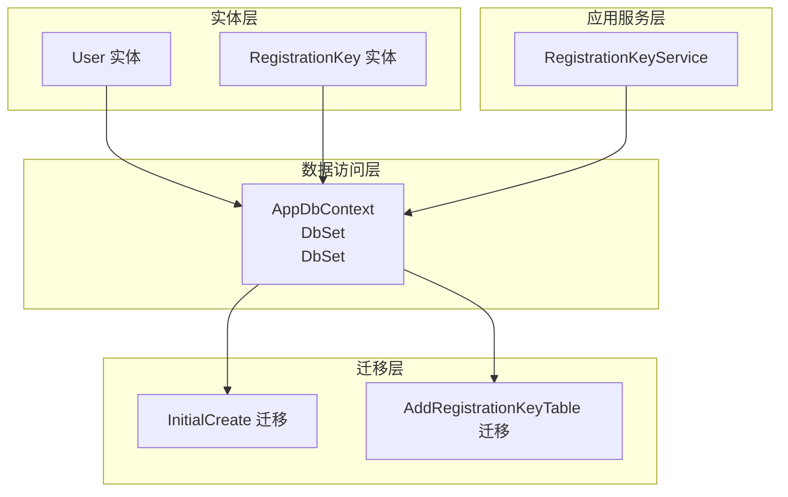
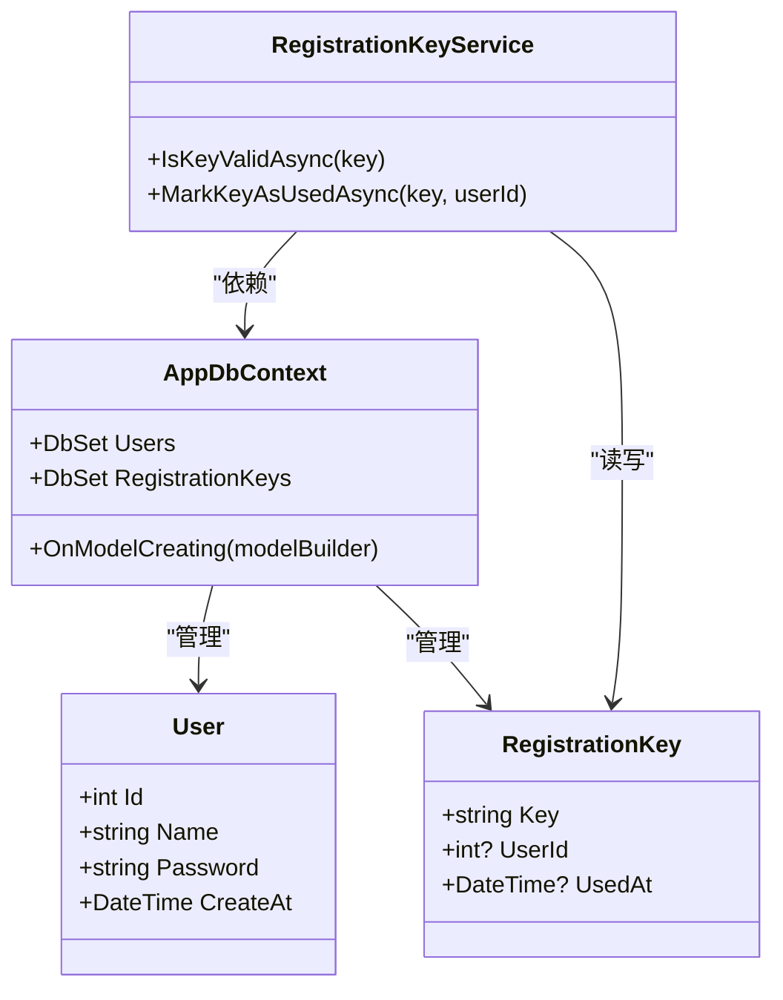
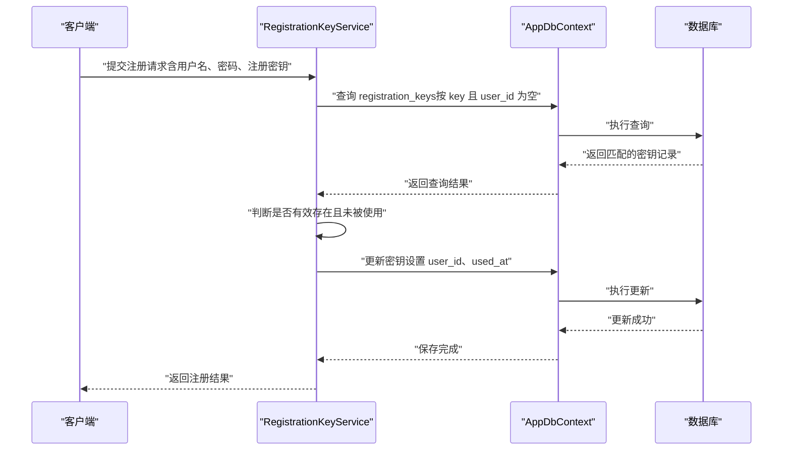
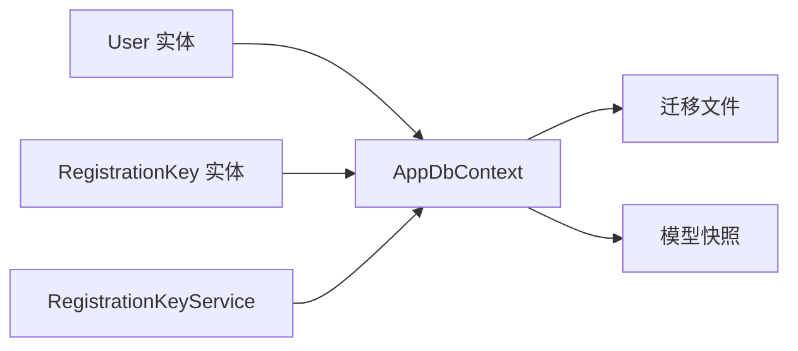

# 数据模型与数据库设计

<cite>
**本文引用的文件**
- [User.cs](file://src/data/entities/User.cs)
- [RegistrationKey.cs](file://src/data/entities/RegistrationKey.cs)
- [AppDbContext.cs](file://src/data/AppDbContext.cs)
- [20251202060311_InitialCreate.cs](file://Migrations/20251202060311_InitialCreate.cs)
- [20251217055145_AddRegistrationKeyTable.cs](file://Migrations/20251217055145_AddRegistrationKeyTable.cs)
- [AppDbContextModelSnapshot.cs](file://Migrations/AppDbContextModelSnapshot.cs)
- [RegistrationKeyService.cs](file://src/application/service/RegistrationKeyService.cs)
- [RegisterDto.cs](file://src/data/dto/RegisterDto.cs)
</cite>

## 目录
1. [简介](#简介)
2. [项目结构](#项目结构)
3. [核心实体与属性](#核心实体与属性)
4. [架构总览](#架构总览)
5. [详细组件分析](#详细组件分析)
6. [依赖关系分析](#依赖关系分析)
7. [性能考量](#性能考量)
8. [故障排查指南](#故障排查指南)
9. [结论](#结论)
10. [附录](#附录)

## 简介
本文件系统性梳理项目的数据模型与数据库设计，重点聚焦于 User 与 RegistrationKey 两个实体，阐明其属性、约束、与数据库表的映射关系，并结合迁移文件说明数据库演进历程。同时解释 EF Core 的 OnModelCreating 配置（如默认创建时间）与实体间的关系（如 RegistrationKey 的用户关联），并以 ER 图与文本形式呈现表结构及主外键关系。

## 项目结构
- 实体层：位于 src/data/entities，包含 User、RegistrationKey 等领域实体。
- 数据访问层：位于 src/data，包含 AppDbContext 及实体集合 DbSet。
- 迁移层：位于 Migrations，包含初始建表与新增注册密钥表的迁移文件。
- 应用服务层：位于 src/application/service，包含 RegistrationKeyService，用于密钥校验与使用标记。
- DTO 层：位于 src/data/dto，包含 RegisterDto，承载注册请求参数。

图表来源
- [AppDbContext.cs](file://src/data/AppDbContext.cs#L10-L16)
- [RegistrationKeyService.cs](file://src/application/service/RegistrationKeyService.cs#L1-L37)
- [20251202060311_InitialCreate.cs](file://Migrations/20251202060311_InitialCreate.cs#L14-L28)
- [20251217055145_AddRegistrationKeyTable.cs](file://Migrations/20251217055145_AddRegistrationKeyTable.cs#L14-L25)

章节来源
- [AppDbContext.cs](file://src/data/AppDbContext.cs#L10-L16)
- [AppDbContextModelSnapshot.cs](file://Migrations/AppDbContextModelSnapshot.cs#L177-L195)
- [20251202060311_InitialCreate.cs](file://Migrations/20251202060311_InitialCreate.cs#L14-L28)
- [20251217055145_AddRegistrationKeyTable.cs](file://Migrations/20251217055145_AddRegistrationKeyTable.cs#L14-L25)

## 核心实体与属性
本节从实体类到数据库表映射，逐项说明 User 与 RegistrationKey 的字段、类型与约束，并给出 EF Core 映射与默认值配置。

- User 实体
  - 字段与约束
    - Id：整型，主键，自增（由 EF Core 默认策略生成）
    - Name：字符串，非空，最大长度 50
    - Password：字符串，非空，最大长度 255
    - CreateAt：日期时间，默认值通过 SQL 设置为当前时间戳
  - 数据库映射
    - 表名 users
    - 列名分别为 id、name、password、create_at
  - EF Core 配置
    - 主键：Id
    - 默认值：CreateAt 使用 HasDefaultValueSql 指定 CURRENT_TIMESTAMP

- RegistrationKey 实体
  - 字段与约束
    - Key：字符串，主键，最大长度 255
    - UserId：整型，可空，表示使用该密钥的用户 ID
    - UsedAt：日期时间，可空，表示使用时间
  - 数据库映射
    - 表名 registration_keys
    - 列名分别为 key、user_id、used_at
  - 关系说明
    - 外键：UserId 指向 users.id（逻辑上存在，实际迁移未显式声明外键约束）

章节来源
- [User.cs](file://src/data/entities/User.cs#L15-L40)
- [RegistrationKey.cs](file://src/data/entities/RegistrationKey.cs#L15-L31)
- [AppDbContext.cs](file://src/data/AppDbContext.cs#L18-L25)
- [AppDbContextModelSnapshot.cs](file://Migrations/AppDbContextModelSnapshot.cs#L177-L195)
- [20251202060311_InitialCreate.cs](file://Migrations/20251202060311_InitialCreate.cs#L14-L28)
- [20251217055145_AddRegistrationKeyTable.cs](file://Migrations/20251217055145_AddRegistrationKeyTable.cs#L14-L25)

## 架构总览
下图展示实体、上下文与迁移之间的关系，以及实体在模型快照中的最终形态。

图表来源
- [User.cs](file://src/data/entities/User.cs#L15-L40)
- [RegistrationKey.cs](file://src/data/entities/RegistrationKey.cs#L15-L31)
- [AppDbContext.cs](file://src/data/AppDbContext.cs#L10-L16)
- [RegistrationKeyService.cs](file://src/application/service/RegistrationKeyService.cs#L1-L37)
- [AppDbContextModelSnapshot.cs](file://Migrations/AppDbContextModelSnapshot.cs#L177-L195)

## 详细组件分析

### User 实体与数据库映射
- 属性与约束
  - Id：主键，自增
  - Name：必填，长度上限 50
  - Password：必填，长度上限 255
  - CreateAt：默认值为当前 UTC 时间
- 数据库表 users
  - 列：id（自增主键）、name（非空）、password（非空）、create_at（默认 CURRENT_TIMESTAMP）
- EF Core 配置
  - 主键：Id
  - 默认值：CreateAt 使用 HasDefaultValueSql 指定 CURRENT_TIMESTAMP

章节来源
- [User.cs](file://src/data/entities/User.cs#L15-L40)
- [AppDbContext.cs](file://src/data/AppDbContext.cs#L18-L25)
- [20251202060311_InitialCreate.cs](file://Migrations/20251202060311_InitialCreate.cs#L14-L28)
- [AppDbContextModelSnapshot.cs](file://Migrations/AppDbContextModelSnapshot.cs#L197-L227)

### RegistrationKey 实体与数据库映射
- 属性与约束
  - Key：主键，长度上限 255
  - UserId：可空，用于记录使用该密钥的用户 ID
  - UsedAt：可空，记录使用时间
- 数据库表 registration_keys
  - 列：key（主键）、user_id（可空）、used_at（可空）
- 关系说明
  - 逻辑外键：UserId 指向 users.id（迁移未显式创建外键约束，但业务上存在关联）

章节来源
- [RegistrationKey.cs](file://src/data/entities/RegistrationKey.cs#L15-L31)
- [20251217055145_AddRegistrationKeyTable.cs](file://Migrations/20251217055145_AddRegistrationKeyTable.cs#L14-L25)
- [AppDbContextModelSnapshot.cs](file://Migrations/AppDbContextModelSnapshot.cs#L177-L195)

### AppDbContext 中的 DbSet 定义与映射
- DbSet<User> Users：映射到 users 表
- DbSet<RegistrationKey> RegistrationKeys：映射到 registration_keys 表
- OnModelCreating：
  - 配置 User 的 CreateAt 默认值为 CURRENT_TIMESTAMP
  - 其他实体的映射由模型快照统一维护

章节来源
- [AppDbContext.cs](file://src/data/AppDbContext.cs#L10-L16)
- [AppDbContext.cs](file://src/data/AppDbContext.cs#L18-L25)
- [AppDbContextModelSnapshot.cs](file://Migrations/AppDbContextModelSnapshot.cs#L177-L195)

### 数据库演进（迁移）
- 初始建表（users）
  - 创建 users 表，包含 id（自增主键）、name、password、create_at（默认 CURRENT_TIMESTAMP）
- 新增注册密钥表（registration_keys）
  - 创建 registration_keys 表，包含 key（主键）、user_id（可空）、used_at（可空）
  - 迁移未显式添加外键约束，但业务上通过 UserId 关联 users

章节来源
- [20251202060311_InitialCreate.cs](file://Migrations/20251202060311_InitialCreate.cs#L14-L28)
- [20251217055145_AddRegistrationKeyTable.cs](file://Migrations/20251217055145_AddRegistrationKeyTable.cs#L14-L25)

### EF Core 的 OnModelCreating 配置要点
- User 实体
  - 主键：Id
  - 默认值：CreateAt 使用 HasDefaultValueSql 指定 CURRENT_TIMESTAMP
- RegistrationKey 实体
  - 主键：Key
  - 未在 OnModelCreating 中额外配置其他约束或默认值

章节来源
- [AppDbContext.cs](file://src/data/AppDbContext.cs#L18-L25)
- [AppDbContextModelSnapshot.cs](file://Migrations/AppDbContextModelSnapshot.cs#L177-L195)

### 实体关系与业务流程（序列图）
以下序列图展示注册流程中密钥校验与使用的典型调用链。

图表来源
- [RegistrationKeyService.cs](file://src/application/service/RegistrationKeyService.cs#L1-L37)
- [AppDbContext.cs](file://src/data/AppDbContext.cs#L10-L16)
- [20251217055145_AddRegistrationKeyTable.cs](file://Migrations/20251217055145_AddRegistrationKeyTable.cs#L14-L25)

## 依赖关系分析
- 实体与上下文
  - User 与 RegistrationKey 通过 AppDbContext 的 DbSet 管理
- 上下文与迁移
  - AppDbContext 的映射由迁移与模型快照共同决定
- 服务层与上下文
  - RegistrationKeyService 依赖 AppDbContext 执行密钥校验与使用标记
- 外键关系
  - RegistrationKey.UserId 在业务上指向 User.Id，迁移未显式创建外键约束

图表来源
- [AppDbContext.cs](file://src/data/AppDbContext.cs#L10-L16)
- [RegistrationKeyService.cs](file://src/application/service/RegistrationKeyService.cs#L1-L37)
- [AppDbContextModelSnapshot.cs](file://Migrations/AppDbContextModelSnapshot.cs#L177-L195)
- [20251202060311_InitialCreate.cs](file://Migrations/20251202060311_InitialCreate.cs#L14-L28)
- [20251217055145_AddRegistrationKeyTable.cs](file://Migrations/20251217055145_AddRegistrationKeyTable.cs#L14-L25)

章节来源
- [AppDbContext.cs](file://src/data/AppDbContext.cs#L10-L16)
- [RegistrationKeyService.cs](file://src/application/service/RegistrationKeyService.cs#L1-L37)
- [AppDbContextModelSnapshot.cs](file://Migrations/AppDbContextModelSnapshot.cs#L177-L195)

## 性能考量
- 查询优化
  - 对 RegistrationKey 的校验建议在数据库层面进行（如使用唯一索引或条件索引），避免不必要的全表扫描
- 写入优化
  - 使用标记密钥为已使用时，尽量减少不必要的属性更新，仅更新必要的列
- 默认值与时区
  - CreateAt 使用数据库默认值，注意与应用时区的一致性，避免跨时区导致的时间偏差

## 故障排查指南
- 密钥无效
  - 现象：IsKeyValidAsync 返回 false
  - 排查：确认密钥是否存在且 user_id 为空；检查迁移是否正确应用
- 密钥重复使用
  - 现象：MarkKeyAsUsedAsync 更新失败或未生效
  - 排查：确认密钥状态（是否已被他人使用）；检查事务与并发控制
- 外键一致性
  - 现象：RegistrationKey.UserId 指向不存在的用户
  - 建议：在迁移中显式添加外键约束，或在应用层增加校验

章节来源
- [RegistrationKeyService.cs](file://src/application/service/RegistrationKeyService.cs#L1-L37)
- [20251217055145_AddRegistrationKeyTable.cs](file://Migrations/20251217055145_AddRegistrationKeyTable.cs#L14-L25)

## 结论
本项目采用简洁清晰的数据模型：User 负责用户身份信息与默认创建时间，RegistrationKey 提供注册密钥机制并在使用后绑定用户。EF Core 通过 AppDbContext 统一管理映射与默认值，迁移文件完整记录了数据库演进过程。建议后续在迁移中补充外键约束，以增强数据一致性与可维护性。

## 附录

### ER 图（文本版）
- users 表
  - 主键：id
  - 字段：name（非空，长度 50）、password（非空，长度 255）、create_at（默认 CURRENT_TIMESTAMP）
- registration_keys 表
  - 主键：key（长度 255）
  - 字段：user_id（可空）、used_at（可空）
  - 关系：user_id 指向 users.id（业务上存在，迁移未显式外键约束）

章节来源
- [20251202060311_InitialCreate.cs](file://Migrations/20251202060311_InitialCreate.cs#L14-L28)
- [20251217055145_AddRegistrationKeyTable.cs](file://Migrations/20251217055145_AddRegistrationKeyTable.cs#L14-L25)
- [AppDbContextModelSnapshot.cs](file://Migrations/AppDbContextModelSnapshot.cs#L177-L195)