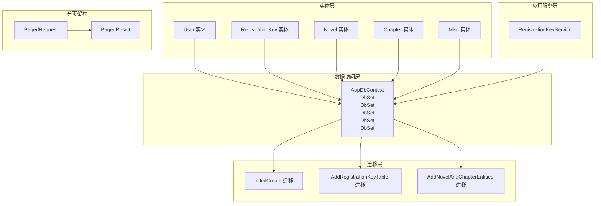
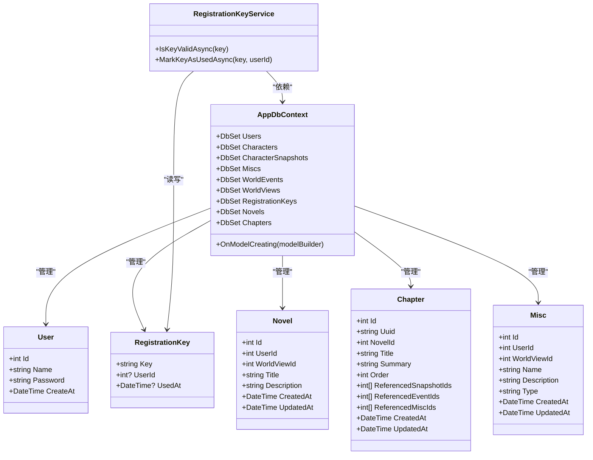
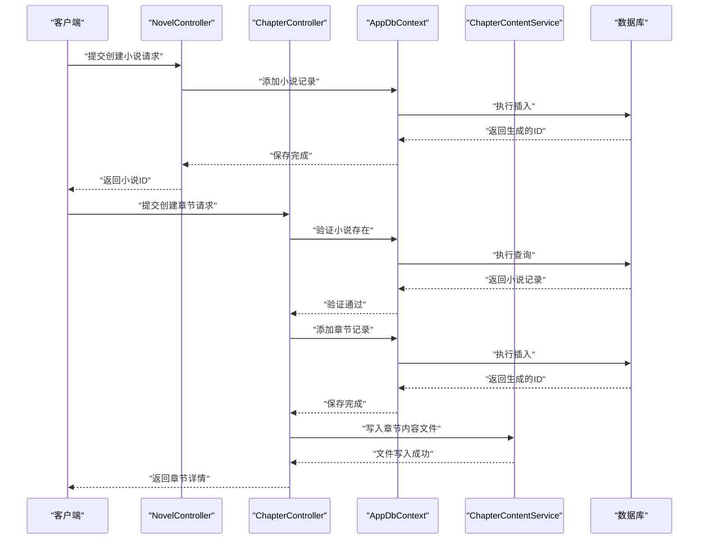
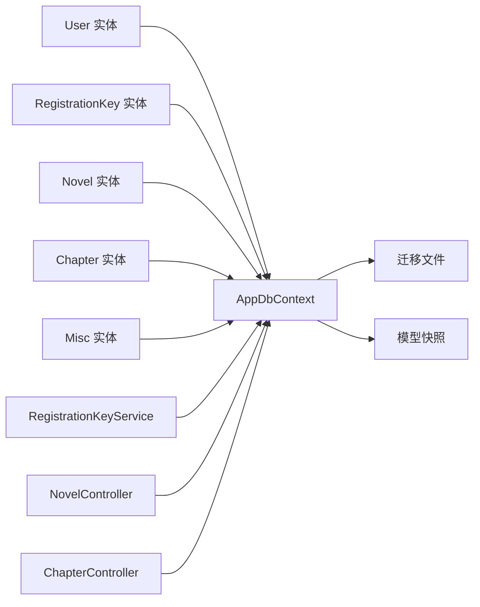

# 数据模型与数据库设计

<cite>
**本文引用的文件**
- [User.cs](file://src/data/entities/User.cs)
- [RegistrationKey.cs](file://src/data/entities/RegistrationKey.cs)
- [AppDbContext.cs](file://src/data/AppDbContext.cs)
- [20251202060311_InitialCreate.cs](file://Migrations/20251202060311_InitialCreate.cs)
- [20251217055145_AddRegistrationKeyTable.cs](file://Migrations/20251217055145_AddRegistrationKeyTable.cs)
- [AppDbContextModelSnapshot.cs](file://Migrations/AppDbContextModelSnapshot.cs)
- [RegistrationKeyService.cs](file://src/application/service/RegistrationKeyService.cs)
- [RegisterDto.cs](file://src/data/dto/RegisterDto.cs)
- [Novel.cs](file://src/data/entities/Novel.cs)
- [Chapter.cs](file://src/data/entities/Chapter.cs)
- [Misc.cs](file://src/data/entities/Misc.cs)
- [20251217094734_AddNovelAndChapterEntities.cs](file://Migrations/20251217094734_AddNovelAndChapterEntities.cs)
- [PagedRequest.cs](file://src/structure/PagedRequest.cs)
- [PagedResult.cs](file://src/structure/PagedResult.cs)
- [QueryableExtensions.cs](file://src/structure/QueryableExtensions.cs)
- [NovelController.cs](file://src/application/controllers/novel/NovelController.cs)
- [ChapterController.cs](file://src/application/controllers/novel/ChapterController.cs)
- [MiscController.cs](file://src/application/controllers/worldview/MiscController.cs)
</cite>

## 更新摘要
**变更内容**
- 扩展核心实体与属性部分，新增小说、章节和杂项实体的详细描述
- 更新架构总览中的类图，包含Novel、Chapter和Misc实体
- 新增“分页架构”章节，描述分页请求与结果模型
- 更新数据库演进部分，包含新增小说与章节表的迁移
- 更新依赖关系分析，反映新增实体间的关联
- 更新ER图（文本版），包含新表结构与外键关系

## 目录
1. [简介](#简介)
2. [项目结构](#项目结构)
3. [核心实体与属性](#核心实体与属性)
4. [架构总览](#架构总览)
5. [详细组件分析](#详细组件分析)
6. [依赖关系分析](#依赖关系分析)
7. [性能考量](#性能考量)
8. [故障排查指南](#故障排查指南)
9. [结论](#结论)
10. [附录](#附录)

## 简介
本文件系统性梳理项目的数据模型与数据库设计，重点聚焦于 User 与 RegistrationKey 两个实体，阐明其属性、约束、与数据库表的映射关系，并结合迁移文件说明数据库演进历程。同时解释 EF Core 的 OnModelCreating 配置（如默认创建时间）与实体间的关系（如 RegistrationKey 的用户关联），并以 ER 图与文本形式呈现表结构及主外键关系。本次更新新增了小说（Novel）、章节（Chapter）和杂项（Misc）实体的详细描述，以及分页架构的实现。

## 项目结构
- 实体层：位于 src/data/entities，包含 User、RegistrationKey、Novel、Chapter 和 Misc 等领域实体。
- 数据访问层：位于 src/data，包含 AppDbContext 及实体集合 DbSet。
- 迁移层：位于 Migrations，包含初始建表、新增注册密钥表、新增小说与章节表的迁移文件。
- 应用服务层：位于 src/application/service，包含 RegistrationKeyService，用于密钥校验与使用标记。
- DTO 层：位于 src/data/dto，包含 RegisterDto，承载注册请求参数。
- 分页架构：位于 src/structure，包含 PagedRequest 和 PagedResult，支持分页查询。

图表来源
- [AppDbContext.cs](file://src/data/AppDbContext.cs#L10-L18)
- [RegistrationKeyService.cs](file://src/application/service/RegistrationKeyService.cs#L1-L37)
- [20251202060311_InitialCreate.cs](file://Migrations/20251202060311_InitialCreate.cs#L14-L28)
- [20251217055145_AddRegistrationKeyTable.cs](file://Migrations/20251217055145_AddRegistrationKeyTable.cs#L14-L25)
- [20251217094734_AddNovelAndChapterEntities.cs](file://Migrations/20251217094734_AddNovelAndChapterEntities.cs#L14-L64)
- [PagedRequest.cs](file://src/structure/PagedRequest.cs#L5-L16)
- [PagedResult.cs](file://src/structure/PagedResult.cs#L7-L17)

章节来源
- [AppDbContext.cs](file://src/data/AppDbContext.cs#L10-L18)
- [AppDbContextModelSnapshot.cs](file://Migrations/AppDbContextModelSnapshot.cs#L177-L195)
- [20251202060311_InitialCreate.cs](file://Migrations/20251202060311_InitialCreate.cs#L14-L28)
- [20251217055145_AddRegistrationKeyTable.cs](file://Migrations/20251217055145_AddRegistrationKeyTable.cs#L14-L25)
- [20251217094734_AddNovelAndChapterEntities.cs](file://Migrations/20251217094734_AddNovelAndChapterEntities.cs#L14-L64)

## 核心实体与属性
本节从实体类到数据库表映射，逐项说明 User、RegistrationKey、Novel、Chapter 和 Misc 的字段、类型与约束，并给出 EF Core 映射与默认值配置。

- User 实体
  - 字段与约束
    - Id：整型，主键，自增（由 EF Core 默认策略生成）
    - Name：字符串，非空，最大长度 50
    - Password：字符串，非空，最大长度 255
    - CreateAt：日期时间，默认值通过 SQL 设置为当前时间戳
  - 数据库映射
    - 表名 users
    - 列名分别为 id、name、password、create_at
  - EF Core 配置
    - 主键：Id
    - 默认值：CreateAt 使用 HasDefaultValueSql 指定 CURRENT_TIMESTAMP

- RegistrationKey 实体
  - 字段与约束
    - Key：字符串，主键，最大长度 255
    - UserId：整型，可空，表示使用该密钥的用户 ID
    - UsedAt：日期时间，可空，表示使用时间
  - 数据库映射
    - 表名 registration_keys
    - 列名分别为 key、user_id、used_at
  - 关系说明
    - 外键：UserId 指向 users.id（逻辑上存在，实际迁移未显式声明外键约束）

- Novel 实体
  - 字段与约束
    - Id：整型，主键，自增
    - UserId：整型，非空，表示创建该小说的用户 ID
    - WorldViewId：整型，非空，表示所属世界观 ID
    - Title：字符串，非空，最大长度 200
    - Description：字符串，最大长度 1000
    - CreatedAt：日期时间，非空，默认值为当前 UTC 时间
    - UpdatedAt：日期时间，非空，默认值为当前 UTC 时间
  - 数据库映射
    - 表名 novels
    - 列名分别为 id、user_id、world_view_id、title、description、created_at、updated_at
  - 关系说明
    - 外键：UserId 指向 users.id
    - 外键：WorldViewId 指向 world_views.id

- Chapter 实体
  - 字段与约束
    - Id：整型，主键，自增
    - Uuid：字符串，非空，最大长度 36，用于文件路径定位
    - NovelId：整型，非空，表示所属小说 ID
    - Title：字符串，非空，最大长度 200
    - Summary：字符串，最大长度 1000
    - Order：整型，非空，表示章节排序
    - ReferencedSnapshotIds：整型数组，非空，表示引用的角色快照 ID
    - ReferencedEventIds：整型数组，非空，表示引用的事件 ID
    - ReferencedMiscIds：整型数组，非空，表示引用的杂项 ID
    - CreatedAt：日期时间，非空，默认值为当前 UTC 时间
    - UpdatedAt：日期时间，非空，默认值为当前 UTC 时间
  - 数据库映射
    - 表名 chapters
    - 列名分别为 id、uuid、novel_id、title、summary、order、referenced_snapshot_ids、referenced_event_ids、referenced_misc_ids、created_at、updated_at
  - 关系说明
    - 外键：NovelId 指向 novels.id

- Misc 实体
  - 字段与约束
    - Id：整型，主键，自增
    - UserId：整型，非空，表示创建该杂项的用户 ID
    - WorldViewId：整型，非空，表示所属世界观 ID
    - Name：字符串，非空，最大长度 100
    - Description：字符串，最大长度 500
    - Type：字符串，非空，表示杂项类型（如道具、地点等）
    - CreatedAt：日期时间，非空，默认值为当前 UTC 时间
    - UpdatedAt：日期时间，非空，默认值为当前 UTC 时间
  - 数据库映射
    - 表名 miscs
    - 列名分别为 id、user_id、world_view_id、name、description、type、created_at、updated_at
  - 关系说明
    - 外键：UserId 指向 users.id
    - 外键：WorldViewId 指向 world_views.id

章节来源
- [User.cs](file://src/data/entities/User.cs#L15-L40)
- [RegistrationKey.cs](file://src/data/entities/RegistrationKey.cs#L15-L31)
- [Novel.cs](file://src/data/entities/Novel.cs#L12-L57)
- [Chapter.cs](file://src/data/entities/Chapter.cs#L12-L83)
- [Misc.cs](file://src/data/entities/Misc.cs#L9-L62)
- [AppDbContext.cs](file://src/data/AppDbContext.cs#L18-L25)
- [AppDbContextModelSnapshot.cs](file://Migrations/AppDbContextModelSnapshot.cs#L177-L195)
- [20251202060311_InitialCreate.cs](file://Migrations/20251202060311_InitialCreate.cs#L14-L28)
- [20251217055145_AddRegistrationKeyTable.cs](file://Migrations/20251217055145_AddRegistrationKeyTable.cs#L14-L25)
- [20251217094734_AddNovelAndChapterEntities.cs](file://Migrations/20251217094734_AddNovelAndChapterEntities.cs#L14-L64)

## 架构总览
下图展示实体、上下文与迁移之间的关系，以及实体在模型快照中的最终形态。

图表来源
- [User.cs](file://src/data/entities/User.cs#L15-L40)
- [RegistrationKey.cs](file://src/data/entities/RegistrationKey.cs#L15-L31)
- [Novel.cs](file://src/data/entities/Novel.cs#L12-L57)
- [Chapter.cs](file://src/data/entities/Chapter.cs#L12-L83)
- [Misc.cs](file://src/data/entities/Misc.cs#L9-L62)
- [AppDbContext.cs](file://src/data/AppDbContext.cs#L10-L18)
- [RegistrationKeyService.cs](file://src/application/service/RegistrationKeyService.cs#L1-L37)
- [AppDbContextModelSnapshot.cs](file://Migrations/AppDbContextModelSnapshot.cs#L177-L195)

## 详细组件分析

### User 实体与数据库映射
- 属性与约束
  - Id：主键，自增
  - Name：必填，长度上限 50
  - Password：必填，长度上限 255
  - CreateAt：默认值为当前 UTC 时间
- 数据库表 users
  - 列：id（自增主键）、name（非空）、password（非空）、create_at（默认 CURRENT_TIMESTAMP）
- EF Core 配置
  - 主键：Id
  - 默认值：CreateAt 使用 HasDefaultValueSql 指定 CURRENT_TIMESTAMP

章节来源
- [User.cs](file://src/data/entities/User.cs#L15-L40)
- [AppDbContext.cs](file://src/data/AppDbContext.cs#L18-L25)
- [20251202060311_InitialCreate.cs](file://Migrations/20251202060311_InitialCreate.cs#L14-L28)
- [AppDbContextModelSnapshot.cs](file://Migrations/AppDbContextModelSnapshot.cs#L197-L227)

### RegistrationKey 实体与数据库映射
- 属性与约束
  - Key：主键，长度上限 255
  - UserId：可空，用于记录使用该密钥的用户 ID
  - UsedAt：可空，记录使用时间
- 数据库表 registration_keys
  - 列：key（主键）、user_id（可空）、used_at（可空）
- 关系说明
  - 逻辑外键：UserId 指向 users.id（迁移未显式创建外键约束，但业务上存在关联）

章节来源
- [RegistrationKey.cs](file://src/data/entities/RegistrationKey.cs#L15-L31)
- [20251217055145_AddRegistrationKeyTable.cs](file://Migrations/20251217055145_AddRegistrationKeyTable.cs#L14-L25)
- [AppDbContextModelSnapshot.cs](file://Migrations/AppDbContextModelSnapshot.cs#L177-L195)

### Novel 实体与数据库映射
- 属性与约束
  - Id：主键，自增
  - UserId：非空，表示创建该小说的用户 ID
  - WorldViewId：非空，表示所属世界观 ID
  - Title：非空，长度上限 200
  - Description：长度上限 1000
  - CreatedAt：非空，记录创建时间
  - UpdatedAt：非空，记录更新时间
- 数据库表 novels
  - 列：id（自增主键）、user_id（非空）、world_view_id（非空）、title（非空）、description、created_at（非空）、updated_at（非空）
- 关系说明
  - 外键：UserId 指向 users.id
  - 外键：WorldViewId 指向 world_views.id

章节来源
- [Novel.cs](file://src/data/entities/Novel.cs#L12-L57)
- [20251217094734_AddNovelAndChapterEntities.cs](file://Migrations/20251217094734_AddNovelAndChapterEntities.cs#L38-L52)
- [AppDbContextModelSnapshot.cs](file://Migrations/AppDbContextModelSnapshot.cs#L242-L281)

### Chapter 实体与数据库映射
- 属性与约束
  - Id：主键，自增
  - Uuid：非空，长度上限 36，用于文件路径定位
  - NovelId：非空，表示所属小说 ID
  - Title：非空，长度上限 200
  - Summary：长度上限 1000
  - Order：非空，表示章节排序
  - ReferencedSnapshotIds：非空，整型数组，表示引用的角色快照 ID
  - ReferencedEventIds：非空，整型数组，表示引用的事件 ID
  - ReferencedMiscIds：非空，整型数组，表示引用的杂项 ID
  - CreatedAt：非空，记录创建时间
  - UpdatedAt：非空，记录更新时间
- 数据库表 chapters
  - 列：id（自增主键）、uuid（非空）、novel_id（非空）、title（非空）、summary、order（非空）、referenced_snapshot_ids（非空）、referenced_event_ids（非空）、referenced_misc_ids（非空）、created_at（非空）、updated_at（非空）
- 关系说明
  - 外键：NovelId 指向 novels.id

章节来源
- [Chapter.cs](file://src/data/entities/Chapter.cs#L12-L83)
- [20251217094734_AddNovelAndChapterEntities.cs](file://Migrations/20251217094734_AddNovelAndChapterEntities.cs#L15-L35)
- [AppDbContextModelSnapshot.cs](file://Migrations/AppDbContextModelSnapshot.cs#L27-L85)

### Misc 实体与数据库映射
- 属性与约束
  - Id：主键，自增
  - UserId：非空，表示创建该杂项的用户 ID
  - WorldViewId：非空，表示所属世界观 ID
  - Name：非空，长度上限 100
  - Description：长度上限 500
  - Type：非空，表示杂项类型
  - CreatedAt：非空，记录创建时间
  - UpdatedAt：非空，记录更新时间
- 数据库表 miscs
  - 列：id（自增主键）、user_id（非空）、world_view_id（非空）、name（非空）、description、type（非空）、created_at（非空）、updated_at（非空）
- 关系说明
  - 外键：UserId 指向 users.id
  - 外键：WorldViewId 指向 world_views.id

章节来源
- [Misc.cs](file://src/data/entities/Misc.cs#L9-L62)
- [AppDbContextModelSnapshot.cs](file://Migrations/AppDbContextModelSnapshot.cs#L196-L241)

### AppDbContext 中的 DbSet 定义与映射
- DbSet<User> Users：映射到 users 表
- DbSet<RegistrationKey> RegistrationKeys：映射到 registration_keys 表
- DbSet<Novel> Novels：映射到 novels 表
- DbSet<Chapter> Chapters：映射到 chapters 表
- DbSet<Misc> Miscs：映射到 miscs 表
- OnModelCreating：
  - 配置 User 的 CreateAt 默认值为 CURRENT_TIMESTAMP
  - 其他实体的映射由模型快照统一维护

章节来源
- [AppDbContext.cs](file://src/data/AppDbContext.cs#L10-L18)
- [AppDbContext.cs](file://src/data/AppDbContext.cs#L20-L27)
- [AppDbContextModelSnapshot.cs](file://Migrations/AppDbContextModelSnapshot.cs#L177-L195)

### 数据库演进（迁移）
- 初始建表（users）
  - 创建 users 表，包含 id（自增主键）、name、password、create_at（默认 CURRENT_TIMESTAMP）
- 新增注册密钥表（registration_keys）
  - 创建 registration_keys 表，包含 key（主键）、user_id（可空）、used_at（可空）
  - 迁移未显式添加外键约束，但业务上通过 UserId 关联 users
- 新增小说与章节表（novels, chapters）
  - 创建 novels 表，包含 id（自增主键）、user_id（非空）、world_view_id（非空）、title（非空）、description、created_at（非空）、updated_at（非空）
  - 创建 chapters 表，包含 id（自增主键）、uuid（非空）、novel_id（非空）、title（非空）、summary、order（非空）、referenced_snapshot_ids（非空）、referenced_event_ids（非空）、referenced_misc_ids（非空）、created_at（非空）、updated_at（非空）
  - 迁移未显式添加外键约束，但业务上通过 NovelId 关联 novels

章节来源
- [20251202060311_InitialCreate.cs](file://Migrations/20251202060311_InitialCreate.cs#L14-L28)
- [20251217055145_AddRegistrationKeyTable.cs](file://Migrations/20251217055145_AddRegistrationKeyTable.cs#L14-L25)
- [20251217094734_AddNovelAndChapterEntities.cs](file://Migrations/20251217094734_AddNovelAndChapterEntities.cs#L14-L64)

### EF Core 的 OnModelCreating 配置要点
- User 实体
  - 主键：Id
  - 默认值：CreateAt 使用 HasDefaultValueSql 指定 CURRENT_TIMESTAMP
- RegistrationKey 实体
  - 主键：Key
  - 未在 OnModelCreating 中额外配置其他约束或默认值
- Novel 实体
  - 主键：Id
  - 未在 OnModelCreating 中额外配置其他约束或默认值
- Chapter 实体
  - 主键：Id
  - 未在 OnModelCreating 中额外配置其他约束或默认值
- Misc 实体
  - 主键：Id
  - 未在 OnModelCreating 中额外配置其他约束或默认值

章节来源
- [AppDbContext.cs](file://src/data/AppDbContext.cs#L18-L25)
- [AppDbContextModelSnapshot.cs](file://Migrations/AppDbContextModelSnapshot.cs#L177-L195)

### 实体关系与业务流程（序列图）
以下序列图展示创建小说并添加章节的典型调用链。

图表来源
- [NovelController.cs](file://src/application/controllers/novel/NovelController.cs#L80-L94)
- [ChapterController.cs](file://src/application/controllers/novel/ChapterController.cs#L130-L164)
- [AppDbContext.cs](file://src/data/AppDbContext.cs#L10-L18)
- [ChapterContentService.cs](file://src/application/service/ChapterContentService.cs#L5-L101)

## 依赖关系分析
- 实体与上下文
  - User、RegistrationKey、Novel、Chapter 和 Misc 通过 AppDbContext 的 DbSet 管理
- 上下文与迁移
  - AppDbContext 的映射由迁移与模型快照共同决定
- 服务层与上下文
  - RegistrationKeyService 依赖 AppDbContext 执行密钥校验与使用标记
  - NovelController 和 ChapterController 依赖 AppDbContext 管理小说与章节
- 外键关系
  - RegistrationKey.UserId 在业务上指向 User.Id，迁移未显式创建外键约束
  - Novel.UserId 指向 User.Id
  - Novel.WorldViewId 指向 WorldView.Id
  - Chapter.NovelId 指向 Novel.Id
  - Misc.UserId 指向 User.Id
  - Misc.WorldViewId 指向 WorldView.Id

图表来源
- [AppDbContext.cs](file://src/data/AppDbContext.cs#L10-L18)
- [RegistrationKeyService.cs](file://src/application/service/RegistrationKeyService.cs#L1-L37)
- [NovelController.cs](file://src/application/controllers/novel/NovelController.cs#L18-L161)
- [ChapterController.cs](file://src/application/controllers/novel/ChapterController.cs#L19-L252)
- [AppDbContextModelSnapshot.cs](file://Migrations/AppDbContextModelSnapshot.cs#L177-L195)
- [20251202060311_InitialCreate.cs](file://Migrations/20251202060311_InitialCreate.cs#L14-L28)
- [20251217055145_AddRegistrationKeyTable.cs](file://Migrations/20251217055145_AddRegistrationKeyTable.cs#L14-L25)
- [20251217094734_AddNovelAndChapterEntities.cs](file://Migrations/20251217094734_AddNovelAndChapterEntities.cs#L14-L64)

章节来源
- [AppDbContext.cs](file://src/data/AppDbContext.cs#L10-L18)
- [RegistrationKeyService.cs](file://src/application/service/RegistrationKeyService.cs#L1-L37)
- [NovelController.cs](file://src/application/controllers/novel/NovelController.cs#L18-L161)
- [ChapterController.cs](file://src/application/controllers/novel/ChapterController.cs#L19-L252)
- [AppDbContextModelSnapshot.cs](file://Migrations/AppDbContextModelSnapshot.cs#L177-L195)

## 性能考量
- 查询优化
  - 对 RegistrationKey 的校验建议在数据库层面进行（如使用唯一索引或条件索引），避免不必要的全表扫描
  - 对 Novel 和 Chapter 的查询，建议在 UserId 和 NovelId 上建立索引，以加速用户数据过滤
- 写入优化
  - 使用标记密钥为已使用时，尽量减少不必要的属性更新，仅更新必要的列
  - 删除小说时，批量删除其关联的章节，减少数据库往返次数
- 默认值与时区
  - CreateAt 使用数据库默认值，注意与应用时区的一致性，避免跨时区导致的时间偏差
  - 应用层使用 UTC 时间作为默认值，确保时间一致性

## 故障排查指南
- 密钥无效
  - 现象：IsKeyValidAsync 返回 false
  - 排查：确认密钥是否存在且 user_id 为空；检查迁移是否正确应用
- 密钥重复使用
  - 现象：MarkKeyAsUsedAsync 更新失败或未生效
  - 排查：确认密钥状态（是否已被他人使用）；检查事务与并发控制
- 外键一致性
  - 现象：RegistrationKey.UserId 指向不存在的用户
  - 建议：在迁移中显式添加外键约束，或在应用层增加校验
- 分页查询异常
  - 现象：分页结果为空或总数不正确
  - 排查：检查 MiscController 中 GetMiscs 方法的分页逻辑，确保先 Count 再 Page
- 章节内容丢失
  - 现象：获取章节详情时内容为空
  - 排查：检查 ChapterContentService 的文件读写路径，确保用户、世界观、小说 ID 和 UUID 正确匹配

章节来源
- [RegistrationKeyService.cs](file://src/application/service/RegistrationKeyService.cs#L1-L37)
- [20251217055145_AddRegistrationKeyTable.cs](file://Migrations/20251217055145_AddRegistrationKeyTable.cs#L14-L25)
- [MiscController.cs](file://src/application/controllers/worldview/MiscController.cs#L34-L72)
- [ChapterContentService.cs](file://src/application/service/ChapterContentService.cs#L5-L101)

## 结论
本项目采用简洁清晰的数据模型：User 负责用户身份信息与默认创建时间，RegistrationKey 提供注册密钥机制并在使用后绑定用户。新增的 Novel 和 Chapter 实体支持小说创作功能，Misc 实体用于管理世界观中的杂项信息。EF Core 通过 AppDbContext 统一管理映射与默认值，迁移文件完整记录了数据库演进过程。分页架构通过 PagedRequest 和 PagedResult 实现，支持高效的数据查询。建议后续在迁移中补充外键约束，以增强数据一致性与可维护性。

## 附录

### ER 图（文本版）
- users 表
  - 主键：id
  - 字段：name（非空，长度 50）、password（非空，长度 255）、create_at（默认 CURRENT_TIMESTAMP）
- registration_keys 表
  - 主键：key（长度 255）
  - 字段：user_id（可空）、used_at（可空）
  - 关系：user_id 指向 users.id（业务上存在，迁移未显式外键约束）
- novels 表
  - 主键：id
  - 字段：user_id（非空）、world_view_id（非空）、title（非空，长度 200）、description（长度 1000）、created_at（非空）、updated_at（非空）
  - 关系：user_id 指向 users.id，world_view_id 指向 world_views.id
- chapters 表
  - 主键：id
  - 字段：uuid（非空，长度 36）、novel_id（非空）、title（非空，长度 200）、summary（长度 1000）、order（非空）、referenced_snapshot_ids（非空）、referenced_event_ids（非空）、referenced_misc_ids（非空）、created_at（非空）、updated_at（非空）
  - 关系：novel_id 指向 novels.id
- miscs 表
  - 主键：id
  - 字段：user_id（非空）、world_view_id（非空）、name（非空，长度 100）、description（长度 500）、type（非空）、created_at（非空）、updated_at（非空）
  - 关系：user_id 指向 users.id，world_view_id 指向 world_views.id

章节来源
- [20251202060311_InitialCreate.cs](file://Migrations/20251202060311_InitialCreate.cs#L14-L28)
- [20251217055145_AddRegistrationKeyTable.cs](file://Migrations/20251217055145_AddRegistrationKeyTable.cs#L14-L25)
- [20251217094734_AddNovelAndChapterEntities.cs](file://Migrations/20251217094734_AddNovelAndChapterEntities.cs#L14-L64)
- [AppDbContextModelSnapshot.cs](file://Migrations/AppDbContextModelSnapshot.cs#L177-L195)

### 分页架构
- PagedRequest 类
  - Page：页码，从1开始，默认值为1
  - Size：每页大小，默认值为10
- PagedResult<T> 类
  - List：数据列表
  - Total：总记录数
- QueryableExtensions 扩展方法
  - Page<T>：对 IQueryable<T> 进行分页，跳过 (Page-1)*Size 条记录，取 Size 条记录

章节来源
- [PagedRequest.cs](file://src/structure/PagedRequest.cs#L5-L16)
- [PagedResult.cs](file://src/structure/PagedResult.cs#L7-L17)
- [QueryableExtensions.cs](file://src/structure/QueryableExtensions.cs#L18-L21)
- [MiscController.cs](file://src/application/controllers/worldview/MiscController.cs#L34-L72)