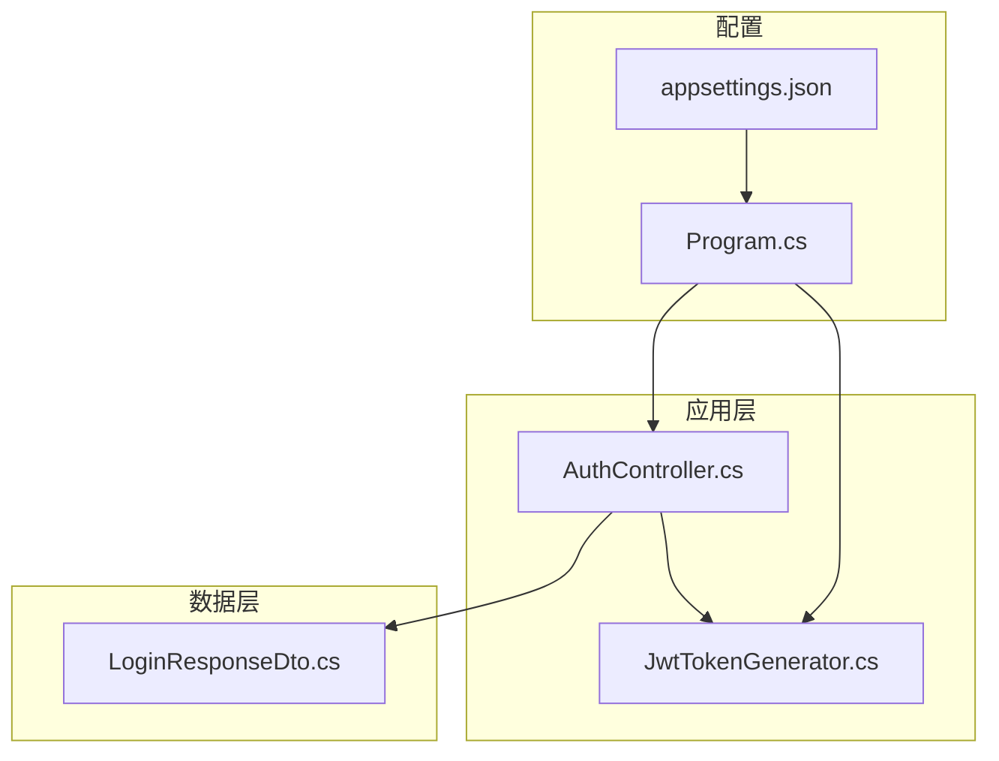
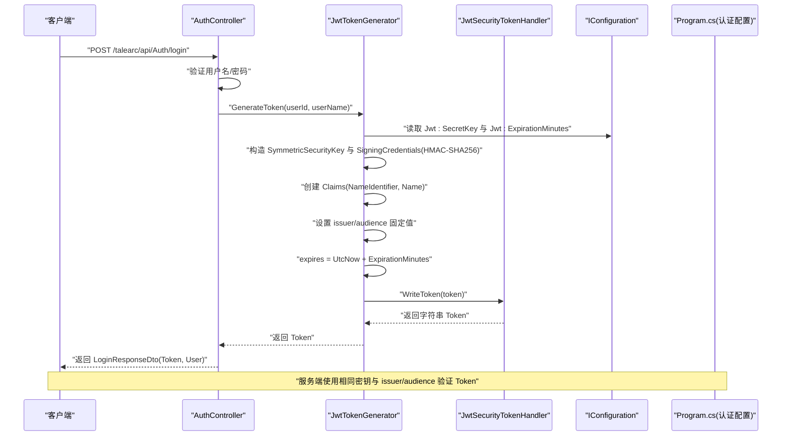
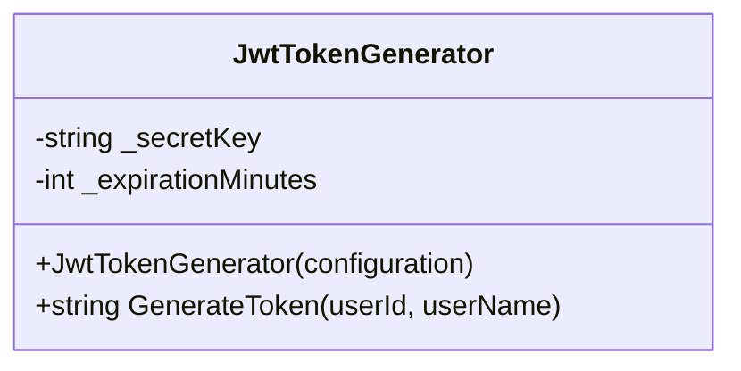
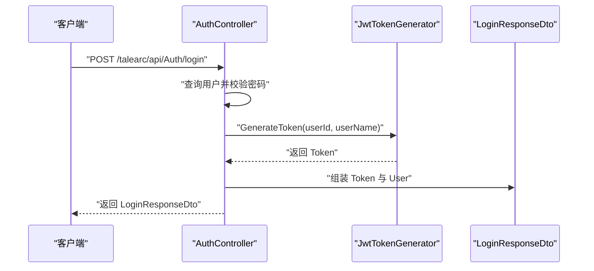
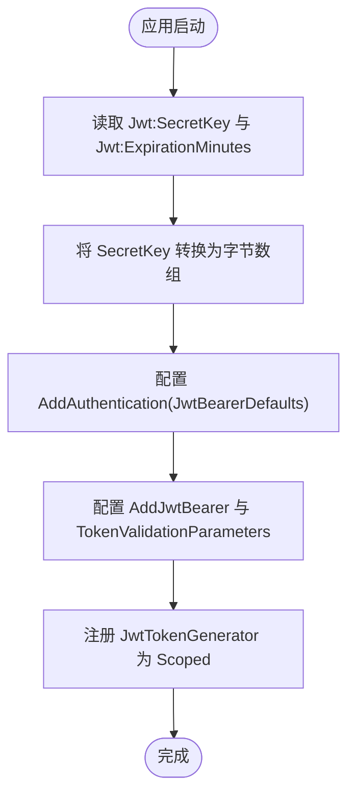
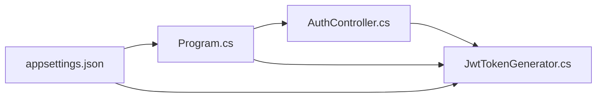

# JWT令牌生成服务

<cite>
**本文引用的文件列表**
- [JwtTokenGenerator.cs](file://src/application/service/JwtTokenGenerator.cs)
- [AuthController.cs](file://src/application/controllers/auth/AuthController.cs)
- [appsettings.json](file://appsettings.json)
- [Program.cs](file://Program.cs)
- [LoginResponseDto.cs](file://src/data/dto/LoginResponseDto.cs)
</cite>

## 目录
1. [简介](#简介)
2. [项目结构](#项目结构)
3. [核心组件](#核心组件)
4. [架构总览](#架构总览)
5. [详细组件分析](#详细组件分析)
6. [依赖关系分析](#依赖关系分析)
7. [性能考量](#性能考量)
8. [故障排查指南](#故障排查指南)
9. [结论](#结论)
10. [附录：扩展与最佳实践](#附录扩展与最佳实践)

## 简介
本文件围绕 JwtTokenGenerator 类的实现机制展开，系统性解析其如何通过 IConfiguration 读取配置、在构造函数中进行空值校验与默认值处理；详解 GenerateToken 方法如何使用对称密钥与 HMAC-SHA256 签名生成 JWT，固定 issuer 与 audience 的设定，以及 NameIdentifier 与 Name 两个核心 Claim 的封装逻辑；说明 UTC 时间与过期时间的计算方式；并结合 AuthController 中的登录流程，展示从用户认证成功到返回 Token 的完整链路。最后提供配置错误的异常处理建议与扩展思路（自定义 issuer/audience、添加额外 claims）。

## 项目结构
本项目采用分层与功能模块化组织：
- 应用层控制器：负责 HTTP 请求入口与业务编排，例如认证控制器。
- 应用层服务：包含 JwtTokenGenerator、PasswordHashService、RegistrationKeyService 等。
- 数据访问层：包含实体、DTO、上下文等。
- 根目录配置：appsettings.json 提供运行时配置；Program.cs 负责依赖注入与认证策略配置。

图表来源
- [AuthController.cs](file://src/application/controllers/auth/AuthController.cs#L66-L175)
- [JwtTokenGenerator.cs](file://src/application/service/JwtTokenGenerator.cs#L1-L40)
- [appsettings.json](file://appsettings.json#L1-L16)
- [Program.cs](file://Program.cs#L24-L48)
- [LoginResponseDto.cs](file://src/data/dto/LoginResponseDto.cs#L1-L17)

章节来源
- [AuthController.cs](file://src/application/controllers/auth/AuthController.cs#L66-L175)
- [JwtTokenGenerator.cs](file://src/application/service/JwtTokenGenerator.cs#L1-L40)
- [appsettings.json](file://appsettings.json#L1-L16)
- [Program.cs](file://Program.cs#L24-L48)
- [LoginResponseDto.cs](file://src/data/dto/LoginResponseDto.cs#L1-L17)

## 核心组件
- JwtTokenGenerator：负责从 IConfiguration 读取密钥与过期时间，生成符合规范的 JWT 令牌。
- AuthController：在用户登录成功后调用 JwtTokenGenerator 生成 Token，并将 Token 与用户信息一并返回。
- Program.cs：完成依赖注入注册与 JWT Bearer 认证策略配置，确保服务端验证参数与客户端生成参数一致。
- appsettings.json：提供 Jwt:SecretKey 与 Jwt:ExpirationMinutes 的运行时配置。
- LoginResponseDto：承载登录响应中的 Token 与用户信息。

章节来源
- [JwtTokenGenerator.cs](file://src/application/service/JwtTokenGenerator.cs#L1-L40)
- [AuthController.cs](file://src/application/controllers/auth/AuthController.cs#L131-L175)
- [Program.cs](file://Program.cs#L24-L48)
- [appsettings.json](file://appsettings.json#L1-L16)
- [LoginResponseDto.cs](file://src/data/dto/LoginResponseDto.cs#L1-L17)

## 架构总览
下图展示了从用户登录到返回 Token 的关键交互流程，以及服务端验证策略与生成器之间的关系。

图表来源
- [AuthController.cs](file://src/application/controllers/auth/AuthController.cs#L131-L175)
- [JwtTokenGenerator.cs](file://src/application/service/JwtTokenGenerator.cs#L12-L39)
- [Program.cs](file://Program.cs#L27-L44)
- [LoginResponseDto.cs](file://src/data/dto/LoginResponseDto.cs#L1-L17)

## 详细组件分析

### JwtTokenGenerator 类实现机制
- 依赖注入与配置读取
  - 通过构造函数接收 IConfiguration，读取 Jwt:SecretKey 并在缺失时抛出异常；读取 Jwt:ExpirationMinutes 并提供默认值。
  - 参考路径：[构造函数与配置读取](file://src/application/service/JwtTokenGenerator.cs#L12-L17)

- 令牌生成流程
  - 使用 UTF-8 编码的密钥字节数组构建 SymmetricSecurityKey。
  - 使用 HMAC-SHA256 算法创建 SigningCredentials。
  - 创建两个核心 Claim：NameIdentifier（用户标识）与 Name（用户名）。
  - 固定 issuer 为 "talearc"，audience 为 "talearc-api"。
  - 过期时间为当前 UTC 时间加上配置的分钟数。
  - 使用 JwtSecurityTokenHandler 将 JwtSecurityToken 序列化为字符串。
  - 参考路径：[令牌生成主流程](file://src/application/service/JwtTokenGenerator.cs#L19-L39)

- 关键点说明
  - 对称密钥长度与安全性：建议密钥长度足够长以满足对称加密要求。
  - UTC 时间与过期：过期时间基于 DateTime.UtcNow，避免本地时区差异带来的问题。
  - 固定 issuer/audience：与 Program.cs 中的 TokenValidationParameters 保持一致，确保验证通过。

图表来源
- [JwtTokenGenerator.cs](file://src/application/service/JwtTokenGenerator.cs#L8-L39)

章节来源
- [JwtTokenGenerator.cs](file://src/application/service/JwtTokenGenerator.cs#L12-L39)

### AuthController 登录流程中的调用
- 登录接口在用户凭据验证通过后，调用 JwtTokenGenerator.GenerateToken 生成 Token。
- 将 Token 与用户信息封装进 LoginResponseDto 返回给客户端。
- 参考路径：[登录接口与 Token 生成](file://src/application/controllers/auth/AuthController.cs#L131-L175)，[登录响应 DTO](file://src/data/dto/LoginResponseDto.cs#L1-L17)

图表来源
- [AuthController.cs](file://src/application/controllers/auth/AuthController.cs#L131-L175)
- [JwtTokenGenerator.cs](file://src/application/service/JwtTokenGenerator.cs#L19-L39)
- [LoginResponseDto.cs](file://src/data/dto/LoginResponseDto.cs#L1-L17)

章节来源
- [AuthController.cs](file://src/application/controllers/auth/AuthController.cs#L131-L175)
- [LoginResponseDto.cs](file://src/data/dto/LoginResponseDto.cs#L1-L17)

### 配置与依赖注入
- appsettings.json 提供 Jwt:SecretKey 与 Jwt:ExpirationMinutes。
- Program.cs 在启动时：
  - 读取 Jwt:SecretKey 并转换为字节数组，作为对称密钥。
  - 配置 AddAuthentication(JwtBearerDefaults.AuthenticationScheme) 与 AddJwtBearer。
  - 设置 TokenValidationParameters：ValidateIssuerSigningKey、IssuerSigningKey、ValidateIssuer/ValidIssuer、ValidateAudience/ValidAudience、ValidateLifetime、ClockSkew。
  - 注册 JwtTokenGenerator 为 Scoped 服务。
- 参考路径：[配置文件](file://appsettings.json#L1-L16)，[认证与验证参数](file://Program.cs#L27-L44)，[服务注册](file://Program.cs#L45-L48)

图表来源
- [appsettings.json](file://appsettings.json#L1-L16)
- [Program.cs](file://Program.cs#L27-L48)

章节来源
- [appsettings.json](file://appsettings.json#L1-L16)
- [Program.cs](file://Program.cs#L27-L48)

## 依赖关系分析
- 组件耦合
  - AuthController 依赖 JwtTokenGenerator 与 PasswordHashService、RegistrationKeyService。
  - JwtTokenGenerator 依赖 IConfiguration 与 Microsoft.IdentityModel.Tokens 与 System.IdentityModel.Tokens.Jwt。
  - Program.cs 同时影响服务端验证策略与服务注册。
- 外部依赖
  - Microsoft.AspNetCore.Authentication.JwtBearer
  - Microsoft.IdentityModel.Tokens
  - System.IdentityModel.Tokens.Jwt
- 潜在循环依赖
  - 当前结构无循环依赖迹象，各层职责清晰。

图表来源
- [AuthController.cs](file://src/application/controllers/auth/AuthController.cs#L66-L175)
- [JwtTokenGenerator.cs](file://src/application/service/JwtTokenGenerator.cs#L1-L40)
- [Program.cs](file://Program.cs#L24-L48)
- [appsettings.json](file://appsettings.json#L1-L16)

章节来源
- [AuthController.cs](file://src/application/controllers/auth/AuthController.cs#L66-L175)
- [JwtTokenGenerator.cs](file://src/application/service/JwtTokenGenerator.cs#L1-L40)
- [Program.cs](file://Program.cs#L24-L48)
- [appsettings.json](file://appsettings.json#L1-L16)

## 性能考量
- 对称密钥计算：SymmetricSecurityKey 与 SigningCredentials 的创建成本较低，适合在每次生成时即时创建。
- 字符串序列化：JwtSecurityTokenHandler.WriteToken 为 O(n) 级别的字符串操作，开销可忽略。
- 建议
  - 将密钥与过期时间缓存于内存中（仅限进程内），减少 IConfiguration 查询次数。
  - 控制 Token 过期时间，避免过长导致频繁刷新与存储压力。
  - 在高并发场景下，确保线程安全与最小化共享状态。

## 故障排查指南
- 配置缺失
  - 现象：应用启动时报错，提示 Jwt:SecretKey 未配置。
  - 原因：Program.cs 与 JwtTokenGenerator 构造函数均会在缺失时抛出异常。
  - 解决：在 appsettings.json 中正确填写 Jwt:SecretKey 与 Jwt:ExpirationMinutes。
  - 参考路径：[Program.cs 启动时校验](file://Program.cs#L27-L28)，[JwtTokenGenerator 构造函数校验](file://src/application/service/JwtTokenGenerator.cs#L14-L17)

- 配置格式错误
  - 现象：过期时间无法解析为整数。
  - 原因：JwtTokenGenerator 使用 int.Parse 处理 Jwt:ExpirationMinutes。
  - 解决：确保 Jwt:ExpirationMinutes 为合法整数值。
  - 参考路径：[过期时间解析](file://src/application/service/JwtTokenGenerator.cs#L16-L17)

- 验证失败
  - 现象：客户端携带 Token 访问受保护资源时被拒绝。
  - 原因：issuer/audience 或密钥不匹配，或过期时间已过。
  - 解决：确认服务端 TokenValidationParameters 与客户端生成参数一致（issuer/audience/密钥/过期时间）。
  - 参考路径：[验证参数配置](file://Program.cs#L33-L44)

- 令牌内容异常
  - 现象：Claims 不完整或类型不正确。
  - 原因：GenerateToken 中仅包含 NameIdentifier 与 Name 两个核心 Claim。
  - 解决：根据需要扩展额外 Claim（见附录）。
  - 参考路径：[Claims 构建](file://src/application/service/JwtTokenGenerator.cs#L24-L28)

章节来源
- [Program.cs](file://Program.cs#L27-L44)
- [JwtTokenGenerator.cs](file://src/application/service/JwtTokenGenerator.cs#L14-L17)

## 结论
JwtTokenGenerator 通过简洁的构造函数与明确的生成逻辑，实现了基于 HMAC-SHA256 的对称密钥签名 JWT 令牌。其与 Program.cs 中的认证配置保持强一致性，确保了客户端与服务端的互操作性。AuthController 在登录成功后调用该服务生成 Token，形成完整的认证闭环。建议在生产环境中强化密钥管理与过期策略，并按需扩展额外的 Claim 以满足业务需求。

## 附录：扩展与最佳实践
- 自定义 issuer 与 audience
  - 修改点：在 JwtTokenGenerator 构造函数或扩展方法中注入自定义 issuer/audience；同时在 Program.cs 的 TokenValidationParameters 中同步更新。
  - 参考路径：[issuer/audience 固定值](file://src/application/service/JwtTokenGenerator.cs#L30-L33)，[验证参数配置](file://Program.cs#L33-L44)

- 添加额外 Claims
  - 扩展点：在 GenerateToken 中追加所需 Claim（如角色、租户 ID 等），并在 AuthController 中按需封装到响应 DTO。
  - 参考路径：[Claims 构建位置](file://src/application/service/JwtTokenGenerator.cs#L24-L28)，[登录响应 DTO](file://src/data/dto/LoginResponseDto.cs#L1-L17)

- 安全建议
  - 密钥长度与随机性：确保 Jwt:SecretKey 至少 32 字符以上且具备足够熵。
  - 过期时间：合理设置 Jwt:ExpirationMinutes，避免过长暴露风险。
  - 传输安全：强制 HTTPS，防止中间人攻击。
  - 最小权限：仅在 Token 中包含必要 Claim，降低泄露面。