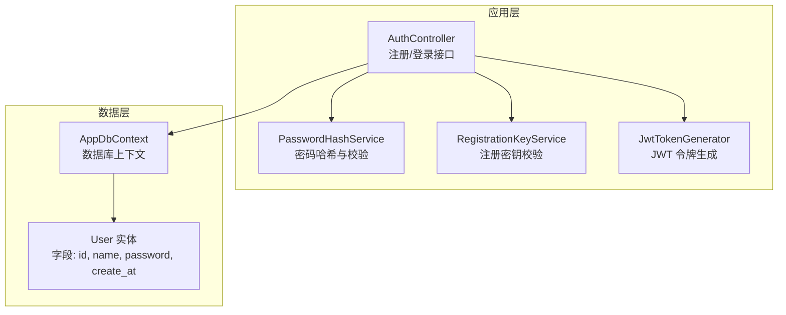
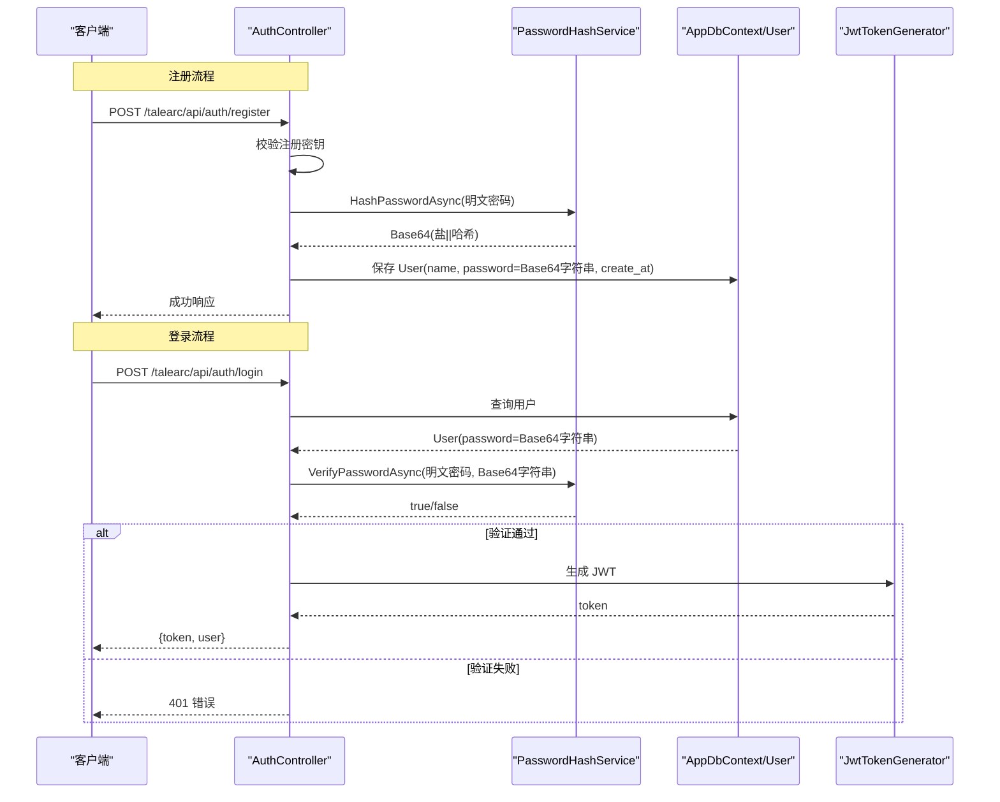
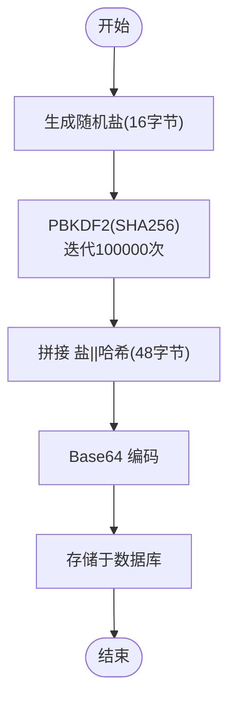
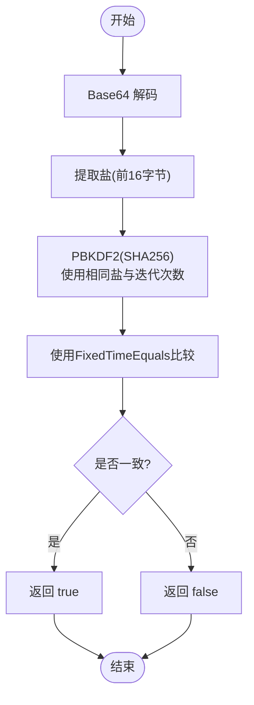
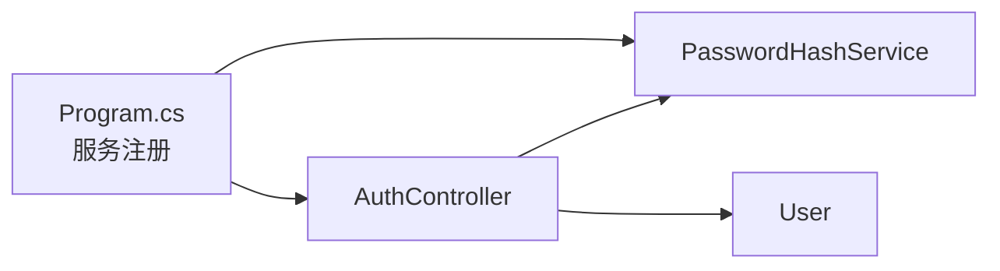

# 密码哈希服务

<cite>
**本文引用的文件**
- [src/application/service/PasswordHashService.cs](file://src/application/service/PasswordHashService.cs)
- [src/application/controllers/auth/AuthController.cs](file://src/application/controllers/auth/AuthController.cs)
- [tests/Services/PasswordHashServiceTests.cs](file://tests/Services/PasswordHashServiceTests.cs)
</cite>

## 更新摘要
**变更内容**
- 将 `HashPassword` 和 `VerifyPassword` 方法重构为异步方法 `HashPasswordAsync` 和 `VerifyPasswordAsync`
- 将 PBKDF2 迭代次数从 10000 次提升至 100000 次，以符合 OWASP 安全建议
- 使用 `CryptographicOperations.FixedTimeEquals` 替代逐字节比较，以更可靠地防止时序攻击
- 在 CPU 密集型操作中使用 `Task.Run` 将工作移至线程池线程，避免阻塞主线程

## 目录
1. [简介](#简介)
2. [项目结构](#项目结构)
3. [核心组件](#核心组件)
4. [架构总览](#架构总览)
5. [详细组件分析](#详细组件分析)
6. [依赖关系分析](#依赖关系分析)
7. [性能考量](#性能考量)
8. [故障排查指南](#故障排查指南)
9. [结论](#结论)
10. [附录](#附录)

## 简介
本文件围绕 PasswordHashService 类进行系统化安全设计与实现解析，重点阐述其基于 PBKDF2（Rfc2898DeriveBytes）与 SHA256 的密码哈希策略，以及在注册与登录流程中的应用。文档强调以下关键点：
- 使用 16 字节盐值与 100000 次迭代，有效抵御彩虹表与暴力破解；
- 哈希输出包含盐与哈希拼接后的字节数组，经 Base64 编码存储；
- 验证流程通过“固定时间比较”避免时序攻击；
- 异常捕获机制防止敏感信息泄露；
- 在用户注册与登录中确保密码永不以明文形式存储；
- 提供调整迭代次数的平衡建议与格式兼容性警示。

## 项目结构
PasswordHashService 位于应用层服务目录，被认证控制器在注册与登录场景中调用；用户实体持久化密码哈希字符串；程序入口完成服务注册与认证配置。

图表来源
- [src/application/controllers/auth/AuthController.cs](file://src/application/controllers/auth/AuthController.cs#L62-L175)
- [src/application/service/PasswordHashService.cs](file://src/application/service/PasswordHashService.cs#L1-L68)
- [src/data/entities/User.cs](file://src/data/entities/User.cs#L1-L40)
- [Program.cs](file://Program.cs#L46-L48)

章节来源
- [src/application/service/PasswordHashService.cs](file://src/application/service/PasswordHashService.cs#L1-L68)
- [src/application/controllers/auth/AuthController.cs](file://src/application/controllers/auth/AuthController.cs#L62-L175)
- [src/data/entities/User.cs](file://src/data/entities/User.cs#L1-L40)
- [Program.cs](file://Program.cs#L46-L48)

## 核心组件
- PasswordHashService：提供异步密码哈希与验证功能，内部使用 PBKDF2（Rfc2898DeriveBytes）+ SHA256，固定盐长与迭代次数，输出 Base64 字符串。
- AuthController：在注册时调用哈希服务生成密码哈希并持久化；在登录时调用验证服务进行比对。
- User 实体：持久化字段包含 password（即哈希字符串），不保存明文密码。
- 程序入口：注册 PasswordHashService 为服务，供控制器注入使用。

章节来源
- [src/application/service/PasswordHashService.cs](file://src/application/service/PasswordHashService.cs#L1-L68)
- [src/application/controllers/auth/AuthController.cs](file://src/application/controllers/auth/AuthController.cs#L86-L119)
- [src/application/controllers/auth/AuthController.cs](file://src/application/controllers/auth/AuthController.cs#L147-L168)
- [src/data/entities/User.cs](file://src/data/entities/User.cs#L27-L33)
- [Program.cs](file://Program.cs#L46-L48)

## 架构总览
下图展示注册与登录两条关键路径中 PasswordHashService 的参与方式与数据流向。

图表来源
- [src/application/controllers/auth/AuthController.cs](file://src/application/controllers/auth/AuthController.cs#L86-L119)
- [src/application/controllers/auth/AuthController.cs](file://src/application/controllers/auth/AuthController.cs#L147-L168)
- [src/application/service/PasswordHashService.cs](file://src/application/service/PasswordHashService.cs#L20-L34)
- [src/application/service/PasswordHashService.cs](file://src/application/service/PasswordHashService.cs#L43-L67)
- [src/data/entities/User.cs](file://src/data/entities/User.cs#L27-L33)

## 详细组件分析

### PasswordHashService 安全设计与实现
- 算法与参数
  - PBKDF2（Rfc2898DeriveBytes）+ SHA256，盐长 16 字节，迭代 100000 次。
  - 该组合具备强抗彩虹表能力，且迭代次数符合 OWASP 安全建议，可有效抵御暴力破解。
- 哈希生成流程（HashPasswordAsync）
  - 使用 `Task.Run` 将 CPU 密集型操作移至线程池线程，避免阻塞主线程；
  - 使用 PBKDF2 生成 16 字节盐与 32 字节哈希；
  - 将盐与哈希拼接为 48 字节字节数组；
  - 转换为 Base64 字符串返回，便于安全存储。
- 验证流程（VerifyPasswordAsync）
  - Base64 解码得到原始字节；
  - 从字节流前 16 字节提取盐；
  - 使用相同盐、迭代次数与算法重新计算哈希；
  - 使用 `CryptographicOperations.FixedTimeEquals` 进行固定时间比较，以防止时序攻击；
  - 捕获异常并统一返回 false，防止信息泄露。
- 存储与兼容性
  - 数据库存储的是 Base64 字符串，不包含明文密码；
  - 不得更改哈希格式（盐长、哈希长度、编码方式、迭代次数等），以保证向后兼容。

图表来源
- [src/application/service/PasswordHashService.cs](file://src/application/service/PasswordHashService.cs#L20-L34)

图表来源
- [src/application/service/PasswordHashService.cs](file://src/application/service/PasswordHashService.cs#L43-L67)

章节来源
- [src/application/service/PasswordHashService.cs](file://src/application/service/PasswordHashService.cs#L1-L68)

### 注册流程中的安全要点
- 注册密钥校验通过后，使用 PasswordHashService 对明文密码进行异步哈希；
- 将哈希字符串存入 User.password 字段；
- 数据库中不存储任何明文密码，降低泄露风险。

章节来源
- [src/application/controllers/auth/AuthController.cs](file://src/application/controllers/auth/AuthController.cs#L86-L119)
- [src/data/entities/User.cs](file://src/data/entities/User.cs#L27-L33)

### 登录流程中的安全要点
- 查询用户并获取 Base64 编码的密码哈希；
- 调用 PasswordHashService 进行异步验证，若失败统一返回 401；
- 成功后生成 JWT 并返回给客户端。

章节来源
- [src/application/controllers/auth/AuthController.cs](file://src/application/controllers/auth/AuthController.cs#L147-L168)

### 时序攻击防护与异常处理
- 验证过程采用 `CryptographicOperations.FixedTimeEquals` 进行固定时间比较，有效防止时序攻击；
- 捕获所有异常并返回 false，防止异常类型或堆栈信息泄露。

章节来源
- [src/application/service/PasswordHashService.cs](file://src/application/service/PasswordHashService.cs#L43-L67)

## 依赖关系分析
- PasswordHashService 由 Program 中的服务注册注入到 AuthController；
- AuthController 在注册与登录中分别调用异步哈希与验证逻辑；
- User 实体仅持久化 password 字段，不包含明文密码。

图表来源
- [Program.cs](file://Program.cs#L46-L48)
- [src/application/controllers/auth/AuthController.cs](file://src/application/controllers/auth/AuthController.cs#L62-L175)
- [src/data/entities/User.cs](file://src/data/entities/User.cs#L27-L33)

章节来源
- [Program.cs](file://Program.cs#L46-L48)
- [src/application/controllers/auth/AuthController.cs](file://src/application/controllers/auth/AuthController.cs#L62-L175)
- [src/data/entities/User.cs](file://src/data/entities/User.cs#L27-L33)

## 性能考量
- 迭代次数与安全权衡：当前设置为 100000 次，符合 OWASP 推荐标准，提供了更强的安全性。由于采用了异步方法和 `Task.Run`，CPU 密集型操作被移至线程池线程，避免了阻塞主线程，从而在高并发场景下仍能保持良好的响应性能。
- 建议：
  - 在生产环境定期评估服务器 CPU 负载与平均响应时间；
  - 可引入动态调整策略（如根据硬件能力或配置项动态变更迭代次数），但需谨慎评估迁移成本与兼容性；
  - 对于高并发场景，建议配合缓存与限流策略，减少重复验证压力。

## 故障排查指南
- 注册失败
  - 检查注册密钥有效性与用户是否存在；
  - 确认 PasswordHashService 是否正常工作（可临时在测试环境验证哈希与验证流程）。
- 登录失败
  - 确认数据库中 User.password 是否为有效的 Base64 字符串；
  - 若出现异常，VerifyPasswordAsync 会捕获并返回 false，需检查日志定位具体原因。
- 日志与异常
  - 控制器与全局中间件记录了注册与登录过程中的关键事件与异常，便于定位问题。

章节来源
- [src/application/controllers/auth/AuthController.cs](file://src/application/controllers/auth/AuthController.cs#L86-L119)
- [src/application/controllers/auth/AuthController.cs](file://src/application/controllers/auth/AuthController.cs#L147-L168)
- [src/application/service/PasswordHashService.cs](file://src/application/service/PasswordHashService.cs#L43-L67)

## 结论
PasswordHashService 通过 PBKDF2（Rfc2898DeriveBytes）+ SHA256 的标准化密码哈希方案，结合固定盐长与 100000 次迭代，有效提升了抗彩虹表与暴力破解能力；其“盐+哈希”的拼接与 Base64 编码存储方式，确保数据库中不保存明文密码；验证流程采用 `CryptographicOperations.FixedTimeEquals` 进行固定时间比较与异常捕获，进一步增强了安全性与健壮性。通过将方法重构为异步并使用 `Task.Run`，服务在保证高安全性的同时，也避免了对主线程的阻塞。在注册与登录流程中，服务被正确注入并使用，实现了密码安全存储与验证。建议在保证向后兼容的前提下，按需调整迭代次数以平衡安全与性能。

## 附录
- 关键实现位置参考
  - 哈希生成：[HashPasswordAsync 方法](file://src/application/service/PasswordHashService.cs#L20-L34)
  - 验证流程：[VerifyPasswordAsync 方法](file://src/application/service/PasswordHashService.cs#L43-L67)
  - 注册调用：[注册接口](file://src/application/controllers/auth/AuthController.cs#L86-L119)
  - 登录调用：[登录接口](file://src/application/controllers/auth/AuthController.cs#L147-L168)
  - 服务注册：[服务注册](file://Program.cs#L46-L48)
  - 用户实体字段：[User.password](file://src/data/entities/User.cs#L27-L33)