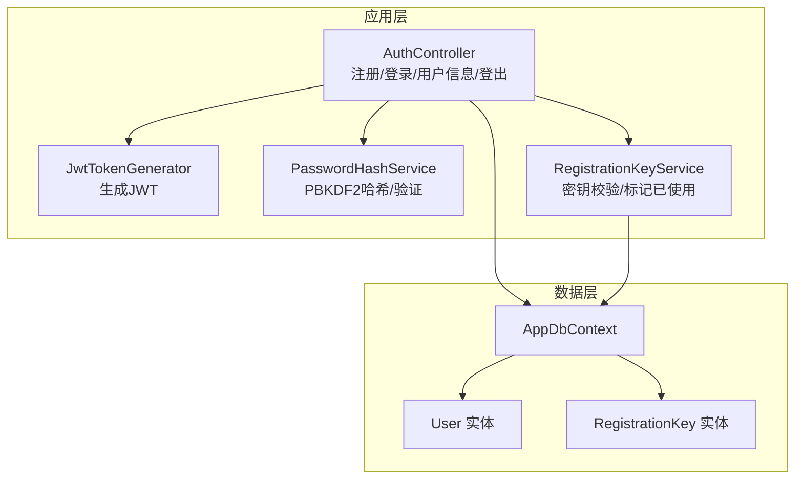
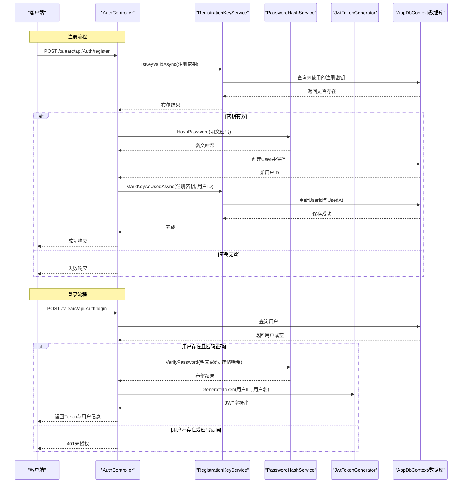
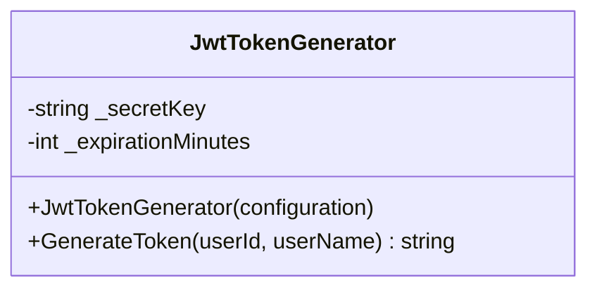
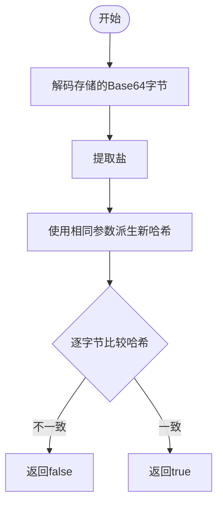
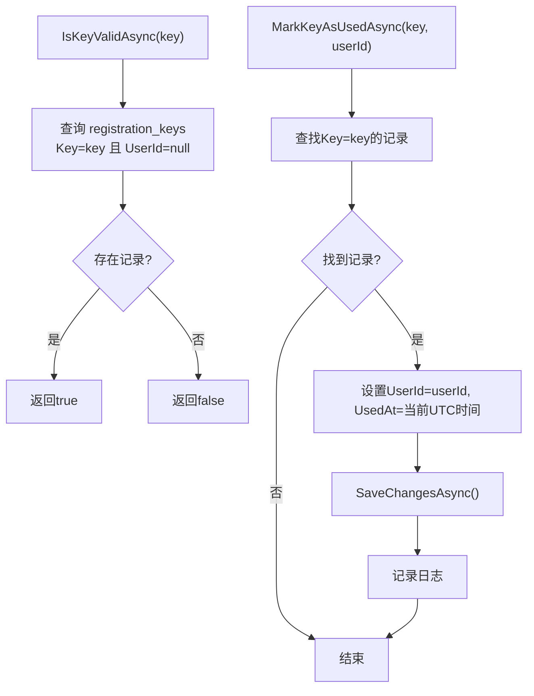
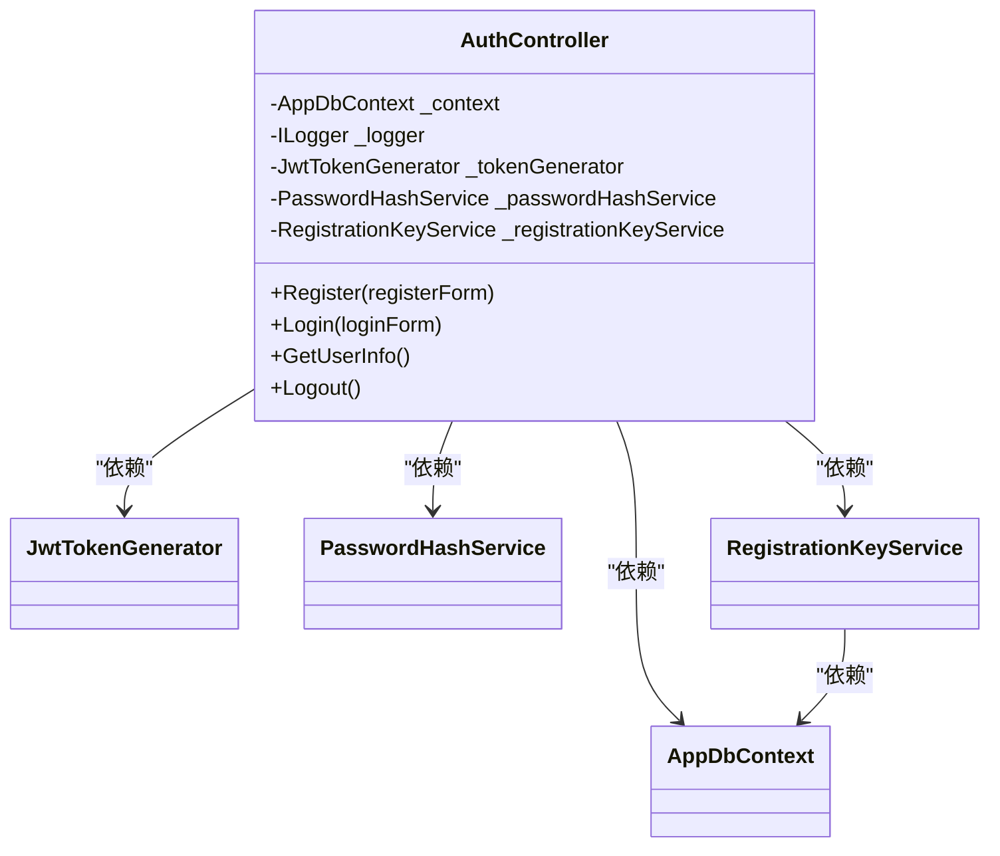
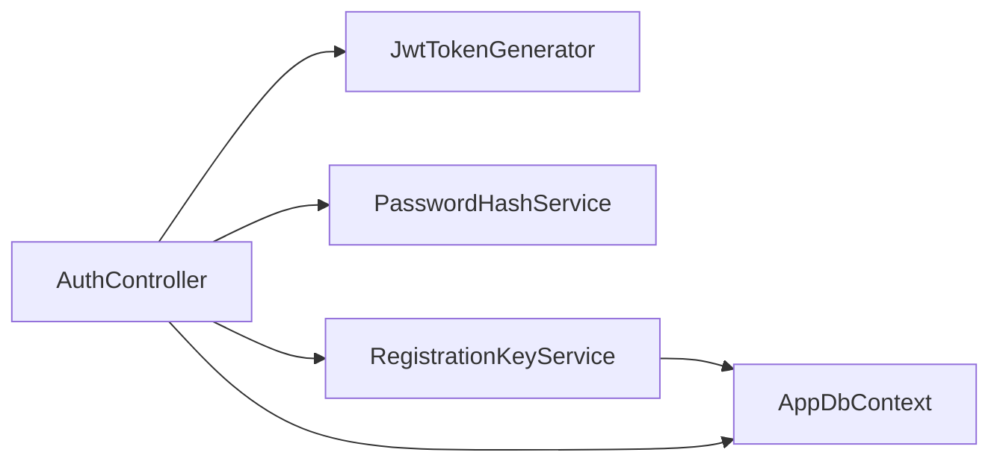

# 核心服务架构

<cite>
**本文引用的文件**
- [JwtTokenGenerator.cs](file://src/application/service/JwtTokenGenerator.cs)
- [PasswordHashService.cs](file://src/application/service/PasswordHashService.cs)
- [RegistrationKeyService.cs](file://src/application/service/RegistrationKeyService.cs)
- [AuthController.cs](file://src/application/controllers/auth/AuthController.cs)
- [Program.cs](file://Program.cs)
- [appsettings.json](file://appsettings.json)
- [RegistrationKey.cs](file://src/data/entities/RegistrationKey.cs)
- [User.cs](file://src/data/entities/User.cs)
- [LoginResponseDto.cs](file://src/data/dto/LoginResponseDto.cs)
</cite>

## 目录
1. [简介](#简介)
2. [项目结构](#项目结构)
3. [核心组件](#核心组件)
4. [架构总览](#架构总览)
5. [详细组件分析](#详细组件分析)
6. [依赖关系分析](#依赖关系分析)
7. [性能考量](#性能考量)
8. [故障排查指南](#故障排查指南)
9. [结论](#结论)

## 简介
本文件聚焦于三个核心服务类的实现细节与协作方式：
- JwtTokenGenerator：从配置读取密钥与过期时间，使用对称密钥与签名凭据生成符合标准的JWT令牌，包含发行者、受众、声明等要素。
- PasswordHashService：基于PBKDF2（Rfc2898DeriveBytes）算法进行密码哈希，提供HashPassword与VerifyPassword方法，确保密码存储安全。
- RegistrationKeyService：校验注册密钥是否有效且未被使用，并在用户注册成功后将其标记为已使用（更新使用者与使用时间）。

同时阐明这些服务通过依赖注入在AuthController中被调用，形成“注册—登录—鉴权”的完整业务链路。

## 项目结构
- 应用层服务位于 src/application/service，包含JWT生成、密码哈希、注册密钥管理三类服务。
- 控制器位于 src/application/controllers/auth，其中AuthController负责注册、登录、获取用户信息、登出等接口。
- 数据访问与实体位于 src/data，包括AppDbContext、User、RegistrationKey等。
- 入口程序在 Program.cs 中完成数据库、认证、服务注册与中间件配置；JWT配置在 appsettings.json 中。

图表来源
- [AuthController.cs](file://src/application/controllers/auth/AuthController.cs#L62-L175)
- [JwtTokenGenerator.cs](file://src/application/service/JwtTokenGenerator.cs#L1-L40)
- [PasswordHashService.cs](file://src/application/service/PasswordHashService.cs#L1-L53)
- [RegistrationKeyService.cs](file://src/application/service/RegistrationKeyService.cs#L1-L37)
- [User.cs](file://src/data/entities/User.cs#L1-L40)
- [RegistrationKey.cs](file://src/data/entities/RegistrationKey.cs#L1-L31)

章节来源
- [Program.cs](file://Program.cs#L24-L48)
- [appsettings.json](file://appsettings.json#L1-L16)

## 核心组件
- JwtTokenGenerator：从配置读取密钥与过期分钟数，构造对称密钥与签名凭据，创建包含发行者、受众、声明的JWT，并返回字符串令牌。
- PasswordHashService：使用PBKDF2（SHA-256、固定迭代次数、盐长度），将盐与哈希拼接后编码为字符串；验证时从存储的字节中提取盐并重新计算哈希比对。
- RegistrationKeyService：查询未使用的注册密钥（UserId为空），并在注册成功后更新为已使用状态（写入UserId与UsedAt）。

章节来源
- [JwtTokenGenerator.cs](file://src/application/service/JwtTokenGenerator.cs#L10-L39)
- [PasswordHashService.cs](file://src/application/service/PasswordHashService.cs#L8-L53)
- [RegistrationKeyService.cs](file://src/application/service/RegistrationKeyService.cs#L12-L37)

## 架构总览
下图展示从客户端请求到服务处理再到数据库持久化的端到端流程，以及各服务之间的依赖关系。

图表来源
- [AuthController.cs](file://src/application/controllers/auth/AuthController.cs#L82-L129)
- [AuthController.cs](file://src/application/controllers/auth/AuthController.cs#L139-L175)
- [RegistrationKeyService.cs](file://src/application/service/RegistrationKeyService.cs#L15-L37)
- [PasswordHashService.cs](file://src/application/service/PasswordHashService.cs#L12-L53)
- [JwtTokenGenerator.cs](file://src/application/service/JwtTokenGenerator.cs#L19-L39)
- [User.cs](file://src/data/entities/User.cs#L1-L40)
- [RegistrationKey.cs](file://src/data/entities/RegistrationKey.cs#L1-L31)

## 详细组件分析

### JwtTokenGenerator 组件分析
- 配置读取与初始化
  - 从 IConfiguration 读取 Jwt:SecretKey 与 Jwt:ExpirationMinutes，若缺失则抛出异常；默认过期分钟数为整型解析值。
- 令牌生成
  - 使用UTF-8编码的密钥构造对称安全密钥，采用HMAC-SHA256签名算法。
  - 声明包含 NameIdentifier（用户ID）与 Name（用户名）。
  - 发行者与受众分别为固定字符串，过期时间为当前UTC时间加上配置的分钟数。
  - 最终由JwtSecurityTokenHandler写出JWT字符串并返回。

图表来源
- [JwtTokenGenerator.cs](file://src/application/service/JwtTokenGenerator.cs#L10-L39)

章节来源
- [JwtTokenGenerator.cs](file://src/application/service/JwtTokenGenerator.cs#L10-L39)
- [appsettings.json](file://appsettings.json#L1-L16)
- [Program.cs](file://Program.cs#L27-L44)

### PasswordHashService 组件分析
- PBKDF2算法与参数
  - 固定盐长度、哈希长度与迭代次数，使用SHA-256作为底层哈希算法。
- HashPassword
  - 生成随机盐，使用Rfc2898DeriveBytes派生哈希，将盐与哈希拼接后Base64编码存储。
- VerifyPassword
  - 解码存储的字节，提取盐，重新派生哈希并与存储的哈希部分逐字节比对，捕获异常时直接返回false。

图表来源
- [PasswordHashService.cs](file://src/application/service/PasswordHashService.cs#L12-L53)

章节来源
- [PasswordHashService.cs](file://src/application/service/PasswordHashService.cs#L8-L53)

### RegistrationKeyService 组件分析
- IsKeyValidAsync
  - 查询数据库中是否存在Key等于传入值且UserId为空的记录，用于判断密钥是否有效且未被使用。
- MarkKeyAsUsedAsync
  - 查找对应密钥记录，若存在则设置UserId为当前用户ID、UsedAt为当前UTC时间并保存；同时记录日志。

图表来源
- [RegistrationKeyService.cs](file://src/application/service/RegistrationKeyService.cs#L15-L37)
- [RegistrationKey.cs](file://src/data/entities/RegistrationKey.cs#L1-L31)

章节来源
- [RegistrationKeyService.cs](file://src/application/service/RegistrationKeyService.cs#L12-L37)
- [RegistrationKey.cs](file://src/data/entities/RegistrationKey.cs#L1-L31)

### 依赖注入与业务链路
- 服务注册
  - 在Program.cs中以Scoped生命周期注册JwtTokenGenerator、PasswordHashService、RegistrationKeyService。
- 控制器注入
  - AuthController通过构造函数注入上述三个服务实例，用于注册、登录与用户信息查询等操作。
- 业务链路
  - 注册：先校验注册密钥有效性，再对密码进行哈希，创建用户并持久化，最后将密钥标记为已使用。
  - 登录：根据用户名查询用户，使用PasswordHashService验证密码，成功后使用JwtTokenGenerator生成JWT返回给客户端。

图表来源
- [AuthController.cs](file://src/application/controllers/auth/AuthController.cs#L62-L74)
- [Program.cs](file://Program.cs#L46-L48)

章节来源
- [Program.cs](file://Program.cs#L46-L48)
- [AuthController.cs](file://src/application/controllers/auth/AuthController.cs#L62-L74)

## 依赖关系分析
- 组件耦合
  - AuthController对三个服务存在强依赖，职责清晰：注册/登录流程编排、密码哈希与JWT生成、注册密钥校验与标记。
  - RegistrationKeyService与AppDbContext耦合，负责密钥实体的查询与更新。
- 外部依赖
  - JwtTokenGenerator依赖Microsoft.IdentityModel.Tokens与System.IdentityModel.Tokens.Jwt。
  - PasswordHashService依赖System.Security.Cryptography。
  - RegistrationKeyService依赖EntityFrameworkCore进行数据库操作。
- 循环依赖
  - 当前设计无循环依赖，控制流自上而下。

图表来源
- [AuthController.cs](file://src/application/controllers/auth/AuthController.cs#L62-L74)
- [RegistrationKeyService.cs](file://src/application/service/RegistrationKeyService.cs#L1-L10)

章节来源
- [AuthController.cs](file://src/application/controllers/auth/AuthController.cs#L62-L74)
- [RegistrationKeyService.cs](file://src/application/service/RegistrationKeyService.cs#L1-L10)

## 性能考量
- PBKDF2参数
  - 迭代次数较高可提升抗暴力破解能力，但会增加CPU与内存开销。可根据硬件条件与安全需求调整。
- 密钥与令牌
  - 对称密钥长度建议满足算法要求；令牌过期时间应平衡用户体验与安全风险。
- 数据库查询
  - IsKeyValidAsync使用单字段过滤与空值判断，建议在Key与UserId组合上建立索引以优化查询性能。
- 日志与异常
  - 控制器与服务均记录关键事件，注意避免敏感信息泄露；异常统一由中间件处理。

[本节为通用指导，无需特定文件引用]

## 故障排查指南
- JWT配置缺失
  - 现象：启动时报错提示缺少Jwt:SecretKey。
  - 排查：检查appsettings.json中的Jwt:SecretKey与Jwt:ExpirationMinutes配置项。
- 登录失败
  - 现象：返回401未授权。
  - 排查：确认用户名存在且密码哈希匹配；检查PasswordHashService的VerifyPassword流程。
- 注册失败
  - 现象：返回400密钥无效或用户名已存在。
  - 排查：确认RegistrationKeyService.IsKeyValidAsync返回true且RegistrationKey.UserId为空；检查数据库中对应记录。
- 密钥标记失败
  - 现象：注册成功但密钥未标记为已使用。
  - 排查：确认RegistrationKeyService.MarkKeyAsUsedAsync执行路径与SaveChangesAsync返回值；查看日志输出。

章节来源
- [appsettings.json](file://appsettings.json#L1-L16)
- [AuthController.cs](file://src/application/controllers/auth/AuthController.cs#L82-L129)
- [AuthController.cs](file://src/application/controllers/auth/AuthController.cs#L139-L175)
- [RegistrationKeyService.cs](file://src/application/service/RegistrationKeyService.cs#L24-L37)

## 结论
- JwtTokenGenerator、PasswordHashService、RegistrationKeyService分别承担令牌生成、密码安全与注册密钥管控的核心职责。
- 通过依赖注入，AuthController将三者无缝串联，形成从注册到登录再到鉴权的闭环。
- 建议持续关注PBKDF2参数、JWT配置与数据库索引优化，以兼顾安全性与性能。