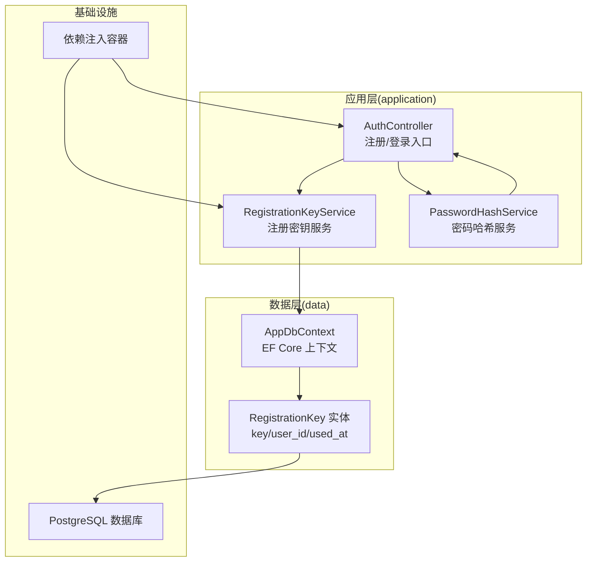
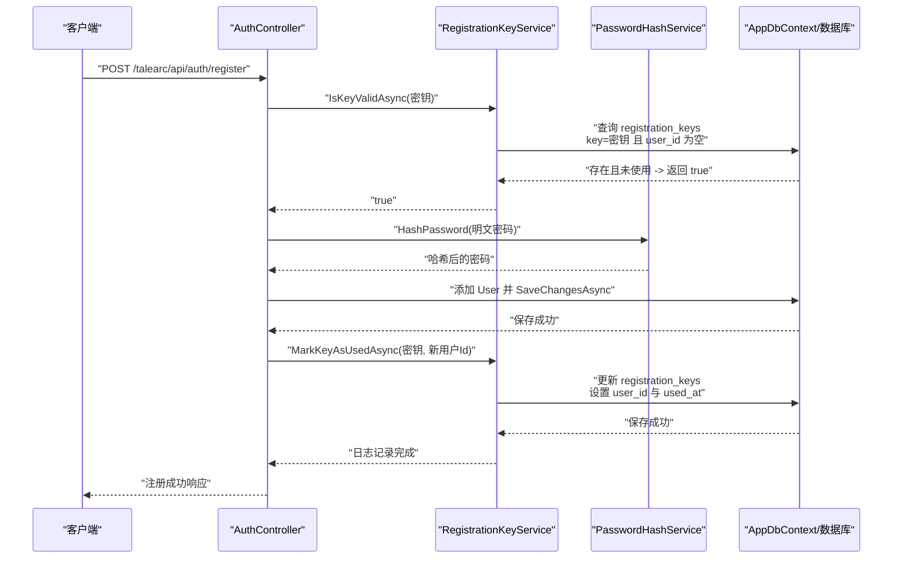
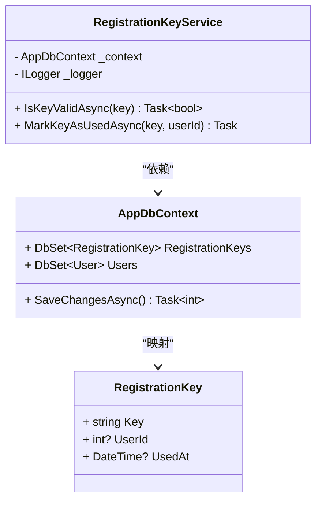
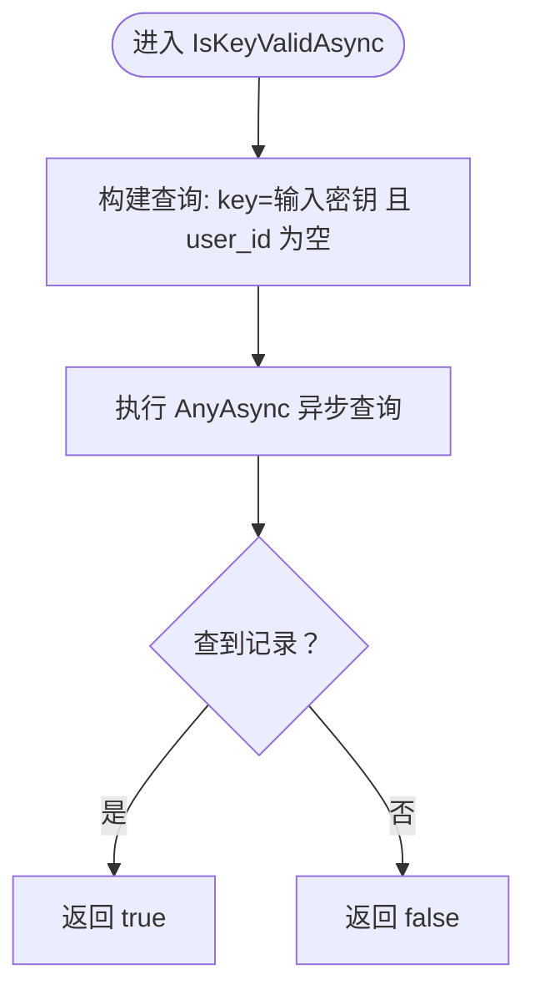
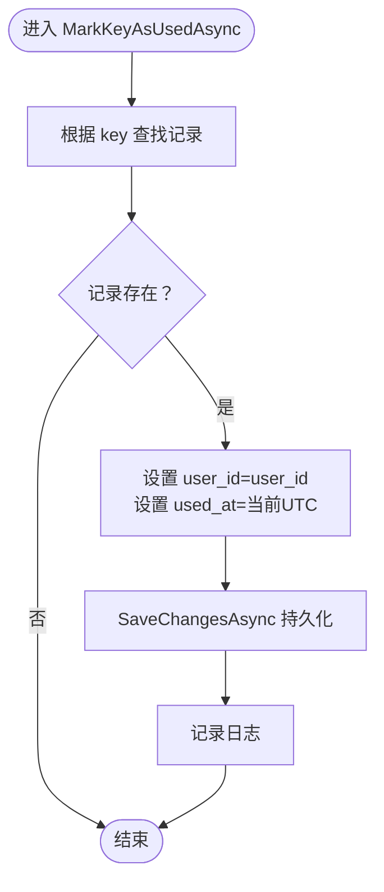
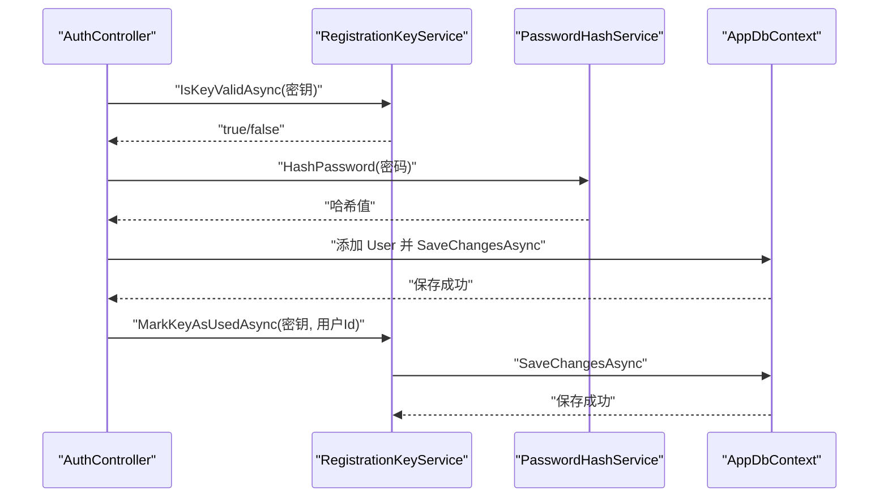
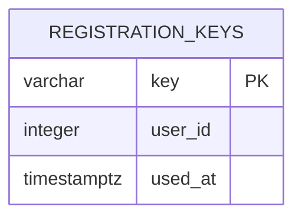
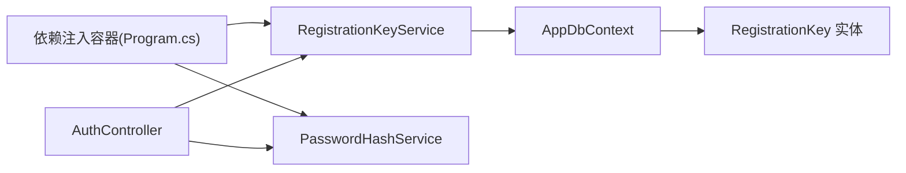

# 注册密钥服务

<cite>
**本文引用的文件**
- [RegistrationKeyService.cs](file://src/application/service/RegistrationKeyService.cs)
- [RegistrationKey.cs](file://src/data/entities/RegistrationKey.cs)
- [AuthController.cs](file://src/application/controllers/auth/AuthController.cs)
- [PasswordHashService.cs](file://src/application/service/PasswordHashService.cs)
- [AppDbContext.cs](file://src/data/AppDbContext.cs)
- [20251217055145_AddRegistrationKeyTable.cs](file://Migrations/20251217055145_AddRegistrationKeyTable.cs)
- [Program.cs](file://Program.cs)
</cite>

## 目录
1. [简介](#简介)
2. [项目结构](#项目结构)
3. [核心组件](#核心组件)
4. [架构总览](#架构总览)
5. [详细组件分析](#详细组件分析)
6. [依赖关系分析](#依赖关系分析)
7. [性能考量](#性能考量)
8. [故障排查指南](#故障排查指南)
9. [结论](#结论)
10. [附录](#附录)

## 简介
本文件围绕 RegistrationKeyService 在用户准入控制中的关键作用展开，系统阐述其通过构造函数注入 AppDbContext 与 ILogger 实现依赖解耦的设计模式；深入解析 IsKeyValidAsync 的查询逻辑，说明其利用 Entity Framework Core 异步查询 RegistrationKeys 表，验证密钥存在且未被使用（UserId 为空）以确保一次性注册机制；阐明 MarkKeyAsUsedAsync 的业务流程：定位密钥记录、设置 UserId 与 UsedAt 时间戳、持久化变更并记录操作日志；强调 SaveChangesAsync 调用的必要性以确保数据库事务提交；结合 AuthController 的注册流程，说明该服务与 PasswordHashService 协同工作，在用户创建后立即标记密钥为已使用，防止重复注册。最后给出关于密钥生成策略、数据库索引优化以及防暴力破解的限流建议。

## 项目结构
本项目采用分层与按功能模块组织的结构：
- 应用层（application）：控制器与服务，负责处理请求与业务编排
- 数据层（data）：实体模型与 EF Core 上下文，负责数据访问与映射
- 迁移（Migrations）：数据库结构演进脚本
- 入口（Program.cs）：依赖注入与运行时配置

图表来源
- [AuthController.cs](file://src/application/controllers/auth/AuthController.cs#L62-L129)
- [RegistrationKeyService.cs](file://src/application/service/RegistrationKeyService.cs#L1-L37)
- [PasswordHashService.cs](file://src/application/service/PasswordHashService.cs#L1-L53)
- [AppDbContext.cs](file://src/data/AppDbContext.cs#L1-L26)
- [RegistrationKey.cs](file://src/data/entities/RegistrationKey.cs#L1-L31)
- [Program.cs](file://Program.cs#L46-L48)

章节来源
- [Program.cs](file://Program.cs#L24-L26)
- [AppDbContext.cs](file://src/data/AppDbContext.cs#L10-L16)

## 核心组件
- RegistrationKeyService：提供注册密钥校验与标记使用的服务，依赖 AppDbContext 与 ILogger
- RegistrationKey 实体：映射 registration_keys 表，包含 key、user_id、used_at 字段
- AuthController.Register：注册流程的入口，先校验密钥有效性，再创建用户并标记密钥为已使用
- PasswordHashService：负责密码哈希与校验，与注册流程协同工作
- AppDbContext：EF Core 上下文，暴露 RegistrationKeys 与 Users 等集合

章节来源
- [RegistrationKeyService.cs](file://src/application/service/RegistrationKeyService.cs#L1-L37)
- [RegistrationKey.cs](file://src/data/entities/RegistrationKey.cs#L1-L31)
- [AuthController.cs](file://src/application/controllers/auth/AuthController.cs#L82-L129)
- [PasswordHashService.cs](file://src/application/service/PasswordHashService.cs#L1-L53)
- [AppDbContext.cs](file://src/data/AppDbContext.cs#L10-L16)

## 架构总览
RegistrationKeyService 通过构造函数注入 AppDbContext 与 ILogger，遵循依赖注入原则，实现与具体数据访问与日志实现的解耦。在注册流程中，AuthController 调用 RegistrationKeyService 校验密钥，随后使用 PasswordHashService 完成密码处理，并在用户创建成功后调用 RegistrationKeyService 标记密钥为已使用，确保一次性注册机制。

图表来源
- [AuthController.cs](file://src/application/controllers/auth/AuthController.cs#L82-L129)
- [RegistrationKeyService.cs](file://src/application/service/RegistrationKeyService.cs#L12-L37)
- [PasswordHashService.cs](file://src/application/service/PasswordHashService.cs#L12-L24)
- [AppDbContext.cs](file://src/data/AppDbContext.cs#L10-L16)

## 详细组件分析

### RegistrationKeyService 组件分析
- 设计模式：构造函数注入 AppDbContext 与 ILogger，实现依赖解耦与可测试性
- 关键方法：
  - IsKeyValidAsync：异步查询 RegistrationKeys，判断指定密钥存在且 UserId 为空（未被使用）
  - MarkKeyAsUsedAsync：定位密钥记录，设置 UserId 与 UsedAt，调用 SaveChangesAsync 持久化并记录日志

图表来源
- [RegistrationKeyService.cs](file://src/application/service/RegistrationKeyService.cs#L1-L37)
- [AppDbContext.cs](file://src/data/AppDbContext.cs#L10-L16)
- [RegistrationKey.cs](file://src/data/entities/RegistrationKey.cs#L1-L31)

章节来源
- [RegistrationKeyService.cs](file://src/application/service/RegistrationKeyService.cs#L12-L37)

### 查询逻辑：IsKeyValidAsync
- 查询目标：RegistrationKeys 表
- 条件：Key 等于传入密钥 且 UserId 为空
- 返回：是否存在满足条件的记录
- 复杂度：基于数据库索引的查找，通常为 O(log n) 或 O(1)，取决于索引与基数
- 错误处理：无显式异常捕获，依赖 EF Core 与数据库层行为

图表来源
- [RegistrationKeyService.cs](file://src/application/service/RegistrationKeyService.cs#L15-L19)

章节来源
- [RegistrationKeyService.cs](file://src/application/service/RegistrationKeyService.cs#L15-L19)

### 业务流程：MarkKeyAsUsedAsync
- 步骤：
  1) 根据 Key 查找记录
  2) 若存在则设置 UserId 为当前用户 Id，UsedAt 设置为当前 UTC 时间
  3) 调用 SaveChangesAsync 持久化变更
  4) 记录操作日志
- 复杂度：查找 O(log n)/O(1)，更新 O(1)，SaveChangesAsync 一次事务提交
- 并发考虑：若并发注册同一密钥，应依赖数据库唯一约束与事务隔离级别避免重复使用

图表来源
- [RegistrationKeyService.cs](file://src/application/service/RegistrationKeyService.cs#L24-L36)

章节来源
- [RegistrationKeyService.cs](file://src/application/service/RegistrationKeyService.cs#L24-L36)

### 与 AuthController 的集成
- 注册流程要点：
  - 先调用 RegistrationKeyService.IsKeyValidAsync 校验密钥有效性
  - 再使用 PasswordHashService 对密码进行哈希
  - 创建 User 并 SaveChangesAsync 保存
  - 最后调用 RegistrationKeyService.MarkKeyAsUsedAsync 标记密钥为已使用
- 事务一致性：注册密钥标记与用户创建在同一请求内完成，需确保 SaveChangesAsync 的调用顺序与异常处理一致

图表来源
- [AuthController.cs](file://src/application/controllers/auth/AuthController.cs#L82-L129)
- [RegistrationKeyService.cs](file://src/application/service/RegistrationKeyService.cs#L12-L37)
- [PasswordHashService.cs](file://src/application/service/PasswordHashService.cs#L12-L24)

章节来源
- [AuthController.cs](file://src/application/controllers/auth/AuthController.cs#L82-L129)

### 数据模型与数据库结构
- RegistrationKey 实体映射到 registration_keys 表，包含 key、user_id、used_at 字段
- 迁移脚本创建了主键为 key 的表结构，便于按密钥快速检索

图表来源
- [RegistrationKey.cs](file://src/data/entities/RegistrationKey.cs#L1-L31)
- [20251217055145_AddRegistrationKeyTable.cs](file://Migrations/20251217055145_AddRegistrationKeyTable.cs#L14-L25)

章节来源
- [RegistrationKey.cs](file://src/data/entities/RegistrationKey.cs#L1-L31)
- [20251217055145_AddRegistrationKeyTable.cs](file://Migrations/20251217055145_AddRegistrationKeyTable.cs#L14-L25)

## 依赖关系分析
- RegistrationKeyService 依赖 AppDbContext 与 ILogger，通过构造函数注入实现解耦
- AuthController 依赖 RegistrationKeyService 与 PasswordHashService，形成业务编排
- Program.cs 中注册了 RegistrationKeyService 与 PasswordHashService 的生命周期

图表来源
- [Program.cs](file://Program.cs#L46-L48)
- [AuthController.cs](file://src/application/controllers/auth/AuthController.cs#L62-L74)
- [RegistrationKeyService.cs](file://src/application/service/RegistrationKeyService.cs#L1-L10)
- [AppDbContext.cs](file://src/data/AppDbContext.cs#L10-L16)

章节来源
- [Program.cs](file://Program.cs#L46-L48)
- [AuthController.cs](file://src/application/controllers/auth/AuthController.cs#L62-L74)

## 性能考量
- 查询性能
  - IsKeyValidAsync 基于 key 字段的等值查询，建议在数据库层为 key 字段建立唯一索引，以提升查找效率并保证唯一性约束
  - MarkKeyAsUsedAsync 更新 user_id 与 used_at，建议在 key 字段上保持唯一索引，同时确保更新操作在事务内完成
- 事务与一致性
  - SaveChangesAsync 的调用确保数据库写入的原子性；在注册流程中，应确保用户创建与密钥标记在同一事务上下文中完成，避免竞态条件导致的重复使用
- 日志与可观测性
  - RegistrationKeyService 在标记密钥使用后记录日志，有助于审计与问题追踪

章节来源
- [RegistrationKeyService.cs](file://src/application/service/RegistrationKeyService.cs#L24-L36)
- [AuthController.cs](file://src/application/controllers/auth/AuthController.cs#L114-L118)

## 故障排查指南
- 密钥无效
  - 现象：注册接口返回“无效的注册密钥”
  - 排查：确认密钥是否存在于 registration_keys 表，且 user_id 是否为空；检查 IsKeyValidAsync 的查询条件
- 重复注册
  - 现象：同一密钥被多次使用
  - 排查：确认 MarkKeyAsUsedAsync 是否在用户创建成功后调用；检查 SaveChangesAsync 是否抛出异常；核对数据库唯一索引与事务隔离级别
- 数据库连接或迁移问题
  - 现象：无法访问 registration_keys 表
  - 排查：确认 AppDbContext 已正确映射 RegistrationKeys；检查迁移脚本是否已应用
- 日志与异常
  - 现象：注册过程出现异常
  - 排查：查看控制器与服务的日志输出，定位异常发生点；确认 PasswordHashService 的哈希与校验流程正常

章节来源
- [AuthController.cs](file://src/application/controllers/auth/AuthController.cs#L90-L104)
- [RegistrationKeyService.cs](file://src/application/service/RegistrationKeyService.cs#L24-L36)
- [AppDbContext.cs](file://src/data/AppDbContext.cs#L10-L16)

## 结论
RegistrationKeyService 在用户准入控制中扮演关键角色：通过 IsKeyValidAsync 实现一次性注册机制，通过 MarkKeyAsUsedAsync 将密钥与用户绑定并记录使用时间。结合 AuthController 的注册流程与 PasswordHashService 的密码处理，形成完整的注册闭环。为确保性能与一致性，建议对 key 字段建立唯一索引，并在注册流程中保证 SaveChangesAsync 的正确调用与事务隔离。通过日志与异常处理机制，可有效提升系统的可观测性与可维护性。

## 附录

### 密钥生成策略建议
- 长度与复杂度
  - 建议密钥长度至少 16 字符以上，包含字母与数字组合，避免易猜测的模式
  - 可采用随机字符集生成，降低碰撞概率
- 分配与回收
  - 为每个用户或批次生成唯一密钥，避免复用
  - 对过期或废弃密钥进行归档与清理，减少查询压力

### 数据库索引优化建议
- 为 registration_keys.key 建立唯一索引，确保：
  - 查询效率提升
  - 业务唯一性约束
- 可选复合索引
  - 若存在按 user_id 查询的场景，可考虑在 (user_id, used_at) 上建立索引以支持统计与审计

### 防暴力破解与限流建议
- 请求限流
  - 对注册接口设置每 IP/每密钥的速率限制，超过阈值进行临时封禁
- 验证码与二次校验
  - 在高风险场景引入验证码或短信校验，降低自动化攻击成功率
- 日志与告警
  - 记录异常注册尝试与失败原因，设置阈值告警以便及时响应