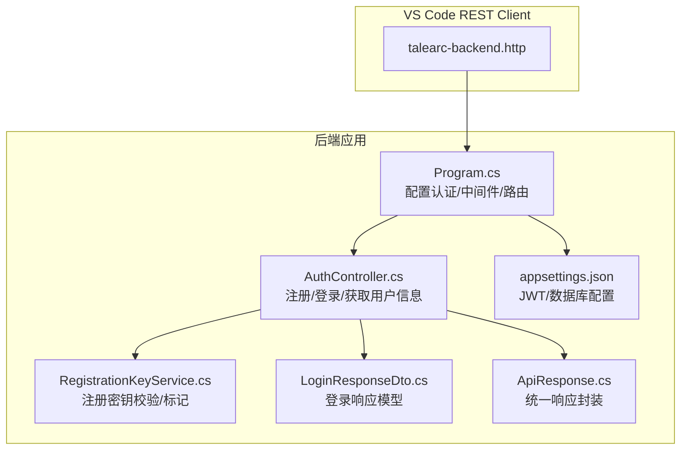
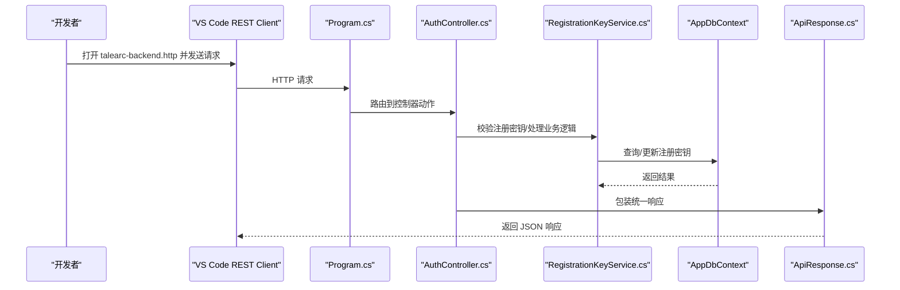
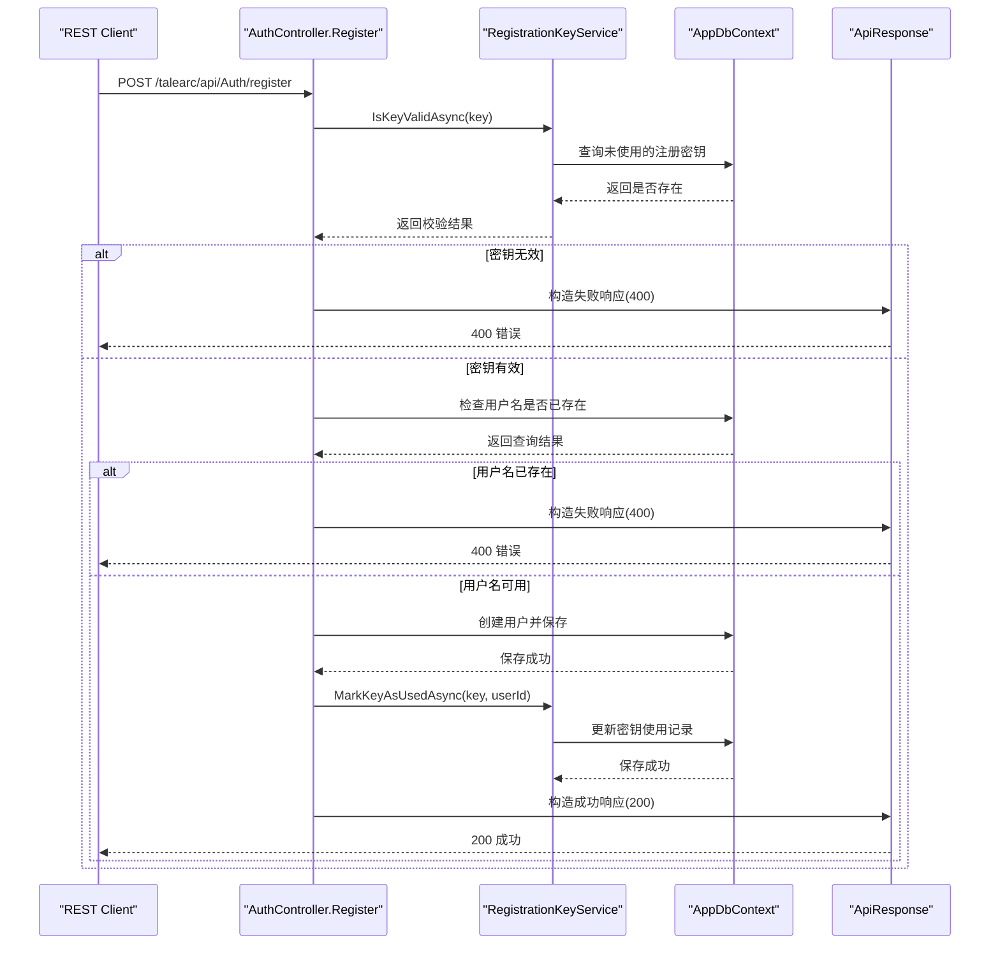
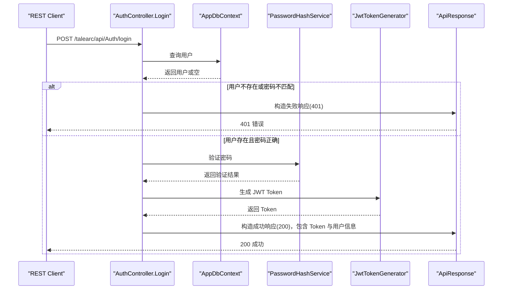
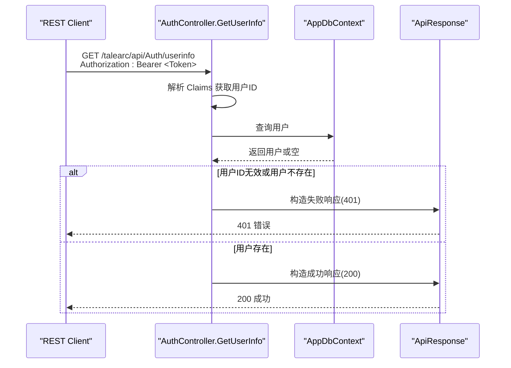
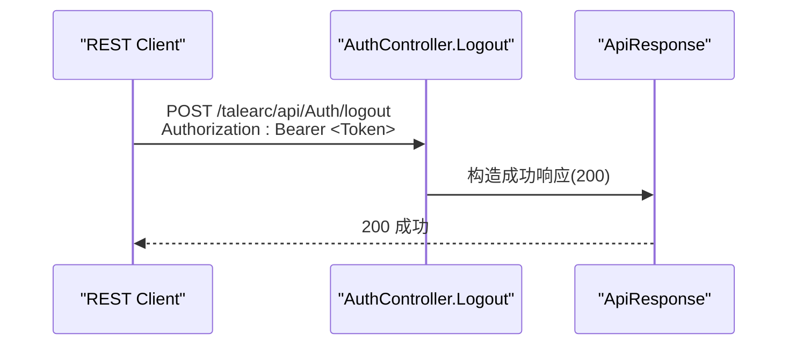
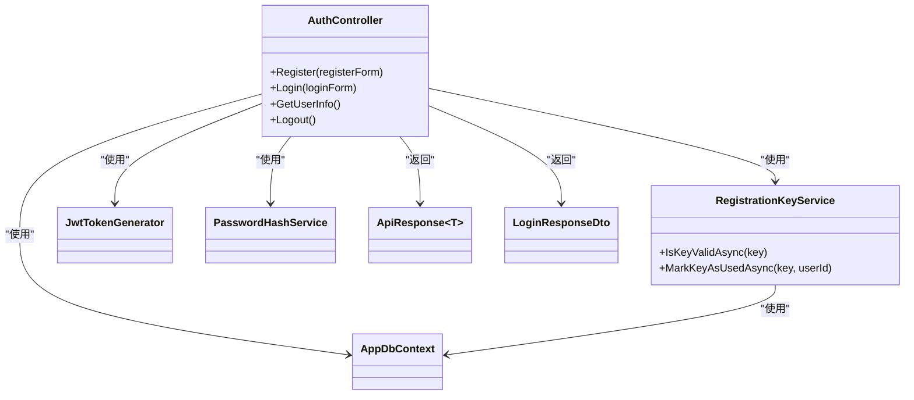

# 测试与验证

<cite>
**本文引用的文件**
- [talearc-backend.http](file://talearc-backend.http)
- [AuthController.cs](file://src/application/controllers/auth/AuthController.cs)
- [LoginForm.cs](file://src/application/controllers/auth/AuthController.cs)
- [RegisterForm.cs](file://src/application/controllers/auth/AuthController.cs)
- [LoginResponseDto.cs](file://src/data/dto/LoginResponseDto.cs)
- [ApiResponse.cs](file://src/structure/ApiResponse.cs)
- [RegistrationKeyService.cs](file://src/application/service/RegistrationKeyService.cs)
- [Program.cs](file://Program.cs)
- [appsettings.json](file://appsettings.json)
</cite>

## 目录
1. [简介](#简介)
2. [项目结构](#项目结构)
3. [核心组件](#核心组件)
4. [架构总览](#架构总览)
5. [详细组件分析](#详细组件分析)
6. [依赖关系分析](#依赖关系分析)
7. [性能考虑](#性能考虑)
8. [故障排查指南](#故障排查指南)
9. [结论](#结论)
10. [附录](#附录)

## 简介
本章节面向开发者，系统性介绍如何使用 VS Code 中的 REST Client 插件，通过仓库中的 talearc-backend.http 文件对后端 API 进行手动测试与验证。该文件包含对注册、登录、获取用户信息等端点的预设请求，开发者只需在 VS Code 中打开该文件，逐条点击“Send Request”即可执行测试，并查看响应状态码与 JSON 数据。同时，本文提供每个请求的预期结果说明，并给出基于现有控制器实现的自动化测试建议（如使用 xUnit 单元测试与集成测试，结合 Moq 对服务进行模拟）。

## 项目结构
- 顶层包含一个用于手动测试的 HTTP 脚本文件：talearc-backend.http
- 后端采用 ASP.NET Core 架构，控制器位于 src/application/controllers/auth/AuthController.cs
- DTO 定义位于 src/data/dto 下，包括登录响应模型 LoginResponseDto.cs
- 统一响应包装类 ApiResponse.cs 位于 src/structure/
- 认证相关服务位于 src/application/service/，如 RegistrationKeyService.cs
- 应用程序入口 Program.cs 配置了 JWT 认证、数据库连接、Swagger 等
- 配置文件 appsettings.json 提供 JWT 密钥与数据库连接字符串

图表来源
- [Program.cs](file://Program.cs#L1-L107)
- [AuthController.cs](file://src/application/controllers/auth/AuthController.cs#L62-L227)
- [RegistrationKeyService.cs](file://src/application/service/RegistrationKeyService.cs#L1-L37)
- [LoginResponseDto.cs](file://src/data/dto/LoginResponseDto.cs#L1-L17)
- [ApiResponse.cs](file://src/structure/ApiResponse.cs#L1-L40)
- [appsettings.json](file://appsettings.json#L1-L16)

章节来源
- [talearc-backend.http](file://talearc-backend.http#L1-L7)
- [Program.cs](file://Program.cs#L1-L107)
- [AuthController.cs](file://src/application/controllers/auth/AuthController.cs#L62-L227)
- [RegistrationKeyService.cs](file://src/application/service/RegistrationKeyService.cs#L1-L37)
- [LoginResponseDto.cs](file://src/data/dto/LoginResponseDto.cs#L1-L17)
- [ApiResponse.cs](file://src/structure/ApiResponse.cs#L1-L40)
- [appsettings.json](file://appsettings.json#L1-L16)

## 核心组件
- REST Client 测试脚本：talearc-backend.http，定义了基础主机地址与若干请求示例（当前包含一个天气预报示例）
- 认证控制器：AuthController.cs，提供注册、登录、获取用户信息、登出等接口
- 登录响应模型：LoginResponseDto.cs，包含 Token 与用户信息
- 统一响应封装：ApiResponse.cs，所有接口统一返回结构
- 注册密钥服务：RegistrationKeyService.cs，负责注册密钥有效性校验与使用标记
- 应用程序入口：Program.cs，配置 JWT 认证、数据库连接、中间件与 Swagger

章节来源
- [talearc-backend.http](file://talearc-backend.http#L1-L7)
- [AuthController.cs](file://src/application/controllers/auth/AuthController.cs#L62-L227)
- [LoginResponseDto.cs](file://src/data/dto/LoginResponseDto.cs#L1-L17)
- [ApiResponse.cs](file://src/structure/ApiResponse.cs#L1-L40)
- [RegistrationKeyService.cs](file://src/application/service/RegistrationKeyService.cs#L1-L37)
- [Program.cs](file://Program.cs#L1-L107)

## 架构总览
下图展示了从 REST Client 到后端控制器、服务与数据层的整体调用链路，以及 JWT 认证与统一响应封装的关键节点。

图表来源
- [Program.cs](file://Program.cs#L1-L107)
- [AuthController.cs](file://src/application/controllers/auth/AuthController.cs#L62-L227)
- [RegistrationKeyService.cs](file://src/application/service/RegistrationKeyService.cs#L1-L37)
- [ApiResponse.cs](file://src/structure/ApiResponse.cs#L1-L40)

## 详细组件分析

### REST Client 手动测试流程
- 在 VS Code 中打开 talearc-backend.http
- 使用“Send Request”按钮逐条执行请求
- 查看响应状态码与 JSON 数据，核对字段是否符合预期
- 若需测试认证相关端点，请先确保后端服务已启动并监听本地端口

章节来源
- [talearc-backend.http](file://talearc-backend.http#L1-L7)

### 注册端点（POST /talearc/api/Auth/register）
- 功能：使用用户名、密码与注册密钥创建新用户
- 请求体：包含用户名、密码、注册密钥
- 成功响应：
  - 状态码：200
  - 数据：包含用户信息的统一响应结构
- 失败场景：
  - 注册密钥无效：返回 400
  - 用户名已存在：返回 400
- 关键实现参考：
  - 控制器动作与响应类型定义
  - 注册密钥有效性校验与使用标记
  - 统一响应封装

图表来源
- [AuthController.cs](file://src/application/controllers/auth/AuthController.cs#L82-L129)
- [RegistrationKeyService.cs](file://src/application/service/RegistrationKeyService.cs#L12-L37)
- [ApiResponse.cs](file://src/structure/ApiResponse.cs#L28-L40)

章节来源
- [AuthController.cs](file://src/application/controllers/auth/AuthController.cs#L82-L129)
- [RegistrationKeyService.cs](file://src/application/service/RegistrationKeyService.cs#L12-L37)
- [ApiResponse.cs](file://src/structure/ApiResponse.cs#L28-L40)

### 登录端点（POST /talearc/api/Auth/login）
- 功能：使用用户名与密码登录，返回 JWT Token 与用户信息
- 请求体：包含用户名与密码
- 成功响应：
  - 状态码：200
  - 数据：包含 Token 与用户信息的登录响应模型
- 失败场景：
  - 用户名或密码错误：返回 401
- 关键实现参考：
  - 控制器动作与响应类型定义
  - 密码哈希验证
  - JWT Token 生成
  - 统一响应封装

图表来源
- [AuthController.cs](file://src/application/controllers/auth/AuthController.cs#L139-L175)
- [LoginResponseDto.cs](file://src/data/dto/LoginResponseDto.cs#L1-L17)
- [ApiResponse.cs](file://src/structure/ApiResponse.cs#L28-L40)

章节来源
- [AuthController.cs](file://src/application/controllers/auth/AuthController.cs#L139-L175)
- [LoginResponseDto.cs](file://src/data/dto/LoginResponseDto.cs#L1-L17)
- [ApiResponse.cs](file://src/structure/ApiResponse.cs#L28-L40)

### 获取用户信息端点（GET /talearc/api/Auth/userinfo）
- 功能：在已登录状态下获取当前用户信息
- 鉴权要求：需要携带有效的 JWT Bearer Token
- 成功响应：
  - 状态码：200
  - 数据：包含用户信息的统一响应结构
- 失败场景：
  - 未提供或无效 Token：返回 401
  - 用户不存在：返回 401
- 关键实现参考：
  - 授权特性与 Claims 解析
  - 用户查询与统一响应封装

图表来源
- [AuthController.cs](file://src/application/controllers/auth/AuthController.cs#L184-L208)
- [ApiResponse.cs](file://src/structure/ApiResponse.cs#L28-L40)

章节来源
- [AuthController.cs](file://src/application/controllers/auth/AuthController.cs#L184-L208)
- [ApiResponse.cs](file://src/structure/ApiResponse.cs#L28-L40)

### 登出端点（POST /talearc/api/Auth/logout）
- 功能：在已登录状态下执行登出
- 鉴权要求：需要携带有效的 JWT Bearer Token
- 成功响应：
  - 状态码：200
  - 数据：统一响应结构（无具体数据）
- 失败场景：
  - 未提供或无效 Token：返回 401
- 关键实现参考：
  - 授权特性与统一响应封装

图表来源
- [AuthController.cs](file://src/application/controllers/auth/AuthController.cs#L217-L226)
- [ApiResponse.cs](file://src/structure/ApiResponse.cs#L28-L40)

章节来源
- [AuthController.cs](file://src/application/controllers/auth/AuthController.cs#L217-L226)
- [ApiResponse.cs](file://src/structure/ApiResponse.cs#L28-L40)

### 自动化测试建议（xUnit + Moq）
- 单元测试
  - 使用 Moq 模拟 AppDbContext、JwtTokenGenerator、PasswordHashService、RegistrationKeyService
  - 针对 AuthController 的 Register、Login、GetUserInfo、Logout 方法分别编写测试用例
  - 验证不同输入组合下的响应状态码与响应体结构
- 集成测试
  - 使用 TestServer 或 WebApplicationFactory 启动最小化应用
  - 配置内存数据库或 SQLite 以避免依赖真实数据库
  - 验证端到端流程：注册 -> 登录 -> 获取用户信息 -> 登出
- JWT 认证测试
  - 在测试中构造有效的 JWT Token，或使用伪造 Token 验证 401 场景
  - 参考 Program.cs 中的 JWT 配置参数进行一致性校验

章节来源
- [Program.cs](file://Program.cs#L24-L44)
- [AuthController.cs](file://src/application/controllers/auth/AuthController.cs#L62-L227)
- [RegistrationKeyService.cs](file://src/application/service/RegistrationKeyService.cs#L1-L37)

## 依赖关系分析
- 控制器依赖服务与上下文：AuthController 依赖 AppDbContext、RegistrationKeyService、JwtTokenGenerator、PasswordHashService
- 服务依赖数据上下文：RegistrationKeyService 依赖 AppDbContext 查询与更新注册密钥
- 统一响应封装：所有控制器返回值均通过 ApiResponse 封装，便于前端统一处理
- 认证依赖配置：Program.cs 中配置了 JWT Bearer 认证方案与密钥参数

图表来源
- [AuthController.cs](file://src/application/controllers/auth/AuthController.cs#L62-L227)
- [RegistrationKeyService.cs](file://src/application/service/RegistrationKeyService.cs#L1-L37)
- [LoginResponseDto.cs](file://src/data/dto/LoginResponseDto.cs#L1-L17)
- [ApiResponse.cs](file://src/structure/ApiResponse.cs#L1-L40)

章节来源
- [AuthController.cs](file://src/application/controllers/auth/AuthController.cs#L62-L227)
- [RegistrationKeyService.cs](file://src/application/service/RegistrationKeyService.cs#L1-L37)
- [ApiResponse.cs](file://src/structure/ApiResponse.cs#L1-L40)

## 性能考虑
- 建议在本地开发环境使用内存数据库或轻量级数据库，减少 I/O 开销
- 对于高频测试场景，可复用已存在的用户与密钥，避免重复注册
- 在 REST Client 中批量执行请求时，注意控制并发，避免数据库锁竞争
- 统一响应封装有助于前端缓存策略的一致性

## 故障排查指南
- 401 未授权
  - 检查是否在请求头中正确添加 Authorization: Bearer <Token>
  - 确认 Token 未过期，且与后端配置的密钥一致
- 400 注册失败
  - 确认注册密钥有效且未被使用
  - 确认用户名唯一
- 500 内部错误
  - 查看后端日志输出，定位异常堆栈
  - 检查数据库连接字符串与权限
- JWT 配置问题
  - 确认 appsettings.json 中的 Jwt:SecretKey 已正确配置
  - 确认 Program.cs 中的 TokenValidationParameters 设置与客户端一致

章节来源
- [Program.cs](file://Program.cs#L24-L44)
- [appsettings.json](file://appsettings.json#L1-L16)
- [AuthController.cs](file://src/application/controllers/auth/AuthController.cs#L139-L175)

## 结论
通过 talearc-backend.http，开发者可以快速在 VS Code 中对后端认证相关端点进行手动测试与验证。结合 AuthController 的实现与统一响应封装，可以明确每条请求的预期结果。建议在掌握手动测试的基础上，进一步引入 xUnit 与 Moq 编写自动化测试，覆盖注册、登录、鉴权与登出等关键流程，提升代码质量与发布信心。

## 附录
- 如何在 VS Code 中使用 REST Client
  - 安装 VS Code REST Client 插件
  - 打开 talearc-backend.http
  - 点击每条请求前的“Send Request”
  - 查看响应状态码与 JSON 数据
- 常见请求路径
  - 注册：POST /talearc/api/Auth/register
  - 登录：POST /talearc/api/Auth/login
  - 获取用户信息：GET /talearc/api/Auth/userinfo（需携带 Bearer Token）
  - 登出：POST /talearc/api/Auth/logout（需携带 Bearer Token）