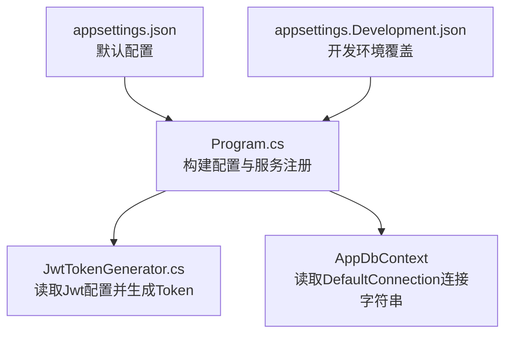
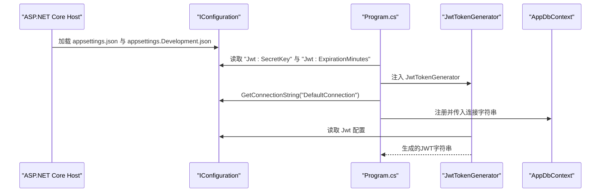
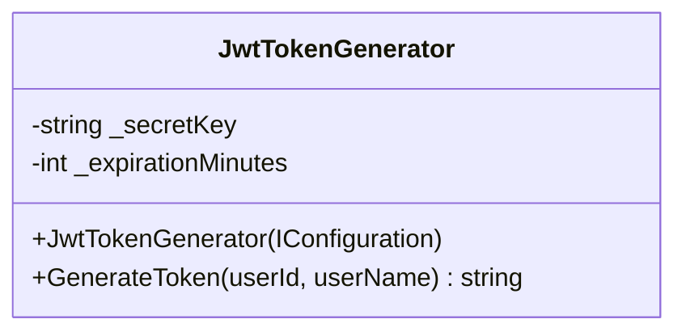
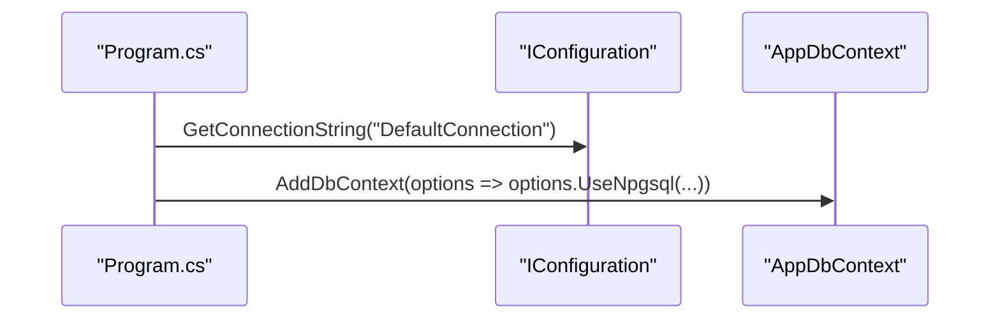
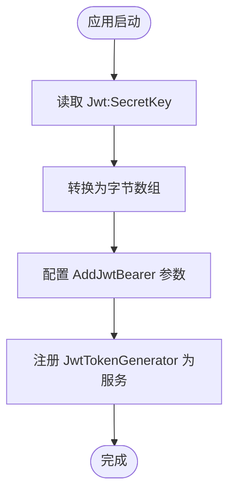
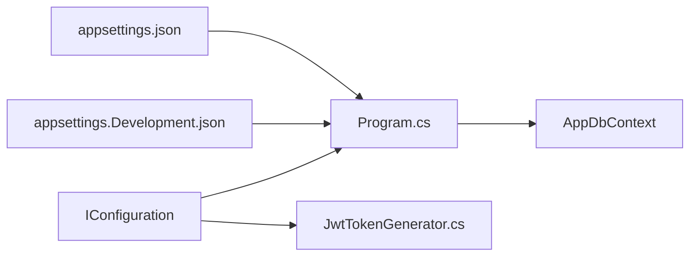

# 配置管理

<cite>
**本文引用的文件**
- [appsettings.json](file://appsettings.json)
- [appsettings.Development.json](file://appsettings.Development.json)
- [Program.cs](file://Program.cs)
- [JwtTokenGenerator.cs](file://src/application/service/JwtTokenGenerator.cs)
</cite>

## 目录
1. [简介](#简介)
2. [项目结构](#项目结构)
3. [核心组件](#核心组件)
4. [架构总览](#架构总览)
5. [详细组件分析](#详细组件分析)
6. [依赖关系分析](#依赖关系分析)
7. [性能与安全考量](#性能与安全考量)
8. [故障排查指南](#故障排查指南)
9. [结论](#结论)
10. [附录：环境配置最佳实践](#附录环境配置最佳实践)

## 简介
本文件聚焦于应用的配置管理，围绕以下目标展开：
- 解析 appsettings.json 的结构与关键配置项
- 说明 Jwt 节下的 SecretKey（JWT 签名密钥）与 ExpirationMinutes（Token 有效期）如何被 JwtTokenGenerator 服务读取与使用
- 解释 ConnectionStrings 节下的数据库连接字符串配置
- 强调敏感信息（如 SecretKey、数据库密码）的安全处理原则
- 提供不同环境（开发、生产）的配置管理建议，包括使用 appsettings.Development.json 进行本地覆盖

## 项目结构
本项目采用标准的 ASP.NET Core 配置体系，通过 appsettings.json 定义默认配置，并通过 appsettings.{Environment}.json 实现环境覆盖。程序入口在 Program.cs 中完成服务注册与中间件装配，其中包含认证与数据库连接的配置读取逻辑。

图表来源
- [appsettings.json](file://appsettings.json#L1-L16)
- [appsettings.Development.json](file://appsettings.Development.json#L1-L9)
- [Program.cs](file://Program.cs#L21-L49)
- [JwtTokenGenerator.cs](file://src/application/service/JwtTokenGenerator.cs#L13-L17)

章节来源
- [appsettings.json](file://appsettings.json#L1-L16)
- [appsettings.Development.json](file://appsettings.Development.json#L1-L9)
- [Program.cs](file://Program.cs#L21-L49)

## 核心组件
- 配置源与优先级
  - 默认配置位于 appsettings.json
  - 开发环境覆盖位于 appsettings.Development.json
  - 运行时可通过环境变量覆盖配置键值
- 关键配置项
  - Jwt:SecretKey：用于 JWT 对称签名的密钥
  - Jwt:ExpirationMinutes：Token 有效期（分钟）
  - ConnectionStrings.DefaultConnection：数据库连接字符串（PostgreSQL）

章节来源
- [appsettings.json](file://appsettings.json#L1-L16)
- [appsettings.Development.json](file://appsettings.Development.json#L1-L9)
- [Program.cs](file://Program.cs#L24-L25)

## 架构总览
下图展示了配置在运行时的流向与使用位置：配置由 ASP.NET Core Host 加载，Program.cs 读取 Jwt 与数据库连接信息，JwtTokenGenerator 使用 Jwt 配置生成 Token；AppDbContext 使用 ConnectionStrings.DefaultConnection 建立数据库连接。

图表来源
- [Program.cs](file://Program.cs#L21-L49)
- [JwtTokenGenerator.cs](file://src/application/service/JwtTokenGenerator.cs#L13-L17)
- [appsettings.json](file://appsettings.json#L1-L16)

## 详细组件分析

### JwtTokenGenerator 服务与 Jwt 配置
- 配置读取
  - 从 IConfiguration 中读取 "Jwt:SecretKey" 作为对称密钥
  - 从 IConfiguration 中读取 "Jwt:ExpirationMinutes" 作为 Token 有效期（分钟）
  - 若缺少 SecretKey 将抛出异常，确保启动失败以避免静默错误
- Token 生成流程
  - 使用对称密钥与 HMAC-SHA256 算法创建签名凭据
  - 设置签发者与受众为固定值
  - 将过期时间设置为当前时间加上配置的有效期
  - 返回序列化后的 JWT 字符串

图表来源
- [JwtTokenGenerator.cs](file://src/application/service/JwtTokenGenerator.cs#L8-L40)

章节来源
- [JwtTokenGenerator.cs](file://src/application/service/JwtTokenGenerator.cs#L13-L17)
- [JwtTokenGenerator.cs](file://src/application/service/JwtTokenGenerator.cs#L19-L39)

### 数据库连接字符串与 DbContext
- 连接字符串读取
  - 通过 IConfiguration.GetConnectionString("DefaultConnection") 获取 PostgreSQL 连接字符串
- DbContext 注册
  - 在 Program.cs 中使用 AddDbContext 注册 AppDbContext，并传入连接字符串
  - 使用 Npgsql 提供程序（根据连接字符串前缀 Host=... 推断）

图表来源
- [Program.cs](file://Program.cs#L24-L25)

章节来源
- [Program.cs](file://Program.cs#L24-L25)
- [appsettings.json](file://appsettings.json#L6-L8)

### 认证与授权中的配置使用
- 启动阶段读取 Jwt:SecretKey 并转换为字节数组
- 配置 JWT Bearer 认证方案，校验签发者、受众、签名密钥与有效期
- 将 JwtTokenGenerator 注册为作用域服务，供控制器或其他服务使用

图表来源
- [Program.cs](file://Program.cs#L27-L44)
- [Program.cs](file://Program.cs#L46-L46)

章节来源
- [Program.cs](file://Program.cs#L27-L44)
- [Program.cs](file://Program.cs#L46-L46)

## 依赖关系分析
- 配置依赖
  - Program.cs 依赖 IConfiguration 提供的 Jwt 与 ConnectionStrings 键值
  - JwtTokenGenerator 依赖 IConfiguration 提供的 Jwt 键值
- 组件耦合
  - JwtTokenGenerator 与 IConfiguration 之间存在直接依赖
  - Program.cs 同时依赖 IConfiguration 与 DbContext 注册逻辑
- 环境覆盖
  - appsettings.Development.json 仅覆盖 Logging 部分，未覆盖 Jwt 与 ConnectionStrings，因此开发环境仍使用 appsettings.json 中的默认值

图表来源
- [Program.cs](file://Program.cs#L21-L49)
- [JwtTokenGenerator.cs](file://src/application/service/JwtTokenGenerator.cs#L13-L17)
- [appsettings.json](file://appsettings.json#L1-L16)
- [appsettings.Development.json](file://appsettings.Development.json#L1-L9)

章节来源
- [Program.cs](file://Program.cs#L21-L49)
- [JwtTokenGenerator.cs](file://src/application/service/JwtTokenGenerator.cs#L13-L17)
- [appsettings.json](file://appsettings.json#L1-L16)
- [appsettings.Development.json](file://appsettings.Development.json#L1-L9)

## 性能与安全考量
- 性能
  - JwtTokenGenerator 的生成过程为 O(1)，主要开销来自字符串编码与签名计算，通常可忽略
  - ConnectionStrings.DefaultConnection 仅在应用启动时读取一次，后续由 EF Core 缓存连接池
- 安全
  - SecretKey 必须足够长且随机，建议使用强密码学安全的随机源生成
  - 不应在版本控制中提交 SecretKey 或数据库密码
  - 生产环境建议使用环境变量或 Azure Key Vault 等外部密钥管理服务
  - 对于开发环境，可通过 appsettings.Development.json 覆盖日志级别等非敏感配置，但不建议在此放置敏感信息

## 故障排查指南
- 启动时报错“Jwt:SecretKey 未配置”
  - 检查 appsettings.json 是否包含 Jwt:SecretKey
  - 确认 appsettings.Development.json 未意外移除该键
  - 如使用环境变量，请确认变量名与键名一致
- Token 无法验证
  - 确认 Jwt:SecretKey 与签发方、受众、签名算法一致
  - 检查客户端是否正确携带 Bearer Token
- 数据库连接失败
  - 检查 ConnectionStrings.DefaultConnection 的格式与凭据
  - 确认目标数据库可达且允许连接

章节来源
- [JwtTokenGenerator.cs](file://src/application/service/JwtTokenGenerator.cs#L15-L15)
- [Program.cs](file://Program.cs#L27-L27)
- [Program.cs](file://Program.cs#L24-L25)
- [appsettings.json](file://appsettings.json#L1-L16)

## 结论
本项目的配置体系清晰地分离了默认配置与环境覆盖，Jwt 与数据库连接的关键信息均通过 IConfiguration 注入到服务中。JwtTokenGenerator 严格依赖 Jwt 配置生成 Token，Program.cs 则负责认证与数据库连接的初始化。建议在生产环境中采用安全的密钥管理方案，并通过环境变量或外部密钥服务替换明文敏感信息。

## 附录：环境配置最佳实践
- 开发环境
  - 使用 appsettings.Development.json 覆盖日志级别等非敏感配置
  - 保持 Jwt 与数据库连接信息与 appsettings.json 一致以便本地调试
- 生产环境
  - 使用环境变量或 Azure Key Vault 注入 Jwt:SecretKey 与 ConnectionStrings.DefaultConnection
  - 严禁将任何敏感信息提交到版本控制
- 多环境策略
  - 通过 ASP.NET Core 的环境变量或外部密钥服务实现不同环境的差异化配置
  - 对于需要在本地覆盖的非敏感配置，使用 appsettings.Development.json

章节来源
- [appsettings.Development.json](file://appsettings.Development.json#L1-L9)
- [appsettings.json](file://appsettings.json#L1-L16)
- [Program.cs](file://Program.cs#L21-L49)