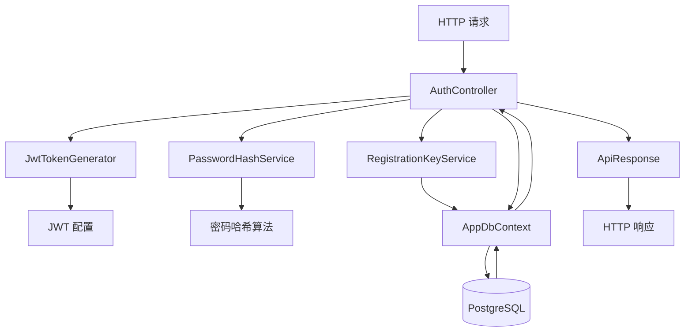
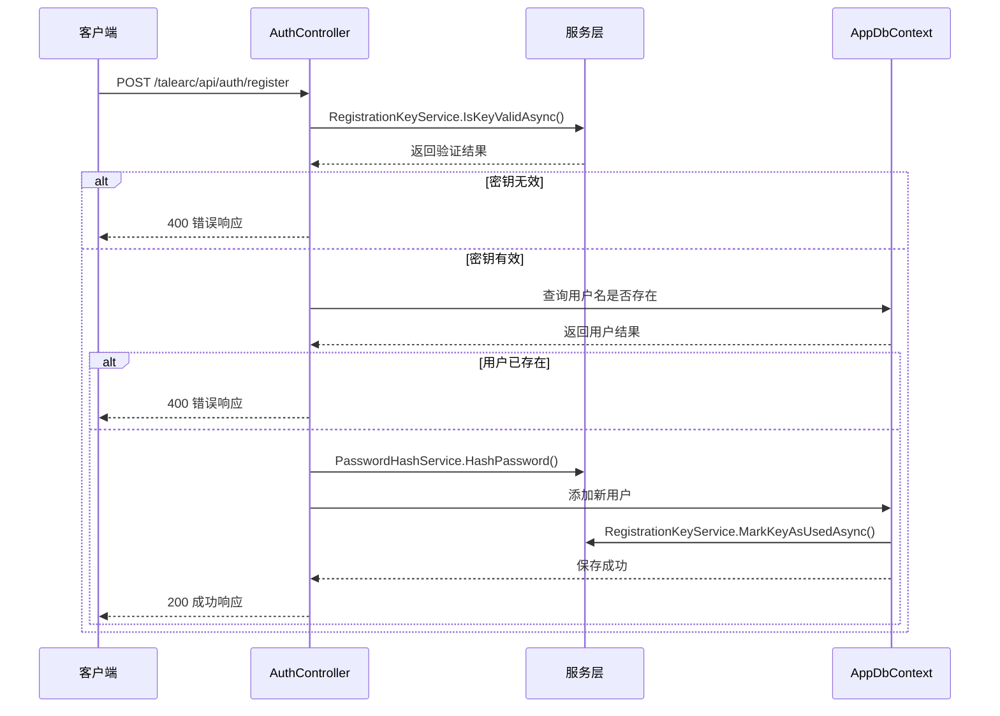
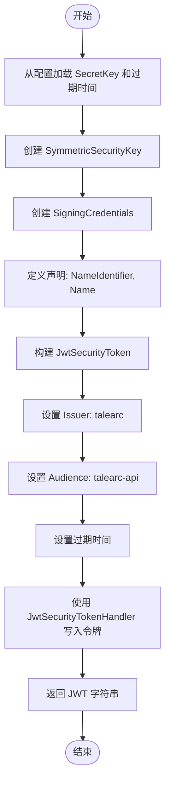
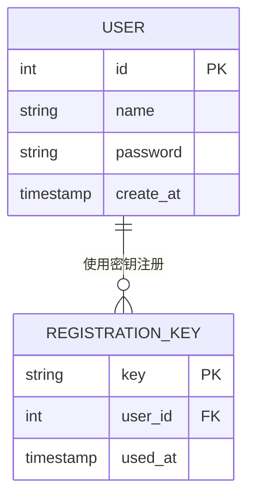
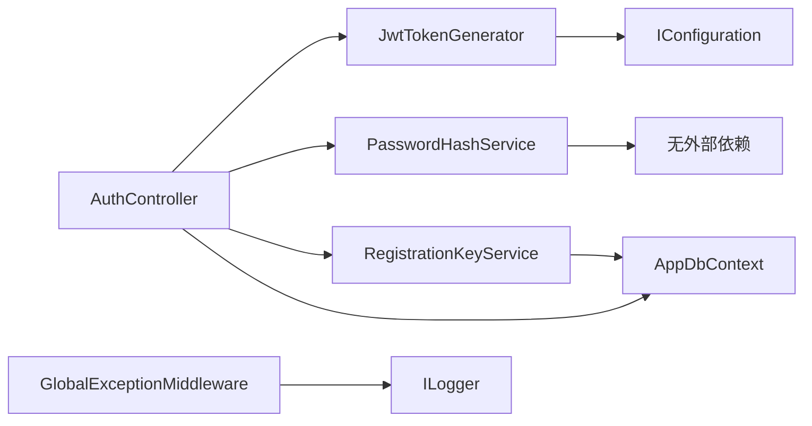

# 项目概述

<cite>
**本文档引用的文件**  
- [Program.cs](file://Program.cs)
- [AuthController.cs](file://src/application/controllers/auth/AuthController.cs)
- [AppDbContext.cs](file://src/data/AppDbContext.cs)
- [JwtTokenGenerator.cs](file://src/application/service/JwtTokenGenerator.cs)
- [PasswordHashService.cs](file://src/application/service/PasswordHashService.cs)
- [RegistrationKeyService.cs](file://src/application/service/RegistrationKeyService.cs)
- [User.cs](file://src/data/entities/User.cs)
- [RegistrationKey.cs](file://src/data/entities/RegistrationKey.cs)
- [ApiResponse.cs](file://src/structure/ApiResponse.cs)
- [appsettings.json](file://appsettings.json)
- [GlobalExceptionMiddleware.cs](file://src/middleware/GlobalExceptionMiddleware.cs)
</cite>

## 目录
1. [简介](#简介)
2. [项目结构](#项目结构)
3. [核心组件](#核心组件)
4. [架构概述](#架构概述)
5. [详细组件分析](#详细组件分析)
6. [依赖分析](#依赖分析)
7. [性能考虑](#性能考虑)
8. [故障排除指南](#故障排除指南)
9. [结论](#结论)

## 简介
talearc-backend 是一个基于 ASP.NET Core 构建的后端 Web API 服务，旨在为前端或客户端应用提供安全、受保护的 RESTful 接口。该项目实现了用户认证、注册（通过注册密钥控制准入）、JWT 令牌生成与管理等核心功能。系统采用分层架构设计，包括控制器层、服务层和数据访问层，并通过依赖注入机制实现组件解耦。数据库使用 PostgreSQL，通过 Entity Framework Core 进行对象关系映射（ORM），确保数据持久化操作的安全性和可维护性。

## 项目结构
项目采用清晰的分层目录结构，便于维护和扩展：

```
src/
├── application/           # 应用层：控制器和服务
│   ├── controllers/       # API 控制器
│   └── service/           # 业务逻辑服务
├── data/                  # 数据层
│   ├── dto/               # 数据传输对象
│   ├── entities/          # 实体模型
│   ├── extensions/        # 扩展方法
│   └── AppDbContext.cs    # EF Core 数据上下文
├── middleware/            # 自定义中间件
├── structure/             # 响应结构定义
└── utils/                 # 工具类
```

这种结构遵循关注点分离原则，使代码更易于测试和维护。

**Section sources**
- [Program.cs](file://Program.cs#L21-L107)
- [AuthController.cs](file://src/application/controllers/auth/AuthController.cs#L65-L227)

## 核心组件
talearc-backend 的核心功能围绕用户身份验证和安全控制展开。主要组件包括：
- **AuthController**：处理用户注册、登录、登出及用户信息获取。
- **JwtTokenGenerator**：负责生成和验证 JWT 令牌。
- **PasswordHashService**：实现密码的哈希加密与验证。
- **RegistrationKeyService**：管理注册密钥的有效性与使用状态。
- **AppDbContext**：EF Core 数据上下文，管理所有实体的数据访问。
- **ApiResponse**：统一 API 响应格式，提升前后端交互一致性。

这些组件协同工作，确保系统的安全性与稳定性。

**Section sources**
- [AuthController.cs](file://src/application/controllers/auth/AuthController.cs#L65-L227)
- [JwtTokenGenerator.cs](file://src/application/service/JwtTokenGenerator.cs#L8-L40)
- [PasswordHashService.cs](file://src/application/service/PasswordHashService.cs#L6-L53)
- [RegistrationKeyService.cs](file://src/application/service/RegistrationKeyService.cs#L6-L37)
- [AppDbContext.cs](file://src/data/AppDbContext.cs#L6-L26)

## 架构概述
talearc-backend 采用典型的三层架构模式：表现层（Controllers）、业务逻辑层（Services）和数据访问层（Data Access）。整个请求流程如下：

1. HTTP 请求进入控制器（如 `AuthController`）
2. 控制器调用服务层处理业务逻辑
3. 服务层通过 `AppDbContext` 与数据库交互
4. 数据持久化后返回结果，逐层向上响应

该架构通过依赖注入（DI）实现松耦合，所有服务均注册为 `Scoped` 生命周期，确保请求级别的资源管理。



**Diagram sources**
- [Program.cs](file://Program.cs#L24-L48)
- [AuthController.cs](file://src/application/controllers/auth/AuthController.cs#L68-L227)
- [AppDbContext.cs](file://src/data/AppDbContext.cs#L6-L26)

## 详细组件分析

### 认证控制器分析
`AuthController` 是系统的核心入口，提供注册、登录、登出和用户信息查询功能。它通过构造函数注入多个服务，实现职责分离。

#### 控制器与服务交互流程


**Diagram sources**
- [AuthController.cs](file://src/application/controllers/auth/AuthController.cs#L86-L123)
- [RegistrationKeyService.cs](file://src/application/service/RegistrationKeyService.cs#L15-L37)
- [PasswordHashService.cs](file://src/application/service/PasswordHashService.cs#L12-L24)

### JWT 令牌生成器分析
`JwtTokenGenerator` 负责创建符合安全标准的 JWT 令牌，用于用户身份验证。

#### JWT 令牌生成流程


**Diagram sources**
- [JwtTokenGenerator.cs](file://src/application/service/JwtTokenGenerator.cs#L19-L38)
- [appsettings.json](file://appsettings.json#L2-L5)

### 数据访问层分析
`AppDbContext` 是 EF Core 的核心类，负责管理所有实体的数据库连接和操作。

#### 实体关系图


**Diagram sources**
- [AppDbContext.cs](file://src/data/AppDbContext.cs#L10-L16)
- [User.cs](file://src/data/entities/User.cs#L10-L40)
- [RegistrationKey.cs](file://src/data/entities/RegistrationKey.cs#L10-L31)

## 依赖分析
项目通过 ASP.NET Core 内置的依赖注入容器管理组件生命周期。关键依赖关系如下：



所有服务均在 `Program.cs` 中注册为 `Scoped`，确保每个请求拥有独立实例，避免状态污染。

**Diagram sources**
- [Program.cs](file://Program.cs#L46-L48)
- [AuthController.cs](file://src/application/controllers/auth/AuthController.cs#L68-L73)
- [RegistrationKeyService.cs](file://src/application/service/RegistrationKeyService.cs#L6-L9)

**Section sources**
- [Program.cs](file://Program.cs#L46-L48)
- [AuthController.cs](file://src/application/controllers/auth/AuthController.cs#L68-L73)

## 性能考虑
尽管当前项目规模较小，但仍有一些性能优化建议：
- 使用异步方法（`async/await`）避免阻塞线程，特别是在数据库操作中。
- JWT 令牌的签发和验证已由 Microsoft.IdentityModel.Tokens 高效实现。
- 密码哈希使用 PBKDF2 算法（Rfc2898DeriveBytes），虽然计算密集但安全性高，适合用户认证场景。
- 建议对高频查询添加缓存机制（如 Redis），减少数据库压力。

## 故障排除指南
当遇到问题时，可参考以下常见情况：

| 问题现象 | 可能原因 | 解决方案 |
|--------|--------|--------|
| 无法连接数据库 | 连接字符串错误或 PostgreSQL 未运行 | 检查 `appsettings.json` 中的 `DefaultConnection` 配置 |
| 登录失败 | 用户名/密码错误或 JWT 配置不匹配 | 确认密码哈希正确，检查 `Jwt:SecretKey` 是否一致 |
| 注册密钥无效 | 密钥不存在或已被使用 | 查询 `registration_keys` 表确认密钥状态 |
| 500 服务器错误 | 未处理异常 | 查看日志文件 `logs/app-.log` 获取详细堆栈信息 |

**Section sources**
- [GlobalExceptionMiddleware.cs](file://src/middleware/GlobalExceptionMiddleware.cs#L7-L45)
- [appsettings.json](file://appsettings.json#L6-L8)

## 结论
talearc-backend 是一个结构清晰、安全性高的 ASP.NET Core Web API 项目。它通过分层架构和依赖注入实现了良好的可维护性，使用 JWT 和密码哈希保障用户认证安全，并通过注册密钥机制控制用户准入。技术选型合理，EF Core 提供了强大的 ORM 支持，Serilog 实现了结构化日志记录。未来可扩展方向包括引入缓存、增加角色权限控制、支持 OAuth2.0 等。